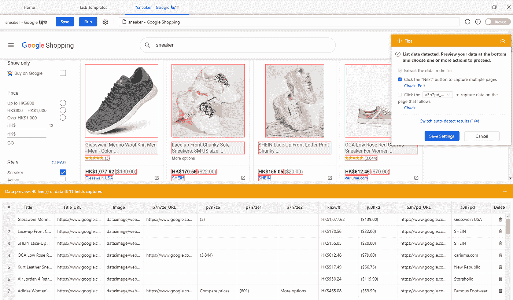

# 如何通过网络数据提取来获取谷歌购物价格

> 原文：<https://towardsdatascience.com/how-to-scrape-google-shopping-prices-with-web-data-extraction-5a0a9b92406f?source=collection_archive---------34----------------------->

[刮谷歌购物产品](https://www.octoparse.com/)

谷歌购物是营销你的在线业务和转化更多销售的良好开端。然而，如果你是一个新来者，有必要观察和学习你的竞争对手如何通过使用 [**网络数据提取工具(网络抓取工具)**](https://www.octoparse.com/) **从谷歌购物品牌化和营销他们的产品。**

# 为什么你应该在你的电子商务业务中使用谷歌购物？

[谷歌购物](https://shopping.google.com/?nord=1)转化率明显很高。这是因为谷歌购物只吸引有购买意向的顾客。例如，一个用户想买一双跑鞋作为生日礼物送给她的母亲。她可能会从搜索“跑鞋”开始，然后谷歌会提供所有相关的产品信息。用户可以在几秒钟内比较价格和功能。

谷歌购物不仅让消费者的购物过程更加方便，也让商家的营销活动更准确地匹配目标。难怪谷歌购物会在成功的电子商务企业家中广受欢迎。如果你能充分利用它，这确实是提高你销售额的有效方法。

# 谷歌购物是如何工作的？

为了更好地优化您的谷歌购物活动，我们需要首先了解它是如何工作的。谷歌购物非常容易开始，因为你可以按照官方的指导方针在谷歌商业中心设置你的帐户。一旦您准备好帐户，我们就可以同步您的在线商店。然后，当特定的产品搜索词出现时，你的产品信息将通过谷歌购物上线。谷歌购物在一个拍卖竞价系统和产品页面质量评分中发挥作用。也就是说，为了让谷歌购物将你的活动广告放在给定搜索结果的第一位，你必须:

1.  **出价高于竞争对手的出价，**
2.  **创建转换-磁性清单描述以提高 CTR**

对于大多数新手来说，他们不知道如何创建一个成功的活动。在这方面，最好的开始方式是观察别人，尤其是你的竞争对手，如何在谷歌购物上销售。

照片由[克里斯蒂安·威迪格](https://unsplash.com/@christianw?utm_source=medium&utm_medium=referral)在 [Unsplash](https://unsplash.com?utm_source=medium&utm_medium=referral) 上拍摄

# 为什么要提取 Web 数据？

有句谚语说，“亲近你的朋友，更要亲近你的敌人。” Google Shopping 拥有大量有价值的信息，可以为您的营销活动提供素材。市面上有很多价格和产品监测平台。然而，在你测试出一个有效的营销策略并做好准备之前，如果投资这些花哨的监控工具，你就是在浪费钱。大多数监控工具是为在各种渠道中拥有大规模产品线的成熟在线企业设计的。

这就是数据提取发挥作用的方式。它可以从网站上自动提取任何数据，并转换成 excel 等可行的格式进行分析。优化策略依赖于从 Google Shopping 收集的足够数量的产品数据。

# 如何使用网络数据提取抓取谷歌购物

Web 数据提取需要很高的技术技能才能完成。幸运的是，有一些网页提取工具，任何人点击一下就可以直观地提取网页数据。 [**Octoparse**](https://www.octoparse.com/) 作为领先的网页抓取软件脱颖而出，对于初学者来说是绝对不需要动脑筋的。任何人都可以定制和设置一个刮刀，从大多数网站获取数据。

1.  要使用 Octoparse 从 Google Shopping 中提取产品信息，我们需要定制一个新任务，方法是单击右上角的加号，然后将 URL 扔进框中。
2.  它有一个内置的浏览器，应该加载网页，让我们点击。OP 8 的新版本。x 将自动读取网页并识别数据字段。
3.  按照指南提示，点击“保存设置”。它会自己生成工作流
4.  单击“开始提取”执行任务。

这将需要几分钟的时间来增加列表的数量。完成提取后，将文件下载到 excel 或 CSV 文件中。

当我们获得足够的信息时，我们可以进一步分析结果。您可以构建图形图表来直观地显示数据。

# 你能从竞争对手身上学到什么:

*   **低价提高点击率:**

有竞争力的价格总是会获得更高的点击率，这让谷歌购物在给定的搜索产品上更频繁地带来你的产品。你获得的印象会加强你的点击率。然而，你能走多低是有限度的。这就是为什么密切关注竞争对手的价格有助于保持竞争力。

*   **不要用鸡蛋砸石头:**

关注像亚马逊、塔吉特和沃尔玛这样的大公司。如果某个产品有很多大玩家，不要试图通过提高出价来超过他们。相反，你可以选择一个利基产品，他们不会出价很高。

*   **优化图像质量:**

产品图片在谷歌购物中可有可无。一张好的照片可以吸引更多的用户点击。你的照片应该足够清晰简单。在这方面，密切注意你可能需要 Photoshop 技巧，使你的照片看起来更有吸引力。

*   **关注推广文字:**

如果你的转换率下降，很可能你的竞争对手正在进行促销。推广文本更有吸引力，这将推动更多的点击率。你的促销可以是季节性的，比如**“冬季大甩卖”**甚至**“所有订单免运费”**对获得更多客户也很有帮助。然而，狡猾的零售商会通过把运费留给顾客来降低他们的价格。有的客户没意识到其实是自己掏钱付运费，后来生气了。所以只要确保顾客对促销活动非常清楚，不会引起任何麻烦。

# 包裹

谷歌购物很容易上手，但你仍然需要更加积极主动，保持警惕。来自谷歌的其他信息也是如此，例如 [Google Play 评论。谷歌有大量信息可供挑选，这就像去相亲一样。网络数据提取是你的圣杯，可以毫不费力地自动跟踪你的竞争对手。自动调整你的市场策略，这样你就可以专注于获得竞争优势。](https://helpcenter.octoparse.com/hc/en-us/articles/360027611891-Scrape-reviews-from-Google-Play)

*原载于 2020 年 4 月 13 日*[*http://www . data extraction . io*](http://www.dataextraction.io/?p=464)*。*