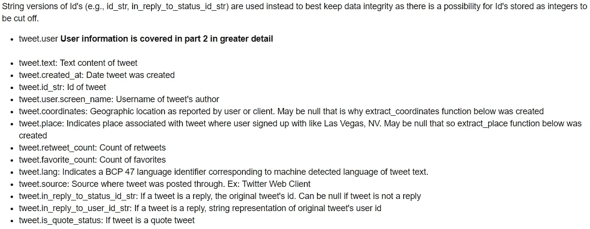
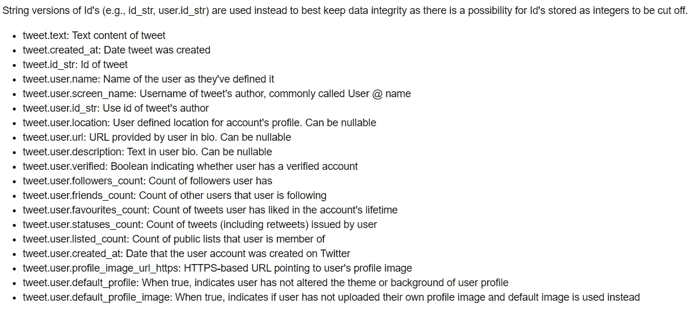
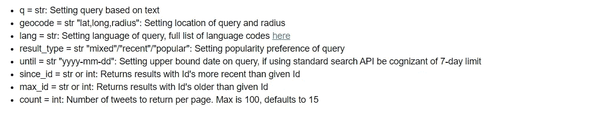
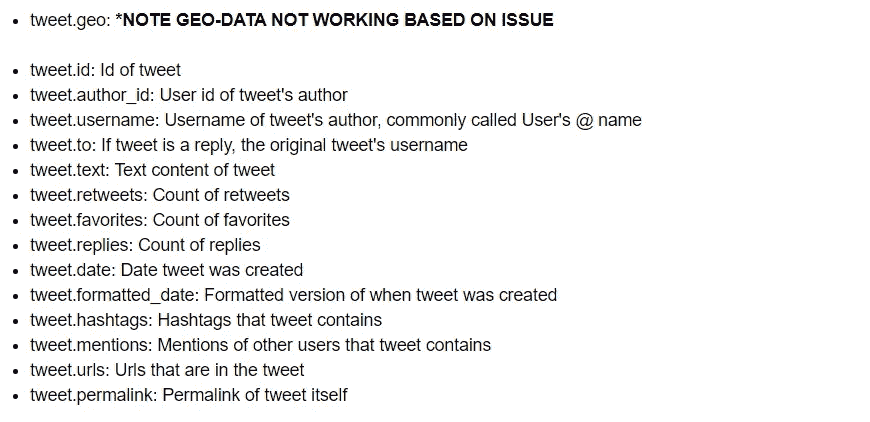
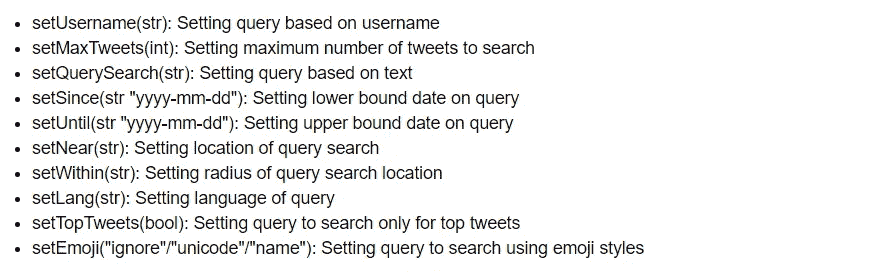

# 如何从 Twitter 上的推文中获取更多信息

> 原文：<https://towardsdatascience.com/how-to-scrape-more-information-from-tweets-on-twitter-44fd540b8a1f?source=collection_archive---------4----------------------->

## 一个深入的 Twitter 抓取教程

## 当抓取文本和使用简单的查询是不够的，你想从 Twitter 上的推文中得到更多


[照片来源](https://pixabay.com/illustrations/twitter-social-media-icon-social-2048133/)

# 概观

有时候，仅仅抓取文本和使用简单的搜索查询是不够的。在收到大量关于我的[基本 Twitter 抓取文章](/how-to-scrape-tweets-from-twitter-59287e20f0f1)中没有完全涵盖的主题的询问后，我决定值得写一篇后续文章，解释 Tweepy 和 GetOldTweets3 提供的许多属性和方法，以进一步完善人们对推文的搜索查询。希望这篇文章将涵盖任何挥之不去的问题或提供新的想法。像我之前的文章一样，我将使用 [Tweepy](https://www.tweepy.org/) ，一个用于访问 Twitter 的 API 的 python 库，以及 Dmitry Mottl 的 [GetOldTweets3](https://github.com/Mottl/GetOldTweets3) ，一个不需要 API 键就能抓取数据的 python 库。

本教程旨在成为一篇直截了当的文章，直接进入编码，展示来自每个库的各种对象中可用的数据和方法，以便在抓取 tweets 时进一步细化查询。

由于对抓取推文的非编码解决方案感兴趣，我的团队正在创建一个应用程序来满足这一需求。是的，这意味着你不必编写代码来收集数据！我们目前正在对我们的应用 Socialscrapr 进行 Alpha 测试。如果您想参与或在下一个测试阶段开放时被联系，请注册我们下面的邮件列表！

# 继续/先决条件之前

本文假设您熟悉 Python 和 Tweepy 或 GetOldTweets3。如果这是您第一次使用这些库，或者您需要复习，我推荐您阅读我的前一篇文章，它涵盖了基础知识和设置。

在我们开始之前，快速概述一下我将在本文中使用的两个库。

**十二周:**

*   可以与 Twitter 的 API 交互并创建推文、收藏夹等。
*   需要注册才能接收凭据
*   获取更深入的推文信息和用户信息
*   在抓取大量推文以及使用标准搜索 API 访问超过一周的推文方面存在限制

**GetOldTweets3**

***更新:由于 TWITTER 的 API 发生变化，GETOLDTWEETS3 不再运行。SNSCRAPE 已经成为一个免费库的替代品，你可以使用它来清除 TWEEPY 的免费限制。我的文章在这里可用为***[***SNSCRAPE***](https://medium.com/better-programming/how-to-scrape-tweets-with-snscrape-90124ed006af)***。***

*   仅用于抓取推文
*   不需要注册
*   对用户信息的有限访问
*   抓取大量推文或访问旧推文没有限制

这些是这两个库的主要特征，如果你感兴趣，我在我的[上一篇文章](/how-to-scrape-tweets-from-twitter-59287e20f0f1#a6a8)中提供了更详细的比较。如果你发现自己想要对大量数据的信息进行二级访问，我建议看看 Twitter 的高级/企业搜索 API。[这篇文章](https://lucahammer.com/2019/11/05/collecting-old-tweets-with-the-twitter-premium-api-and-python/)很好地展示了一个名为 searchtweets 的库，它允许你在 Python 中使用这些 API。如果你觉得 Twitter 的 Premium/Enterprise API 太贵，有一个变通方法，你可以一起使用 Tweepy 和 GetOldTweets3，我在本文的最后讨论了这个方法。

这篇文章涵盖了不同的主题领域，正因为如此，我不建议从头到尾阅读，除非你绝对想对 Tweepy 和 GetOldTweets3 都有深刻的理解。因此，我将包含一个链接的目录，这样您就可以决定哪些信息与您相关，并跳转到相应的部分。此外，正如你将看到的，我的大多数功能都设置为抓取 150 条推文。我建议首先在较小的样本上测试你的查询，然后收集你想要的 tweet 数量，因为大型查询可能需要一些时间才能完成。

**快速注意，如果你正在抓取私人账户或以前的私人账户，你可能会发现你无法访问推文，或者你可以抓取的推文数量有限。**

如果你想提前检查我的代码，或者在阅读每一部分时有所遵循，我已经创建了一个文章笔记本，遵循本文中给出的代码示例；以及一个配套的笔记本，它提供了更多的例子来更好地充实代码。你可以在我的 GitHub [*这里*](https://github.com/MartinKBeck/TwitterScraper/tree/master/AdvScraper) *访问我的 Jupyter 笔记本来获取这个教程。*

事不宜迟，让我们投入战斗吧！


[照片来源](https://www.pexels.com/photo/person-pointing-numeric-print-1342460/)

# 目录:

## [**用 Tweepy 刮更**](#cbb8)

*   [从推文中获取更多信息，例如收藏、转发](#eaf6)
*   [从推文中获取用户信息，例如关注者数量、推文数量](#c2a9)
*   [使用高级查询进行抓取，例如从特定位置或以特定语言进行抓取](#aa2a)
*   [综合考虑](#7152)

## [**用 GetOldTweets3 刮更**](#c1c5)

*   [从推文中获取更多信息，例如收藏、转发](#a760)
*   [从推文中获取用户信息，**有限**](#a25e)
*   [使用高级查询进行抓取，例如从特定位置或以特定语言进行抓取](#c6aa)
*   把所有的放在一起

## [**如何将 Tweepy 与 GetOldTweets3**](#65db) 一起使用

# 用 Tweepy 刮得更多

如果你想让代码跟随这一部分，我这里有一篇文章 Jupyter 笔记本。如果你想要更多的代码示例和易于使用的功能，我在这里创建了一个配套的 Jupyter 笔记本[。](https://github.com/MartinKBeck/TwitterScraper/blob/master/AdvScraper/Tweepy/Tweepy_Companion_Scraper.ipynb)

## **入门**

在使用 Tweepy 之前，它需要授权。我不会详细介绍如何设置，因为我在之前的文章中已经介绍过了。

```
consumer_key = "XXXXX"
consumer_secret = "XXXXX"
access_token = "XXXXX"
access_token_secret = "XXXXXX"auth = tweepy.OAuthHandler(consumer_key, consumer_secret)
auth.set_access_token(access_token, access_token_secret)
api = tweepy.API(auth,wait_on_rate_limit=True)
```

## **从推文中获取更多信息**

下面提供的图片虽然不是一个详尽的列表，但涵盖了 Tweepy 的 tweet 对象中的大部分可用信息。如果你对其他可用的数据感到好奇，Twitter 开发者网站上的[这里](https://developer.twitter.com/en/docs/twitter-api/v1/data-dictionary/overview/tweet-object)显示了完整的信息列表。正如您将在本部分和用户信息部分看到的。为了保持数据的完整性，我使用字符串版本的 Ids，而不是 integer，因为存储 integer 值可能会导致以后访问它时数据丢失。



Tweepy 提供的推文信息列表

大多数情况下，每个 tweet.attribute 都有一定的价值，并且容易访问。但是，tweet.coordinates 和 tweet.place 属性需要一些提取，因为它们是包含其他数据的数据字典。此外，因为它们可能是空的，所以首先检查 tweet 是否有信息是很重要的。下面的函数检查属性是否有数据，并提取相关信息。这段代码假设您遵循了我的列命名约定，我们将在下一节中看到这一点。如果你改变了 Tweet 坐标或位置信息的命名方式，你需要相应地调整下面的代码。

```
# Function created to extract coordinates from tweet if it has coordinate info
# Tweets tend to have null so important to run check
# Make sure to run this cell as it is used in a lot of different functions below
def extract_coordinates(row):
    if row['Tweet Coordinates']:
        return row['Tweet Coordinates']['coordinates']
    else:
        return None# Function created to extract place such as city, state or country from tweet if it has place info
# Tweets tend to have null so important to run check
# Make sure to run this cell as it is used in a lot of different functions below
def extract_place(row):
    if row['Place Info']:
        return row['Place Info'].full_name
    else:
        return None
```

现在我们可以继续前进，能够从 tweet.coordinates 和 tweet.place 属性中提取有用的信息。让我们开始实际刮削。

**从用户的推文中提取所有推文相关信息的搜索查询示例:**

```
username = 'random'
max_tweets = 150

tweets = tweepy.Cursor(api.user_timeline,id=username).items(max_tweets)

# Pulling information from tweets iterable object
# Add or remove tweet information you want in the below list comprehension
tweets_list = [[tweet.text, tweet.created_at, tweet.id_str, tweet.user.screen_name, tweet.coordinates, tweet.place, tweet.retweet_count, tweet.favorite_count, tweet.lang, tweet.source, tweet.in_reply_to_status_id_str, tweet.in_reply_to_user_id_str, tweet.is_quote_status] for tweet in tweets]

# Creation of dataframe from tweets_list
# Add or remove columns as you remove tweet information
tweets_df = pd.DataFrame(tweets_list,columns=['Tweet Text', 'Tweet Datetime', 'Tweet Id', 'Twitter @ Name', 'Tweet Coordinates', 'Place Info', 'Retweets', 'Favorites', 'Language', 'Source', 'Replied Tweet Id', 'Replied Tweet User Id Str', 'Quote Status Bool'])

# Checks if there are coordinates attached to tweets, if so extracts them
tweets_df['Tweet Coordinates'] = tweets_df.apply(extract_coordinates,axis=1)

# Checks if there is place information available, if so extracts them
tweets_df['Place Info'] = tweets_df.apply(extract_place,axis=1)
```

上面的查询从 Twitter 用户@random 获取 150 条 tweets，并利用 extract_coordinates 和 extract_place 函数检查是否有信息，如果有，就提取相关信息。如上所示，tweet 对象中有很多可用的信息。要修改信息，你只需要添加或删除 tweets_list 中显示的任何 tweet.attribute。为此，在创建 dataframe tweets_df 时调整列名也很重要。

**访问多达 280 个字符的推文文本**

出于兼容性的考虑，Tweepy 默认情况下只提取最多 140 个字符的 tweet 文本，因为这是 Twitter 的旧 tweet 字符限制。这可能很烦人，因为你可能想要所有可用的信息，而不是被缩短的推文。要取消此限制，您必须修改 tweepy.Cursor 中的 tweepy _ mode 参数。如果您正在使用 Tweepy，请务必将此 tweet_mode 设置为“extended ”,因为如果您不在查询中包含此选项，您将始终会抓取缩短到原始 140 个字符限制的 tweet。当 Tweepy 设置为扩展 tweet 模式时，这也会将 tweet.text 属性改为 tweet.full_text。因此，如果您使用这种扩展的 tweet 模式，请确保相应地调整您的代码。下面的代码片段展示了 tweepy 中的变化。光标和 tweets_list 来访问超过 140 个字符的 tweets。Tweepy 文档中的[此处](http://docs.tweepy.org/en/latest/extended_tweets.html#standard-api-methods)提供了关于扩展 Tweepy 模式的更多信息。

```
username = 'BillGates'
max_tweets = 150

# Creation of query method using parameters
tweets = 
tweepy.Cursor(api.user_timeline, id=username, tweet_mode='extended').items(max_tweets)

# Pulling information from tweets iterable object
# Add or remove tweet information you want in the below list comprehension
tweets_list = [[tweet.full_text, tweet.created_at, tweet.id_str, tweet.user.screen_name, tweet.coordinates, tweet.place, tweet.retweet_count, tweet.favorite_count, tweet.lang, tweet.source, tweet.in_reply_to_status_id_str, tweet.in_reply_to_user_id_str, tweet.is_quote_status] for tweet in tweets]

# Creation of dataframe from tweets_list
# Did not include column names to simplify code 
tweets_df = pd.DataFrame(tweets_list)
```

## 从推文中获取用户信息

用户信息是 Tweepy 优于 GetOldTweets3 的地方。下面提供的图片虽然不是一个详尽的列表，但涵盖了 Tweepy 的用户对象中可用的大部分信息。如果你对其他可用的数据感到好奇，完整的信息列表可以在 Twitter 的开发者网站上[这里](https://developer.twitter.com/en/docs/twitter-api/v1/data-dictionary/overview/user-object)找到。



Tweepy 提供的用户信息列表

**从推文中提取所有用户相关信息的搜索查询示例:**

```
text_query = 'Coronavirus'
max_tweets = 150

# Creation of query method using parameters
tweets = tweepy.Cursor(api.search,q=text_query).items(max_tweets)

# Pulling information from tweets iterable object
# Add or remove tweet information you want in the below list comprehension
tweets_list = [[tweet.text, tweet.created_at, tweet.id_str, tweet.user.name, tweet.user.screen_name, tweet.user.id_str, tweet.user.location, tweet.user.url, tweet.user.description, tweet.user.verified, tweet.user.followers_count, tweet.user.friends_count, tweet.user.favourites_count, tweet.user.statuses_count, tweet.user.listed_count, tweet.user.created_at, tweet.user.profile_image_url_https, tweet.user.default_profile, tweet.user.default_profile_image] for tweet in tweets]

# Creation of dataframe from tweets_list
# Did not include column names to simplify code 
tweets_df = pd.DataFrame(tweets_list)
```

上面的查询搜索了 150 条包含单词冠状病毒的最近的推文。类似于前面显示的其他代码片段。要修改可用的信息，可以在 tweets_list 中显示的列表理解中添加或删除任何 tweet.user.attribute。

## **高级查询刮除**

Tweepy 提供了几种不同的方法来优化您的查询。下图显示了可通过 Tweepy 访问的搜索参数列表。同样，虽然这不是详尽的清单，但它涵盖了大部分。如果你想了解更多关于搜索 API 的信息，可以在 Twitter 的开发者网站[这里](https://developer.twitter.com/en/docs/twitter-api/v1/tweets/search/api-reference/get-search-tweets)找到。正如您可能注意到的 geocode，Tweepy 没有一个方法可以接受城市的字符串版本并在它们周围进行搜索。您必须输入一对特定的纬度、经度坐标来限制地理位置的查询。



Tweepy 提供的搜索参数列表

**使用高级查询的搜索查询示例:**

```
# Example may no longer show tweets if until_date falls outside 
# of 7-day period from when you run cell
coordinates = '19.402833,-99.141051,50mi'
language = 'es'
result_type = 'recent'
until_date = '2020-08-10'
max_tweets = 150

# Creation of query method using parameters
tweets = tweepy.Cursor(api.search, geocode=coordinates, lang=language, result_type = result_type, until = until_date, count = 100).items(max_tweets)

# List comprehension pulling chosen tweet information from tweets iterable object
# Add or remove tweet information you want in the below list comprehension
tweets_list = [[tweet.text, tweet.created_at, tweet.id_str, tweet.favorite_count, tweet.user.screen_name, tweet.user.id_str, tweet.user.location, tweet.user.url, tweet.user.verified, tweet.user.followers_count, tweet.user.friends_count, tweet.user.statuses_count, tweet.user.default_profile_image, 
tweet.lang] for tweet in tweets]

# Creation of dataframe from tweets_list
# Did not include column names to simplify code 
tweets_df = pd.DataFrame(tweets_list)
```

上面的查询用西班牙语提取了 150 条最近在墨西哥城发布的推文，最新日期是 2020 年 8 月 10 日。这个代码片段与之前展示的另外两个略有不同。为了优化搜索参数，您必须将上图所示的不同参数添加到 tweepy 中。光标(geocode =坐标，lang =语言等。)并给它传递一个变量或者硬编码。这样你就可以根据地点、语言或者任何你想做的事情来优化你的搜索。

## 把所有的放在一起

太好了，我见过很多单独的东西，但这有什么关系呢？无论您是想从搜索关键词的特定用户那里收集推文，还是搜索在内华达州拉斯维加斯(Lat 36.169786，Long-115.139858)50 英里半径范围内具有关键词冠状病毒的推文。您的 Tweepy 抓取仅受您的想象力和 Tweepy 中可用的属性和方法的限制。下面我将通过显示上面提到的查询向您展示挑选您想要的方法和信息是多么容易。

**使用高级查询提取推文和用户信息的查询示例:**

```
text_query = 'Coronavirus'
coordinates = '36.169786,-115.139858,50mi'
max_tweets = 150

# Creation of query method using parameters
tweets = tweepy.Cursor(api.search, q = text_query, geocode = coordinates, count = 100).items(max_tweets)

# Pulling information from tweets iterable object
# Add or remove tweet information you want in the below list comprehension
tweets_list = [[tweet.text, tweet.created_at, tweet.id_str, tweet.favorite_count, tweet.user.screen_name, tweet.user.id_str, tweet.user.location, tweet.user.followers_count, tweet.coordinates, tweet.place] for tweet in tweets]

# Creation of dataframe from tweets_list
# Did not include column names to simplify code
tweets_df = pd.DataFrame(tweets_list)
```

正如您在上面看到的，只需修改 tweepy 中的代码。Cursor(api.search，)带有搜索参数，可以根据位置、top_tweets 等进一步优化搜索。如果您想修改从 tweets 中收到的信息，只需在我在 query 方法下创建的 tweets_list 列表理解中添加或删除 tweet.chosen _ attribute。

# 使用 GetOldTweets3 获取更多信息

***更新:由于 TWITTER 的 API 发生变化，GETOLDTWEETS3 不再运行。SNSCRAPE 已经成为一个免费库的替代品，你可以使用它来清除 TWEEPY 的免费限制。我的文章在这里可用为***[***sn scrape***](https://medium.com/better-programming/how-to-scrape-tweets-with-snscrape-90124ed006af)***。***

GetOldTweets3 只需要安装一个 pip。导入库后，您应该能够立即使用它。如果你想让代码跟随这一部分，我这里有一篇文章 Jupyter Notebook。如果你想要更多的代码示例和易于使用的功能，我在这里创建了一个配套的 Jupyter 笔记本[。](https://github.com/MartinKBeck/TwitterScraper/blob/master/AdvScraper/GetOldTweets3/GetOldTweets3_Companion_Scraper.ipynb)

## 从推文中获取更多信息

下面提供的图片是通过 GetOldTweets3 的 tweet 对象向您提供的信息的详尽列表。正如你所看到的，一条 tweet 包含了相当多的信息，访问它一点也不困难。



GetOldTweets3 提供的 tweet 信息列表

**从用户的推文中提取所有推文相关信息的搜索查询示例:**

```
username = 'jack'
count = 150

# Creation of tweetCriteria query object with methods to specify further
tweetCriteria = got.manager.TweetCriteria().setUsername(username)\
.setMaxTweets(count)

# Creation of tweets iterable containing all queried tweet data
tweets = got.manager.TweetManager.getTweets(tweetCriteria)

# List comprehension pulling chosen tweet information from tweets
# Add or remove tweet information you want in the below list comprehension
tweets_list = [[tweet.id, tweet.author_id, tweet.username, tweet.to, tweet.text, tweet.retweets, tweet.favorites, tweet.replies, tweet.date, tweet.formatted_date, tweet.hashtags, tweet.mentions, tweet.urls, tweet.permalink,] for tweet in tweets]

# Creation of dataframe from tweets_list
# Did not include column names to simplify code 
tweets_df = pd.DataFrame(tweets_list)
```

上面的查询提取了 twitter 用户@jack 最近的 150 条推文。如上所示，要修改可用信息，您只需添加或删除 tweets_list 中显示的列表理解的任何 tweet.attribute。

## 从推文中获取用户信息

与 Tweepy 相比，GetOldTweets3 的可用用户信息有限。这个库的 tweet 对象只包含 tweet 作者的用户名和 user_id。如果您想要比现有的更多的用户信息，我建议您要么使用 Tweepy 进行所有的抓取，要么使用 Tweepy 方法和 GetOldTweets3，以便充分利用两个库的优势。为此，我在下面的“如何使用 Tweepy 和 GetOldTweets3”一节中展示了一些解决方法。

## 使用高级查询抓取

下面提供的图片是通过 GetOldTweets3 优化查询的详尽方法列表。



GetOldTweets3 可用的搜索方法列表

**使用高级查询的搜索查询示例:**

```
username = "BarackObama"
text_query = "Hello"
since_date = "2011-01-01"
until_date = "2016-12-20"
count = 150

# Creation of tweetCriteria query object with methods to specify further
tweetCriteria = got.manager.TweetCriteria().setUsername(username)\
.setQuerySearch(text_query).setSince(since_date)\
.setUntil(until_date).setMaxTweets(count)

# Creation of tweets iterable containing all queried tweet data
tweets = got.manager.TweetManager.getTweets(tweetCriteria)

# List comprehension pulling chosen tweet information from tweets
# Add or remove tweet information you want in the below list comprehension
tweets_list = [[tweet.id, tweet.author_id, tweet.username, tweet.text, tweet.retweets, tweet.favorites,tweet.replies,tweet.date] for tweet in tweets]

# Creation of dataframe from tweets list
# Did not include column names to simplify code 
tweets_df = pd.DataFrame(tweets_list)
```

上面的查询试图从巴拉克·奥巴马那里提取 150 条 tweetss，这些 tweet 在日期范围 2011 年 1 月 1 日到 2016 年 12 月 20 日之间打招呼。如上面的代码片段所示，如果您想使用任何方法来创建更具体的查询，您需要做的就是将它们添加到 TweetCriteria()的末尾。例如，我可以在上面的代码中添加。塞特尼尔(“华盛顿特区”)在年底。setMaxTweets()，如果我想查询该地区周围的推文。

## 把所有的放在一起

太好了，我可以从 2016 年开始发布推文信息或推文。为什么重要？无论您是想从搜索关键词的特定用户那里收集所有可用信息，还是搜索华盛顿特区在 2020 年 8 月 5 日至 2020 年 8 月 10 日之间以冠状病毒为关键词的热门推文。您的 tweet 抓取只受您的想象力和该包中可用的属性和方法的限制。下面我将向您展示通过创建上面提到的查询来挑选您想要的方法和信息是多么容易。

**使用高级查询提取推文和用户信息的查询示例:**

```
text_query = 'Coronavirus'
since_date = '2020-08-05'
until_date = '2020-08-10'
location = 'Washington, D.C.'
top_tweets = True
count = 150

# Creation of tweetCriteria query object with methods to specify further
tweetCriteria = got.manager.TweetCriteria()\
.setQuerySearch(text_query).setSince(since_date)\
.setUntil(until_date).setNear(location).setTopTweets(top_tweets)\
.setMaxTweets(count)

# Creation of tweets iterable containing all queried tweet data
tweets = got.manager.TweetManager.getTweets(tweetCriteria)

# List comprehension pulling chosen tweet information from tweets
# Add or remove tweet information you want in the below list comprehension
tweets_list = [[tweet.id, tweet.author_id, tweet.username, tweet.to, tweet.text, tweet.retweets, tweet.favorites, tweet.replies, tweet.date, tweet.mentions, tweet.urls, tweet.permalink,] for tweet in tweets]

# Creation of dataframe from tweets list
# Add or remove columns as you remove tweet information
tweets_df = pd.DataFrame(tweets_list)
```

正如最后一个例子所示，改进您的查询或修改您可用的 tweet 数据相当简单。通过在末尾添加 set 方法并传入值来修改 tweetCriteria 对象，可以优化查询。您可以通过修改 tweets_list 中列出的 tweet 属性来删除或添加更多信息。

# 如何将 Tweepy 与 GetOldTweets3 一起使用

如果你使用 GetOldTweets3 但是想要访问用户信息会怎么样？或者你使用 Tweepy，但需要访问旧的推文。还好，有一个变通办法，你可以使用 Tweepy 的方法来访问更多的 Tweepy 或用户信息。允许您一起使用这两个库。

重要的是要记住，Tweepy 的 API 总是要求用户注册以接收凭证，如果你需要这样做的话[我以前的文章](/how-to-scrape-tweets-from-twitter-59287e20f0f1#cb70)讨论过这个问题。此外，这些方法仍然受到 Tweepy 的请求限制，所以我不建议对大于 20k tweets 的数据集使用这种变通方法，除非您不介意让您的计算机运行几个小时。我个人使用了这两个库和一个 5000 条 tweets 的数据集，花了我大约 1-2 个小时来运行所有的东西。如果你没有时间等待或者不介意付费，那么利用 Twitter 的 Premium/Enterprise API 是值得的。这篇[文章](https://lucahammer.com/2019/11/05/collecting-old-tweets-with-the-twitter-premium-api-and-python/)涵盖了 searchtweets，一个 Python 中的库，如果你决定走这条路，它允许访问高级/企业 API。

如果你想让代码跟随这一部分，我有一个 Jupyter 笔记本可用[在这里](https://github.com/MartinKBeck/TwitterScraper/blob/master/AdvScraper/Tweepy_and_GetOldTweets3.ipynb)。

**凭证**

在使用 Tweepy 之前，它需要授权。我不会详细介绍如何设置，因为我在之前的文章[中已经介绍过了。](/how-to-scrape-tweets-from-twitter-59287e20f0f1#cb70)

```
# consumer_key = "XXXXX"
# consumer_secret = "XXXXX"
# access_token = "XXXXX"
# access_token_secret = "XXXXXX"auth = tweepy.OAuthHandler(consumer_key, consumer_secret)
auth.set_access_token(access_token, access_token_secret)
api = tweepy.API(auth,wait_on_rate_limit=True)
```

**准备**

Tweepy 的 API 提供了两种方法，允许 GetOldTweets3 用户访问更多信息。

api.get_status()接受一个 tweet id，并返回与该 tweet 相关的所有信息

api.get_user()接受用户 id 或用户名，并返回与该用户相关的所有信息

因此，让我们确保这些数据可用，并使用 GetOldTweets3 获取 tweet.id、tweet.author_id 和 tweet.username。

```
text_query = 'Hello'
since_date = "2020-7-20"
until_date = "2020-7-21"count = 150

# Creation of tweetCriteria query object with methods to specify further
tweetCriteria = got.manager.TweetCriteria()\
.setQuerySearch(text_query).setSince(since_date)\
.setUntil(until_date).setMaxTweets(count)

# Creation of tweets iterable containing all queried tweet data
tweets = got.manager.TweetManager.getTweets(tweetCriteria)

# List comprehension pulling chosen tweet information from tweets
# Add or remove tweet information you want in the below list comprehension
tweets_list = [[tweet.id, tweet.author_id, tweet.username, tweet.text, tweet.retweets, tweet.favorites, tweet.replies, tweet.date] for tweet in tweets]

# Creation of dataframe from tweets list
# Add or remove columns as you remove tweet information
tweets_df = pd.DataFrame(tweets_list, columns = ['Tweet Id', 'Tweet User Id', 'Tweet User', 'Text', 'Retweets', 'Favorites', 'Replies', 'Datetime'])
```

**功能**

很好，我们已经得到了一些包含 tweet.id、tweet.author_id 和 tweet.username 的数据。让我们测试一下 Tweepy 中的这些方法，以确保它们能够工作。

```
api.get_status(1285363852851511301)api.get_user(811267164476841984)api.get_user('realJakeLogan')
```

正如您在上面的代码中看到的，有许多信息来自请求。还需要注意的是，Tweepy 的 tweet 对象已经包含了一个用户对象。如果你只需要 Tweepy 的用户信息，你可以使用任何一种方法，但是如果你想要 Tweepy 的 tweet 信息，你必须使用 get_status 方法。让我们更进一步。上面的代码只对一次搜索一个东西有用，如果你有一个完整的数据集，你需要创建一个函数来提取数据。

```
def extract_tweepy_tweet_info(row):
    tweet = api.get_status(row['Tweet Id'])
    return tweet.source

tweets_df['Tweet Source'] = tweets_df.apply(extract_tweepy_tweet_info,axis=1)
```

这很好，但是，如果您想从 tweet 对象返回多个属性，会发生什么情况呢？也许你还想要 tweet.user.location 和 tweet.user.followers_count。有两种方法可以解决这个问题。创建一个函数将数据存储在列表中，然后将所有数据添加到数据框中。或者创建一个将创建一个系列并返回它的函数，然后使用 panda 的 apply 方法在数据框上使用该函数。我将展示前者，因为它更容易掌握。

```
# Creation of list to store scrape tweet data
tweets_holding_list = []

def extract_tweepy_tweet_info_efficient(row):
    # Using Tweepy API to request for tweet data
    tweet = api.get_status(row['Tweet Id'])

    # Storing chosen tweet data in tweets_holding_list to be used later
    tweets_holding_list.append((tweet.source, tweet.user.statuses_count,      
    tweet.user.followers_count, tweet.user.verified))

# Applying the extract_tweepy_tweet_info_efficient function to store tweet data in the tweets_holding_list
tweets_df_test_efficient.apply(extract_tweepy_tweet_info_efficient, axis=1)

# Creating new columns to store the data that's currently being held in tweets_holding_list
tweets_df_test_efficient[['Tweet Source', 'User Tweet Count', 'Follower Count', 'User Verified Status']] = pd.DataFrame(tweets_holding_list)
```

太好了，不用每次都请求 Tweepy 的 API，您可以发送一个请求，然后一次性修改您的数据框。如果您发现自己需要多种属性，这将更加高效，并最终为您节省大量时间。

以上就是我关于 Tweepy 和 GetOldTweets3 的高级教程，以及使用 Tweepy 和 GetOldTweets3 的方法。希望你的大部分问题能在我之前的文章或者这篇文章中得到解答。如果你有具体的问题，在谷歌上找不到答案，或者想联系我。我在 [LinkedIn](https://www.linkedin.com/in/martbeck/) 上有空。

# 参考

如果你感兴趣，注册我们的 Socialscrapr 邮件列表:【https://upscri.be/3kcmqx 

如果你想要一个 GetOldTweets3 替代品的 snscrape 抓取文章:[https://medium . com/better-programming/how-to-scrape-tweets-with-snscrape-90124 ed 006 af](https://medium.com/better-programming/how-to-scrape-tweets-with-snscrape-90124ed006af)

之前的基础 twitter 抓取文章:[https://towardsdatascience . com/how-to-scrape-tweets-from-Twitter-59287 e 20 f0f 1](/how-to-scrape-tweets-from-twitter-59287e20f0f1)

包含本教程的 Twitter scraper 的 GitHub:[https://GitHub . com/martink beck/TwitterScraper/tree/master/adv scraper](https://github.com/MartinKBeck/TwitterScraper/tree/master/AdvScraper)

GitHub 包含了我的基础和高级教程 Twitter scraper 的:[https://github.com/MartinKBeck/TwitterScraper](https://github.com/MartinBeckUT/TwitterScraper)

随 Tweepy 提供的各种 API:[https://developer.twitter.com/en/products/products-overview](https://developer.twitter.com/en/products/products-overview)

tweepy GitHub:【https://github.com/tweepy/tweepy 

getoldtweets 3 GitHub:【https://github.com/Mottl/GetOldTweets3 

使用 searchtweets 访问 Twitter 的 Premium/Enterprise API 的教程文章:[https://Luca hammer . com/2019/11/05/collecting-old-tweets-with-the-Twitter-Premium-API-and-python/](https://lucahammer.com/2019/11/05/collecting-old-tweets-with-the-twitter-premium-api-and-python/)