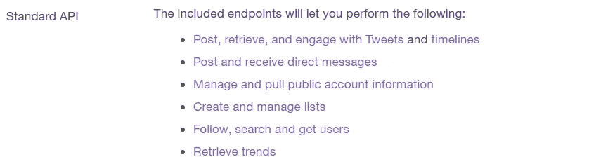

# 如何从 Twitter 上抓取推文

> 原文：<https://towardsdatascience.com/how-to-scrape-tweets-from-twitter-59287e20f0f1?source=collection_archive---------1----------------------->

## 一个基本的 Twitter 抓取教程

## 使用 Python 从 Twitter 抓取推文的快速介绍


照片来自 P [exels](https://www.pexels.com/photo/apple-applications-apps-cell-phone-607812/)

# 概观

社交媒体可以成为消费者情绪方面的数据金矿。Twitter 等平台有助于保存有用的信息，因为用户可能会发布未经过滤的意见，这些意见很容易被检索到。将这些信息与其他公司内部信息相结合，有助于洞察人们对公司、产品等的总体看法。

本教程旨在简单快速地介绍如何使用 Tweepy 的 Twitter API 或 Dmitry Mottl 的 GetOldTweets3 从 Python 中抓取 tweets。为了给本教程提供指导，我决定集中在两个方面:抓取特定用户的推文和从一般文本搜索中抓取推文。

***由于对抓取推文的非编码解决方案感兴趣，我的团队正在创建一个应用程序来满足这一需求。是的，这意味着你不必编写代码来收集数据！我们目前正在对我们的应用 Socialscrapr 进行 Alpha 测试。如果您想参与或在下一个测试阶段开放时被联系，请注册我们下面的邮件列表！***

# Tweepy vs GetOldTweets3

## 十二岁

在我们开始实际的抓取之前，了解这两个库都提供了什么是很重要的，所以让我们来分析一下这两个库之间的区别，以帮助您决定使用哪一个。

Tweepy 是一个用于访问 Twitter API 的 Python 库。Tweepy 提供了几种不同类型和级别的 API 访问，如这里的[所示](https://developer.twitter.com/en/products/products-overview)，但这些都是针对非常具体的用例。Tweepy 能够完成各种任务，不仅仅是查询 tweets，如下图所示。出于相关性的考虑，我们将只关注使用这个 API 来抓取 tweets。



通过 Tweepy 的标准 API 提供的各种功能列表。

使用 Tweepy 抓取推文有局限性。标准 API 仅允许您检索 7 天前的推文，并且仅限于在 15 分钟的窗口内抓取 18，000 条推文。但是，可以增加该限制，如这里的[所示](https://bhaskarvk.github.io/2015/01/how-to-use-twitters-search-rest-api-most-effectively./)。此外，使用 Tweepy，你最多只能返回 3200 条用户最近的推文。使用 Tweepy 对于那些试图利用 Twitter 的其他功能、进行复杂查询或者希望为每条推文提供最广泛信息的人来说非常有用。

## GetOldTweets3

***更新:由于 TWITTER 的 API 发生变化，GETOLDTWEETS3 不再运行。SNSCRAPE 已经成为一个免费库的替代品，你可以使用它来清除 TWEEPY 的免费限制。我的文章在这里可用为***[***SNSCRAPE***](https://medium.com/better-programming/how-to-scrape-tweets-with-snscrape-90124ed006af)***。***

GetOldTweets3 由 Dmitry Mottl 创建，是 Jefferson Henrqiue 的 GetOldTweets-python 的改进分支。它不提供 Tweepy 拥有的任何其他功能，而是只专注于查询 Tweepy，并且没有 Tweepy 相同的搜索限制。这个包允许你检索大量的推文和一周前的推文。但是，它没有提供 Tweepy 拥有的信息量。下图显示了使用这个包可以从 tweets 中检索到的所有信息。同样值得注意的是，到目前为止，使用 GetOldTweets3 从 tweet 访问地理数据还有一个未解决的问题。


GetOldTweet3 的 Tweet 对象中可检索的信息列表。

使用 GetOldTweets3 是一个很好的选择，对于那些正在寻找一种快速简洁的抓取方式的人来说，或者想要解决标准 Tweepy API 搜索限制的人来说，可以抓取大量的 Tweepy 或超过一周的 tweet。

虽然他们关注的是非常不同的事情，但这两种选择很可能足以满足大多数人通常的大部分需求。直到你有了明确的目标，你才真正需要选择使用哪一个选项。

好了，解释够了。这是一个刮擦教程，所以让我们进入编码。


照片来自[像素](https://www.pexels.com/photo/man-in-grey-sweater-holding-yellow-sticky-note-879109/)

***更新:我写了一篇后续文章，更深入地探讨了如何从推文中提取更多信息，比如用户信息，以及细化对推文的查询，比如按位置搜索推文。如果你读了这一节，并决定你需要更多，我的后续文章可用*** [***在这里***](/how-to-scrape-more-information-from-tweets-on-twitter-44fd540b8a1f) ***。***

*以下章节的 Jupyter 笔记本在我的 GitHub* [*这里*](https://github.com/MartinKBeck/TwitterScraper/tree/master/BasicScraper) *都有。我创建了从这些示例查询中导出 CSV 文件的函数。*

# 用 Tweepy 刮

Tweepy 的抓取分为两个部分，因为它需要 Twitter 开发人员证书。如果您已经从以前的项目证书，那么你可以忽略这一部分。

## 获取 Tweepy 的凭据

为了获得证书，你必须在这里申请成为 Twitter 开发者。这需要你有一个 Twitter 账户。申请会问各种各样关于你想做什么样的工作的问题。不要苦恼，这些细节不必涉及广泛，过程也相对容易。


Twitter 开发者登陆页面。

完成申请后，审批过程相对较快，应该不会超过几天。获得批准后，您需要登录并在开发人员仪表板中设置开发环境，然后查看该应用程序的详细信息，以检索您的开发人员凭据，如下图所示。除非您特别请求访问其他提供的 API，否则您现在将能够使用标准的 Tweepy API。


Tweepy 开发人员凭据。

## 使用 Tweepy 刮擦

太好了，你有了 Twitter 开发者证书，终于可以开始抓取一些推文了。

**设置 Tweepy 授权:**

在开始之前，Tweepy 必须授权你有资格使用它的 API。下面的代码片段是一个人如何授权自己。

```
consumer_key = "XXXXXXXXX"
consumer_secret = "XXXXXXXXX"
access_token = "XXXXXXXXX"
access_token_secret = "XXXXXXXXX"auth = tweepy.OAuthHandler(consumer_key, consumer_secret)
auth.set_access_token(access_token, access_token_secret)
api = tweepy.API(auth,wait_on_rate_limit=True)
```

**抓取特定 Twitter 用户的推文:**

我关注的搜索参数是 id 和 count。Id 是特定 Twitter 用户的@ username，count 是您想要从特定用户的时间表中抓取的最近推文的最大数量。在这个例子中，我使用 Twitter 首席执行官的@jack 用户名，选择抓取他最近的 100 条推文。大部分的刮码都比较快，比较直接。

```
username = 'jack'
count = 150try:     
 # Creation of query method using parameters
 tweets = tweepy.Cursor(api.user_timeline,id=username).items(count)

 # Pulling information from tweets iterable object
 tweets_list = [[tweet.created_at, tweet.id, tweet.text] for tweet in tweets]

 # Creation of dataframe from tweets list
 # Add or remove columns as you remove tweet information
 tweets_df = pd.DataFrame(tweets_list)except BaseException as e:
      print('failed on_status,',str(e))
      time.sleep(3)
```

如果您想进一步定制您的搜索，您可以在这里查看 api.user_timeline 方法[中可用的其余搜索参数](https://tweepy.readthedocs.io/en/latest/api.html#API.user_timeline)。

**从文本搜索查询中抓取推文:**

我重点关注的搜索参数是 q 和 count。q 应该是你想要搜索的文本搜索查询，count 也是你想要从这个特定的搜索查询中抓取的最近的 tweets 的最大数量。在这个例子中，我收集了与 2020 年美国大选相关的 100 条最新推文。

```
text_query = '2020 US Election'
count = 150try:
 # Creation of query method using parameters
 tweets = tweepy.Cursor(api.search,q=text_query).items(count)

 # Pulling information from tweets iterable object
 tweets_list = [[tweet.created_at, tweet.id, tweet.text] for tweet in tweets]

 # Creation of dataframe from tweets list
 # Add or remove columns as you remove tweet information
 tweets_df = pd.DataFrame(tweets_list)

except BaseException as e:
    print('failed on_status,',str(e))
    time.sleep(3)
```

如果您想进一步定制您的搜索，您可以在此处查看 api.search 方法[中可用的其余搜索参数。](https://tweepy.readthedocs.io/en/latest/api.html#API.search)

*推文中还有哪些信息是可以获取的？*

使用 Tweepy 进行查询的优势之一是 tweet 对象中包含的信息量。如果你对获取我在本教程中选择的信息以外的其他信息感兴趣，你可以在 Tweepy 的 tweet 对象[这里](https://developer.twitter.com/en/docs/tweets/data-dictionary/overview/tweet-object)查看完整的信息列表。为了展示获取更多信息是多么容易，在下面的例子中，我创建了一个包含以下信息的 tweet 列表:创建时间、tweet id、tweet 文本、与 tweet 相关联的用户，以及在检索 tweet 时有多少收藏夹。

```
tweets = tweepy.Cursor(api.search, q=text_query).items(count)# Pulling information from tweets iterable 
tweets_list = [[tweet.created_at, tweet.id, tweet.text, tweet.user, tweet.favorite_count] for tweet in tweets]# Creation of dataframe from tweets list
tweets_df = pd.DataFrame(tweets_list)
```

# 用 GetOldTweets3 抓取

***更新:由于 TWITTER 的 API 发生变化，GETOLDTWEETS3 不再运行。SNSCRAPE 已经成为一个免费库的替代品，你可以使用它来清除 TWEEPY 的免费限制。我的文章在这里可用为***[***SNSCRAPE***](https://medium.com/better-programming/how-to-scrape-tweets-with-snscrape-90124ed006af)***。***

使用 GetOldTweets3 不像 Tweepy 那样需要任何授权，只需要 pip 安装库就可以马上上手。

**抓取特定 Twitter 用户的推文:**

我关注的两个变量是用户名和计数。在这个例子中，我们使用 setUsername 方法从特定用户那里抓取 tweets，并使用 setMaxTweets 设置要查看的最近 tweets 的数量。

```
username = 'jack'
count = 2000# Creation of query object
tweetCriteria = got.manager.TweetCriteria().setUsername(username)\
                                        .setMaxTweets(count)
# Creation of list that contains all tweets
tweets = got.manager.TweetManager.getTweets(tweetCriteria)# Creating list of chosen tweet data
user_tweets = [[tweet.date, tweet.text] for tweet in tweets]# Creation of dataframe from tweets list
tweets_df = pd.DataFrame(user_tweets)
```

**从文本搜索查询中抓取推文:**

我关注的两个变量是 text_query 和 count。在这个例子中，我们使用 setQuerySearch 方法从文本查询中抓取 tweets。

```
text_query = 'USA Election 2020'
count = 2000# Creation of query object
tweetCriteria = got.manager.TweetCriteria().setQuerySearch(text_query)\
                                            .setMaxTweets(count)
# Creation of list that contains all tweets
tweets = got.manager.TweetManager.getTweets(tweetCriteria)# Creating list of chosen tweet data
text_tweets = [[tweet.date, tweet.text] for tweet in tweets]# Creation of dataframe from tweets list
tweets_df = pd.DataFrame(text_tweets)
```

通过组合 TweetCriteria 搜索参数，可以进一步定制查询。所有当前可用的搜索参数如下所示。


当前 TweetCriteria 搜索参数。

**使用多个搜索参数的查询示例:**

以下堆叠查询将返回 2019 年 1 月 1 日至 2019 年 10 月 31 日之间发布的 2000 条与 2020 年美国大选相关的推文。

```
text_query = 'USA Election 2020'
since_date = '2019-01-01'
until_date = '2019-10-31'
count = 2000# Creation of query object
tweetCriteria = got.manager.TweetCriteria().setQuerySearch(text_query)
.setSince(since_date).setUntil(until_date).setMaxTweets(count)# Creation of list that contains all tweets
tweets = got.manager.TweetManager.getTweets(tweetCriteria)# Creating list of chosen tweet data
text_tweets = [[tweet.date, tweet.text] for tweet in tweets]# Creation of dataframe from tweets list
tweets_df = pd.DataFrame(text_tweets)
```

如果你想联系我，不要害怕在 LinkedIn 上联系我

# 参考

如果你感兴趣，注册我们的 Socialscrapr 邮件列表:[https://upscri.be/3kcmqx](https://upscri.be/3kcmqx)

我的后续文章深入研究了这两个包:[https://towards data science . com/how-to-scrape-more-information-from-tweets-on-Twitter-44fd 540 b8 a1f](/how-to-scrape-more-information-from-tweets-on-twitter-44fd540b8a1f)

帮助设置并提供几个示例查询的 snscrape 文章:[https://medium . com/better-programming/how-to-scrape-tweets-with-snscrape-90124 ed 006 af](https://medium.com/better-programming/how-to-scrape-tweets-with-snscrape-90124ed006af)

包含本教程的 Twitter 抓取器的 GitHub:[https://GitHub . com/martink beck/TwitterScraper/tree/master/basics craper](https://github.com/MartinKBeck/TwitterScraper/tree/master/BasicScraper)

增加 Tweepy 的标准 API 搜索限制:[https://bhaskarvk . github . io/2015/01/how-to-use-twitters-search-rest-API-most-effectively。/](https://bhaskarvk.github.io/2015/01/how-to-use-twitters-search-rest-api-most-effectively./)

tweepy GitHub:[https://github.com/tweepy/tweepy](https://github.com/tweepy/tweepy)

getoldtweets 3 GitHub:[https://github.com/Mottl/GetOldTweets3](https://github.com/Mottl/GetOldTweets3)