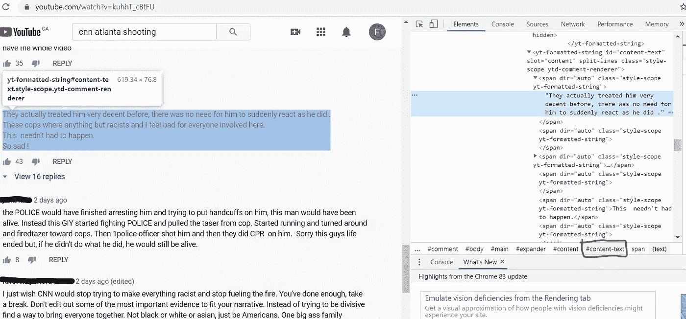
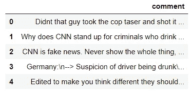

# 如何用 Python 抓取 Youtube 评论

> 原文：<https://towardsdatascience.com/how-to-scrape-youtube-comments-with-python-61ff197115d4?source=collection_archive---------8----------------------->

## 从头开始构建 NLP 数据库


来源:https://unsplash.com/photos/UfseYCHvIH0

任何自然语言处理项目的第一部分都是获取数据库。事实上，清洗和标记整个数据集只适用于 Kaggle，而不是在现实生活中。

当谈到情感分析项目时，我觉得 Youtube 评论代表了一个巨大的、未被充分利用的数据来源。您可以轻松获得所有观众对某个特定主题(如视频)的看法。

了解了所有这些，下面是如何一步一步地从 Youtube 视频中抓取评论。

以下是我将收集评论的视频:【https://www.youtube.com/watch?v=kuhhT_cBtFU】T2&t = 2s

这是 CNN 发布的一段视频，显示了 6 月 12 日发生在亚特兰大的逮捕和枪杀 Rayshard Brooks 的事件。

所以首先，别忘了从右边[这里](https://chromedriver.chromium.org/)安装一个 from 驱动。你还应该安装谷歌浏览器。现在已经完成了，让我们导入我们需要的库:

```
import time
from selenium.webdriver import Chrome
from selenium.webdriver.common.by import By
from selenium.webdriver.common.keys import Keys
from selenium.webdriver.support.ui import WebDriverWait
from selenium.webdriver.support import expected_conditions as EC
```

这里需要 Selenium，因为 Youtube 是 JavaScript 渲染的，这是 BeautifulSoup 无法处理的。

所有其他模块都是必需的，因为 Youtube 评论是动态加载的，这意味着它们只有在你向下滚动页面时才可见。因此，我们需要一个能够:

*   向下滚动
*   等待评论出现
*   删除评论
*   重复我们想要的任何范围。

下面是实现这一点的循环。

这就是它的工作原理:

1.  用 **driver.get** 函数访问你想要的 URL。
2.  使用 **wait.until** 和**EC . visibility _ of _ element _ located**向下滚动并等待，直到所有内容都可见。
3.  通过在当前查看的页面中找到所有的 **#content-text** 元素(这就是我们想要的，正如你在下面看到的)来收集评论。



4.将注释添加到数据列表中。

要从另一个视频中收集评论，你只需更改网址即可！就这么简单。

在这里，我重复循环 200 次，收集了大约 1400 条评论。数据如下所示:

```
import pandas as pd   
df = pd.DataFrame(data, columns=['comment'])
df.head()
```



这就是了。现在，您将能够使用这些数据来启动您的 NLP 项目。

感谢阅读，我希望这有所帮助！

成为会员:[https://francoisstamant.medium.com/membership](https://francoisstamant.medium.com/membership)