# 如何用 KDTree 搜索数据

> 原文：<https://towardsdatascience.com/how-to-search-data-with-kdtree-aad5c82ebd99?source=collection_archive---------38----------------------->

## 给你一个任务，在一个巨大的数据集中查找某个范围内的数据，你能快速有效地找到它吗？


克里斯托夫·鲁舍夫在 [Unsplash](https://unsplash.com?utm_source=medium&utm_medium=referral) 上拍摄的照片

# 动机

想象一下，你记录了你所在地区每天的游客数量。要求你报告从 2 月 2 日到 3 月 2 日的旅客人数。假设这些数据被排序，你**如何在短时间**内找到这个范围内的数据？这是一个范围搜索问题的陈述。

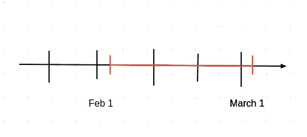

作者照片

这似乎是一个简单的问题。我们能从左到右检查所有数据吗？是的，但是如果我们有大量的**大数据**，这将花费大量的时间，还没有考虑到我们的数据可能是 k 维的**。**

**这个问题可以像 2D 地图一样推广到二维。**

**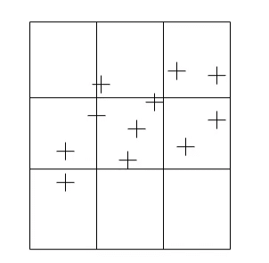**

**作者照片**

**我们可以将这个空间分成一个规则的网格 MxM，而不是在这个空间中搜索每一厘米。然后确定**完全落在范围**内的单元格和**与范围**相交的单元格。**

**我们将**包括完全落在范围**内的单元格的所有数据，并检查所有未完全包括的单元格的单个数据。这种方法的伟大之处在于，我们可以**快速排除不在范围内的数据**并缩小搜索范围。**

**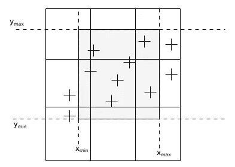**

**作者照片**

**但是，如果我们的数据是不一致的，这意味着在一些地区有数据的**簇**而在其他地区只有很少的数据，那该怎么办呢？**

*   **如果我们选择的网格太少(M 小)，我们将在一个单元格中有许多数据点。性能将接近顺序搜索之一。**
*   **如果我们选择许多网格(M 大)，我们可能会有太多的空单元格和空间浪费。**

**由于在现实生活中，我们经常需要处理像地图这样的非均匀数据，我们需要一种更好的方法。**

**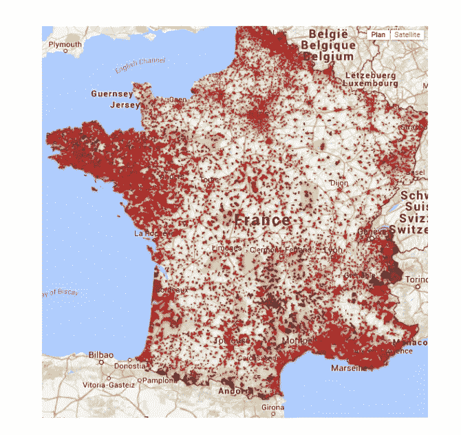**

**从[阿切努比斯](http://achenubis.blogspot.com/)取回**

**当处理如上所述的集群数据时，使用规则的网格会导致糟糕的行为。这就是为什么保持预先分割数据的想法是理想的，但是要根据**数据密度**进行分割！**

**一个你可能不知道的小秘密:我将介绍的数据结构是从 sklearn 创建对 [**KNearest 邻居**的健壮性的实现，而不是众所周知的 KNearest 邻居算法的实现。](https://scikit-learn.org/stable/modules/generated/sklearn.neighbors.KNeighborsClassifier.html)**

# **空间划分树**

**在考虑 k 维之前，我们先从 2 维开始。我们得到这样的数据点**

**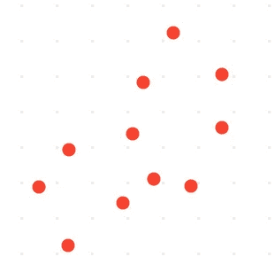**

**作者照片**

**我们将在轴(x 或 y)上的**中值**处分割数据，而不是将数据分割成等宽的网格。我们可以从沿着 y 轴的中间值开始，将平面分成两半。**

**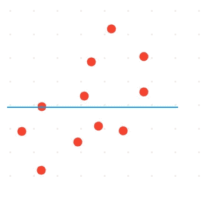**

**作者照片**

**然后在平面的每一半中，通过选择穿过每个细分中的**中值**的垂直线，继续将细分分成两个相等的细分。**

**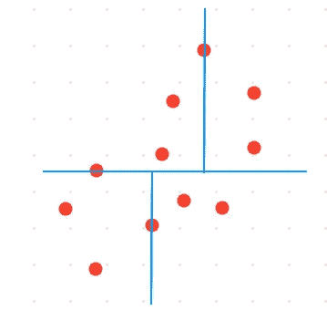**

**作者照片**

**我们在两个区域中递归地重复相同的过程，直到在相应的分割元素中不再有点(或者我们决定的点数)。**

**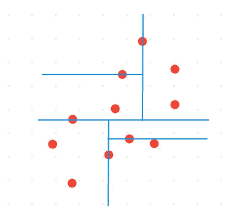**

**作者照片**

**使用这种方法，我们将能够根据数据的密度对其进行分区！那么这个方法的底层数据结构是什么呢？**

**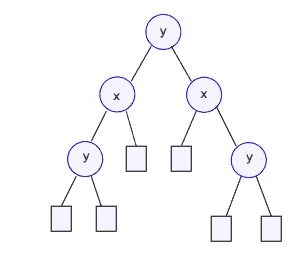**

**作者照片**

**它与二叉查找树非常相似，但又不完全相同。**

*   **由于数据首先在 y 轴上拆分，因此 y 是根节点。**
*   **子对象是 x，因为每个半平面都在 x 轴上分割。**
*   **左侧子树节点的所有 x 值都低于根节点的 x 值。**
*   **右边的子树节点的所有 x 值都高于根节点的 x 值。**
*   **在两个轴之间交替，直到我们到达极限。**

# **查找范围内的数据**

**目前为止听起来不错。但是我们如何使用这种数据结构来搜索特定范围内的数据呢？**

**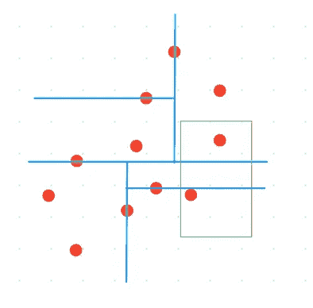**

**作者照片**

**好消息是，一旦我们创建了一个二维树，查找数据就变得简单多了。**

**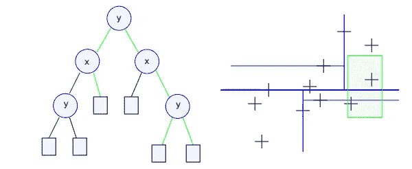**

**作者照片**

**我们从树根开始访问树节点:**

*   **如果节点在查询范围内**，则将其添加到答案中****
*   **如果查询的范围**与左子树定义的区域**相交，则探索它**
*   **如果查询的范围**与左子树定义的区域**相交，则探索它**

# **KdTree 示例**

**假设我们有一个 ECOBICI 站点(墨西哥城市自行车公共共享系统)位置的数据集。我们的任务是找到一定范围内的数据。正如我们所看到的，一些地区的站点比其他地区更密集。**

**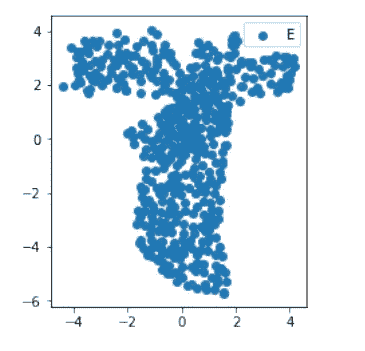**

**要查看如何使用 Kdtree 拆分上面的数据，克隆这个 [repo](https://github.com/khuyentran1401/kdtree-implementation)**

```
git clone [https://github.com/khuyentran1401/kdtree-implementation](https://github.com/khuyentran1401/kdtree-implementation)
```

**然后 cd 到本地机器中的 kdtree-implementation 目录并运行**

```
python ecobi.py
```

**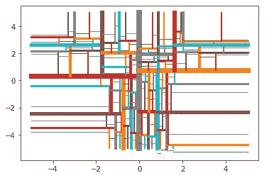**

**您应该看到上面数据的 kd 树表示。线条越多的区域表示该区域的集群越密集。**

**要查找特定区域的范围，请运行**

```
python findrange.py
```

**您应该会看到输入范围的提示。假设您在 x 轴上选择了-1 到 1 之间的范围，在 y 轴上选择了-1 到 1 之间的范围，您应该会看到该范围内的数据坐标。**

**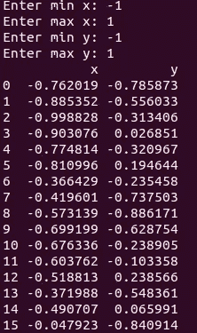**

**厉害！使用 KdTree，您可以在几秒钟内找到特定范围内的数据。尽管我们没有介绍如何使用 KdTree 搜索最近点，但是 KdTree 也可以有效地用于 Sklearn 的 KNearestNeighbor。**

# **结论**

**恭喜你！你已经学习了什么是 KdTree 及其应用。要了解如何实现它并将其用于您的数据，请查看我的 [Github repo](https://github.com/khuyentran1401/kdtree-implementation) 。**

**我喜欢写一些基本的数据科学概念，并尝试不同的算法和数据科学工具。你可以通过 [LinkedIn](https://www.linkedin.com/in/khuyen-tran-1401/) 和 [Twitter](https://twitter.com/KhuyenTran16) 与我联系。**

**如果你想查看我写的所有文章的代码，请点击这里。在 Medium 上关注我，了解我的最新数据科学文章，例如:**

**[](/convex-hull-an-innovative-approach-to-gift-wrap-your-data-899992881efc) [## 凸包:包装数据的创新方法

### 如何利用包装算法实现数据可视化

towardsdatascience.com](/convex-hull-an-innovative-approach-to-gift-wrap-your-data-899992881efc) [](/how-to-organize-your-data-science-articles-with-github-b5b9427dad37) [## 如何用 Github 组织你的数据科学文章

### 被新信息淹没？现在，您可以轻松地跟踪文章并为其创建自定义注释

towardsdatascience.com](/how-to-organize-your-data-science-articles-with-github-b5b9427dad37) [](/how-to-create-an-elegant-website-for-your-data-science-portfolio-in-10-minutes-577f77d1f693) [## 如何在 10 分钟内为您的数据科学产品组合创建一个优雅的网站

### 你需要做的就是编辑

towardsdatascience.com](/how-to-create-an-elegant-website-for-your-data-science-portfolio-in-10-minutes-577f77d1f693) [](/how-to-visualize-social-network-with-graph-theory-4b2dc0c8a99f) [## 如何用图论可视化社交网络

### 找出《权力的游戏》中的影响者

towardsdatascience.com](/how-to-visualize-social-network-with-graph-theory-4b2dc0c8a99f) [](/how-to-solve-analogies-with-word2vec-6ebaf2354009) [## 如何用 Word2Vec 解决类比问题

### 美国之于加拿大，就像汉堡之于 _？

towardsdatascience.com](/how-to-solve-analogies-with-word2vec-6ebaf2354009)**