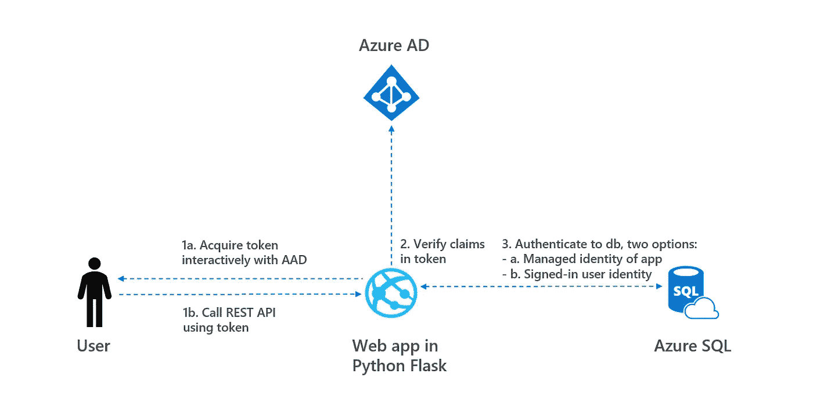
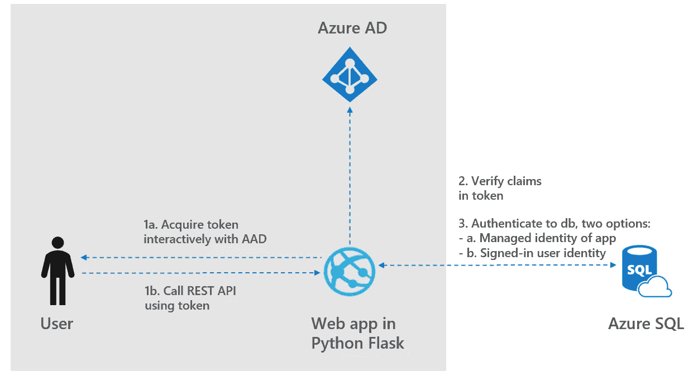
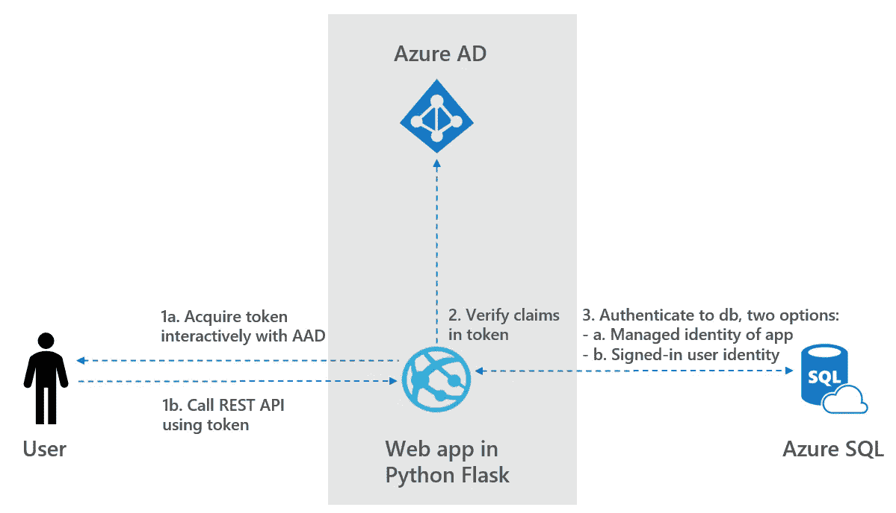
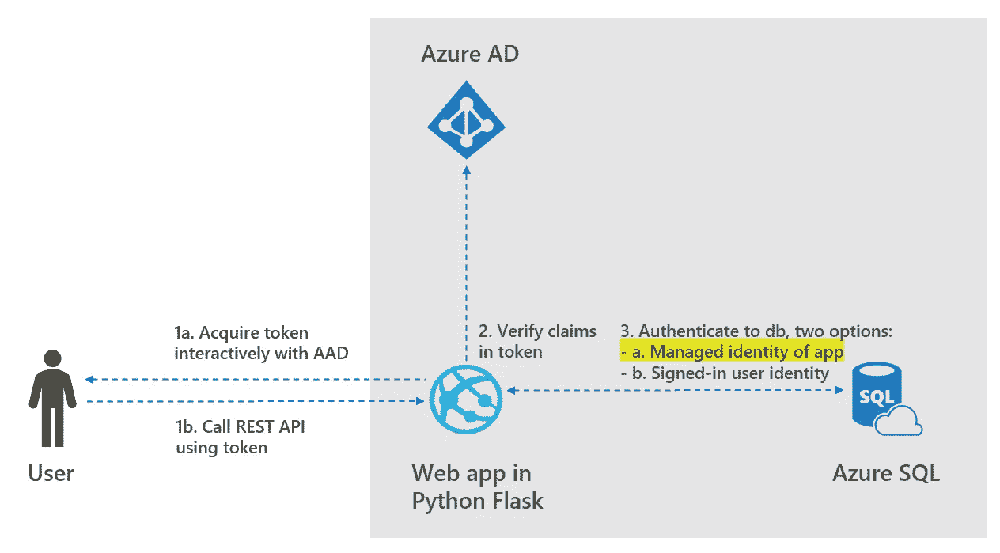
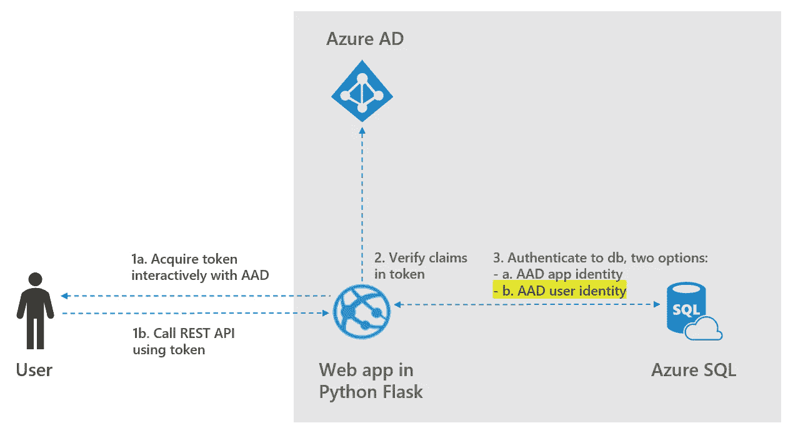

# 如何使用 Azure AD 保护 Python Flask Web APIs

> 原文：<https://towardsdatascience.com/how-to-secure-python-flask-web-apis-with-azure-ad-14b46b8abf22?source=collection_archive---------13----------------------->

## 学习在 web 应用和 Azure SQL 中使用身份和令牌

# 1.介绍

Python Flask 是创建 web 应用程序的流行工具。使用 Azure AD，用户可以向 REST APIs 进行身份验证，并从 Azure SQL 检索数据。在这篇博客中，创建了一个示例 Python web 应用程序，如下所示:

*   1a:用户登录 web 应用程序并获得一个令牌
*   1b:用户调用 REST API 来请求数据集
*   2: Web 应用程序使用令牌中的声明来验证用户对数据集的访问
*   3: Web app 从 Azure SQL 检索数据。Web 应用程序可以配置为 a)应用程序的托管身份或 b)登录的用户身份用于数据库的身份验证

项目的代码可以在[这里找到](https://github.com/rebremer/ms-identity-python-webapp-backend)，架构可以在下面找到。



1.使用 Azure AD 保护 Python Flask web APIs 简介。图片作者。

在本博客的剩余部分，将执行以下步骤:

*   步骤 1:获取令牌并使用令牌调用 api
*   步骤 2:验证令牌中的声明
*   步骤 3a:应用程序管理的身份认证
*   步骤 3b:登录的用户通过认证

要了解如何使用授权或应用程序权限访问 Azure Function 后端，请参见[我的后续博客](/how-to-use-the-microsoft-identity-platform-in-your-azure-web-app-fcb3839a44e5)，它与我的博客共享相同的 git repo。

# 步骤 1:获取令牌并使用令牌调用 api

此示例展示了如何使用 Flask 和 MSAL Python 构建一个 Python web 应用程序，该应用程序登录用户并访问 Azure SQL 数据库。有关协议在这个场景和其他场景中如何工作的更多信息，请参见 Azure AD 的[认证场景。在该步骤中，执行以下子步骤:](https://docs.microsoft.com/en-us/azure/active-directory/develop/active-directory-authentication-scenarios)

*   1.1:准备工作
*   1.2:创建和配置应用程序注册
*   1.3:配置 python webapp 项目
*   1.4:运行示例

步骤 1 关注架构的以下部分。



步骤 1:获取令牌并使用令牌调用 api。图片作者。

## 1.1:准备工作

若要运行此示例，您需要:

*   [Python 2.7+](https://www.python.org/downloads/release/python-2713/) 或 [Python 3+](https://www.python.org/downloads/release/python-364/)
*   Azure 活动目录(Azure AD)租户。有关如何获得 Azure AD 租户的更多信息，请参见[如何获得 Azure AD 租户。](https://docs.microsoft.com/azure/active-directory/develop/quickstart-create-new-tenant)
*   Git 克隆下面的项目:`git clone https://github.com/rebremer/ms-identity-python-webapp-backend.git`或者下载并解压存储库。zip 文件。

## 1.2:创建和配置应用程序注册

创建和配置应用程序注册，如下所示:

*   使用此[链接](https://docs.microsoft.com/en-us/azure/active-directory/develop/quickstart-register-app)中的步骤创建应用注册以创建应用注册。两个备注:
*   使用`http://localhost/getAToken`作为回复网址。如果您在创建过程中没有这样做，可以使用应用程序注册的**验证**选项卡添加它
*   转到**认证**并启用隐式授权中的选项 ID 令牌
*   转到**证书&秘密**创建一个秘密。复制客户端 id 和客户端密码

## 1.3:配置 pythonwebapp 项目

1.  打开`app_config.py`文件，改变下面的变量。
2.  在步骤 1.2 中创建应用程序注册时，找到文本`<<Enter_the_Client_Secret_here>>` ，并将其替换为您的应用程序密码。
3.  找到文本`<<Enter_the_Tenant_Name_Here>>`，用你的 Azure AD 租户名称替换现有值。
4.  找到文本`<<Enter_the_Application_Id_here>>`并用步骤 1.2 中应用程序注册的应用程序 ID (clientId)替换现有值。

## 1.4:运行示例

您需要使用 pip 安装依赖项，如下所示:

```
$ pip install -r requirements.txt
```

使用以下命令从 shell 或命令行运行 app.py:

```
flask run --host localhost --port 5000
```

当 app 在本地运行时，可以通过 localhost:5000(不是 127.0.0.1:5000)访问。在步骤 1 之后，用户可以使用他们的 Azure AD 凭据登录。在下一步中，设置用户角色，这些角色可用于验证是否允许用户使用 API 检索数据。

# 步骤 2:验证令牌中的声明

在此步骤中，可以设置令牌中的声明，令牌可以只是 web 应用程序，以验证是否允许用户调用 api。有关令牌声明的更多信息，请参见[此](https://docs.microsoft.com/en-us/azure/active-directory/develop/active-directory-optional-claims)链接。执行以下子步骤:

*   2.1:在应用配置中设置配置
*   2.2:向清单添加角色
*   2.3:将用户分配给角色

第 2 步关注架构的后续部分。



步骤 2:验证令牌中的声明。图片作者。

## 2.1:在应用配置中设置配置

索赔验证是一个可选步骤，可以使用`app_config.py`文件中的以下设置启用:`AAD_ROLE_CHECK = True`。

## 2.2:向清单添加角色

按照本教程[中的步骤，向步骤 1.2 中创建的应用注册添加角色。显然，应使用以下方法:](https://docs.microsoft.com/en-us/azure/active-directory/develop/howto-add-app-roles-in-azure-ad-apps)

```
"appRoles": [
  {
    "allowedMemberTypes": ["User"],
    "description": "Basic user, only read product data from SQLDB",
    "displayName": "basic_user_access",
    "id": "a8161423-2e8e-46c4-9997-f984faccb625",
    "isEnabled": true,
    "value": "basic_user_access"
  },
  {
    "allowedMemberTypes": ["User"],
    "description": "Premium user, read all data from SQLDB",
    "displayName": "premium_user_access",
    "id": "b8161423-2e8e-46c4-9997-f984faccb625",
    "isEnabled": true,
    "value": "premium_user_access"
  }
],
```

## 2.3:将用户分配给角色

在[链接](https://docs.microsoft.com/en-us/azure/active-directory/develop/howto-add-app-roles-in-azure-ad-apps#assign-users-and-groups-to-roles)中解释了用户的分配。作为测试，可以创建两个用户。用户 1 被分配了`basic_user_access`，而用户 2 获得了`premium_user_access`角色。

下一步，创建 Azure SQL 数据库，并使用应用程序身份从数据库中检索数据。

# 步骤 3a:应用程序管理的身份认证

在此步骤中，应用程序的托管身份用于检索数据，该数据链接到在步骤 1 中创建的应用程序注册。执行以下子步骤:

*   3a.1:创建 Azure SQL 数据库
*   3a.2:在应用配置中设置配置

步骤 3a 关注架构的以下部分。



步骤 3a:向 Azure SQL 应用托管身份认证。图片作者。

## 3a.1:创建 Azure SQL 数据库

使用这个[链接](https://docs.microsoft.com/en-us/azure/azure-sql/database/single-database-create-quickstart?tabs=azure-portal#create-a-single-database)创建一个 Azure SQL DB，其中可以选择最便宜的 SKU(基本)。确保完成以下工作:

*   AdvertureWorks 作为示例数据库安装，可以选择最便宜的数据库(SKU 基本)。
*   使用正确的读者角色将应用程序身份作为用户添加到 Azure SQL 数据库，请参见以下示例

```
CREATE USER [<<Name of app registration>>] FROM EXTERNAL PROVIDER;
EXEC sp_addrolemember [db_datareader], [<<Name of app registration>>];
```

## 3a.2:在应用配置中设置配置

backend_settings 需要设置为 database。还要确保连接中填入了您的设置。由于使用了 app 的 MI，application_permissions 需要指向"https://database.windows.net//。默认”在`app_config.py`文件中，也见下文。

```
# 2\. Type of BACKEND
#
# Option 2a. Database
BACKEND_SETTINGS = {"Type": "Database", "Connection":{"SQL_SERVER": "<<Enter_logical_SQL_server_URL_here>>.database.windows.net", "DATABASE": "<<Enter_SQL_database_name_here>>"}}# Option 3a. Delegated user is used to authenticate to Graph API, MI is then used to authenticate to backend...APPLICATION_PERMISSIONS = ["https://database.windows.net//.default"]
```

现在，应用程序可以按照步骤 1.4 中的描述运行。当您点击链接`(Premium users only) Get Customer data from Database`时，将检索客户数据。随后，当点击链接`Get Product data from Database`时，将检索产品数据(前提是在步骤 2 中为用户正确设置了声明或者检查被禁用)

在此步骤中，应用程序的身份用于检索数据。但是，用户的身份也可以通过(AAD passthrough)从数据库中检索数据。

# 步骤 3b:登录的用户通过认证

在该步骤中，用户本身的身份用于检索数据。这意味着在步骤 1 中创建的用于登录 web 应用程序的令牌也用于对数据库进行身份验证。执行以下子步骤:

*   3b.1:将 Azure SQL DB 范围添加到应用程序注册
*   3b.2:将 AAD 用户添加到数据库
*   3b.3:在应用配置中设置配置

步骤 3b 着重于体系结构的以下部分。



步骤 3b:对 Azure SQL 的已登录用户直通身份验证。图片作者。

## 3b.1:将 Azure SQL DB 范围添加到应用程序注册

*   修改在步骤 1.2 中创建的应用程序注册。作为委派用户拥有 Azure SQL 数据库的权限。这个在[环节](https://docs.microsoft.com/en-us/azure/azure-sql/database/active-directory-interactive-connect-azure-sql-db#register-your-app-and-set-permissions)中有解释
*   重要提示:Azure SQL 数据库需要管理员同意。这可以通过在**权限**选项卡中选择**默认目录**的 Grant_admin 权限来完成，也可以在运行时登录完成

## 3b.2:将 AAD 用户添加到数据库

因为在这个步骤中使用了 AAD passthrough，所以用户本身应该在 SQLDB 中具有适当的角色，作为外部用户和 datareader。参见下面的例子。

```
CREATE USER [<<AAD user email address>>] FROM EXTERNAL PROVIDER;
EXEC sp_addrolemember [db_datareader], [<<AAD user email address>>];
```

如果您想在数据库中的角色成员中获得更多的粒度，`read_customer`从 SalesLT 中读取数据。客户，而`read_product`从 SalesLT 读取数据。产品)

## 3b.3:在应用配置中设置配置

通过将 delegated_permissions 设置为[" https://SQL . azure syncapse-dogfood . net/User _ impersonation "]，可以在`app_config.py`文件中设置 AAD 用户直通身份验证，另请参见下文

```
# Option 3b. Delegated user is used to authenticate to backend, graph API disabled...DELEGATED_PERMISSONS = ["https://sql.azuresynapse-dogfood.net/user_impersonation"]
```

现在，应用程序可以按照步骤 1.4 中的描述运行，其中可以使用登录用户的身份从数据库中检索数据。

# 结论

在这篇博客中，创建了一个从 SQLDB 检索数据的 Python web 应用程序。讨论了用户声明、托管身份和登录用户直通令牌，以验证和授权用户从 Azure SQL 检索数据，另请参见下面的概述。


4.使用 Azure AD 保护 Python Flask web APIs 结论。图片作者。