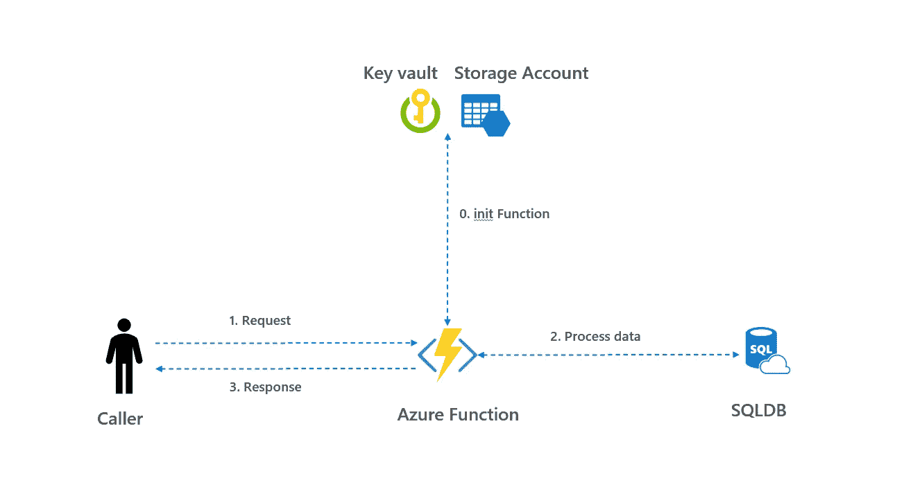
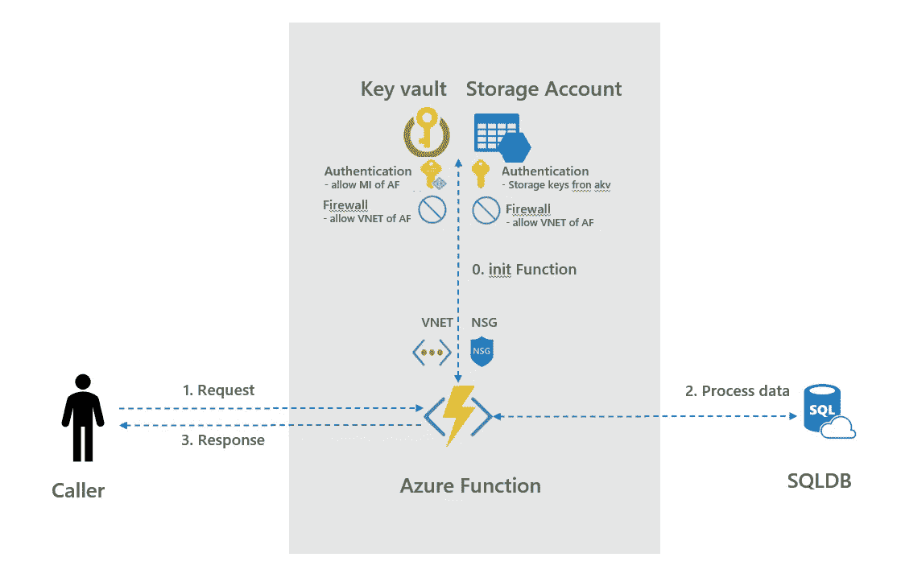
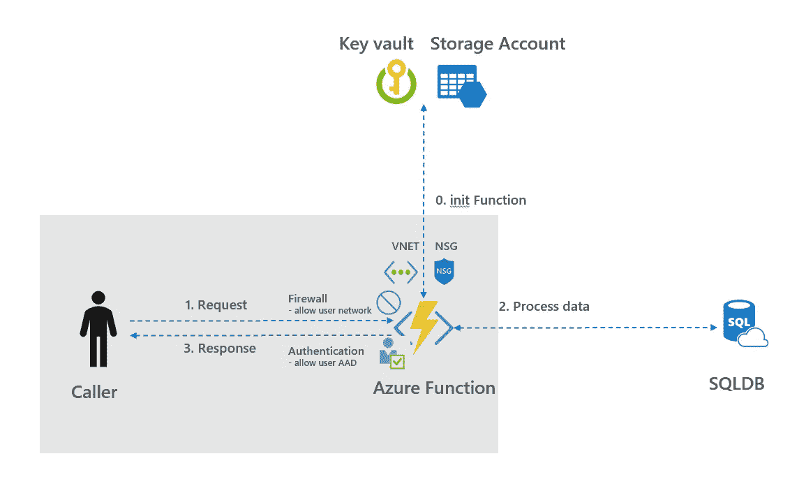
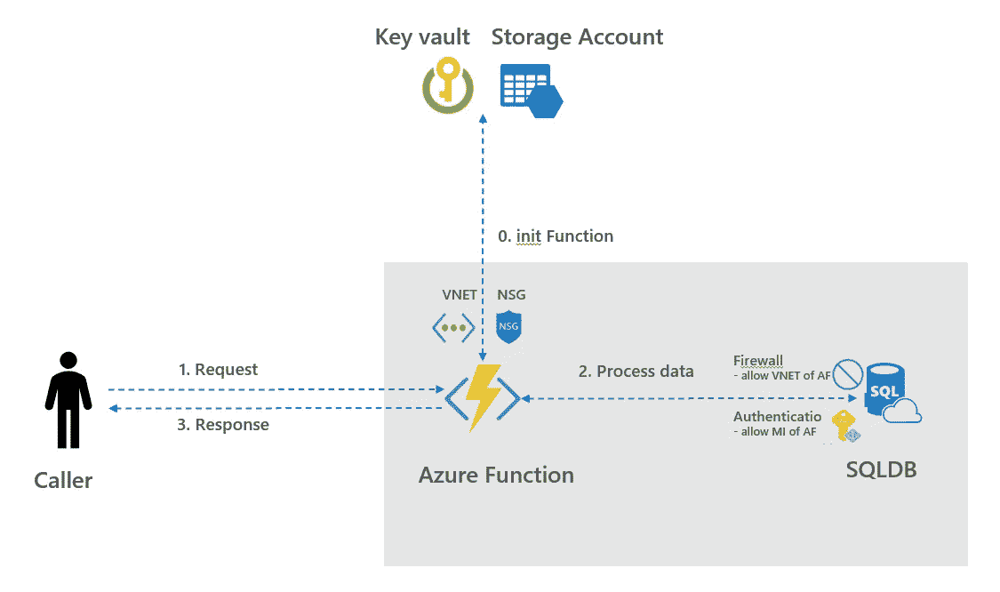
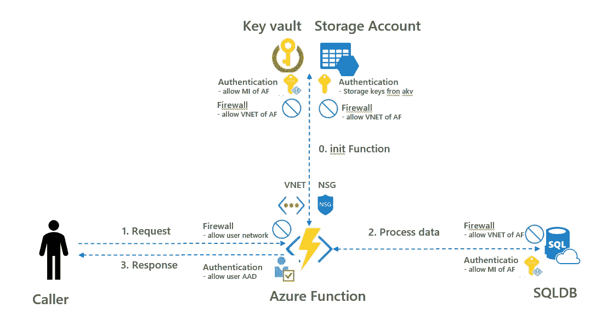

# 如何使用 Azure AD、密钥库和 VNETs 保护 Azure 功能

> 原文：<https://towardsdatascience.com/how-to-secure-your-azure-function-data-processing-c9947bf724fb?source=collection_archive---------8----------------------->

使用 Azure AD、密钥库和 VNETs 保护 Azure 功能。然后使用防火墙规则和函数的托管身份连接到 Azure SQL。

# A.Azure 功能安全性-简介

[Azure Functions](https://docs.microsoft.com/en-us/azure/azure-functions/functions-overview) 是一个流行的工具，用来创建可以执行简单任务的小代码片段。Azure 功能可以使用队列触发器、HTTP 触发器或时间触发器来触发。Azure 函数的典型模式如下:

*   Init:从存储帐户中检索状态
*   请求:端点被另一个应用程序/用户调用
*   处理:使用其他 Azure 资源处理数据
*   响应:将结果回复给呼叫者

模式如下所示，其中数据从 Azure SQL 检索并返回给应用程序/用户。



1.安全 Azure 功能—简介

在这篇博客中，讨论了如何保护 Azure 函数的安全。其中，使用了 Azure AD、托管身份、密钥库、VNET 和防火墙规则。为了创建专用和隔离的 Azure 功能，也可以决定创建单独的 [App 服务环境(ASE)](https://docs.microsoft.com/en-us/azure/app-service/environment/intro) 。然而，ASE 可能很难管理，并且涉及更多的成本。因此，在这个博客中没有使用 ASE，而是采用了常规的应用服务计划。结构如下:

*   B0。init:Azure 函数的安全存储帐户
*   B1/B3。请求-响应:对 Azure 函数的安全访问
*   B2。处理数据:从 Azure 函数安全访问 Azure SQL
*   C.结论

关于如何保护你的 Azure 数据工厂管道的详细信息，请看[这篇](/how-to-secure-your-azure-data-factory-pipeline-e2450502cd43)博客。在这篇[博客](/how-to-create-a-selenium-web-scraper-in-azure-functions-f156fd074503)中讨论了部署一个定制的 docker 映像作为 Azure 函数来运行 Selenium web scraper。

# B0。init:Azure 函数的安全存储帐户

Azure 函数总是附带一个支持存储帐户。在此存储帐户上，可以在文件共享中找到代码，并且日志记录被写入 blob 存储中。在这个博客中，安全帐户的保护如下:

*   Azure 功能的托管身份(MI)已启用，此 MI 用于向 Azure 密钥库进行身份验证以获取/设置机密
*   存储密钥存储在密钥库中，而不是默认的应用程序设置中。此外，Azure 功能键存储在这个密钥库中
*   VNET 集成已启用 Azure 功能，以便所有出站流量都流经此 VNET
*   添加了 NSG，仅允许到端口 443、1433 和目的地 Azure WestEurope 的出站流量
*   只有 Azure Function 的 VNET 可以使用防火墙规则访问密钥库。
*   (可选)只有 Azure Function 的 VNET 可以使用防火墙规则访问支持存储帐户。请注意，这种情况是官方不支持的，请参见[此处](https://docs.microsoft.com/en-us/azure/azure-functions/functions-networking-options#restrict-your-storage-account-to-a-virtual-network)，它可能会破坏您的应用程序。使用此功能时，如果应用程序仍在工作，则应在部署到生产环境后进行明确测试，如果不工作，则应重新部署应用程序。

下面描述了在 Azure 函数模式中保护存储帐户的安全。



B0。初始化函数安全性

这一步的代码通过使用下面找到，脚本也可以在[我的 github](https://github.com/rebremer/azure_function_mi_sqldb/blob/master/scripts_deployment/B0_init_secure_storage_account.ps1) 上找到。

```
**# B0_1\. Login** 
Clear-AzContext -Scope CurrentUser -Force                       Connect-AzAccount
**# B0_2\. Variables, take same id in all B0/B1B3/B2 scripts**
$id = "3405" 
$rg = "test-funappsec" + $id + "-rg"                       
$loc = "westeurope"                       
$funname = "test-funappsec" + $id + "-func"
$funstor = "testfunappsec" + $id + "stor"                       
$akv = "test-funappsec" + $id + "-akv"
$funplan = "test-funappsec" + $id + "-plan"
$vnet = "test-funappsec" + $id + "-vnet"                       
$nsg = "test-funappsec" + $id + "-nsg"                       
$subnet = "azurefunction"                       
$addressrange = "10.200.0.0"
**# B0_3\. Create resource group **                      
az group create -n $rg -l $loc                                               **# B0_4\. Create Storage account **                      
az storage account create -n $funstor -g $rg --sku Standard_LRS                                               **# B0_5\. Create VNET **                      
az network vnet create -g $rg -n $vnet --address-prefix $addressrange/16 -l $loc                                               **# B0_6\. create NSG  **                     
az network nsg create -g $rg -n $nsg                                               **# B0_7\. Create firewall rules** # Only allow outbound to WE storage, port 443 and Azure WE
az network nsg rule create -g $rg --nsg-name $nsg -n allow_we_stor_sql --priority 100 --source-address-prefixes VirtualNetwork --source-port-ranges '*' --destination-address-prefixes Storage.WestEurope --destination-port-ranges '443' '1433' --access Allow --protocol '*' --description "Allow storage West Europe 443" --direction Outbound                       
az network nsg rule create -g $rg --nsg-name $nsg -n allow_azure_internal --priority 110 --source-address-prefixes VirtualNetwork --source-port-ranges '*' --destination-address-prefixes AzureCloud.WestEurope --destination-port-ranges '*' --access Allow --protocol '*' --description "Azure we" --direction Outbound                       
az network nsg rule create -g $rg --nsg-name $nsg -n deny_all_outbound --priority 130 --source-address-prefixes '*' --source-port-ranges '*' --destination-address-prefixes '*' --destination-port-ranges '*' --access Deny --protocol '*' --description "Deny all outbound" --direction Outbound                                               **# B0_8\. Create subnet with NSG to VNET  **                     
az network vnet subnet create -g $rg --vnet-name $vnet -n $subnet --address-prefixes $addressrange/24 --network-security-group $nsg                                               **# B0_9\. Turn on firewall **                      
Update-AzStorageAccountNetworkRuleSet -ResourceGroupName $rg -Name $funstor -DefaultAction Deny                                               **# B0_10\. Set service endpoints for storage and web app to subnet   **                    Get-AzVirtualNetwork -ResourceGroupName $rg -Name $vnet | Set-AzVirtualNetworkSubnetConfig -Name $subnet -AddressPrefix $addressrange/24 -ServiceEndpoint "Microsoft.Storage", "Microsoft.Web", "Microsoft.Sql", "Microsoft.KeyVault" | Set-AzVirtualNetwork                                               
**# B0_11\. Add firewall rules to Storage Account    **                   $subnetobject = Get-AzVirtualNetwork -ResourceGroupName $rg -Name $vnet | Get-AzVirtualNetworkSubnetConfig -Name $subnet                       Add-AzStorageAccountNetworkRule -ResourceGroupName $rg -Name $funstor -VirtualNetworkResourceId $subnetobject.Id                                               **# B0_12\. Create Azure Function**                       
az appservice plan create -n $funplan -g $rg --sku P1v2 --is-linux                       az functionapp create -g $rg --os-type Linux --plan $funplan --runtime python --name $funname --storage-account $funstor                                               **# B0_13\. Turn on managed identity of Azure Function  **                     az webapp identity assign --name $funname --resource-group $rg                                               **# B0_14\. Add VNET integration**
az webapp vnet-integration add -g $rg -n $funname --vnet $vnet --subnet $subnet                                               
**# B0_15\. Create key vault     **                  
az keyvault create --name $akv --resource-group $rg --location $loc                                               **# B0_16\. Set policy such that Azure Function can read from AKV   **                    $objectid_funname = az functionapp identity show -n $funname -g $rg --query "principalId"                       
az keyvault set-policy -n $akv --secret-permissions set get list --object-id $objectid_funname                                               
**# B0_17\. Set acl on key vault  **                     
az keyvault network-rule add -n $akv -g $rg --subnet $subnet --vnet-name $vnet                                               
**# B0_18\. Get storage connection string and add to key vault   **                    $storageconnectionstring = az storage account show-connection-string -n $funstor --query "connectionString"                       
$keyref = az keyvault secret set -n storageconnectionstring --vault-name $akv --value $storageconnectionstring --query "id"                       $appkeyref = "@Microsoft.KeyVault(SecretUri=" + $keyref + ") " -replace '"',''                                               
**# B0_19\. Set app settings of function** # Function gets function keys from AKV instead of storage account     az functionapp config appsettings set --name $funname --resource-group $rg --settings AzureWebJobsSecretStorageKeyVaultConnectionString="" AzureWebJobsSecretStorageKeyVaultName=$akv AzureWebJobsSecretStorageType="keyvault"                                               az functionapp config appsettings set --name $funname --resource-group $rg --settings AzureWebJobsStorage=$appkeyref                       az functionapp config appsettings set --name $funname --resource-group $rg --settings AzureWebJobsDashboard=$appkeyref                                               **# B0_20\. Done**
```

# B1B3。请求-响应:对函数的安全访问

默认情况下，Azure 功能键用于对 Azure 函数的请求进行身份验证。由于 Azure 功能在 web 应用中运行，因此可以为 Azure 功能启用 Azure AD 身份验证。在这篇博客中，对 Azure 函数的访问是安全的，如下所示:

*   为 Azure 函数启用了 Azure AD，因此只有此 Azure AD 租户中的对象可以调用该函数。Azure AD 中的对象可以是用户、服务主体或托管身份
*   (可选)仅将 Azure AD 租户中可以访问该功能的特定对象列入白名单。例如，只有 Azure 数据工厂实例的托管身份可以执行一个函数(参见这个[博客](/(e.g. an ADFv2 managed identity))
*   (可选)在 Azure 功能的防火墙规则中添加[访问限制](https://docs.microsoft.com/nl-nl/azure/app-service/app-service-ip-restrictions#adding-and-editing-access-restriction-rules-in-the-portal)

限制对 Azure 函数的访问如下所示。



B1B3。请求-响应安全性

这一步的代码通过使用下面找到，脚本也可以在 [my github](https://github.com/rebremer/azure_function_mi_sqldb/blob/master/scripts_deployment/B1B3_request_response_enable_easy_auth.ps1) 上找到。

```
**# B1B3_1\. Login** 
Clear-AzContext -Scope CurrentUser -Force                       Connect-AzAccount
**# B1B3_2\. Variables, take same id in all B0/B1B3/B2 scripts**
$id = "3405" # take same id in all B0/B1B3/B2 scripts                                               $rg = "test-funappsec" + $id + "-rg"                       
$funname = "test-funappsec" + $id + "-func"                                               # 0.2 connect to AAD                       
$Environment = "AzureCloud"                       
$aadConnection = Connect-AzureAD -AzureEnvironmentName $Environment                                               **# B1B3_3\. Creat App registration    **                   
# step 2 is derived from https://devblogs.microsoft.com/azuregov/web-app-easy-auth-configuration-using-powershell/                       $Password = [System.Convert]::ToBase64String($([guid]::NewGuid()).ToByteArray())                       $startDate = Get-Date                       
$PasswordCredential = New-Object -TypeName Microsoft.Open.AzureAD.Model.PasswordCredential                       $PasswordCredential.StartDate = $startDate                       $PasswordCredential.EndDate = $startDate.AddYears(10)                       $PasswordCredential.Value = $Password                       $identifier_url = "https://" + $funname + ".azurewebsites.net"                       [string[]]$reply_url = $identifier_url + "/.auth/login/aad/callback"                       $reqAAD = New-Object -TypeName "Microsoft.Open.AzureAD.Model.RequiredResourceAccess"                       $reqAAD.ResourceAppId = "00000002-0000-0000-c000-000000000000"                       $delPermission1 = New-Object -TypeName "Microsoft.Open.AzureAD.Model.ResourceAccess" -ArgumentList "311a71cc-e848-46a1-bdf8-97ff7156d8e6","Scope"              
$reqAAD.ResourceAccess = $delPermission1                                               $appRegName = $funname + "_easyauth"                       
$appReg = New-AzureADApplication -DisplayName $appRegName -IdentifierUris $identifier_url -Homepage $identifier_url -ReplyUrls $reply_url -PasswordCredential $PasswordCredential -RequiredResourceAccess $reqAAD                                               **# B1B3_4\. Add new AppRole object to app registration **                      # step 3 is derived from https://gist.github.com/psignoret/45e2a5769ea78ae9991d1adef88f6637                       
$newAppRole = [Microsoft.Open.AzureAD.Model.AppRole]::new()                       $newAppRole.DisplayName = "Allow MSI SPN of ADFv2 to authenticate to Azure Function using its MSI"                       $newAppRole.Description = "Allow MSI SPN of ADFv2 to authenticate to Azure Function using its MSI"
$newAppRole.Value = "Things.Read.All"                       
$Id = [Guid]::NewGuid().ToString()                       $newAppRole.Id = $Id                       
$newAppRole.IsEnabled = $true                       $newAppRole.AllowedMemberTypes = "Application"                       $appRoles = $appReg.AppRoles                       
$appRoles += $newAppRole                       
$appReg | Set-AzureADApplication -AppRoles $appRoles                                               **# B1B3_5\. Add app registration to web app **                      $authResourceName = $funname + "/authsettings"                       $auth = Invoke-AzResourceAction -ResourceGroupName $rg -ResourceType Microsoft.Web/sites/config -ResourceName $authResourceName -Action list -ApiVersion 2016-08-01 -Force                       $auth.properties.enabled = "True"                       $auth.properties.unauthenticatedClientAction = "RedirectToLoginPage"                       $auth.properties.tokenStoreEnabled = "True"                       $auth.properties.defaultProvider = "AzureActiveDirectory"                       $auth.properties.isAadAutoProvisioned = "False"                       $auth.properties.clientId = $appReg.AppId                       $auth.properties.clientSecret = $Password                       $loginBaseUrl = $(Get-AzEnvironment -Name $environment).ActiveDirectoryAuthority                       $auth.properties.issuer = $loginBaseUrl + $aadConnection.Tenant.Id.Guid + "/"                       $auth.properties.allowedAudiences = @($identifier_url)                       New-AzResource -PropertyObject $auth.properties -ResourceGroupName $rg -ResourceType Microsoft.Web/sites/config -ResourceName $authResourceName -ApiVersion 2016-08-01 -Force                                               **# B1B3_6\. Create SPN connected to app registration   **                    $SPN = New-AzADServicePrincipal -ApplicationId $appReg.AppId -DisplayName $appRegName                                                                                             
**# B1B3_7\. Set "User assignment required?" to true in SPN** # (optional, in case you want to whitelist AAD users)                      #Set-AzureADServicePrincipal -ObjectId $SPN.Id -AppRoleAssignmentRequired $true                                                                  **# B1B3_8\. Set obj of ADFv2 as only authorized user to log in web app**
# (optional, in case you want to whitelist AAD users)                        #$adfv2_resource = Get-AzDataFactoryV2 -ResourceGroupName $rg -Name $adfv2_name                       
#New-AzureADServiceAppRoleAssignment -ObjectId $adfv2_resource.Identity.PrincipalId -Id $newAppRole.Id -PrincipalId $adfv2_resource.Identity.PrincipalId -ResourceId $SPN.Id
**# B1B3_9\. Done**
```

# B2。进程:从函数安全访问 SQLDB

Azure SQL(又名 SQLDB)用于从。在这篇博客中，Azure SQL 的数据处理受到如下保护:

*   Azure 功能的托管身份(MI)已启用，此 MI 用于向 SQLDB 进行身份验证
*   Azure 函数的 MI 被配置为 SQLDB 中的外部 Azure AD 对象，并被授予读取者角色以检索数据
*   只有 Azure 函数的 VNET 可以使用防火墙规则访问 SQLDB

下面描述了如何限制从 Azure 函数访问 SQLD。



2.在 SQLDB 安全性中处理数据

这一步的代码通过使用下面找到，脚本也可以在 [my github](https://github.com/rebremer/azure_function_mi_sqldb/blob/master/scripts_deployment/B2_processing_mi_sqldb.ps1) 上找到。

```
**# B2_1\. Login** 
Clear-AzContext -Scope CurrentUser -Force                       Connect-AzAccount
**# B2_2\. Variables, take same id in all B0/B1B3/B2 scripts** $id = "3405" # take same id in all B0/B1B3/B2 scripts                                               $rg = "test-funappsec" + $id + "-rg"                       
$rg_sql = "test-funappsec" + $id + "-rg"                       
$loc = "westeurope"                       
$funname = "test-funappsec" + $id + "-func"                       $vnet = "test-funappsec" + $id + "-vnet"                       $subnet = "azurefunction"                                               $sqlserver = "test-funappsec" + $id + "-dbs"                       $sqldb = "test-funappsec" + $id + "-sqldb"                       $sqluser = "testfunappsec" + $id + "sqluser"                       $pass = "<<SQLDB password, use https://passwordsgenerator.net/>>"                       $aaduser = "<<your AAD email account>>"                                              **# B2_3\. Create logical SQL server and SQLDB**
az sql server create -l $loc -g $rg_sql -n $sqlserv -u sqluser -p $pass                       
az sql db create -g $rg_sql -s $sqlserver -n $sqldb --service-objective Basic --sample-name AdventureWorksLT                                               **# B2_4\. Configure AAD access to logical SQL server **                      
# Connect-AzureAD                       
Set-AzSqlServerActiveDirectoryAdministrator -ResourceGroupName $rg_sql -ServerName $sqlserver -DisplayName $aaduser                                                **# B2_5\. log in SQL with AAD (e.g. via portal query editor/SSMS/VSC) **                      # Execute following SQL statement                       
#CREATE USER [<<your azure function name, equal to $funname>>] FROM EXTERNAL PROVIDER;                       
#EXEC sp_addrolemember [db_datareader], [<<your azure function name, equal to $funname>>];                                               
**# B2_6\. point app settings to database **                      
az functionapp config appsettings set --name $funname --resource-group $rg --settings sqlserver=$sqlserver sqldb=$sqldb                                               **# B2_7\. Add firewall rules    **                   
$subnetobject = Get-AzVirtualNetwork -ResourceGroupName $rg -Name $vnet | Get-AzVirtualNetworkSubnetConfig -Name $subnet                       New-AzSqlServerVirtualNetworkRule -ResourceGroupName $rg_sql -ServerName $sqlserver -VirtualNetworkRuleName $subnet -VirtualNetworkSubnetId $subnetobject.Id                                               **# B2_8\. Upload code Azure Function **                      
# To create Azure Function in Python, see https://github.com/MicrosoftDocs/azure-docs/blob/master/articles/azure-functions/functions-create-first-function-python.md                       
# Get code from __init__.py and requirements.txt from this git repo, then run command below                                               func azure functionapp publish $funname
**# B2_9\. Done**
```

# C.结论

Azure 函数是一个流行的工具，用来创建可以执行简单任务的小代码片段。在这篇博客中，讨论了如何保护一个典型的 Azure 函数，如下所示

*   0.init:Azure 函数的安全存储帐户
*   1/3.请求-响应:对 Azure 函数的安全访问
*   2.处理数据:从 Azure 函数安全访问 SQLDB

下面也描述了具有安全性的模式。



C.具有安全性的 Azure 函数模式

***来自《走向数据科学》编辑的提示:*** *虽然我们允许独立作者根据我们的* [*规则和指导方针*](/questions-96667b06af5) *发表文章，但我们不认可每个作者的贡献。你不应该在没有寻求专业建议的情况下依赖一个作者的作品。详见我们的* [*读者术语*](/readers-terms-b5d780a700a4) *。*