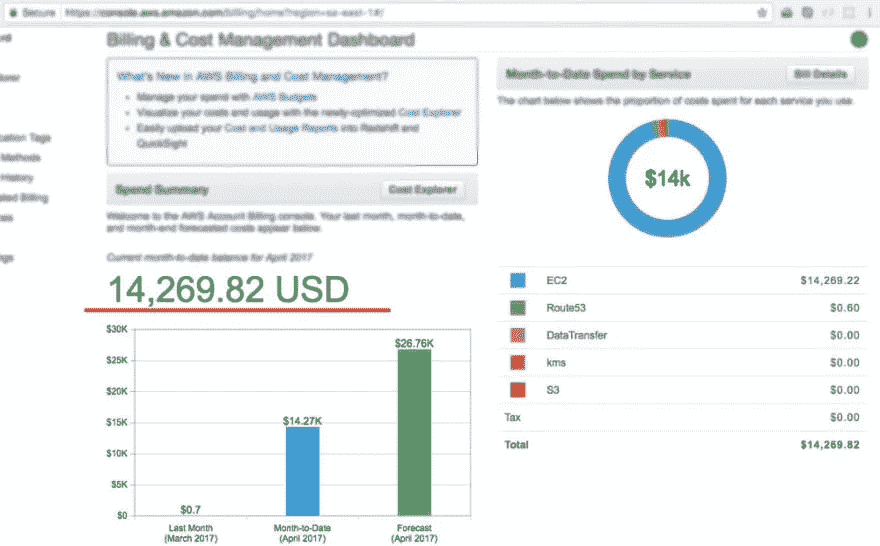
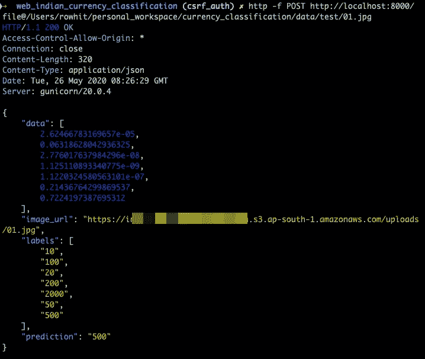
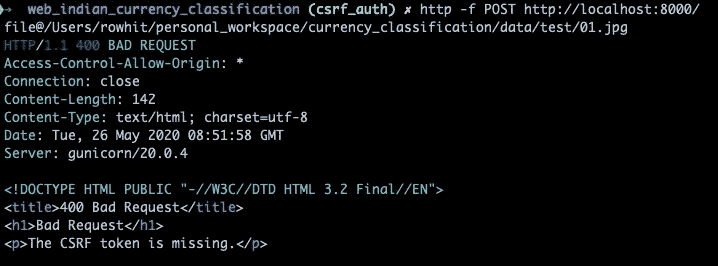
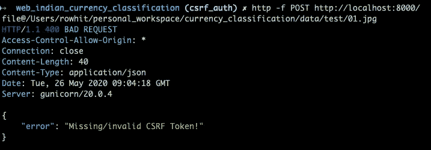

# 如何使用 CSRF 保护来保护您的机器学习应用程序？

> 原文：<https://towardsdatascience.com/how-to-secure-your-machine-learning-app-with-csrf-protection-506c3383f9e5?source=collection_archive---------39----------------------->

## 机器学习技巧

## 通过真实示例了解 CSRF 保护的内容和原因。


由 [Unsplash](https://unsplash.com?utm_source=medium&utm_medium=referral) 上的 [Katarzyna Pe](https://unsplash.com/@kasiape?utm_source=medium&utm_medium=referral) 拍摄

那么你已经训练好了你的 ML/DL 模型，现在考虑在云上部署它。最受欢迎的方法之一是将你的模型包装在 Flask 应用程序中，并使用 REST API 提供服务。但是请稍等，让我们为您的应用程序添加一些安全性。我将借助一个真实世界的例子简要解释代码，以及为什么考虑应用程序的安全性很重要。我将尽可能直截了当地介绍实现部分。但是首先，像任何其他教程一样，让我们了解什么是 CSRF，为什么我们真的需要它？

## CSRF 到底是什么？

跨站点请求伪造(CSRF)，也称为 XSRF、Sea Surf 或 Session Riding，是一种攻击媒介，它欺骗 web 浏览器在用户登录的应用程序中执行不需要的操作。

那是什么意思？让我用最简单的术语来解释它。

我正在做一个[个人深度学习](https://github.com/rowhitswami/Indian-Paper-Currency-Prediction)项目，它将一张图像(印度纸币)作为输入，并从 10、20、50、100、200、500、2000 新面值的印度货币中预测图像的类别。

**问题:**我不是一个安全人员，但是在这个项目中，我注意到我的 API 端点现在是公开的。现在的问题是，你为什么要在乎它是否暴露？这对开发者来说意味着什么？

**回答:**以我的情况来说，互联网上的任何人都可以用所需的数据向我的 app 发送合法的 POST 请求，并获得预测。你真的不希望自己处于这样的场景中，你把上传的图像和预测存储在一个 S3 桶中。如果你使用 AWS 的免费层(像我一样！)，那么这些坏人可以立即消耗你的免费等级的免费配额，最终会给你这样的账单。



我在亚马逊网络服务上被开了 14k 美元的账单😱(来源:[https://dev . to/juanmanuelramallo/I-was-billed-on-Amazon-web-services-17fn](https://dev.to/juanmanuelramallo/i-was-billed-for-14k-usd-on-amazon-web-services-17fn))

我试图在我的本地机器上重现这个场景，毫无疑问，我能够在我的终端上得到预测。成功执行该命令后，输入图像和预测也存储在我的 S3 存储桶中。



这种合法但伪造的请求被称为跨站点伪造请求(CSRF)。现在的问题是…

## 如何为你的应用程序实现 CSRF 保护？

根据文档，如果您使用 [FlaskForm](https://flask-wtf.readthedocs.io/en/stable/api.html#flask_wtf.FlaskForm) 来处理请求，您已经获得了 CSRF 保护。如果您没有使用 FlaskForm 或发出 AJAX 请求，您可能需要使用所提供的扩展显式地添加另一层安全性。

```
# app.pyfrom flask import Flask
from flask_wtf.csrf import CSRFProtect, CSRFErrorapp = Flask(__name__)
app.config['SECRET_KEY'] = "anything_unique"
app.config['WTF_CSRF_TIME_LIMIT'] = WTF_CSRF_TIME_LIMIT
CSRFProtect(app)
```

正如您可能已经猜到的，在第一行中，我们正在导入 **Flask** 类。这个类的一个实例将是我们的 WSGI 应用程序。在第二行，我们从 **flask_wtf** 模块导入 **CSRFProtect** 类。

接下来，我们将创建 Flask 类的实例。在接下来的两行中，我们将设置密钥和 CSRF 令牌的到期时间限制。需要注意的是，没有这个密钥，你就不能真正享受 CSRF 的保护。

> 注意:CSRF 保护需要一个秘密密钥来安全地签署令牌。默认情况下，这将使用 Flask 应用程序的`SECRET_KEY`。如果您想使用单独的令牌，您可以设置`WTF_CSRF_SECRET_KEY`。

我强烈建议您将您的密钥存储在`.env`文件中或者作为一个环境变量，这样在将您的代码推向生产时就不会被分发。我会在这篇博客的最后部分谈到`WTF_CSRF_TIME_LIMIT`。最后一行是奇迹发生的地方！用`ProtectCSRF`扩展注册将会为 Flask 应用启用全球 CSRF 保护。

现在，我们将在表单中添加 CSRF 代币的值。

```
<!-- index.html --><form method="post" >
<input type="hidden" name="csrf_token" value="{{ csrf_token() }}" />
...
...
...
</form>
```

然而，[官方文档](https://flask-wtf.readthedocs.io/en/stable/csrf.html)建议在 AJAX 请求的头中添加`csrf_token`。

你猜怎么着？我们完了！


来源:[https://giphy . com/gifs/intuit quickbooks-Danny-devito-quickbooks-intuit-8jw 82 ndayfmnoyaekm](https://giphy.com/gifs/intuitquickbooks-danny-devito-quickbooks-intuit-8JW82ndaYfmNoYAekM)

好吧，你不相信我？这就是证据😅

添加代码后，我在我的终端中执行相同的命令，并得到以下响应。



Flask 应用程序在请求体中找不到`csrf_token`，因此出现了错误的请求。

## 用户化

1.  您可以使用`WTF_CSRF_TIME_LIMIT`设置 CSRF 令牌的到期时间。这是 CSRF 令牌的最长期限(秒)。默认值为 3600。如果设置为 None，则 CSRF 令牌在会话生命周期内有效。
2.  您还可以在 CSRF 令牌丢失/无效的情况下捕捉错误，并在您的应用程序视图中显示出来。阶级`CSRFError`在这里是我们的救援。您只需要在 Flask 应用程序中定义一个简单的路由来捕获 CSRF 令牌异常。

```
[@app](http://twitter.com/app).errorhandler(CSRFError)
def handle_csrf_error(e):
    return jsonify({"error": e.description}), 400
```

在上面的代码中，我们捕获了 CSRF 可能出现的异常，并以 JSON 格式返回，状态代码为 400(错误请求)。

您可以根据您的应用进行修改。下面是修改 CSRF 令牌后对 POST 请求的响应。



## 结束注释

本博客中使用的所有代码片段都是我的[印度纸币预测](https://github.com/rowhitswami/Indian-Paper-Currency-Prediction)项目的一部分。

我非常乐意与你见面。你可以访问我的个人网站 www.rohitswami.com[了解我更多。还有，你可以在](https://www.rohitswami.com) [LinkedIn](https://www.linkedin.com/in/rowhitswami) 和 [GitHub](https://www.github.com/rowhitswami/) 上找到我🎉

我很想听到你对这篇文章的反馈。请随意在下面的评论区发送垃圾邮件。😊

***来自《走向数据科学》编辑的提示:*** *虽然我们允许独立作者根据我们的* [*规则和指导方针*](/questions-96667b06af5) *发表文章，但我们并不认可每个作者的贡献。你不应该在没有寻求专业建议的情况下依赖一个作者的作品。详见我们的* [*读者术语*](/readers-terms-b5d780a700a4) *。*