# 如何在没有机器学习的情况下对客户进行细分

> 原文：<https://towardsdatascience.com/how-to-segment-your-customers-without-machine-learning-a14107c62298?source=collection_archive---------49----------------------->

## RFM 分析快速指南

照片由[肯尼·罗](https://unsplash.com/@kennyluoping?utm_source=medium&utm_medium=referral)在 [Unsplash](https://unsplash.com?utm_source=medium&utm_medium=referral)

> 让我们听一个故事。

# 介绍

致谢:[亚历克斯·昆切夫斯基](https://dribbble.com/kunchevsky)来源:[滴滴出行](https://dribbble.com/shots/2876664-Gift-Shop?utm_source=Clipboard_Shot&utm_campaign=kunchevsky&utm_content=Gift%20Shop&utm_medium=Social_Share)

2020 年， *Gifty* (一家虚构的公司)受到新冠肺炎局势的重创。零售店关门了，顾客被锁在家里，没有人从 Gifty 买任何东西。

作为一家销售圣诞礼物的商店，我们不能破产。送礼的精神必须永存！

圣诞老人博士，吉夫蒂的首席执行官给我的任务是让吉夫蒂活着。这意味着两件事:

1.  削减成本
2.  增加收入

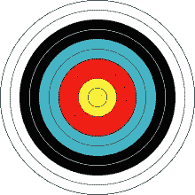

来源:[维基百科](https://en.wikipedia.org/wiki/Bullseye_(target)#/media/File:WA_80_cm_archery_target.svg)

作为首席营销官，我将通过“牛眼计划”拯救 Gifty。正如“牛眼”这个词所暗示的，我们将把精力集中在**重新定位**我们的客户上。在我们锁定客户之前，我们必须对他们进行细分。

每当我们谈论客户细分时，我们通常会想到机器学习方法，如 K-NN、K-means 或多项式逻辑回归。由于经济衰退和预算限制，我们没有足够的资源用于机器学习。因此，我将依靠 RFM 分析项目牛眼。

**简而言之，牛眼项目将:**

1.  **根据客户的 RFM 指标对客户进行细分**
2.  将他们的 RFM 措施与其对营销提议的**回应率**联系起来
3.  优化我们目前的营销工作。

# 什么是 RFM？

RFM 代表:

*   顾客最后一次购买是什么时候？这是通过计算自客户上次购买商品以来所经过的时间(天/月/年)来计算的。
*   频率——客户从我们这里购买的频率是多少？这是通过在一定时间范围内购买的总次数来计算的。
*   一元钱——顾客在我们身上花了多少钱？这是通过在一定时间范围内购买的美元价值来计算的。如果时间框架不明确，建议采用平均支出而不是总支出。

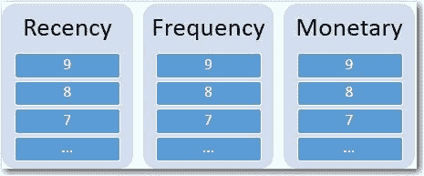

来源: [SAS](https://communities.sas.com/t5/SAS-Communities-Library/Which-RFM-binning-method-is-best-for-me/ta-p/341327)

在计算每个客户的 RFM 值后，我们根据他们的 RFM 值对客户进行分类。例如:

*   前 10%的花费者将被分配一个“5”的 M
*   接下来的 10%将被赋予“4”的 M
*   支出最低的 10%将被分配一个“1”的 M
*   对每个 R、F 和 M 重复这一过程

*注意箱子的数量完全由你决定。人们通常以 5 人为一组。*

然后，客户被分成 125 个组(5 * 5 * 5)。

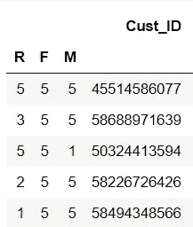

根据每个客户的 R、F 和 M 值，我们应该能够粗略估计出一个客户对礼物的获利程度。例如，我们最有利可图的客户应该:

1.  R = 5，表示最近进行了购买
2.  有 F = 5，表明经常购买
3.  有 M= 5，表明花了很多钱

然后，我们可以精心定制营销工作，以迎合每个群体，这将在稍后进一步讨论。

# 改进的 RFM 分割

等等，传统的 RFM 分割方法似乎有一个很大的问题。

1.  我们客户的 R、F 和 M 指标之间有很高的**相关性**,其中
2.  经常购买的人很可能是最近购买的。
3.  因此，我们有大量 R = 5，F = 5 的客户，但是…
4.  R = 1，F = 5 的零客户。
5.  125 组都很**参差不齐**！
6.  这是一场灾难，因为如果我把所有的预算都花在接触如此庞大的客户群上，圣诞老人会杀了我的。

别担心，有一个 RFM 分割的改进版本:

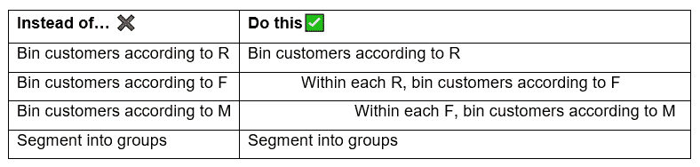

这将确保在我们的 125 个组中的每一组都有相同数量的客户，因为在每个 R = 1，2，3，4，5 中，我们根据他们的 F 和 m 进一步分成 5 个相等的组。

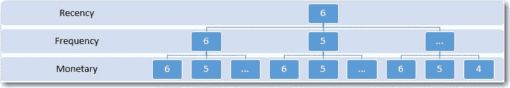

来源: [SAS](https://communities.sas.com/t5/SAS-Communities-Library/Which-RFM-binning-method-is-best-for-me/ta-p/341327)

# 三步走 RFM

时间不多了。让我们开始吧！

## 1.创造原始 RFM 价值

首先，我们必须计算每个客户的 R、F 和 M 值。根据您的数据集，您必须设计您的数据以生成值。一个好的做法是创建 3 个不同的函数，每个函数分别计算 R、F 和 M。

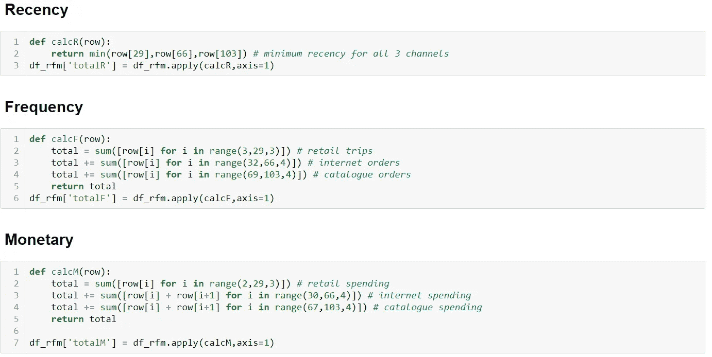

别担心，代码在我的 Github repo 上。

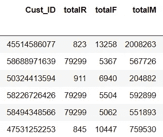

RFM 价值观先于宁滨

## 2.根据 RFM 标准划分

现在我们有了原始的 RFM 值，我们可以开始使用改进的 RFM 分割方法，也称为嵌套宁滨方法来对它们进行分类。

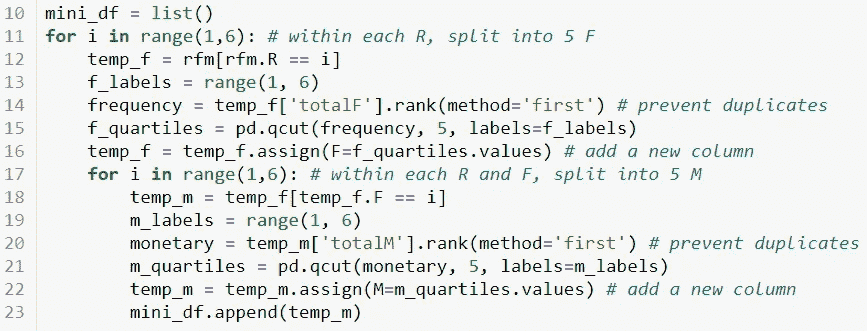

如果我们观察第 11 行和第 17 行，我们可以看到我们是如何**嵌套**我们的箱的。

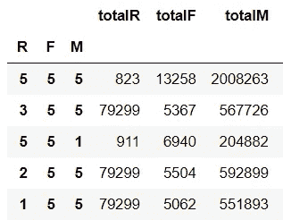

宁滨之后的 RFM 集团

## 3.将 RFM 指标与营销报价的回应率联系起来

情报必须是可操作的。如果我们不能从中获得任何洞察力，那么对我们的客户进行细分就毫无意义。因此，我决定分析每个细分市场对营销提议的回应率。

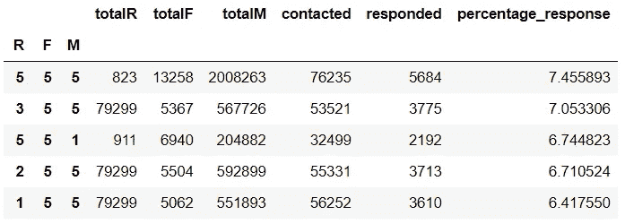

请随意将其与任何其他可预测的行为联系起来，如交易的可能性、被收购的可能性或实施欺诈的可能性。

# 优化营销工作

靶心计划最重要的部分来了**。最后一步是开始**对我们的分析进行**操作。首先，我们放大到排名前五的 RFM 集团。**

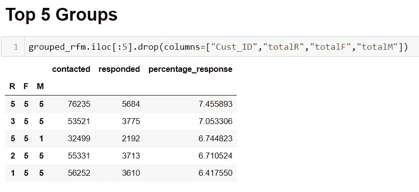

*   **重新激活休眠群体。**在前 5 组中，我们观察到有些客户的近期价值较低(长时间没有购买)。因为他们是我们最有利可图的客户，我们应该找出他们停止从 Gifty 购买的原因，并重新激活他们。Gifty 可以利用个性化的营销信息与他们建立关系。
*   **奖励顶级 RFM 团体。** Gifty 可以通过免费会员、折扣或免费送货来奖励这些团体，试图让他们购买更多。
*   **推出转诊计划。如果顾客向他们的朋友或家人推荐礼物，可以获得奖励。**
*   **追加销售顶级消费者。Gifty 可以推荐相关产品或新产品，试图向他们追加销售。**

我们永远不应该把太多的注意力放在我们的顶级支出者身上。底层消费者也应该得到一些关注。

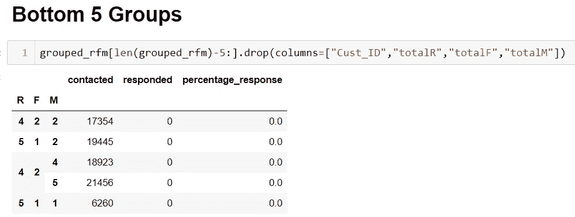

*   **停止联系下 RFM 团体。**下 RFM 群体中的许多客户对营销工作根本没有反应。Gifty 应该停止向他们发送邮件或目录来浪费资源。
*   向顶级 RFM 集团输送资源。节省下来的资源可以用于顶级 RFM 集团或其他地方。例如，资金可以用于设计新的方式来接触底层 RFm 群体，如使用社交媒体广告或病毒式营销活动。
*   **增加与随机 RFM 群体的接触。**对于 Gifty 来说，接触随机的 RFM 群体同样重要。Gifty 应定量地、持续地跟踪其核心指标的变化，如一段时间内的销售额，以确定他们对这些群体的营销工作的有效性。

# 结论

通过“牛眼计划”,我们观察了如何利用简单的 RFM 分析来优化 Gifty 的营销工作。

每个数据科学家都必须确保他们的数据能够讲述一个故事。数据可以帮助我们。数据中隐藏着大量的信息。我们剩下要做的就是把它挖出来。

# 参考

代码:[https://github . com/bensjx/RFM-Analysis/blob/master/RFM . ipynb](https://github.com/bensjx/RFM-Analysis/blob/master/RFM.ipynb)