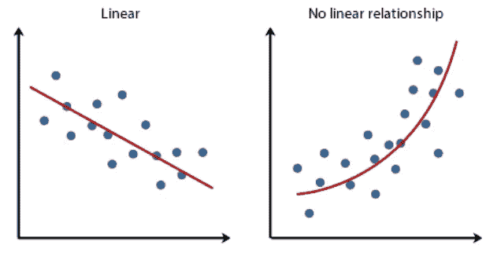

# 如何选择正确的机器学习算法

> 原文：<https://towardsdatascience.com/how-to-select-the-right-machine-learning-algorithm-b907a3460e6f?source=collection_archive---------30----------------------->

Denys Nevozhai 在 [Unsplash](https://unsplash.com?utm_source=medium&utm_medium=referral) 上拍摄的照片

## 机器学习

## 实施算法时要考虑的七个关键因素

对于任何给定的机器学习问题，可以应用许多算法，并且可以生成多个模型。例如，[垃圾邮件检测分类问题](/spam-detection-in-emails-de0398ea3b48)，可以使用各种模型来解决，包括朴素贝叶斯、逻辑回归和深度学习技术，如 BiLSTMs。

拥有丰富的选择是好的，但是决定在生产中实现哪种模型是至关重要的。尽管我们有许多性能指标来评估一个模型，但是为每个问题实现每个算法是不明智的。这需要大量的时间和工作。因此，了解如何为特定任务选择正确的算法非常重要。

在本文中，我们将研究可以帮助您选择最适合您的项目和特定业务需求的算法的因素。我们将通过查看各种因素来帮助您完善您的选择。理解这些因素将帮助您理解您的模型将执行的任务以及您的问题的复杂性。

以下是实现算法时要考虑的因素列表:

*   可解释性
*   数据点和特征的数量
*   数据格式
*   数据的线性
*   训练时间
*   预测时间
*   内存要求

下面我们来仔细看看！

# 可解释性

当我们谈论算法的可解释性时，我们谈论的是它解释其预测的能力。缺乏这种解释的算法被称为黑盒算法。

像 k-最近邻(KNN)这样的算法通过特征重要性具有很高的可解释性。像线性模型这样的算法通过赋予特征的权重具有可解释性。当考虑你的机器学习模型最终会做什么时，知道算法的可解释性变得很重要。

对于分类问题，如检测癌细胞或判断住房贷款的信用风险，必须了解系统结果背后的原因。仅仅得到一个预测是不够的，因为我们需要能够评估它。即使预测是准确的，我们也必须理解导致这些预测的过程。

如果理解您的结果背后的原因是您的问题的要求，那么需要相应地选择合适的算法。

# 数据点和特征的数量

在选择合适的机器学习算法时，数据点和特征的数量起着至关重要的作用。根据使用情况，机器学习模型将与各种不同的数据集一起工作，这些数据集在其数据点和特征方面会有所不同。在某些情况下，选择模型归结为理解模型如何处理不同大小的数据集。

像神经网络这样的算法可以很好地处理海量数据和大量特征。但是一些算法，如支持向量机(SVM)，只能处理有限数量的特征。选择算法时，一定要考虑数据的大小和特征的数量。

# 数据格式

数据通常来自开源和定制数据源的混合，因此它也可以是各种不同的格式。最常见的数据格式是分类数据和数字数据。任何给定的数据集可能只包含分类数据、数值数据或两者的组合。

算法只能处理数值数据，因此如果您的数据是分类的或者格式上是非数值的，那么您将需要考虑一个将其转换为数值数据的过程。

# 数据的线性

在选择模型之前，了解数据的线性是一个必要的步骤。确定数据的线性有助于确定决策边界或回归线的形状，这反过来又会引导我们使用模型。

一些关系，如身高体重，可以用线性函数来表示，这意味着一个增加，另一个通常以相同的值增加。这种关系可以用线性模型来表示。

*通过散点图了解数据的线性度(图片由作者创建)*

了解这一点有助于你选择合适的机器学习算法。如果数据几乎是线性可分的，或者可以用线性模型表示，那么像 SVM、线性回归或逻辑回归这样的算法是不错的选择。否则，可以使用深度神经网络或集成模型。

# 训练时间

训练时间是算法学习和创建模型所花费的时间。对于像向特定用户推荐电影这样的用例，用户每次登录时都需要训练数据。但是对于像股票预测这样的用例，模型需要每秒训练一次。所以考虑训练模型所花费的时间是必不可少的。

众所周知，神经网络需要大量时间来训练模型。像 K-最近邻和逻辑回归这样的传统机器算法花费的时间要少得多。有些算法，如随机森林，根据所使用的 CPU 内核需要不同的训练时间。

# 预测时间

预测时间是模型进行预测所需的时间。对于产品通常是搜索引擎或在线零售店的互联网公司来说，快速的预测时间是平滑用户体验的关键。在这种情况下，因为速度非常重要，如果预测速度太慢，即使结果很好的算法也没有用。

然而，值得注意的是，在一些业务需求中，准确性比预测时间更重要。在我们前面提到的癌细胞例子中，或者在检测欺诈性交易时，情况确实如此。

像 SVM、线性回归、逻辑回归和一些类型的神经网络这样的算法可以进行快速预测。然而，像 KNN 和集合模型这样的算法通常需要更多的时间来进行预测。

# 内存要求

如果您的整个数据集可以加载到服务器或计算机的 RAM 中，您就可以应用大量的算法。然而，当这不可能时，你可能需要采用增量学习算法。

增量学习是一种机器学习方法，其中输入数据被连续地用于扩展现有模型的知识，即进一步训练模型。增量学习算法旨在适应新数据而不忘记现有知识，因此您不需要重新训练模型。

# 最后

在为机器学习任务选择算法时，性能似乎是最明显的指标。然而，性能本身并不足以帮助您为工作选择最佳算法。您的模型需要满足其他标准，如内存要求、训练和预测时间、可解释性和数据格式。通过纳入更广泛的因素，你可以做出更有信心的决定。

如果您很难在几个选定的模型中为您的数据选择最佳算法，一种流行的模型选择方法是在验证数据集上测试它们。这将为您提供衡量标准，您可以通过这些标准来比较每个模型并做出最终决定。

当决定实现一个机器学习模型时，选择正确的模型意味着分析你的需求和预期结果。虽然这可能会花费一些额外的时间和精力，但回报是更高的准确性和改进的性能。

谢谢你的阅读。本文原载于 [Lionbridge.ai](https://lionbridge.ai/articles/how-to-select-the-right-machine-learning-algorithm/) 。我也将在未来写更多初学者友好的帖子。请在[媒体](https://medium.com/@ramyavidiyala)上关注我，以便了解他们。我欢迎反馈，可以通过 Twitter [ramya_vidiyala](https://twitter.com/ramya_vidiyala) 和 LinkedIn [RamyaVidiyala](https://www.linkedin.com/in/ramya-vidiyala-308ba6139/) 联系我。快乐学习！