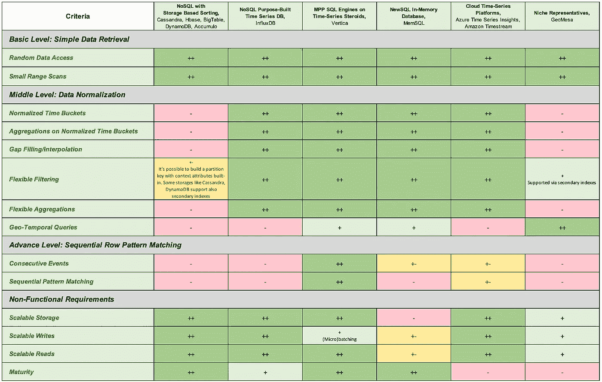
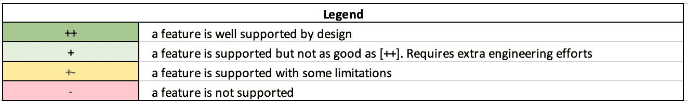

# 如何选择时间序列数据库

> 原文：<https://towardsdatascience.com/how-to-select-time-series-db-123b0eb4ab82?source=collection_archive---------23----------------------->

## 物联网分析第 3 部分:时间序列引擎的比较

# 介绍

一般来说，时间序列用例，尤其是物联网领域，增长如此之快，因此为每个特定用例选择正确的存储至关重要。

如今，所有其他数据库引擎或平台都是以面向时间序列的方式销售的，所以让我们试着更深入地了解一下，找出哪一个最适合每个特定的需求。

# 问题陈述

为了正式确定引擎选择，让我们明确定义成功的输入和标准。作为一个**输入**，让我们考虑一个**遥测数据集。**

作为**成功的标准**，我们有:

*   **功能需求的覆盖范围**与不同级别的数据查询/分析相关
*   **非功能需求**的覆盖范围

让我们更具体地定义它们。

## 遥测数据集

作为物联网数据分析系列文章的继续，让我们使用健身追踪器用例，它很好地代表了典型的物联网用例。数据集(也称为[这里的](https://medium.com/swlh/iot-data-analytics-part1-types-of-storages-677b8a24657d)和[这里的](/iot-data-analytics-part-2-data-model-3da9676cb449))由一组观察值组成，每个观察值包含:

*   由传感器/边缘生成的**度量名称**，*即:* *心率、心率、步数*
*   与**时间点**、*绑定的传感器产生的**度量值**，即:(2020–11–12 17:14:07，71bpm)、(2020–11–12 17:14:32，93bpm)等*
*   **标签或上下文**或**描述**其中给定传感器正在生成数据，*即:设备型号、地理位置、用户、活动类型等*。

# 功能需求

围绕数据分析有许多不同的可能性，所以让我们将它们分为初级、中级和高级。

## 基本级别:简单的数据检索

*   **随机数据访问:**为特定时间点返回适当的度量值
*   **小范围扫描:**对于特定的时间范围(相当小，根据数据生成的频率，在几分钟或几小时内)返回连续的度量值(即:在其上绘制标准图表)

## 中级:时间窗归一化

测量事件通常应该在预定义的重复基础上触发，但是数据点定时总是存在偏差。这就是为什么非常需要围绕构建预定义的时间窗口来标准化时间序列数据的能力。

所需的能力包括:

*   **构建时间段**以正确标准化数据
*   **标准化时段上的聚合**
*   **间隙填充**，使用**插值**在一组离散的已知数据点范围内构建新的数据点。

对于中级容量，值得添加更复杂的诊断分析/特别查询:

*   **灵活过滤:**根据标签/上下文属性上的谓词过滤数据点，*即:根据某个区域、用户或活动类型过滤数据点*
*   **灵活聚合:**标签/上下文属性或其组合上的分组和聚合*，即:按活动类型按区域的最大炉膛率。*

## 高级级别:顺序行模式匹配

最高级将包括检查**事件序列** **是否与**特定**模式**匹配，以执行自检和高级诊断:

*   在特定事件之前有相似的测量模式吗？；
*   什么样的测量可能表明某个事件的原因，例如失败？

到目前为止，很少有数据库支持这样的特性，但是我相信它们会出现的。

在这里，我们可以区分以下能力:

*   找到一系列连续事件，即:会话定义
*   **模式匹配**:趋势反转，周期性事件

# 非功能性需求

除了功能性需求之外，考虑非功能性需求也非常重要，这些需求通常是选择的主要驱动因素:

*   **可扩展存储:**处理大数据量的能力
*   **可扩展写入:**处理大量并发写入的能力。这与实时数据访问密切相关，即在数据点生成和可供读取之间尽可能缩短延迟的能力。
*   **可伸缩读取:**处理大量并发读取的能力
*   **高成熟度:**在市场上的存在和社区支持。

# 市场上的时间序列数据库和平台

让我们回顾一下市场上有什么可以满足我们的严格需求。有多种选择。这真的很难涵盖所有这些，所以我将尝试描述发动机家族。

## 带有内置分类功能的 NoSQL

**BigTable、HBase、Cassandra、DynamoDB、Accumulo 常用于存储时序数据。有大量关于如何在这些存储上实现时序用例的文章；如何避免热点使用盐等？**

> ****优势:**非常适合写入。极其高效地执行基本级别的分析。**
> 
> ****弱势:**所有其他类型的分析都不受支持且效率低下**

## **NoSQL 特制时间序列数据库**

**有一些引擎是作为时间序列数据库从头开始设计的。在大多数情况下，他们是 NoSQL。最突出的例子是 **InfluxDB** ，它位于所有谷歌搜索的首位。**

## **基于时序类固醇的 MPP SQL 引擎**

**一些成熟的 MPP 分析引擎，如 **Vertica** 不断增加新的分析功能，包括与时间序列数据处理相关的功能。但缺点是，从设计上来说，它们不是为高效的流数据摄取而创建的。但是如果微批处理是可接受的，它们可能是许多用例的最佳匹配。**

> ****优势:**提供最大的分析能力。**
> 
> ****弱方:**实时摄取可能很有挑战性，而且效率不高**

***注意:Oracle 不是传统的 MPP，但是从功能的角度来看，它支持 MATCH_RECOGNIZE 子句，该子句涵盖了复杂的模式匹配特性***

## **内存数据库**

**SQL 数据库的内存特性提高了它们处理快速数据接收的能力。由时段规范化支持丰富的 SQL 接口，如 **SingleStore MemSQL** 数据库对于时间序列用例来说看起来非常有吸引力**

> ****优势:**提供触达分析能力。**
> 
> ****弱势:**读写的可伸缩性通常有限或者非常昂贵**

## **云时序平台**

**Azure 和 AWS 最近发布了他们的时序数据服务/平台:**

*   ****Azure 时序洞察****
*   ****亚马逊时光流****

**这些平台涵盖了时间序列数据存储、可视化和查询功能的许多方面。它们内置了热存储、热存储和冷存储之间的数据分离，从拥有成本的角度来看，可以很好地平衡数据存储和检索。**

> ****优势:**很好地集成到适当的云基础设施中，提供了范围查询功能以及**
> 
> ****弱点:**对于某些用例来说，紧密的云集成可能是一个限制；在市场上出现的时间还太短，不能把它们当作成熟的产品。**

## **其他人**

**也有其他选择和小众玩家。我有机会使用一个叫做 **GeoMesa** 平台/框架的例子。这是一个基于 Accumulo/Hbase/Cassandra 等 NoSQL 存储的框架，能够为时态和地理时态数据建立特殊索引；它还通过二级索引提供了额外的灵活性。**

> ****优势:**高效的基本时序分析以及良好的缩放水平。地理时态查询支持是一项关键功能，也是物联网数据的一大优势。**
> 
> ****弱势:**尽管开发社区非常友好且响应迅速，但它的采用率和成熟度都很低。**

# **汇总比较**

**请使用我们在下面开头定义的标准来查找不同时间序列存储的高级比较:**

****

****哪里****

****

**作者图片**

# **结论**

**这个主题非常广泛，值得一本书来详细介绍，但是我希望这篇文章能够帮助您在时序引擎世界中导航，并帮助您为您的特定用例选择正确的方向。**