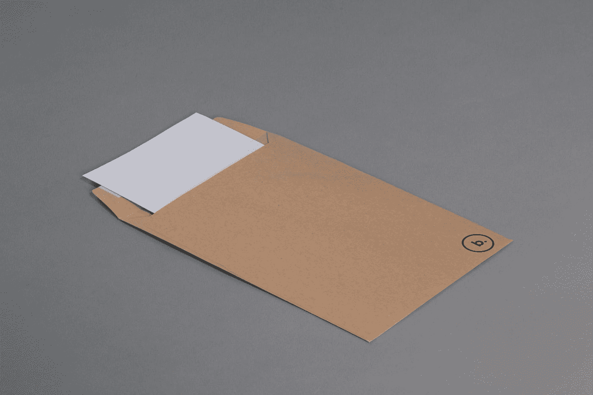
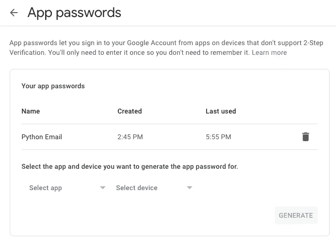
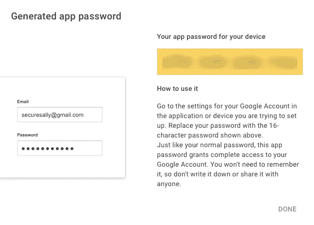
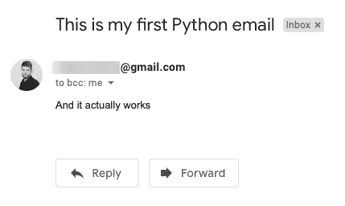
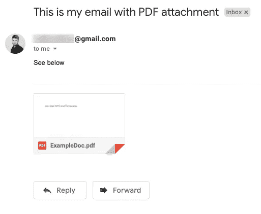
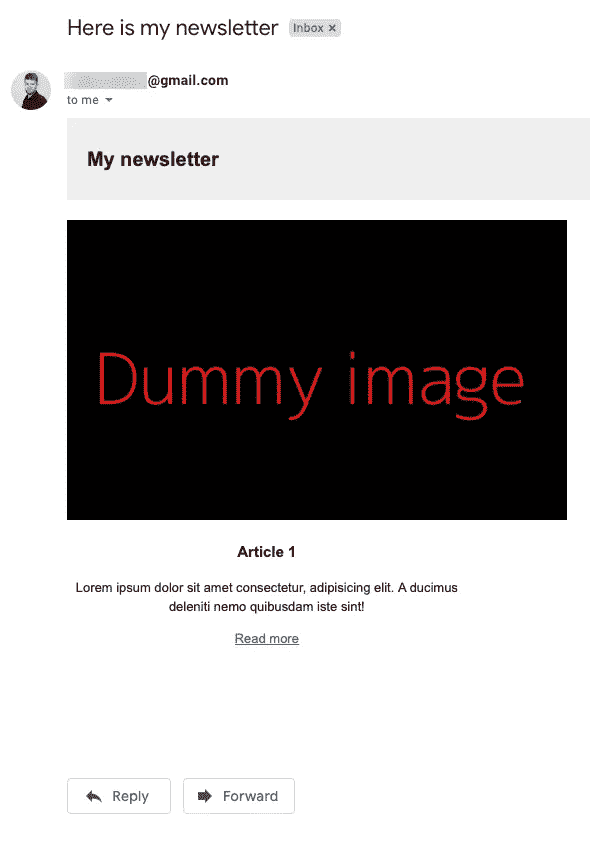

# 如何用 Python 发送漂亮的电子邮件——基本指南

> 原文：<https://towardsdatascience.com/how-to-send-beautiful-emails-with-python-the-essential-guide-a01d00c80cd0?source=collection_archive---------8----------------------->

## 使用 Python 发送带有附件的风格化电子邮件。给多个收件人。

通过 Python 这样的编程语言发送邮件有很多用例。例如，您可能想要管理一个邮件列表而不支付月费，或者在生产代码中出现问题时使用它来通知您。今天，您将学习如何轻松地向多个收件人发送精美的电子邮件。包括附件。

[摄白兰度在](https://unsplash.com/@brandomakesbranding?utm_source=medium&utm_medium=referral) [Unsplash](https://unsplash.com?utm_source=medium&utm_medium=referral) 上制作品牌

为此，我们将使用 Python 的`smtplib`。SMTP 代表*简单邮件传输协议*，对于你们这些书呆子来说。这是一个简单的库，允许我们发送电子邮件。我们还将使用`email`库进行格式化。两者都内置在 Python 中，所以不需要安装任何东西。

如果你更喜欢视频，我为你准备了一份礼物:

今天的日程如下:

*   Gmail 设置
*   发送简单的邮件
*   向多个收件人发送电子邮件
*   发送附件
*   发送 HTML 格式的电子邮件
*   结论

内容太多了，让我们开门见山吧。

# Gmail 设置

我假设你的 Gmail 账户已经启用了双重认证。如果没有，你应该。我们必须生成一个密码，Python 脚本将使用该密码登录您的帐户并发送电子邮件。

这是一个简单的步骤。只需点击[这个网址](https://myaccount.google.com/apppasswords)，你就会看到这样一个屏幕:

作者图片

但是，您不会看到“Python 电子邮件”行。只需点击*选择应用*下拉菜单，然后点击*其他(自定义名称)*。输入一个名称(任意)，点击*生成*按钮。

就是这样！像这样的模态窗口将会弹出:

作者图片

只要把密码保存在安全的地方。

现在，您可以打开代码编辑器(或笔记本)并创建一个 Python 文件。以下是电子邮件和密码的库导入和变量声明:

请记住— `EMAIL_ADDRESS`变量应该包含您的实际电子邮件地址，而`EMAIL_PASSWORD`应该包含几秒钟前生成的应用程序密码。有一种更健壮、更安全的方法可以做到这一点——使用环境变量，但这超出了本文的范围。

您现在可以发送您的第一封电子邮件了。

# 发送简单的邮件

这是你期待已久的部分。发送电子邮件之前需要几个步骤，如下所示:

1.  创建一个`EmailMessage`类的实例
2.  指定从、*到*的*和*主题*——你猜哪个是干什么的*
3.  设置电子邮件的内容，即邮件本身
4.  使用`smtplib`建立安全连接(SSL)并登录您的电子邮件帐户
5.  发送电子邮件

听起来工作量很大，但归结起来不到十行代码。以下是片段:

如您所见，我已经将从到*到*的*字段设置为相同的值。这不是你通常会做的事情，但对于测试来说是必不可少的。这是我几秒钟后收到的电子邮件:*

作者图片

接下来让我们看看如何向多个收件人发送电子邮件。

# 向多个收件人发送电子邮件

如果你理解了前一部分，你就会理解这一部分。你只需要改变一件事。

在`msg['To']`中，您将不得不指定一个电子邮件列表，而不是指定一个您想要发送到的电子邮件地址(和前面的例子一样)。

代码如下:

你能看出区别吗？发送给多个收件人比预期的要容易，因为你不必手动遍历列表。让我们继续邮件附件。

# 发送附件

发送附件有点奇怪，直到你掌握了它的要点。你必须用 Python 的`with open`语法打开每个附件，并使用`EmailMessage`类中的`add_attachment`方法来添加附件。

在下面的例子中，这个方法被用来发送一个 PDF 文档。代码如下:

这是我几秒钟后收到的电子邮件:

作者图片

厉害！接下来让我们看看如何创建定制的电子邮件！

# 发送 HTML 格式的电子邮件

如果你打算发送纯文本的、无风格的或者丑陋的邮件，你可以从你的列表中划掉 inbound。这就是 HTML 和 CSS 发挥作用的地方。

就代码而言，这与上一节中的内容几乎相同。唯一不同的是邮件内容。这次您将使用来自`EmailMessage`类的`set_content`方法来编写 HTML。CSS 样式是内嵌设置的。

这是我在几分钟内设计出来的:

作者图片

不是很好，但比我们以前的有所改善。这就足够了。让我们在下一部分总结一下。

# 离别赠言

用 Python 发送电子邮件很容易。Gmail 配置让你可以直接从你的机器上发送邮件，不需要上传任何东西到实时服务器上。如果你问我的话，我觉得这很好。几年前，当我第一次开始通过 PHP 发送电子邮件时，本地主机不是一个选项(根据我的经验)。

你今天已经看到了一堆新概念——从发送电子邮件到前端技术。这仅仅够让你入门，而且网络上有很多更高级的指南。

感谢阅读。

[**加入我的私人邮件列表，获取更多有用的见解。**](https://mailchi.mp/46a3d2989d9b/bdssubscribe)

*喜欢这篇文章吗？成为* [*中等会员*](https://medium.com/@radecicdario/membership) *继续无限制学习。如果你使用下面的链接，我会收到你的一部分会员费，不需要你额外付费。*

 [## 通过我的推荐链接加入 Medium-Dario rade ci

### 作为一个媒体会员，你的会员费的一部分会给你阅读的作家，你可以完全接触到每一个故事…

medium.com](https://medium.com/@radecicdario/membership) 

*原载于 2020 年 11 月 2 日 https://betterdatascience.com***。**