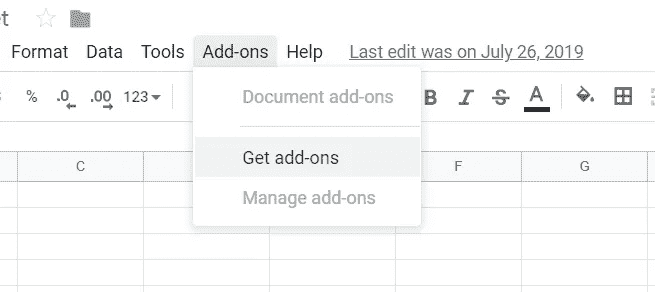
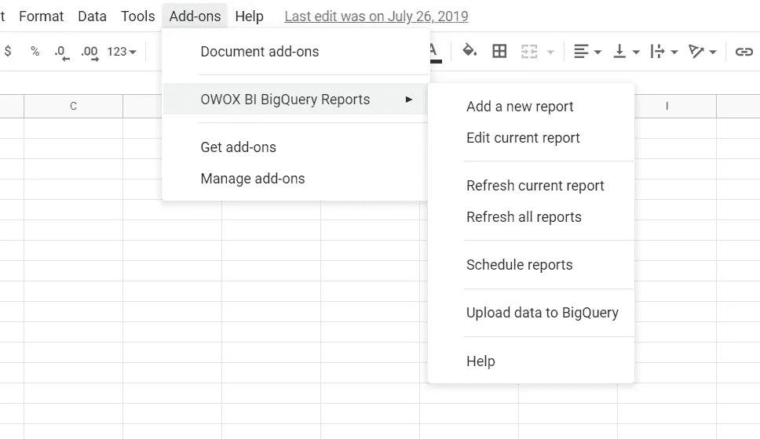
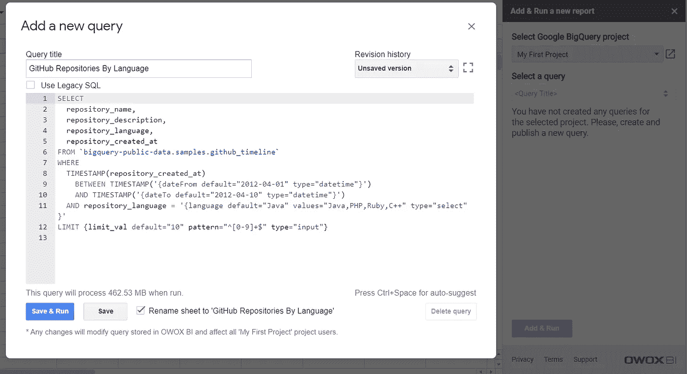
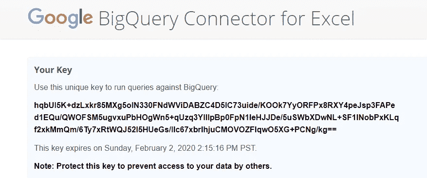
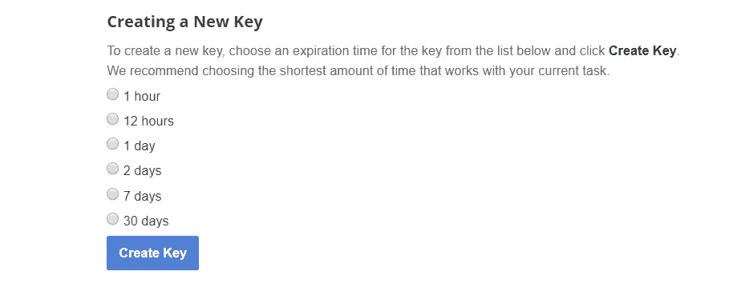
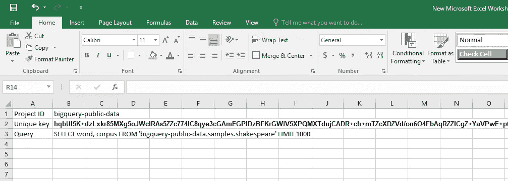
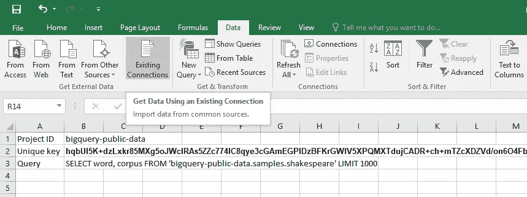
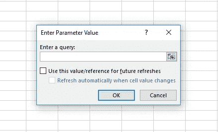

# 如何将数据从 Google BigQuery 发送到 Google Sheets 和 Excel

> 原文：<https://towardsdatascience.com/how-to-send-data-from-google-bigquery-to-google-sheets-and-excel-eb58436bc398?source=collection_archive---------55----------------------->

来源:[沉积照片](https://ru.depositphotos.com/323141388/stock-photo-business-intelligence-bi-key-performance.html)

## 了解如何自动快速地将数据从 Google BigQuery 发送到 Google Sheets 和 Excel

Google BigQuery (GBQ)不需要额外的维护成本，可以在不到一分钟的时间内处理您的数据。在本文中，您可以了解如何使用 BigQuery API 将数据从 CSV 和 JSON 文件上传到 GBQ，或者从其他 Google 服务[上传数据。今天，我们将告诉你如何从 BigQuery 上传数据到你的最爱——Google Sheets 和 Excel。](https://www.owox.com/blog/use-cases/load-data-into-bigquery/)

# 如何将数据从 Google BigQuery 导入到 Google Sheets

将数据加载到 Google Sheets 的简单方法是使用 OWOX BI 的 [BigQuery Reports 插件。你可以直接从 Google Sheets 的**附加组件**菜单免费安装，或者从 Chrome 网上商店下载。](https://gsuite.google.com/marketplace/app/owox_bi_bigquery_reports/263000453832?pann=cwsdp&hl=ru)

图片由作者提供

2.一旦安装了 OWOX BI BigQuery Reports 插件，就可以从存储中加载数据了。为此，请转到 Google Sheets 中的**附加组件**菜单，将鼠标悬停在 **OWOX BI BigQuery 报告**上，然后选择**添加新报告**。

图片由作者提供

2.在屏幕右侧出现的附加菜单中，指定 GBQ 项目的名称。然后，您可以为选定的项目创建新的 SQL 查询，或者从下拉列表中选择以前使用的查询。

图片由作者提供

1.  如有必要，为您的查询定义[动态参数](https://support.owox.com/hc/en-us/articles/217491007)。然后点击**添加&运行**。
2.  你的数据准备好了！来自 GBQ 的数据将被上传到 Google Sheets 中的一个新表中。

OWOX BI BigQuery Reports 插件的优势:

*   您可以将数据从 BigQuery 加载到 Google Sheets，反之亦然。
*   您可以控制对数据的访问。
*   您可以从 Google Sheets 中一键与同事共享数据。
*   您可以访问一个简单的查询编辑器。
*   报告会自动更新。

您可以在 OWOX 博客上了解更多关于设置 [OWOX BI BigQuery Reports](https://www.owox.com/blog/use-cases/bigquery-sheets-connector/) 连接器和[在 Google Sheets 中自动生成报告](https://www.owox.com/blog/use-cases/bigquery-reports-in-google-sheets/)的信息。

# 如何从 Google BigQuery 导入数据到 Excel

1.  要将数据从 Google BigQuery 导入 Excel，首先，您需要一个[惟一键来运行对 BigQuery](https://bigquery-connector.appspot.com/) 的查询。您可以随时创建此密钥，但请记住它有一个到期日期。

图片由作者提供

如有必要，您可以随时创建新的密钥。

图片由作者提供

您也可以使用**撤销密钥**按钮或在您的 Google 档案设置中终止当前密钥。

图片由作者提供

2.在 Excel 中，创建一个新工作表，并在中提供以下信息。下面截图所示的格式:

*   您的项目 ID
*   您的唯一密钥
*   你的疑问

图片由作者提供

请注意，如果您的查询超过 256 个字符，Excel 将不会运行它。在这种情况下，您应该将查询拆分成多个部分，并将它们插入相邻的单元格中。

3.接下来，[下载 IQY 文件](https://uc.appengine.google.com/_ah/loginform?state=~AJKiYcF94RVWJJ9eRO46LKHqH3nvpeo_w4YDA9Wa9KpMhGCrsK6gXQgigdjvGEtMaIAftiMd3t_Yx2dv1x4jVobW_34ZMMzPMTPqVXcBpFF0Tdmzv_SkttFypoJCeUD2xViB-zZTZrypXvUYq-2orRIaXUN7yppJohd4eqMip0r0v7Ne_hrHRIIU27P2MQ4kbGBjKqrFop8inlbs_HXorL02gX8_ukjXIOHNLdJ37-AvqWN-gya-FKJB_XbZkzvWtXPEyBixb2cTRdu-CxuUSQNkL_iY5WN_ALiuHW-uc-q-sUt1nDtyNWk)。

4.在 Excel 的**数据**选项卡中，选择**现有连接**。在出现的窗口中，点击**浏览更多**并选择您刚刚下载的 IQY 文件。

图片由作者提供

5.首次连接时，您需要指定数据的显示位置。在当前工作表中选择一个单元格。

图片由作者提供

6.在以下窗口中，指定包含查询、项目 ID 和连接器关键字的单元格的值。

图片由作者提供

准备好了！您的 BigQuery 数据现在将出现在 Excel 中。

作为连接到 Excel 的另一种方法，您可以使用 [Magnitude Simba ODBC 驱动程序](https://cloud.google.com/bigquery/providers/simba-drivers)进行 BigQuery。详细说明可以在 YouTube 上找到:[如何将 Google BigQuery 连接到 Microsoft Excel](https://www.youtube.com/watch?v=OpFtx3BTcOA) 。