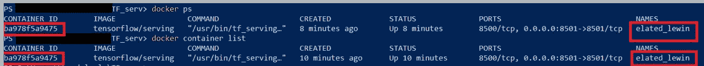

# 如何使用 TensorFlow 服务不同的模型版本

> 原文：<https://towardsdatascience.com/how-to-serve-different-model-versions-using-tensorflow-serving-de65312e58f7?source=collection_archive---------24----------------------->

## 了解不同的配置设置，以便使用 TensorFlow Serving 管理不同的模型和模型的不同版本

***本文解释了如何使用配置文件在 TensorFlow 服务中管理多个模型和同一模型的多个版本，并简要了解批处理。***

## 先决条件:

[**将 TensorFlow 模型部署到生产制造 Eas**](/deploying-a-tensorflow-model-to-production-made-easy-4736b2437103) **y**


照片由 [Loverna 在](https://unsplash.com/@loverna?utm_source=unsplash&utm_medium=referral&utm_content=creditCopyText) [Unsplash](https://unsplash.com/s/photos/serving-tea?utm_source=unsplash&utm_medium=referral&utm_content=creditCopyText) 上的旅程拍摄

您拥有不同架构的 TensorFlow 深度学习模型，或者已经使用不同的超参数训练了您的模型，并且希望在本地或生产中测试它们。最简单的方法是使用一个**模型服务器配置文件来服务模型。**

> 模型服务器配置文件是一个协议缓冲文件(protobuf ),它是一种与语言无关、与平台无关的可扩展的、简单而快速的序列化结构数据的方法。

***如何创建模型配置文件？***

下面是一个样本模型配置文件，它将服务于磁盘上所有版本的“MNIST”模型。

```
**model_config_list {
 config {
    name: 'mnist'
    base_path: '/models/mnist/'
    model_platform: 'tensorflow'
    model_version_policy: {all: {}}
        }
}**
```

每个 ModelConfig 指定一个模型，该模型使用以下参数。

**名字-** 一个可服务的模型名

**base_path -** 指定查找 servable 版本的路径。

**模型 _ 平台-** 开发模型的平台。

**model_version_policy -** 模型的版本策略指示加载哪个版本的模型并提供给客户端。默认情况下，将提供模型的最新版本，并且可以通过更改 **model_version_policy** 字段来覆盖。

***如何加载模型配置文件？***

点击阅读如何在 Windows 10 上加载 TensorFlow 服务 Docker 容器

```
**docker run -p 8501:8501 --mount type=bind,source=C:\TF_serv\TF_model,target=/models/mnist -e MODEL_NAME=mnist -t tensorflow/serving**
```

列出所有正在运行的 Docker 容器

```
**docker container list** 
```

或者

```
**docker ps**
```



以红色突出显示的容器 Id 和容器名称

将 models.config 文件从 Docker 映像的源复制到目标

```
**docker cp \TF_serv\TF_model\models.config *ba978f5a9475*:/models/mnist**
```

将文件复制到 docker 容器时，提供容器 Id，如上所示。

使用 Docker 容器名称或容器 Id 停止 Docker 容器

```
**docker stop *ba978f5a9475***
```

最后，使用选项加载模型配置文件

`**--model_config_file_poll_wait_seconds**` flag 指示服务器每 60 秒在使用`**--model_config_file**`指定的路径检查一次新的配置文件。

```
**docker run 
-p 8501:8501 
--mount type=bind,source=C:\TF_serv\TF_model,target=/models/mnist 
-e MODEL_NAME=mnist 
-t tensorflow/serving 
--model_config_file_poll_wait_seconds=60 
--model_config_file=/models/mnist/models.config**
```

***如何使用 models.config 文件提供的模型使用模型的具体版本进行推理？***

使用 REST API 进行推理请求

```
json_response = requests.post('[**http://localhost:8501/v1/models/mnist/versions/5**:**predict'**](http://localhost:8501/v1/models/mnist/versions/5:predict'), data=data, headers=headers)
```

因为上面指定的 models.config 文件将加载磁盘上的所有版本；我已经加载了版本 5。

下面显示了调用模型的特定版本进行推理的一般方法。

```
**/v1/models/*<model name>*/versions/*<version number>***
```

***我如何覆盖并指定一个要加载和服务的模型的特定版本？***

您需要使用**指定的**标签和**型号版本政策**中的**版本号**

```
**model_config_list {
 config
 {
    name: 'mnist'
    base_path: '/models/mnist/'
    model_platform: 'tensorflow'
    model_version_policy{
                        specific{
                           versions:2
                                }
                         }
 }
}**
```

有了上面的变更 models.config 文件，客户端现在可以只为版本 2 调用模型的 predict 方法。

***我可以同时服务同一型号的多个版本吗？***

您还可以同时提供同一型号的多个版本。在下面的例子中，我们同时为 MNIST 模型提供版本 2 和版本 3。

```
**model_config_list {
 config
 {
    name: 'mnist'
    base_path: '/models/mnist/'
    model_platform: 'tensorflow'
    model_version_policy{
                        specific{
                           versions:2
                           versions:3
                              }
                         }
 }
}**
```

当您有一个较新版本的模型，并希望将一些用户转移到一个较新的版本，并让大多数客户端使用稳定的较旧版本的模型时，这是很有帮助的。这允许您完成 A/B 测试。

***我能否为多个模型提供服务，如定制模型和转移学习模型？***

要为多个模型提供服务器，请更新 models.config 文件，如下所示

```
**model_config_list {
  config{
         name: 'mnist'
         base_path: '/models/mnist/'
         model_platform: 'tensorflow'
         model_version_policy{
             specific{
                      versions:2
                      versions:3
                      }** **}
       }
  config{
        name: 'Inception_1'
        base_path: '/models/inception_1/'
        model_platform: 'tensorflow'
        }
}**
```

TensorFlow 服务允许批量处理多个请求吗？

TensorFlow 服务允许两种不同形式的批处理。

*   **批量处理单个模型推理请求，TensorFlow serving 等待预定时间，然后对该时间段内到达的所有请求进行推理**
*   **单个客户端可以向 TensorFlow 服务器发送批量请求。**

批处理要求所有请求使用相同版本的模型。

批处理允许更高的资源利用率和更高的吞吐量。

要启用批处理，将`**--enable_batching**`标志指定为真，并使用`**--batching_parameters_file**`标志设置包含批处理参数的配置文件。

```
**docker run -p 8501:8501 --mount type=bind,source=C:\TF_serv\TF_model,target=/models/mnist 
-e MODEL_NAME=mnist 
-t tensorflow/serving 
--model_config_file_poll_wait_seconds=60  
--model_config_file=/models/mnist/models.config 
--enable_batching=true 
--batching_parameters_file=/models/mnist/batch.config**
```

批处理配置文件是一个. protobuf 文件

```
**max_batch_size { value: 128 }
batch_timeout_micros { value: 0 }
max_enqueued_batches { value: 1000000 }
num_batch_threads { value: 8 }**
```

**max_batch_size** :允许您指定任何批次的最大大小。如果您指定一个大于 **max_batch_size，**的批处理，那么您将得到一个错误。该参数决定吞吐量/延迟的权衡，并确保不超过资源限制。

**batch_timeout_micros** :这是服务器重试批量请求的最大时间。参数值以微秒为单位指定。

**num_batch_threads** :通过指定要同时处理的最大批处理数量来定义并行度。

**max_enqueued_batches** :它有助于通过拒绝需要很长时间才能得到服务的请求来限制批处理队列，并避免构建大量积压的请求。

当我在有批处理和没有批处理的情况下运行下面的代码时，批处理让我的结果快了 2 到 3 倍。

```
**import time**
#Build the batched data for making iferences for 100 images
**data = json.dumps({"signature_name": "serving_default", "instances": test_images[:100].tolist()})**

**st=time.perf_counter()
headers = {"content-type": "application/json"}
json_response = requests.post('**[**http://localhost:8501/v1/models/mnist/labels/2:predict'**](http://localhost:8501/v1/models/mnist/labels/stable:predict')**, data=data, headers=headers)****predictions = json.loads(json_response.text)['predictions']
end_t= time.perf_counter()
print(end_t-st)**
```

## 结论:

TensorFlow 服务通过使用模型服务器配置提供服务不同模型或同一模型的不同版本的简单方法，使生产部署变得更加容易。

批处理允许您对同一客户端或不同客户端的多个请求进行批处理，从而优化硬件加速器资源并提供更好的吞吐量。

## 参考资料:

[https://github . com/tensor flow/serving/blob/master/tensor flow _ serving/batching/readme . MD # batch-scheduling-parameters-and-tuning](https://github.com/tensorflow/serving/blob/master/tensorflow_serving/batching/README.md#batch-scheduling-parameters-and-tuning)

[https://www.tensorflow.org/tfx/serving/serving_config](https://www.tensorflow.org/tfx/serving/serving_config)