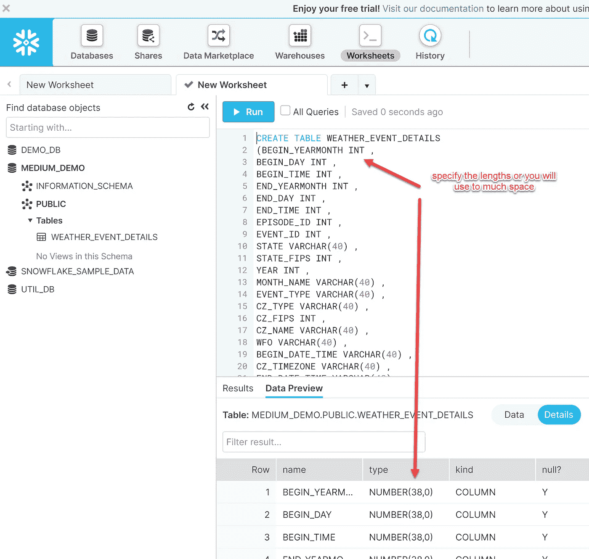
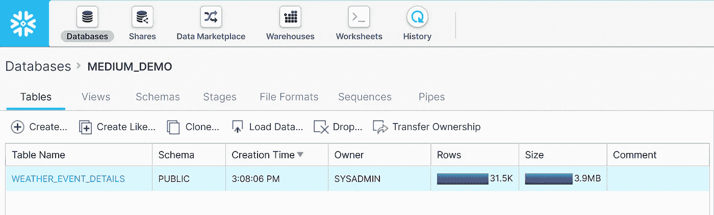
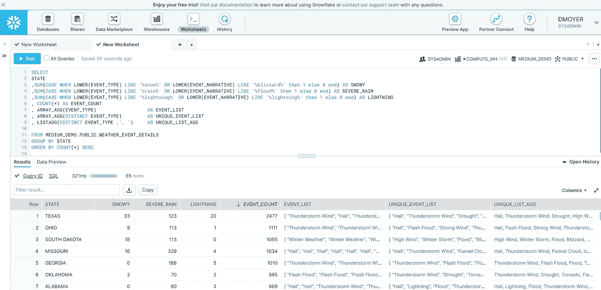
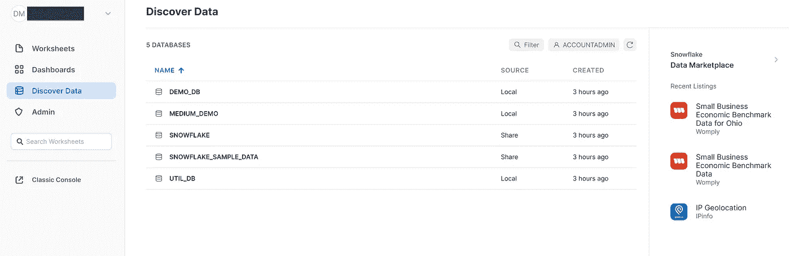

# 如何建立雪花数据库

> 原文：<https://towardsdatascience.com/how-to-set-up-a-snowflake-database-f9f6e1ca3cfb?source=collection_archive---------30----------------------->

## 这个平台绝对值得花时间在免费试用期间体验一下

图片由[皮克斯拜](https://pixabay.com/?utm_source=link-attribution&utm_medium=referral&utm_campaign=image&utm_content=1065155)的 Gerd Altmann 提供

当公司于 9 月 5 日在 T4 上市时，雪花引起了相当大的兴趣。当我最初去 AWS 查看雪花服务时，该服务被认为是一个数据仓库解决方案。通常，“数据仓库”这个术语让我感到厌烦。当我在处理较小的项目和合同时，我喜欢加速和转储数据库和表格，而不太担心基础设施。经过进一步调查，雪花将自己定位为“云数据平台”，提供包括数据科学和数据应用在内的服务。听起来更适合我。我决定冒险使用免费试用版来检验我的高级 SQL 教程的开发平台。这是我的经历。

## 很容易建立一个帐户

在所有的云平台中，这是最容易建立一个自由层数据库的。输入基本信息，确认你的电子邮件地址，你就可以开始工作了。那非常令人耳目一新。

正如我在回顾经历时所做的那样，除非需要，否则我不会阅读任何文档。除了 [SQL 语法](https://docs.snowflake.com/en/sql-reference/constructs.html)之外，我不需要查找任何操作信息(因为 SQL 必须总是不同的，不是吗？)雪花用的是 SQL: ANSI。

## 创建表

我没有通过 UI 下拉菜单手动命名列，而是使用工作表加载 Create Table SQL。如果不指定字段的长度，它们默认为一些大值。太大。我检查了一下，并在 SQL 中添加了大小。

注意您的插入 SQL —作者截图

## 数据加载

我使用了与早期文章相同的恶劣天气细节数据源。

 [## NCEI 的恶劣天气资料目录

### 恶劣天气数据目录(SWDI)是美国恶劣天气记录的综合数据库。

www.ncdc.noaa.gov](https://www.ncdc.noaa.gov/ncei-severe-weather-data-inventory) 

我发现数据加载比其他数据库更繁琐，尽管显式地指定数据长度并非不合理。我使用“加载数据”功能来加载。csv 文件放入表中。加载过程似乎有两个部分，加密和插入行。

最终加载的数据—作者截图

## 运行查询

查询通过工作表运行。界面熟悉，性能良好。我连接到 AWS 的唯一指示是 URL。

查询结果—作者截图

## 结论

我喜欢简单的设置和远离基础设施的抽象。我肯定会在我的个人项目中再次使用这个平台。对于这个演示，我使用了经典的控制台，但似乎雪花正在开发一个更干净的应用程序，目前处于预览模式:

雪花 app 预览——作者截图

我真的很喜欢数据市场如此突出。你是否有购买数据的预算，或者根据你的分析，这是否合乎道德，则是另一回事。

## 雪花数据仓库链接

 [## 试试云数据平台|雪花

### 雪花使每个组织都能够以数据为驱动力，利用您的数据纵向扩展、横向扩展……

www.snowflake.com](https://www.snowflake.com/try-the-cloud-data-platform/?_bt=470247374840&_bk=%2Baws%20%2Bsnowflake&_bm=b&_bn=g&_bg=59115312956&utm_medium=search&utm_source=adwords&utm_campaign=NA%20-%20Branded&utm_adgroup=NA%20-%20Branded%20-%20Snowflake%20-%20AWS&utm_term=%2Baws%20%2Bsnowflake&utm_region=na&gclid=Cj0KCQjwwuD7BRDBARIsAK_5YhX4YUsMYQgfOPMqKcBX8_OBSULUB6iYHZ0tonpMf1i64iDzV1MWuk8aAk_gEALw_wcB)