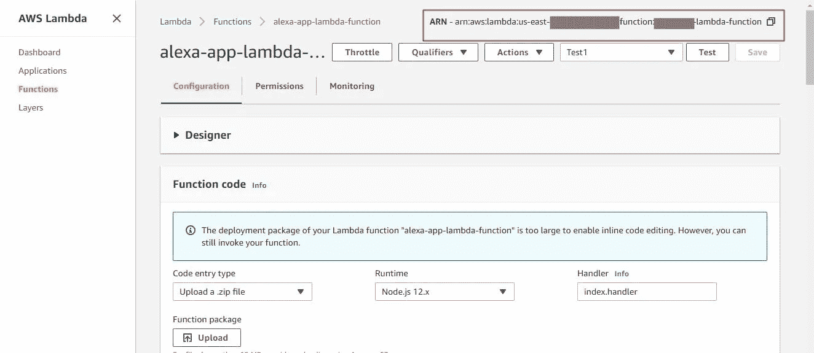

# 如何在 Amazon Alexa 中使用 Amazon Cognito OAuth2 授权许可设置帐户链接

> 原文：<https://towardsdatascience.com/how-to-set-up-account-linking-in-amazon-alexa-with-amazon-cognito-oauth2-authorization-grant-122cb1b2caca?source=collection_archive---------26----------------------->

## 亚马逊 ALEXA

## 使用 Alexa 实现安全的个性化访问


简·安东宁·科拉尔在 [Unsplash](https://unsplash.com?utm_source=medium&utm_medium=referral) 上拍摄的照片

A **mazon Alexa** ，是亚马逊开发的虚拟助理 AI 技术，最初于 2014 年发布。这是亚马逊迄今为止最有创意的设计之一。

Alexa 的表现令人惊叹，如语音交互，音乐播放，制定待办事项，设置闹钟，流媒体播客，提供天气，交通，体育和其他实时信息，如新闻，它还可以控制几个智能设备。

据[亚马逊的开发者网站](https://developer.amazon.com/en-US/alexa/alexa-voice-service/what-is-avs)称， **Alexa 语音服务(AVS)** 生活在云端。亚马逊的 AVS 是一项**智能语音识别**和**自然语言理解(NLU)** 服务。Alexa 语音服务(AVS)试图模仿真实的人与人之间的对话。该服务可用于为任何具有麦克风和扬声器的连接设备启用语音功能。Alexa 通过名为“技能”的组件向公众提供服务。

> “Alexa 总是通过机器学习的新功能变得越来越聪明，”
> 
> -亚马逊的开发者网站上说。

在这篇博文中，我将解释一下 Alexa 账户链接。

***来自《走向数据科学》编辑的提示:*** *虽然我们允许独立作者根据我们的* [*规则和指导方针*](/questions-96667b06af5) *发表文章，但我们并不认可每个作者的贡献。你不应该在没有寻求专业建议的情况下依赖一个作者的作品。详见我们的* [*读者术语*](/readers-terms-b5d780a700a4) *。*

# 什么是 Alexa 账户链接

*帐户链接*支持自定义技能将技能用户的 Amazon 身份与不同系统中的身份连接起来。它还允许您使用服务安全地验证用户的技能。一旦技能和外部用户帐户之间的连接建立，技能就可以代表用户使用该帐户执行操作。

账户链接使用 [**OAuth 2.0**](https://tools.ietf.org/html/rfc6749) 。OAuth 2.0 服务器支持两种发起安全访问令牌交换的协议:**授权码授予**和**隐式授予**。

## Amazon Cognito 用户池是如何工作的


来源:[链接](https://developer.amazon.com/blogs/alexa/post/ab0901f8-5b18-483c-91ea-5d2347e117ca/how-to-set-up-alexa-account-linking-with-amazon-cognito-user-pools-to-create-a-personalized-customer-experience)

Amazon Cognito 用户池包括以下任务流。

1.  首先，Alexa 服务在运行时向 Alexa skill 提供当前有效的访问令牌。请注意，Alexa service 负责管理刷新令牌，并在令牌到期时获取新的访问令牌。
2.  然后，Alexa 技能代码使用该令牌访问用户池中的用户配置文件。当使用 Alexa 应用程序链接技能时，客户将直接通过 Cognito 用户门户进行身份验证。

## Amazon Cognito 账户链接的工作原理

Amazon Cognito 帐户链接过程如下。

1.  当客户想要登录系统时，会通过帐户链接发起请求。这里，首先由 app 打开开发者指定的授权链接。这是一个到 Cognito 用户门户的链接。
2.  重定向时，客户会与 Cognito 登录页面进行交互。然后，用户可以提供必要的登录信息(用户名和密码)以进行身份验证。
3.  当 Cognito 验证客户的凭证时，授权码被提供给应用程序，并被传递给 Alexa 服务。
4.  然后，Alexa 服务将代码提供给 Cognito。作为回报，它向 Alexa 服务提供初始访问令牌和刷新令牌。然后用户可以使用 Alexa 技能访问。

# 使用 Amazon Cognito 逐步链接帐户

为了完整地设置这个示例，您需要一个 AWS 帐户和一个 Amazon 开发人员帐户。可选地，需要一个域，在亚马逊 Route53 托管。

按照以下步骤继续。

## 步骤 1-创建用户池

I)登录 [AWS 管理控制台](https://console.aws.amazon.com/console/home)并导航至 [Amazon Cognito](https://console.aws.amazon.com/cognito/) 。

*   通过查看 AWS 管理控制台右上角的区域，检查正在使用的 AWS 区域。
*   尽管可以使用 Cognito 支持的任何地区，但 Alexa 建议使用四个地区之一 **us-east-1(北弗吉尼亚)、us-west-2(俄勒冈州)、eu-west-1(爱尔兰)和 ap-northeast-1(东京)。**

ii)点击**管理用户池**。

iii)点击**创建用户池**。

iv)输入一个**池名**，点击**查看默认值**。


图 1:创建用户池

v)在左侧菜单中选择**属性**。

vi)首先，让我们看看如何设置电子邮件认证。因此，首先选择**电子邮件地址或电话号码**，然后选择**允许电子邮件地址**。

vii)在**中，您想要要求哪些标准属性？**部分，检查以下内容:

> 地址、电子邮件、姓、名、电话号码

如果您需要注册页面的更多用户详细信息，您可以相应地添加它们。


图 2:添加属性 I


图 3:添加属性 II

viii)点击**下一步**。

ix)转到左侧面板中的**策略**并输入以下配置，然后点击**保存**。


图 4:添加策略

x)在左侧菜单中选择 **MFA 和验证**，并设置:

**是否要启用多因素认证(MFA)** 至**关闭**和**您要验证哪些属性？**至**电子邮件**


图 4:设置 MFA 和验证

xi)点击**保存更改，在左侧菜单**选择 **App 客户端**，然后点击**添加 App 客户端**。


图 5:创建应用程序客户端 I

xii)输入一个**应用客户端名称。**在**刷新令牌到期(天数)**字段中输入首选周期。

xiii)选中保留**生成客户端机密**框，其余框未选中。点击**创建 App 客户端**。


图 6:创建应用程序客户端 II

xiv)在左侧菜单中选择**审查**，并点击页面底部的**创建池**。创建完成后，会提示消息说**您的用户池已成功创建**。


图 7:用户池的回顾


图 8:成功创建的用户池

xv)现在，请注意左侧菜单发生了变化。在左侧菜单中选择**通用设置** > **App 客户端**，选择**显示详情**。可以看到为 App 生成的 **App 客户端 id** 和 **App 客户端机密**。


图 9:查看创建的应用程序客户端细节

十六)在左侧菜单中选择 **App 集成** > **App 客户端设置**。在**启用的身份提供者**下，选中**认知用户池**旁边的框。

xvii)接下来，构建回调 URL 列表。将以下 URL 中的占位符值 **< VID >** 替换为您的开发者帐户的**供应商 ID** 。要查找您的供应商 ID，请前往 https://developer.amazon.com/settings/console/mycid并根据提示使用您的亚马逊开发者账户登录。

```
https://alexa.amazon.co.jp/api/skill/link/<VID>
https://layla.amazon.com/api/skill/link/<VID>
https://pitangui.amazon.com/api/skill/link/<VID>
```

注意这三个 URL 对应的是 Alexa 的三个区域: **FE (co.jp)、EU (layla)、NA (pitangui)** 。

将它们组合成一个逗号分隔的值，并将逗号分隔的回调 URL 列表复制/粘贴到**回调 URL**字段中。


图 10:应用程序客户端设置 I

xvii)在 **OAuth 2.0** 和**允许的 OAuth 流程**下，勾选**授权码授予复选框。**在**允许的 OAuth 范围**下，勾选这些框:

> *openid，aws.cognito.signin.user.admin，个人资料*

**Openid**——返回客户端可读的 id 令牌中的所有用户属性。

**AWS . cogn ITO . sign in . User . admin-**授予对需要访问令牌的 Amazon Cognito 用户池 API 操作的访问权限。

**profile-** 授权访问客户端可读的所有用户属性。

点击**保存更改**。


图 11:应用客户端设置二

## 步骤 2-设置认知到 OAuth 域

设置 Cognito OAuth 域有两个选项。

**I .使用认知域:**该选项只能用于试验和演示目的。

**二。使用你自己的领域:**如果开发者打算发布一个使用 Cognito 资源库的技能，那么这个选项是必需的。

因为我做这个例子只是为了尝试，所以我将继续使用 Cognito 域。

## 使用认知域

I)从左侧菜单中选择 **App 集成** > **域名**。

ii)选择一个域名前缀，并将其输入到**域名前缀**字段。

iii)点击**检查可用性**。将提示域前缀是否已经存在。

iv)收到可用的域名前缀后，点击**保存更改**。


图 12:创建认知域

v)从左侧菜单中选择**应用集成**。可以看到完整的网址为(**https://chathurangis-user portal . auth . us-east-1。亚马逊歌尼图。com)** 中的**域**域。


图 13:在应用集成中查看创建的域

## 使用您自己的域名

如果 Alexa 开发者有一个由亚马逊路线 53 管理的域名，他们可以选择这个选项。

## 步骤 3-设置 AWS **身份和访问管理(** IAM)

在本节中，我们可以创建一个 AWS IAM 角色(带策略),它将由支持您的技能的 Lambda 函数使用。

1.  导航到 [AWS IAM 控制台](https://console.aws.amazon.com/iam)。
2.  点击左侧菜单上的**策略**。
3.  点击**创建策略**按钮。
4.  根据您的要求创建一个策略。
5.  在左侧菜单中选择**角色**，点击**创建角色**按钮。
6.  在**选择可信实体类型**下，选择 **AWS 服务**。
7.  在**选择将使用该角色的服务**下，选择**λ**。
8.  点击**下一步:权限**按钮。
9.  搜索您之前创建的策略，并选中策略旁边的框。
10.  点击**下一步:标签**按钮，然后点击**下一步:查看**按钮。
11.  输入合适的名称并点击**创建角色**按钮。


图 14: AWS IAM 创建策略和规则

## 步骤 4-设置 Alexa 技能

您可以通过您的亚马逊开发者帐户使用 [**Alexa 技能工具包开发者控制台**](https://developer.amazon.com/alexa/console/ask) 创建自己的 Alexa 技能:

## 创建 AWS Lambda 函数

创建 AWS Lambda 函数。您可以从头开始创建 lambda 函数，或者使用现有的模板，或者从 AWS 无服务器应用程序存储库中部署一个示例 lambda 应用程序。


图 15:创建 AWS Lambda 函数

## **将技能与 Lambda 函数**连接起来

1.  复制您从 Amazon 控制台创建的 lambda 函数的 ARN。



图 16:创建的 Lambda 函数

2.现在，导航到 Alexa 开发者控制台中的**端点**部分，点击**AWSλARN**并在**默认区域**下输入复制的 ARN。


图 17:配置端点细节

## **为技能**配置账号链接

1.  在 Alexa 开发者控制台中，选择左侧菜单中的**账户链接**。
2.  将以下选项设为“开”。


图 17:配置帐户链接 I

3.接下来，在**安全提供者信息**下，输入以下配置。

I)将**授权码授权**设置为授权授权类型。

ii)通过将< example_domain >替换为您的域，将< VID >替换为您的 in vendor ID，设置**授权 URI、**以下 URL:***https://<example _ domain>/oauth 2/authorize？redirect _ URL = https://pitangui . Amazon . com/API/skill/link/<VID>***

iii)设置**访问令牌 URI** ，将< your_domain >替换为以下 URL 中的您的域:**https://<example _ domain>/oauth 2/Token**

iv)根据您在 Cognito 上找到的相应值，设置**客户端 ID** 和**客户端密码**。

v)保留客户端验证方案为 **HTTP Basic(推荐)**。

vi)点击 **+添加范围**并输入 openid， **+添加范围**并输入 profile 和 k **+添加范围**并输入 aws.cognito.signin.user.admin

vii)点击 **+添加域名**，输入您的域名。请注意，此处应输入域列表值，不包括 [https://。](https://.)


图 18:配置帐户链接 II


图 19:配置帐户链接 III

viii)就这些。点击**保存**按钮。

## 步骤 5 —测试

现在，您可以通过 Beta 测试或登录您所在地区的 Alexa 网站来测试该技能。

**I - Alexa Beta 测试**

1.  要进行 Beta 测试，请前往 Alexa 开发者控制台的**发行版**部分。
2.  用您各自的详细信息完成**商店预览、隐私&合规性和可用性**部分。
3.  然后，在“可用性”下，您将被告知您的技能是否可以进行 Beta 测试。


图 20: Alexa 技能测试版测试

同样，您可以根据 Beta 测试的需要添加管理员和测试人员。

**II-通过亚马逊进行测试**

1.  使用你创建技能的同一个亚马逊开发者账号登录 Alexa 网站([**alexa.amazon.com**](http://alexa.amazon.com))。
2.  导航到技能的详细信息页面。点击**技能**。点击**你的技能**。点击**开发技能**标签，找到你的 alexa 技能并点击它。

通过以上两种方式中的任何一种，你都可以在测试模式下使用你的技能。接下来你会被提示**启用**你的技能。如果已经启用，点击**设置**，然后点击**链接账户**。


图 21:账户链接

3.接下来，将打开一个新的浏览器选项卡。点击**注册**创建用户。填充细节。回想一下，它们是您在创建用户池时启动的变量。接下来点击**报名。**


图 22:用户登录

4.接下来会出现一个窗口，要求输入验证码。输入您通过电子邮件收到的验证码，然后点击**验证**。现在，您的用户已被添加到用户池中。您可以通过导航到 Cognito Federated Identities 下**常规设置**中的**用户和组**来查看添加的用户。


图 23:在 Cognito 用户池中创建的用户和组

5.然后，再次单击登录，输入您刚才输入的帐户的电子邮件和密码。如果认证成功，你的技能和账号现在就关联了。您将获得以下成功标签。


图 24:成功链接技能和账户

返回亚马逊开发者控制台，导航到**测试**选项卡。使用你在创造技能时指定的话语来测试你的技能。以下是我的技能通过认证并与我的帐户关联后的快照。您可以在 JSON 编辑器中看到请求和成功的响应。Alexa 模拟器将显示个性化的结果。


图 25:账户链接后在 Alexa 模拟器中的测试技巧

现在，我们已经成功地将技能与用户帐户关联起来。

如果您要使用另一种最常用的验证机制，如移动 OTP，也可以遵循相同的过程。您需要做的唯一修改是在 Cognito 用户池中设置**电子邮件地址或电话号码**并选择**允许** **电话号码**。然后在标准属性列表中选择 **phone_number** 。

尽管如此，在使用移动 OTP 时，每个地区都有短信价格限制。但是，对于基于电子邮件的验证，没有此类限制。

希望你通过这篇博文清楚地了解了 Alexa 账户链接是如何工作的。如果你对这篇博文有任何问题或评论，请在下面留下你的评论。


来源:[链接](https://www.pngfind.com/mpng/ihxhwTh_amazon-echo-png-amazon-and-alexa-transparent-png/)

干杯，学习愉快！

## 参考

[1][https://developer . Amazon . com/en-US/Alexa/Alexa-voice-service/what-is-AVS](https://developer.amazon.com/en-US/alexa/alexa-voice-service/what-is-avs)

[https://www.qed42.com/blog/alexa-account-linking](https://www.qed42.com/blog/alexa-account-linking)

[3][https://developer . Amazon . com/blogs/Alexa/post/ab 0901 f 8-5b 18-483 c-91ea-5d 2347 e 117 ca/how-to-set-up-Alexa-account-linking-with-Amazon-cognito-user-pools-to-create-a-personalized-customer-experience](https://developer.amazon.com/blogs/alexa/post/ab0901f8-5b18-483c-91ea-5d2347e117ca/how-to-set-up-alexa-account-linking-with-amazon-cognito-user-pools-to-create-a-personalized-customer-experience)

[4][https://www . digital trends . com/home/what-is-amazons-Alexa-and-what-can-it-do/](https://www.digitaltrends.com/home/what-is-amazons-alexa-and-what-can-it-do/)

[5][https://medium . com/@ ankit 81008/Alexa-account linking-cogn ITO-74a 29243 B1 ca](https://medium.com/@ankit81008/alexa-accountlinking-cognito-74a29243b1ca)