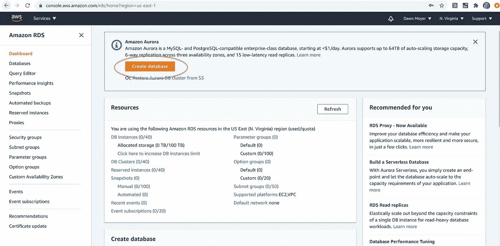
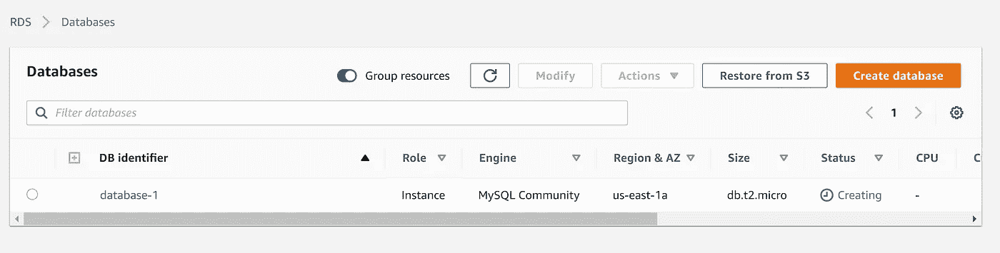
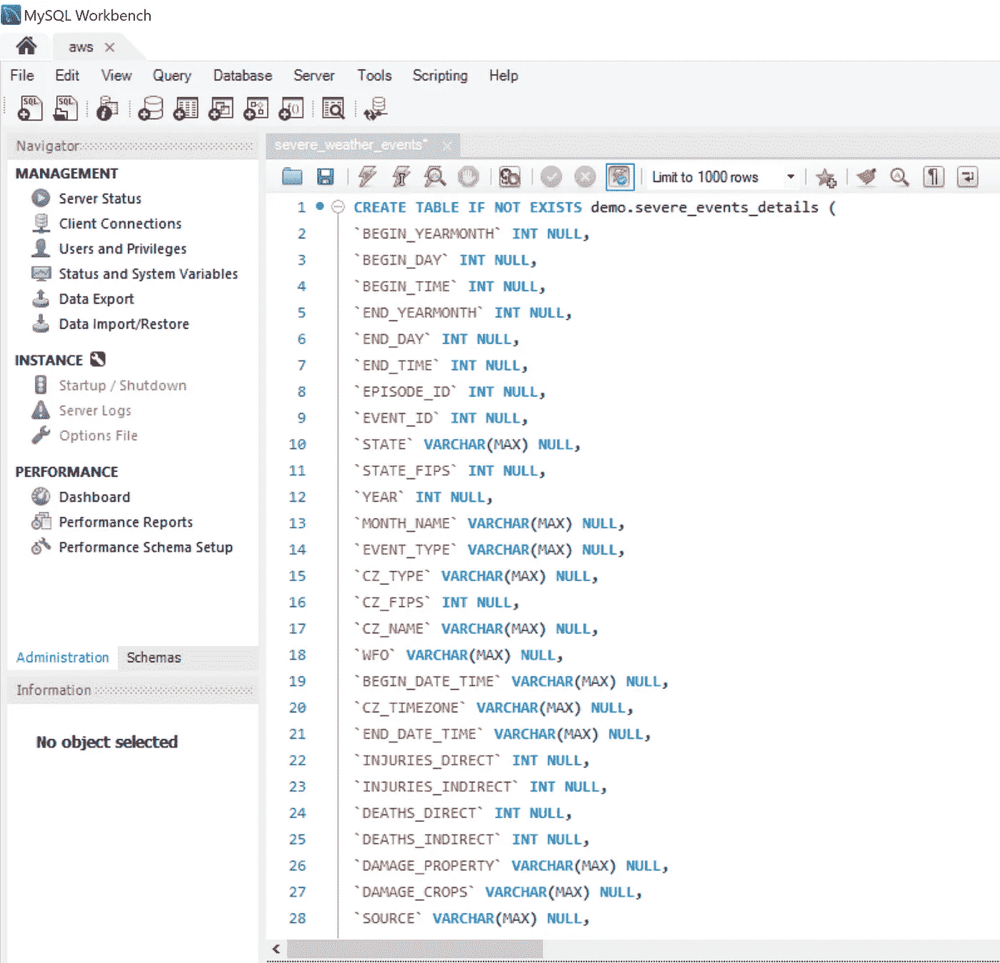
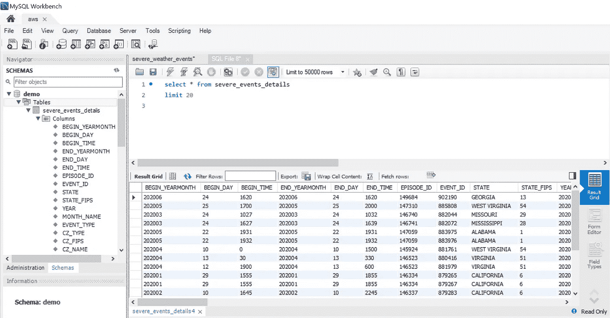

# 如何设置 AWS MySQL 数据库

> 原文：<https://towardsdatascience.com/how-to-set-up-an-aws-mysql-database-c33eba8870eb?source=collection_archive---------39----------------------->

## 一个快速、简单、免费的平台，用于创建 SQL 教程

图片由 [Gerd Altmann](https://pixabay.com/users/geralt-9301/?utm_source=link-attribution&utm_medium=referral&utm_campaign=image&utm_content=2953869) 从 [Pixabay](https://pixabay.com/?utm_source=link-attribution&utm_medium=referral&utm_campaign=image&utm_content=2953869) 拍摄

在写一系列关于如何使用 SQL 回答各种业务问题的文章时，我需要找到公共数据集。想要使用真实的数据而不是精选的 Kaggle 数据集，我在各种云平台上设置了我的数据库实例。我正在分享这些数据库设置经验。第一个实现是 AWS MySQL。

## 为什么选择 AWS MySQL？

我会用“自由层”来开始和结束任何争论

> 自由层

AWS 显然是一个受欢迎的平台。虽然这次经历很顺利，但并不是每次与 AWS 的互动都是一帆风顺的。

虽然 MySQL 的数据库实例工作正常，但是 MySQL Workbench 还有许多不足之处。我用来构建数据行的 insert SQL 文件一直冻结着我的应用程序。一旦加载了数据，从工作台到 AWS 以及从 AWS 到工作台的查询性能相当快。

## MySQL 数据库实例设置

本教程假设您拥有一个 AWS 帐户。如果您是第一次设置您的帐户，有一些[免费等级选项](https://aws.amazon.com/free/?trk=ps_a134p000003yBfsAAE&trkCampaign=acq_paid_search_brand&sc_channel=ps&sc_campaign=acquisition_US&sc_publisher=google&sc_category=core&sc_country=US&sc_geo=NAMER&sc_outcome=acq&sc_detail=%2Baws%20%2Baccount&sc_content=Account_bmm&sc_segment=438195700988&sc_medium=ACQ-P|PS-GO|Brand|Desktop|SU|AWS|Core|US|EN|Text&s_kwcid=AL!4422!3!438195700988!b!!g!!%2Baws%20%2Baccount&ef_id=Cj0KCQjwp4j6BRCRARIsAGq4yMGFkcgdPrRLQB9KY30Sr6dUaK5v13V_29tTNcgbn7n3K7oOZhRDtmIaAqbTEALw_wcB:G:s&s_kwcid=AL!4422!3!438195700988!b!!g!!%2Baws%20%2Baccount&all-free-tier.sort-by=item.additionalFields.SortRank&all-free-tier.sort-order=asc)。从您的控制台中，搜索 Amazon RDS 服务。这个链接会引导你到 AWS 提供的一个优秀的指南:[https://AWS . Amazon . com/getting-started/hands-on/create-MySQL-db/](https://aws.amazon.com/getting-started/hands-on/create-mysql-db/)。它将指导您逐步设置自由层实例。

从亚马逊 RDS 服务创建一个数据库——作者截图

挑完配置就上路了——作者截图。

## 数据

在我的教程中，我将使用一些网上可获得的严重风暴事件信息。我已经在我的工作中使用了这些数据，它足够有趣，可以创建有趣的样本用例。我会将恶劣天气事件的详细信息加载到数据库表中。如果你想看的话，我提供了这些文件的链接。

ftp://ftp.ncdc.noaa.gov/pub/data/swdi/stormevents/csvfiles/

 [## 恶劣天气数据清单

### 恶劣天气数据目录(SWDI)是美国恶劣天气记录的综合数据库。

www.ncdc.noaa.gov](https://www.ncdc.noaa.gov/ncei-severe-weather-data-inventory) 

要将数据加载到表中，需要将其转换为 SQL Insert 语句。总是寻求尝试不同的工具，我用了康伯特([https://numidian.io/convert](https://numidian.io/convert))。我无法谈论他们的数据安全性，因为我使用的是公共数据集。您上传您的数据文件，它被转换成您的 Create 和 Insert SQL 语句。为了防止 MySQL Workbench 中的错误，我不得不做一些小的改动，但这仍然是值得的。

## 连接到 AWS 数据库实例

按照说明做了 90%的工作。 [MySQL 踢我错误](https://docs.aws.amazon.com/AmazonRDS/latest/UserGuide/CHAP_Troubleshooting.html#CHAP_Troubleshooting.Connecting)告诉我检查我的密码和访问。我不得不回到我的 [AWS VPC，并允许访问。](https://docs.aws.amazon.com/AmazonRDS/latest/UserGuide/CHAP_SettingUp.html#CHAP_SettingUp.SecurityGroup)添加 TCP 规则后，我立即可以连接了。

## 创建表格并添加数据

在我创建的“演示”模式下，我使用了由 konbert 生成的 SQL 文件。我打开 SQL 文件并执行语句。我不得不将一些 varchar(MAX)语句更新为 varchar(##)。我最终加载了两次数据，因为 insert 语句没有显示友好的绿色勾号。我花了几分钟时间在没有副本的情况下复制了这个表，并且准备好了。运行查询的性能优于对大型 Create/Insert SQL 文件进行更改。

## 结论

我绝对不喜欢 MySQL Workbench 作为我与 AWS 数据库集群交互的应用程序。也许您可以使用一个替代的 GUI 应用程序来与您的数据库进行交互。如果没有更好的工具可以使用，我以后很可能不会选择 AWS 上的 MySQL。