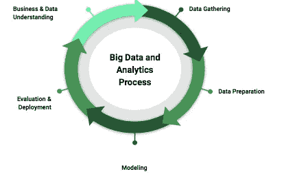

# 如何建立现代数据分析平台

> 原文：<https://towardsdatascience.com/how-to-set-up-an-flexible-and-scalable-data-analytics-platform-quickn-easy-5fb3a4c83745?source=collection_archive---------49----------------------->

## 借助 ELT plus 等易于实施且可扩展的云服务，您可以非常快速地建立数据仓库、湖泊和枢纽。

构建你的数据景观——照片由 [Neda Astani](https://unsplash.com/@nedaastani?utm_source=unsplash&utm_medium=referral&utm_content=creditCopyText) 在 [Unsplash](https://unsplash.com/s/photos/cloud?utm_source=unsplash&utm_medium=referral&utm_content=creditCopyText) 上拍摄

通过 ETL 过程和 OLAP 立方体构建一个传统的本地数据仓库经常会导致项目延期、额外的成本和 IT 经理的头痛。新的技术、方法和云让我们有可能减少设置时间，并提供更加灵活和可扩展的解决方案。

## **云(即插即用)**

与亚马逊、谷歌等大型云提供商合作。数据仓库、数据库等 IT 服务都是即插即用的。提供像 Big Query [1]或 Redshift [2]这样的数据仓库服务需要每次点击。公共云也提供了比自托管计算机中心更多的计算能力。

尤其是对于小公司和初创公司来说，这是一个使用这些服务的有趣机会，因为它们具有成本效益并且易于设置。如果您感兴趣，您可以通过大多数大型云提供商提供的免费层轻松测试解决方案。

## **数据仓库与数据湖**

几十年来，数据工程师、软件工程师和数据分析师一直在用 ETL 过程构建数据仓库，并一直专注于实现严格遵循 Star 或 Snowflake 等数据模型的架构。此外，人们通常更关注技术细节，而不是业务需求。在数据湖中，所有数据都存储在临时区域中。之后，数据将被处理到数据仓库(数据仓库是数据湖的一部分的混合模型也很常见)、数据集市或用于分析和报告。这使得数据湖比数据仓库更加灵活。此外，它还支持机器学习等新的用例，并为非结构化数据提供存储功能。

## ELT 与 ETL

ETL(提取-转换-加载)过程在将数据加载到数据库之前进行转换，而 ELT(提取-加载-转换)过程首先将数据加载到数据库中，并让数据库执行转换任务。这带来了一些好处:

1.  繁重的转换任务不必在 ETL/ELT 工具中进行。这使得数据处理速度更快(业务分析师不再需要等待数小时或数天的数据)
2.  实现可以更快地实现，因为数据工程师不再需要担心业务逻辑。相反，他们只是建立从源中提取原始数据的工作。这种转换可以在以后由数据湖中的业务分析师或数据科学家来完成，或者通过 BI 工具来完成。
3.  流程中的更改和错误修复可以更快地实现，因为没有转换发生，数据可以很容易地重新加载[3]。

最终，像这样的架构可以成为目标:

在基于云的数据库中进行转换的 ELT 流程—图片由作者提供

## **敏捷项目管理&数据分析过程**

数据项目的目标可以是:

*   数据仓库或湖中的新数据对象
*   报告
*   数据科学模型，例如

实现过程通常如下所示:

大数据和分析流程—按作者分类的图片

在收集、准备和建模数据之后，请求者(通常是产品所有者或业务部门)会对数据进行评估。在所有要求的愿望得到满足之前，可能需要一些时间和调整。因此，迭代方法是解决方案。就我个人而言，我建议使用基于 scrum 的 sprints，产品负责人和业务部门每两周评估一次结果。

## 自助式商务智能工具与老式 OLAP 立方体

构建数据分析平台的另一个加速是通过自助 BI 工具实现的，如易于使用的 Google Data Studio 和 MS Power BI Desktop 或 Qlik 或 looker 等“重型”解决方案。由于有了这样的工具，业务用户可以通过拖放来构建报告。例如，由工程师构建沉重的 OLAP 立方体现在可以由商业用户使用数据透视表功能来完成。通过这样做，耗时的工作从 IT 部门转移到了业务部门。因此，这也可以被视为一种优势，因为自助 BI 工具将数据带给了最了解业务的人。

## **结论**

在即用型云服务的帮助下，ELT 和自助 BI 工具等新模式以及敏捷方法公司(尤其是中小型公司)可以在更短的时间内构建数据分析平台，从而能够更加专注于业务需求。

## 资料来源和进一步阅读

[1]谷歌， [BigQuery](https://cloud.google.com/bigquery)

[2] AWS，[亚马逊红移](https://aws.amazon.com/de/redshift/?whats-new-cards.sort-by=item.additionalFields.postDateTime&whats-new-cards.sort-order=desc)

[3] XPLENTY， [ETL 与 ELT](https://www.xplenty.com/blog/etl-vs-elt/)