# 如何设置避鸽系统的数据收集

> 原文：<https://towardsdatascience.com/how-to-set-up-data-collection-for-the-pigeon-avoidance-system-eba572fe6dc9?source=collection_archive---------46----------------------->

## 鸽子回避系统

## 设置 Raspberry Pi 为深度学习项目收集图像

免责声明:您正在阅读的是描述技术设置的第 2 部分。 [*第 1 部分*](https://medium.com/@tatianasennikova/how-artificial-intelligence-helped-me-to-win-the-war-against-the-pigeons-9458293983a1) *给出了鸽子回避系统的概述* [*第 3 部分*](https://medium.com/@tatianasennikova/how-to-use-deep-learning-to-shoo-pigeons-from-the-balcony-31a2704f2160) *提供了关于鸽子识别模型的细节。*

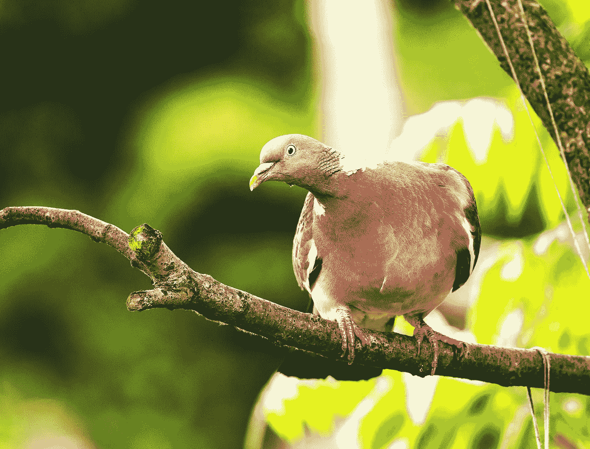

来源:安迪·霍姆斯在 [Unsplash](https://unsplash.com/?utm_source=unsplash&utm_medium=referral&utm_content=creditCopyText) 上拍摄的照片

现在我们已经熟悉了这个问题，让我们设置 Raspberry Pi 来收集图像。在这一部分，我将谈论鸽子回避系统的技术设置。本文由三个部分组成:

1.  硬件设置
2.  编排软件
3.  生产设备

如何为数据收集设置 Raspberry Pi 的一般方法可以适用于您自己的深度学习项目。该部分的所有代码位于 GitHub 的[中，可以重复使用。](https://github.com/tsennikova/pigeon-avoidance-system)

在我开始之前，我想感谢我的朋友兼同事丹尼尔，他帮助我建立了覆盆子，并在生产中突然出现问题时为我提供技术支持。

# 硬件设置

回想一下第 1 部分的图表:

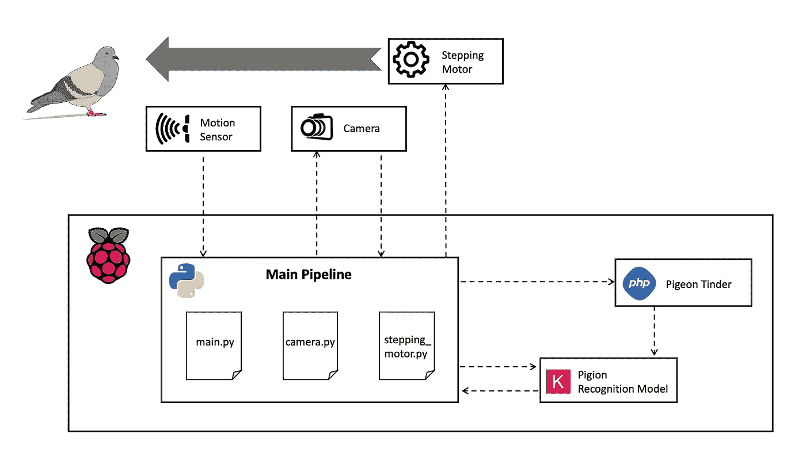

图 1:鸽子回避系统架构图

硬件方面，鸽子回避系统包括一个 Raspberry Pi 和三个外部组件:运动传感器、摄像头和步进电机。所有这些都是通过主要的管道来安排的。主管道是我们需要编写的软件中最关键的部分。甚至在我们训练鸽子识别模型之前，我们就需要把它准备好来收集数据。然而，我们首先需要将外部组件连接到 Raspberry Pi。为此，我们将需要使用 GPIO(通用输入/输出)引脚，可以通过 Python 程序访问这些引脚。如图所示，引脚被枚举:

图 2:树莓 Pi GPIO 布局。来源:[官方覆盆子文档](https://www.raspberrypi.org/documentation/usage/gpio/)

任何 GPIO 引脚都可以指定为输入或输出引脚，用途广泛。此外，还有两个 5V 引脚、两个 3.3V 引脚和几个 0V 接地引脚，我们将用来连接外部 Raspberry 元件。

## 连接运动传感器

应该连接的第一个元件是运动传感器。我用了一个红外运动传感器 [HC SR-501](https://www.amazon.de/gp/product/B00PRFPY72/ref=ox_sc_act_title_1?smid=A1BRLTYVHCTXZH&psc=1) 可以检测到人或者动物反射的红外线。传感器的示意图如下所示。

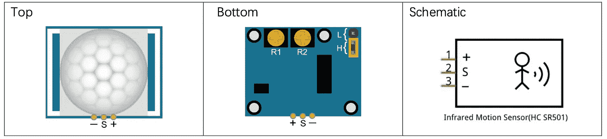

图 3:红外运动传感器 HC SR-501 的示意图。来源:Freenove 文档

当一只鸽子进入传感器的活动区域时，它会向与之相连的 GPIO 引脚输出一个 3.3V 信号。运动检测器的敏感范围在 2 到 7 米之间，可以通过旋转电位计 R2 进行校准。电位计 R1 校准高电平输出之间的时间延迟。还有一个跳线帽(黄色矩形)，用作两种触发模式之间的开关:

l:不可重复触发模式。传感器第一次感应到鸽子后会输出高电平。它将继续输出由 R1 配置的高电平延迟。在此期间，感应器**无法**感应到鸽子。当延迟时间结束时，传感器将输出低电平。

h:可重复触发模式。传感器可以检测到鸽子，直到它离开阳台。在此期间，它输出高电平。鸽子离开后，传感器计时延迟，也是由 R1 配置的，然后输出低电平。

我将传感器设置为可重复触发模式，因为我想激怒鸽子，直到它们最终离开阳台。图 4(红圈)显示了如何将运动传感器连接到树莓。在测试设置时，我使用的是 Raspberry Pi 扩展板。在生产系统中，我将跳线直接放在覆盆子引脚上。

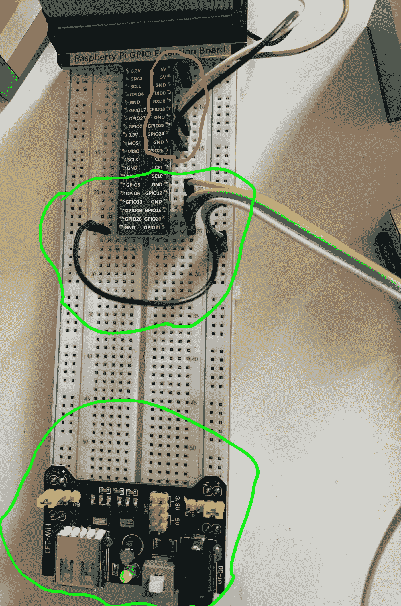

图 4:将外部组件连接到 Raspberry Pi

## 连接步进电机

步进电机会转动一个吓跑鸽子的装置。我在我的设置中使用了步进电机，因为它可以旋转特定的角度和定义的时间间隔。

步进电机有一个连接到步进电机驱动器的 5 路插座。步进电机驱动器用于将来自树莓的微弱输入信号转换成驱动步进电机的鲁棒控制信号。

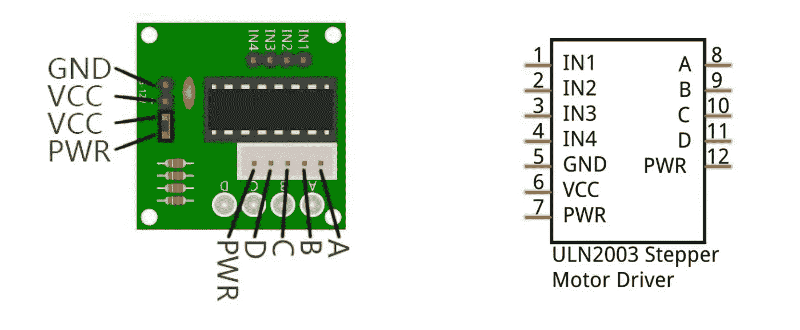

图 5:步进电机驱动器原理图。来源:Freenove 文档

步进电机驱动器 IN1-IN4 的输入信号对应于控制步进电机位置的输出信号 A-D。位置控制可以通过编程来完成。步进电机需要一个外部 5V 电源，该电源应与 Raspberry Pi 共享一个公共地。图 4 显示了如何将步进电机与 Raspberry Pi(绿色圆圈)连接。

## 连接摄像机

连接摄像头是最简单的部分。摄像头端口位于 HDMI 连接器附近。我们只需要把相机的排线绑牢，就万事俱备了。

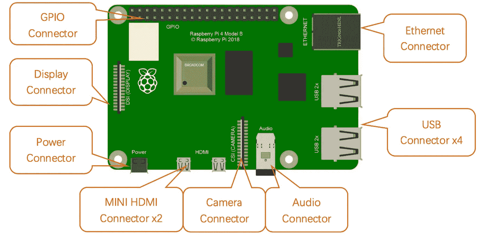

图 6:树莓 Pi 布局。来源:Freenove 文档

当所有外部组件都连接好后，它看起来就像图片上的混乱:

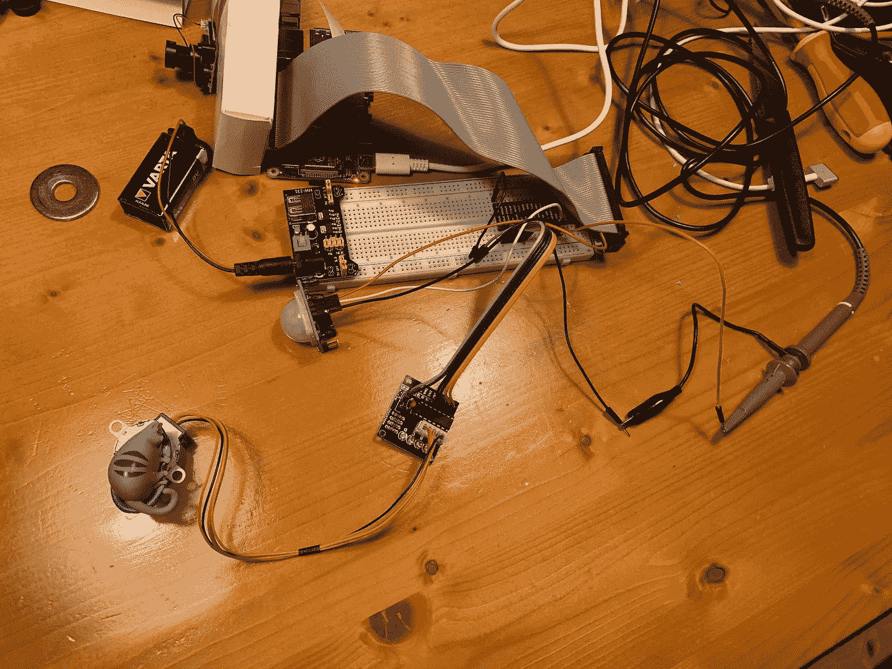

图 7:连接外部组件的 Raspberry Pi

现在，当所有组件都连接到 Raspberry Pi 时，我们可以编写 python 代码来操作它。

# 编排软件

我们需要编写 python 代码，以便在检测到运动时触发主管道。Raspberry Pi 已经预装了 python 包 RPi。GPIO 提供了一个类来控制 GPIO。我们需要做的第一件事是设置 GPIO 编号，它定义了在 Raspberry Pi 上寻址 GPIO 引脚的模式。然后，我们设置了一个连接运动传感器的引脚作为输入端口。

设置运动销

之后，我们编写一个事件检测方法。当在 pin_motion 上检测到上升沿时，add_event_detect()将调用 main_pipeline，而不管程序中发生了什么。

运动检测方法

我们需要在无限的 while 循环中运行运动检测方法。这样，程序将一直执行，除非键盘中断结束它。

无限循环中的运动检测方法

现在来看主管道。主管道会调用相机拍照。之后，它会尝试识别图像上有哪些物体:鸽子、人或什么都没有。基于此，它将移动马达，休眠 180 秒，或者什么也不做。

主管道

我们用需要指定的 take_pic()方法拍照。首先，我们配置摄像头模块:

配置摄像头模块

您可能已经注意到，我导入了 config，这是一个配置文件，在其中我指定了外部组件的 GPIO 引脚、图像路径以及图像分类模型的训练数据的路径。

照相

take_pic()在检测到运动时拍照，并将其存储在配置中指定的 img_path 中。如果我们还处于数据收集阶段，那么就要用鸽子火绒手动给图像打标签，把主管道中的条件表达式注释掉，直到我们收集到足够多的图像，训练好模型。

如果在图像上识别出一只鸽子，我们需要通过旋转马达来驱赶它。电机旋转在 rotate_motor 方法中实现。

我们再一次指定了电机所连接的引脚。步进电机有四个引脚，负责旋转角度。

步进电机引脚配置

电机以一定角度旋转(例如从 A 到 B)。

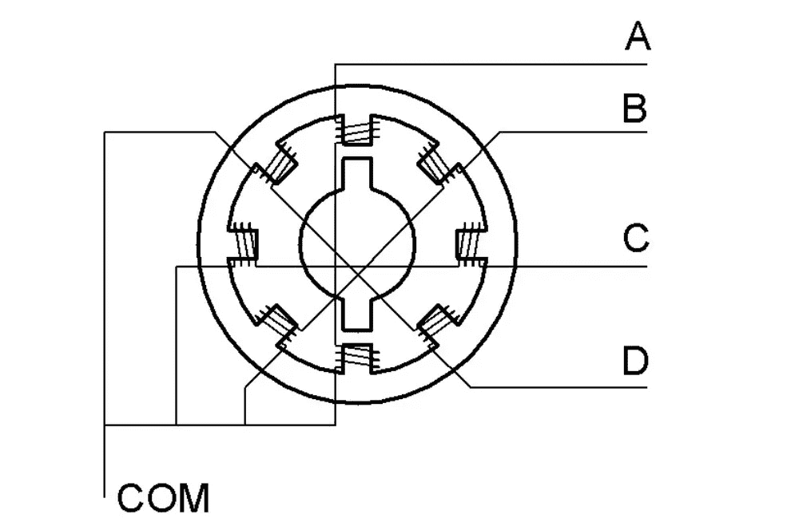

图 8:步进电机图。来源:Freenove 文档

上面代码中指定的管脚:[12，16，20，21]对应的是步进电机的位置:[A，B，C，D]。对于顺时针旋转，我们需要以正向顺序迭代该列表:A→B→C→D→A，等等。从一个状态到另一个状态(例如，从 A 到 B)的每个转换被称为一个步骤。通过控制旋转步数，我们可以控制旋转角度。通过控制两步之间的时间，我们可以控制转速。

首先，让我们实现一个停止电机的方法:

我们对 motor_ports 进行迭代，并将输出级别设置为低。现在，我们可以实现一个具有相同逻辑的旋转函数:在 motor_ports 上逐步迭代，并将输出设置为高。rotate_motor()方法比我们目前所写的稍微复杂一些。

旋转电机

在主管道准备好之后，我们可以测试我们的设置:

鸽子回避系统。测试设置

注意，在这个设置中，我还没有对模型进行训练。因此，每当传感器检测到运动时，电机就会运行。此外，塑料猫不是旨在吓跑鸽子的最终解决方案。它在这里只是为了表明电机运行。

# 生产设备

现在是时候把树莓派安装到生产环境中了，也就是我的阳台。为了保护硬件免受雨水和鸽子的攻击，我需要防水的塑料盒。我在全球速卖通订购了漂亮的接线盒。然而，根据我过去购买鞋子和手袋的经验，送货可能需要长达四周的时间，我想尽快开始收集数据。因此，我用乐高为摄像头和运动传感器搭建了房子。对于覆盆子本身，我用了一个特百惠盒子，当然，作为一个好主妇，我的厨房里就有这个盒子。

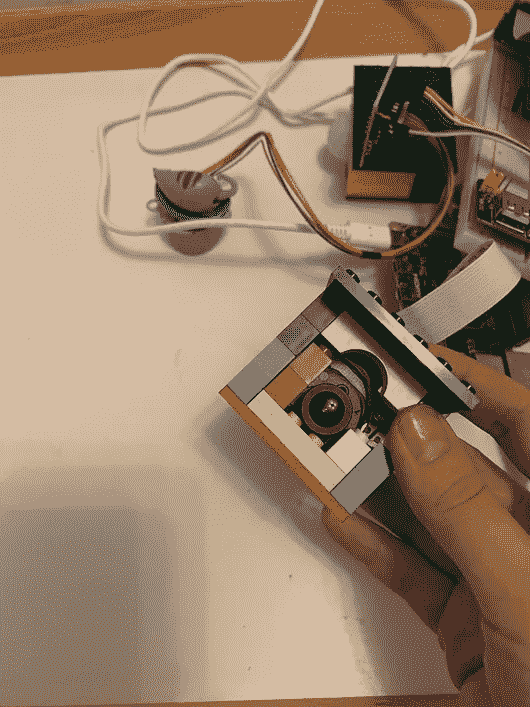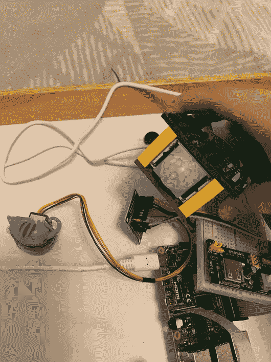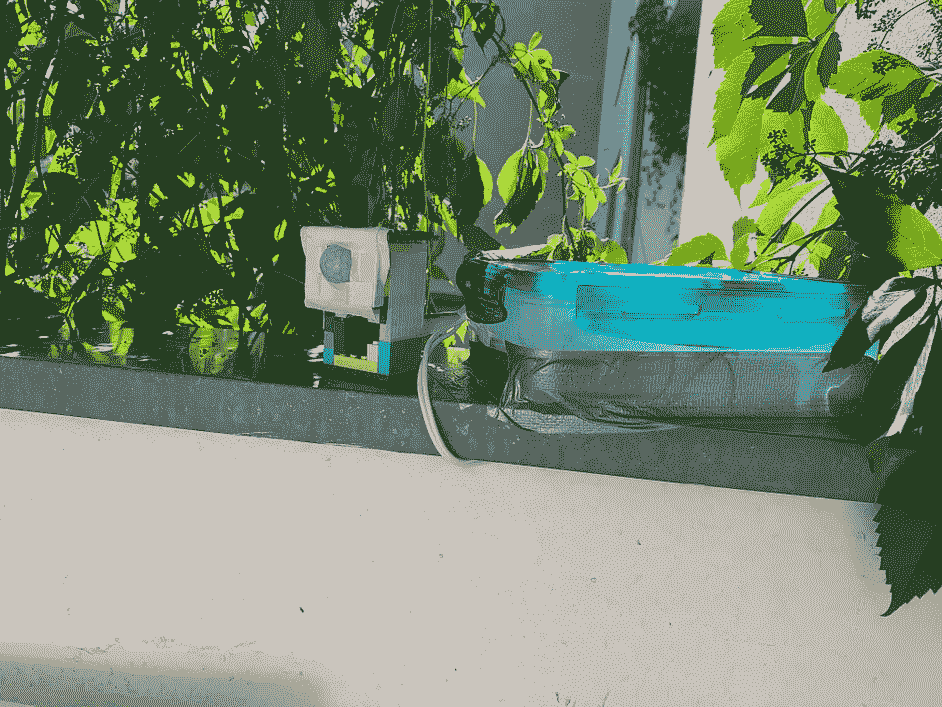

图 9–11:我阳台上的数据收集装置

下一步是让覆盆子通电。最初，它配有一根电源线，长约一米。这远远不够。我在阳台上没有电源插座。因此，我需要从房子里的插座给树莓供电。为此，我焊接了一条 5 米长的新电源线。有了新的电线，我把电源直接给树莓引脚，这通常是不推荐的，但仍然是一种确定。

现在是等待鸽子的时候了。实际上，我需要测试运动检测器对我阳台区域的覆盖情况。因此，我在阳台周围放上燕麦片来吸引鸽子，让它们四处走动。这样，我可以检查运动传感器是否有检测不到鸽子的死角。仅仅几个小时后，我得到了第一张鸽子的照片！

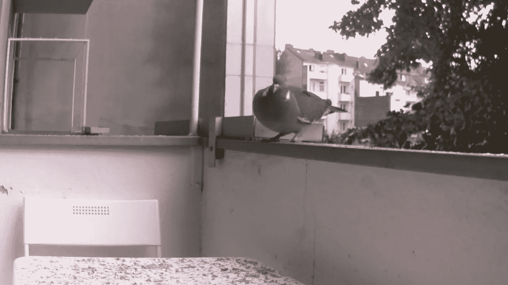

图 12:第一张鸽子图片

看过这张照片的人都注意到了鸽子有多胖。事实上，在杜塞尔多夫我们有非常胖的鸽子。然而，一个非常不幸的惊喜是，运动传感器只检测到正前方的鸽子，而忽略了传感器左侧或右侧的鸽子。因此，我决定安装第二个运动传感器，它将观察垂直方向。这样，我阳台的整个周边都被覆盖了。

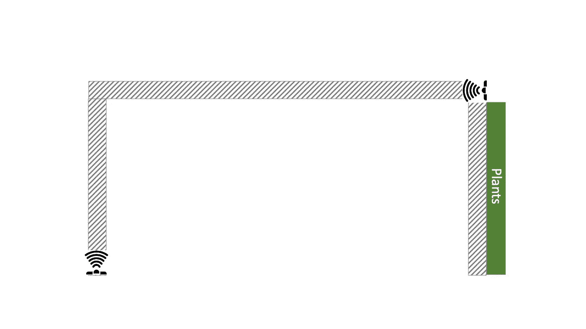

图 13:运动传感器设置

运动传感器覆盖了我阳台的两个垂直边缘。在阳台的右边，我有植物。因此鸽子不能在那里着陆。为了简单起见，我用同一根线连接了两个传感器，它在同一个引脚上发送来自两个传感器的信号。在把另一份燕麦片放在我的阳台上后，我意识到现在整个阳台都被覆盖了，我得到了比只有一个传感器更多的鸽子照片。新设置的另一个优点是，我可以将传感器的灵敏度设置为最低，从而减少误报(没有鸽子的图像，由风吹树木引发)。

现在为数据收集建立了鸽子回避系统。每当传感器检测到运动，相机就会拍照并存储在树莓 Pi 上。后来，我用鸽子绒仔细检查了这些照片，并给它们贴上标签，以便进一步训练。

这是第 2 部分的结尾。在“[如何利用深度学习把鸽子从阳台上赶走](https://medium.com/@tatianasennikova/how-to-use-deep-learning-to-shoo-pigeons-from-the-balcony-31a2704f2160)”中，我讲的是如何利用迁移学习的力量进行鸽子检测。保持更新，与此同时，先睹为快从[第三部分](https://medium.com/@tatianasennikova/how-to-use-deep-learning-to-shoo-pigeons-from-the-balcony-31a2704f2160):如何被当成鸽子？假装你要建一个巢。

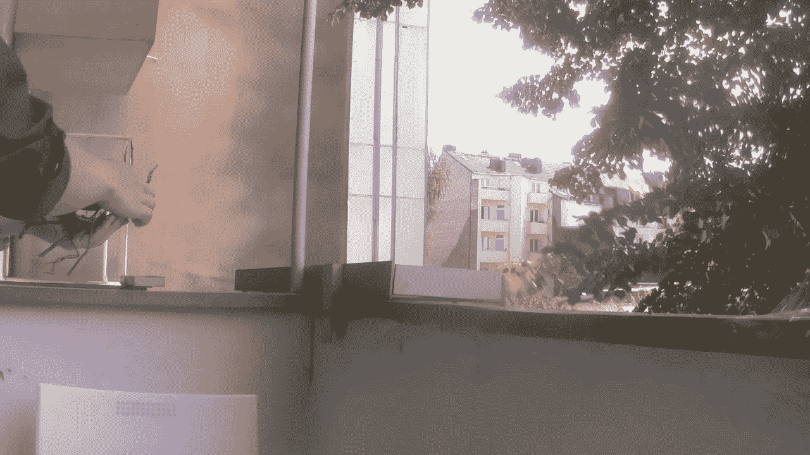

图 14:我的手被归类为鸽子。

如果你对这个项目有任何疑问，请随时通过 [Linkedin](https://www.linkedin.com/in/tatiana-sennikova-7b864140/) 联系我。