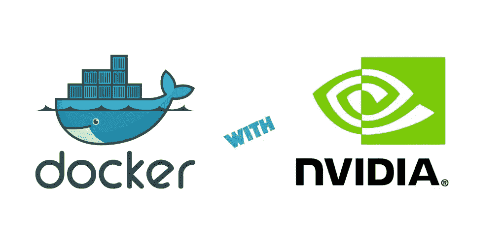
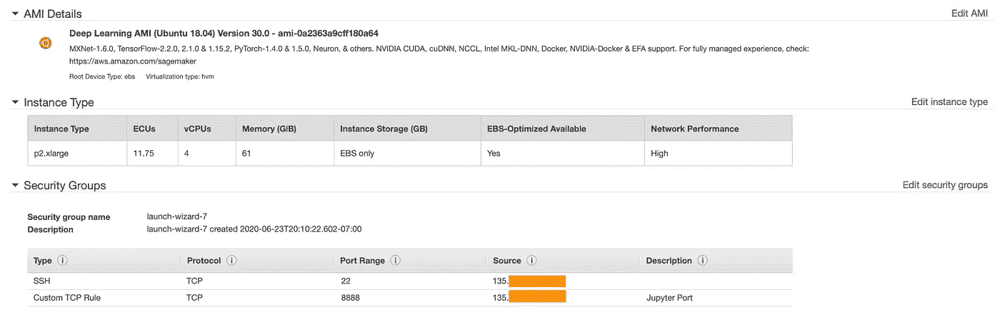
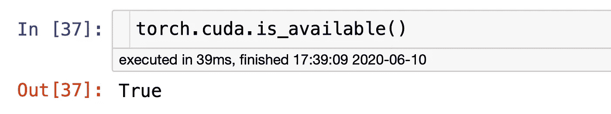

# 如何在 AWS 上设置深度学习的 Docker

> 原文：<https://towardsdatascience.com/how-to-set-up-docker-for-deep-learning-on-aws-bce751eaf662?source=collection_archive---------35----------------------->

## 使用 nvidia-docker 访问运行容器中的 GPU



来源:[https://blog.pridybailo.com/docker-and-nvidia-gpus/](https://blog.pridybailo.com/docker-and-nvidia-gpus/)

这篇文章将帮助您在 AWS EC2 实例上设置一个支持 GPU 的 Docker 容器，用于深度学习。我们还将介绍如何从本地机器访问运行在容器内部的 Jupyter 服务器。

为什么？我最喜欢 Docker 的一点是，它允许你在远程机器上轻松地复制本地开发环境。每当你需要在 GPU 上训练一个模型时，这就非常方便了。

本文假设读者对构建 Docker 映像和在 AWS 上启动 EC2 实例有一定的了解。关于 Docker 以及它如何帮助改进您的数据科学工作流的初级读本，请查看[这篇精彩的文章](/how-docker-can-help-you-become-a-more-effective-data-scientist-7fc048ef91d5)。

**TL；DR:** 使用`nvidia/cuda`作为您的基本映像，并在启动容器时传递`--gpus all`标志。

# 步骤 0:您的 Git 存储库

这篇文章的工作目录将是您项目的本地`git`库。虽然这不是我们在 AWS 上设置支持 GPU 的 Docker 容器的目标的严格先决条件，但它将使您的生活更加轻松，因为它允许您在 EC2 实例上简单地`git clone`GitHub repo。

# 第一步:Docker 图像

第一步是建立我们训练深度学习模型所需的图像。我们将通过将以下 docker 文件添加到我们的存储库中来实现这一点。

这个 does 文件的关键组件是`[nvidia/cuda](https://github.com/NVIDIA/nvidia-docker)`基础映像，它完成了容器访问系统 GPU 所需的所有工作。

你的`requirements`文件应该包含你训练你的模型所需要的所有包，并且需要包含`Jupyter`以使最后的`CMD`工作。如果您有一个训练您的模型的脚本，只需用运行您的脚本的命令替换上面的`CMD`。

**奖金👻:**您也可以通过在需求步骤后添加`RUN jupyter contrib nbextension install`来启用您最喜欢的 Jupyter 扩展。

# 步骤 2:启动并连接到 EC2

下一步是启动一个 EC2 实例并`ssh`进入其中。您的实例需要安装`Docker`和`nvidia-docker`。最简单的选择是选择一个 ubuntu 深度学习 AMI，两者都有安装。

一旦你选择了实例的 AMI，选择一个带有 GPU 的实例类型。遗憾的是，它们并不便宜。在我写这篇文章的时候，`us-west-2`中的一个`p2.xlarge`实例将花费你`$0.90/hour`😭。

在启动实例之前的 review 页面，编辑安全组以打开`port 8888`,这样我们就可以从本地机器连接到运行在容器内部的 Jupyter 服务器。

检查您的评论页面看起来像这样，并启动您的实例。



记得在 source 下选择 MyIP。

一旦您的实例启动并运行，通过在本地终端上运行以下命令进入它:

```
% ssh -i <path-to-aws-pem-file> <user>@<ec2-hostname>
```

您可以通过选择您的实例并单击 AWS 控制台上的`Connect`来找到您的`user`和`ec2-hostname`。如果你选择了一个 Ubuntu 图片，它看起来会像`ubuntu@ec2–XXX.us-west-2.compute.amazonaws.com`。

# 第三步:克隆你的回购协议，建立你的形象

现在我们已经连接到一个正在运行的 EC2 实例，是时候构建我们的 Docker 映像了。在实例的命令行中，克隆 GitHub repo:

```
$ git clone https://github.com/<username>/<repo>.git
```

然后`cd`进入它并运行这个命令来构建您的 Docker 映像:

```
$ docker build -t <image-name> . 
```

**奖金👻:**如果你有一个预先构建好的镜像存储在容器注册表中，比如 [docker hub](https://hub.docker.com) ，你可以用`docker pull`来拉你的镜像，如果你的镜像需要一些时间来构建的话，这可以节省时间。

# 步骤 4:启动支持 GPU 的容器

建立了我们的映像后，我们就可以发布我们的容器了🚀。在实例的命令行中，运行:

```
$ docker run --gpus all -d -p 8888:8888 -v $(pwd):/src <image-name>
```

关键的一点是`--gpus`标志，它允许容器访问实例的 GPU(多亏了`nvidia-docker`)。至于其他的，

*   `-d`标志在后台运行容器(分离模式)。
*   `-p`标志将容器上的`port 8888`绑定到 EC2 实例上的`port 8888`(我们之前已经向入站连接开放了该实例)。
*   `-v`标志将当前目录(您克隆的存储库)挂载到我们在 Dockerfile 中设置的工作目录(我们称之为`/src`)中，这样我们对笔记本所做的更改就会修改磁盘上的文件。

上面的命令既启动了一个容器，又启动了其中的 Jupyter 服务器(感谢我们的`Dockerfile`中的最后一个`CMD`)。您将看到打印在屏幕上的容器 ID。复制并运行下一个命令来获取 Jupyter 服务器的`access token`:

```
$ docker exec <container-ID> jupyter notebook list
```

复制打印的`access token`并返回到您的本地命令行。

# 步骤 5:连接到容器的 Jupyter 服务器

恭喜你。您已经完成了在远程 AWS 实例上设置支持 GPU 的容器的所有艰苦工作。最后一步是将您机器上的一个本地端口转发到容器内部运行的 Jupyter 服务器:

```
% ssh -NfL 8080:localhost:8888 <user>@<ec2-hostname>
```

上面的命令将机器上的`port 8080`转发到 EC2 实例上的`localhost:8888` ，Jupyter 服务器在 EC2 实例上运行。

由于`port 8888`是 Jupyter 的默认端口，我们转发了`port 8080`以避免与本地机器上运行的任何笔记本发生冲突。

现在在浏览器中导航到`localhost:8080`，粘贴上一步中的 Jupyter `access token`。

哒哒🎉！您现在正在与一个运行在远程 EC2 实例上支持 GPU 的 Docker 容器内的 Jupyter 服务器对话。

如果您使用 PyTorch，您可以检查`cuda`是否可用:



# 最后的想法

我希望这篇文章能够帮助你在训练深度学习模型时简化开发工作流程。将 Docker 整合到你的日常工作流程中需要时间，但是它会省去很多麻烦和花费在远程环境中的时间。

感谢阅读！🙏

**附注**完成后，记得关闭您的`p2.xlarge`实例！