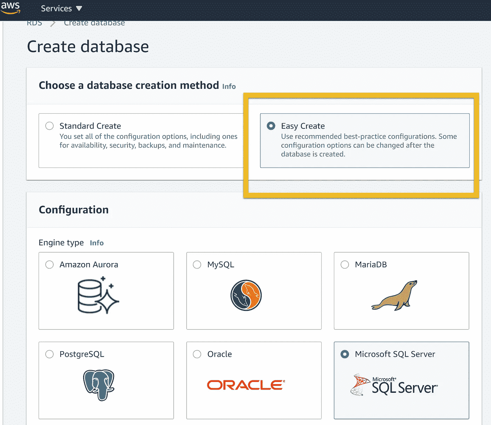
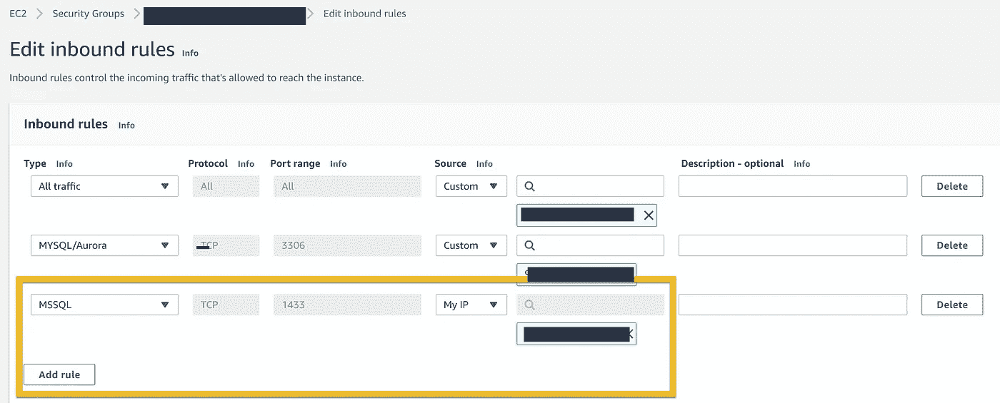
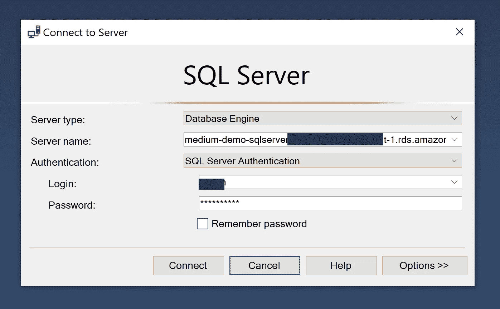
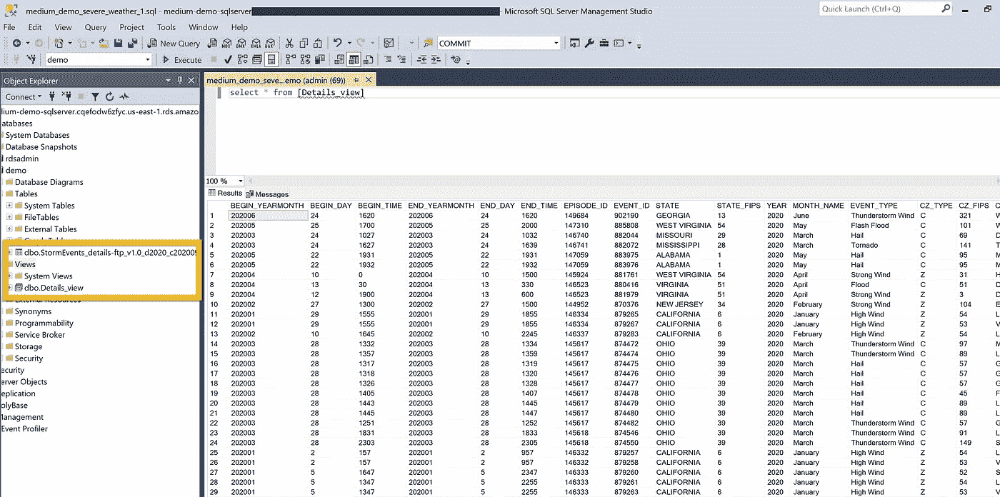

# 如何在 AWS 上设置 MS SQL Server

> 原文：<https://towardsdatascience.com/how-to-set-up-ms-sql-server-on-aws-c1105ce08fb4?source=collection_archive---------58----------------------->

## 他们有一个简单的按钮！

图片由[皮克斯拜](https://pixabay.com/?utm_source=link-attribution&utm_medium=referral&utm_campaign=image&utm_content=3389893)的 Gerd Altmann 提供

正如我在上一篇关于 [MySQL](/how-to-set-up-an-aws-mysql-database-c33eba8870eb) 设置的文章中所讨论的，虽然我将设置这些数据库来创建高级 SQL 教程，但我是在分享我的经验。如今的数据库是 AWS Microsoft SQL Server 产品。

## 为什么选择 Microsoft SQL Server？

SQL Server 是一种非常流行的数据库，尤其是对中小型公司而言。你经常会在 guru.com 和 upwork.com 看到 SQL Server/TSQL 自由职业者的招聘信息。编写或调试 TSQL 查询和存储过程相对容易。

与 MySQL 一样，您可以轻松地建立一个自由层实现。非常适合我的小型用例。

## 设置

使用 Easy Create，创建数据库和连接非常简单。点击几下，你的数据库就开始运转了。

Easy Create = Easy Button —作者截图

## 与数据库交互

为了与数据库进行交互，我下载了 18.6 版本的微软 SQL Server Management Studio([SSMS](https://docs.microsoft.com/en-us/sql/ssms/download-sql-server-management-studio-ssms?view=sql-server-ver15))。这个版本是 2020 年 6 月 22 日刚刚发布的，所以我很乐意去看看。对于使用过老版本的人来说，你会发现界面非常熟悉。

最初，我无法连接到 AWS 数据库实例。记住我必须为 MySQL 实例所做的更改；我[编辑了入库规则](https://docs.aws.amazon.com/AmazonRDS/latest/UserGuide/USER_VPC.Scenarios.html)。

添加 MSSQL 入站规则—作者截图

这似乎不起作用。尽管我使用了 Easy Create，但我必须返回到实例中，修改数据库实例以使其公开。一旦我完成了调试，我的状态就很好了。

## 连接到数据库

服务器名是您的端点链接，*和*一个逗号，后跟分配的端口 id。默认是 1433，对我来说很管用。

SSMS 连接数据库——作者截图

## 加载数据

我使用了与前一篇文章相同的恶劣天气细节数据源。

 [## 恶劣天气数据清单

### 恶劣天气数据目录(SWDI)是美国恶劣天气记录的综合数据库。

www.ncdc.noaa.gov](https://www.ncdc.noaa.gov/ncei-severe-weather-data-inventory) 

由于 1，000 行的插入限制，我无法装载常规的 Insert 语句。对我来说这太弱了。

1000 行限制—作者截图

在设置模式之后，我使用了导入平面文件选项。不需要将信息转换成 SQL 语句。平面文件导入会尝试文件中的数据类型。我不得不修改 varchar 长度，直到进程成功运行。

现在我的数据库已经设置好了，可以开始学习教程了

成功！—作者截图

## 结论

毫无疑问，SSMS 是比 MySQL Workbench 好得多的工具。我认为可以更好地估计数据类型和长度属性。如果我有一个包含 100 个报价的文件，那就太无聊了。AWS 的设置非常简单。直到我的第一个安全补丁失效，我才看任何手册。AWS 上的 SQLServer 将在我未来产品的候选名单上。