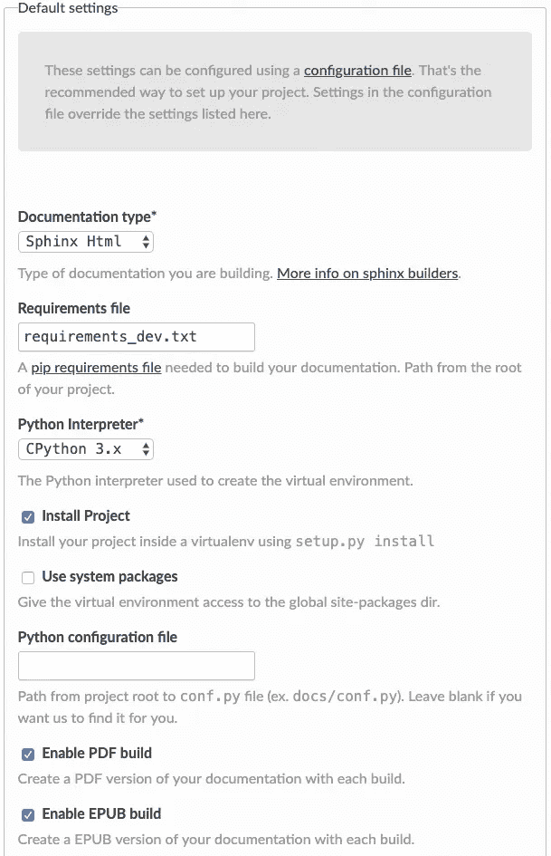
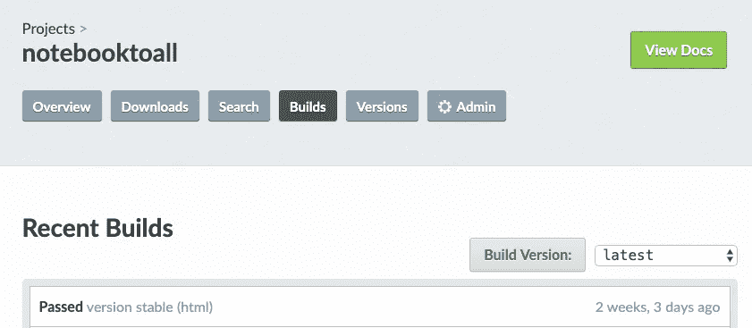
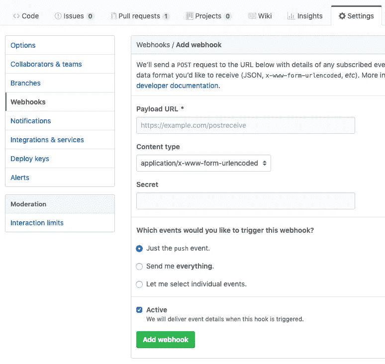
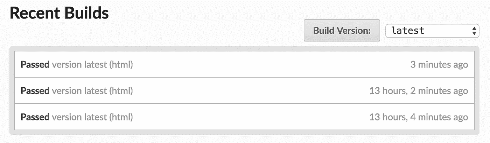
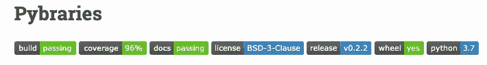
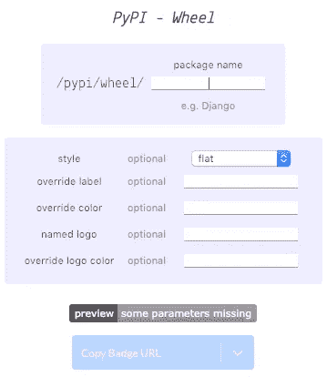
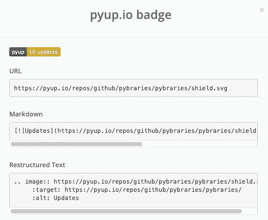
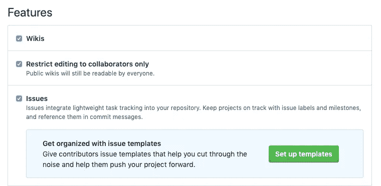

# 如何成功设置 Python 项目文档🎉

> 原文：<https://towardsdatascience.com/how-to-set-up-your-python-project-docs-for-success-aab613f79626?source=collection_archive---------32----------------------->

## 使用 Sphinx 自动化您的文档创建工作流并阅读文档

你做了一个很棒的 Python 软件并向公众发布。太好了！不幸的是，这还不够。️You 需要文件！

良好的文档对采用至关重要。让文档清晰是你能为当前和未来的软件包用户做的最好的事情之一。🎁

文件不会自己写，但你可以通过阅读文件、斯芬克斯和一些眼泪来达到部分目的。😢开个玩笑，可能会有一些并发症，但希望不会有眼泪。

将文档设置为在每个新版本上自动构建可能会令人困惑。在本文中，我将向您展示如何设置您的文档，这样您就可以为您的项目提供最大的成功机会。我们走吧！🚀


斯芬克斯。资料来源:pixabay.com

如果你没有一个基本的 Python 包，请点击这里查看我的制作指南。然后阅读[的下一篇文章](/10-steps-to-set-up-your-python-project-for-success-14ff88b5d13)，学习如何添加测试、Travis、工作服、Black 和 PyUp，这样你就更有信心你的代码不会被破坏。

我将在本文中使用的示例项目是[*py libraries*](https://github.com/pybraries/pybraries)*，*一个我为 libraries.io API 制作的包装器。您可以使用它来订阅新版本开源包的电子邮件提醒。您还可以使用它来查找关于开源包和库的许多方面的信息。[这里的](https://pybraries.readthedocs.io/en/latest/README.html)是单据。让我们看看如何建立它们！🚀

# 步骤 1:设置阅读文档

*免费阅读文档* ( *RTD* )主机开源项目文档！非常酷。🕶

在[https://readthedocs.org](https://readthedocs.org)设置您的 Read the Docs 账户。

然后执行以下操作:

1.  如果您在 RTD 上看不到 GitHub 资源库，请手动将其导入。
2.  进入 RTD 项目后，输入相关信息并勾选*编辑高级项目选项框。*
3.  在下一个屏幕上，选择 *Python* 作为你的编程语言。
4.  点击*完成*。然后 *Admin* 。然后*高级设置*。
5.  选中*复选框，使用 setup.py install* 在 virtualenv 中安装您的项目，并在*需求* *文件*字段中输入`requirements_dev.txt`(假设这是您的需求文件的名称。保存。或者，您可以创建一个 *readthedocs.yml* 配置文件，如这里的[所述](https://docs.readthedocs.io/en/stable/config-file/v2.html)。



6.点击*构建*选项卡。您应该看到一个构建正在进行或已经完成。

7.构建完成后，点击*查看文档*。这些文档还没有显示太多关于我们包的信息——我们稍后会处理这个问题。



当你推送 GitHub 时，如果配置了 webhoook，你的文档会自动生成。如果您自动将 repo 连接到 GitHub，您可能不需要为自动构建配置任何其他东西。☝️

如果您手动导入了回购协议，则需要设置一个 webhook。说明可以在[这里](https://docs.readthedocs.io/en/stable/webhooks.html?highlight=webhooks)找到。我对这些文档做了一些小的改进，所以如果你觉得有什么不清楚的地方，用 PR 来改进它们。😄以下是添加网页挂钩的方法:

在你的 GitHub repo 中，进入*设置*->-*web hooks*->-*添加 webhook* 。您应该会看到如下所示的表单。



对于*有效载荷 URL* ，进入 RTD*集成*设置并复制 webhook 信息。在前面加上`https://`。你可以不去管其他的事情，点击*添加 webhook* 。或者选择*让我选择单个事件*如果您想要触发 RTD 文档构建以响应除推送到回购之外的其他 GitHub 事件。仅供参考，我不得不删除我在 RTD 和 GitHub 上的 webhook，并重做重新添加 webhook 使其工作。

下次你把你的代码推给 GitHub，合并 PR，去 RTD 吧。您应该看到您的文档被自动重建！🎉如果你没有马上看到变化，等待几分钟。



酷！现在让我们设置 Sphinx 来为 RTD 生成我们的文档。

# 步骤 2:安装和配置 Sphinx

[Sphinx](http://www.sphinx-doc.org/en/master/) 号称可以轻松创建智能美观的 Python 文档。我不知道我会说这是一个快照，但斯芬克斯是非常酷的。😉功能包括语法突出显示、主题和简单的文档链接。[这里有](https://docs.readthedocs.io/en/latest/intro/getting-started-with-sphinx.html)斯芬克斯入门指南供参考。

将`sphinx==3.03`添加到 *requirements_dev.txt 中，*用`pip install -r requirements_dev.txt`安装。


其他狮身人面像。资料来源:pixabay.com

在项目目录的顶层创建一个 *docs* 目录。在那个目录中，从命令行运行`sphinx-quickstart`。

会问你几个问题。出现提示时，输入项目名称和作者姓名。通常缺省值是你想要的。

将自动生成以下文件:

*   *index.rst*
*   *conf.py*
*   *Makefile*

## *conf.py*

*conf.py* 控制构建文档时 Sphinx 如何运行。在其中，您可以配置项目文档设置。让我们对 *conf.py* 做一些修改，让 Sphinx 创建更好的文档。取消注释并调整该部分，使 *abspath* 为 `..`

```
import os
import sys
sys.path.insert(0, os.path.abspath('..'))
```

将以下内容插入扩展名列表:

```
extensions = [
    'sphinx.ext.napoleon',
    'sphinx.ext.autodoc',
    'sphinx.ext.viewcode',
    'sphinx.ext.coverage',
]
```

我不是雪花石膏模板的粉丝，所以我在我的 *requirement_dev.py* 文件中添加了`sphinx_rtd_theme==0.4.3`并安装了它。

如果你做了同样的事情，将 *conf.py* 中关于 *html_theme* 的那一行改为:

```
html_theme = ‘sphinx_rtd_theme’
```

## 制造

Make 是一个构建自动化工具。Sphinx 生成的 *Makefile* 控制以`make`开头的快捷命令如何操作。点击了解更多关于 makefiles [的信息。不用深究 Make，你大概也能过得去。😉](https://opensource.com/article/18/8/what-how-makefile)

从命令行运行`make html`用这个快捷命令创建您的文档。然后，在你的*docs*->-*build*_->*html*目录下你应该会看到*index.html*。在浏览器中打开该文件，您应该会看到您的基本文档。😄

要检查任何未记录的函数和类，将下面几行添加到您的 *Makefile 中。*

```
%: Makefile
    @$(SPHINXBUILD) -M $@ "$(SOURCEDIR)" "$(BUILDDIR)" $(SPHINXOPTS) $(O) 
    @$(SPHINXBUILD) -M $@ "$(SOURCEDIR)" "$(BUILDDIR)" $(SPHINXOPTS) $(O) -b coverage
```

附加的行`-b coverage`创建了一个覆盖率报告，这样可以告诉你有多少代码被记录。现在，当您运行`make html`时， *html* 文件夹将包含一个名为 *python.txt.* 的文本文件，该文件将显示您需要一些文档的位置。😀

提交并继续制作您的 doc 文件。


其他文件。资料来源:pixabay.com

# 第 3 步:创建文档文件

你可以选择是用 Markdown(以下简称 *md* 还是 reStructuredText(以下简称 *rst* )来写你的文件。Md 更接近常规散文，学起来更快。但是，rst 允许您使用更多 Sphinx 的强大功能。[这里是](https://guides.github.com/features/mastering-markdown/)MD 的 GitHub 指南和[rst 的](http://www.sphinx-doc.org/en/master/usage/restructuredtext/basics.html)Sphinx 指南。

是否花时间学习 rst 是你的选择。你还可以学习十亿种其他的东西，所以如果它不在你的清单上，我能理解。😉然而，许多项目的文档都是用 rst 写的，所以知道这一点很好。

使用这个在线 [pandoc](https://pandoc.org/try/) 转换器，你可以在 md 和 rst 的片段之间快速转换。您可以使用它从一种格式复制粘贴到另一种格式。 [CloudConvert](https://cloudconvert.com/md-to-rst) 对整个文件做同样的处理。CloudConvert 每天使用 25 分钟后开始充电。☝️

如果您走的是 rst 路线，请将您的自述文件扩展名切换到*。rst* 。

另外， *setup.py* 将需要 README 名称，而*long _ description _ content _ type*将切换到 rst。

我要用 rst。如果您使用 md，请将下面的文件扩展名更改为 *.md.*

创建以下文件:

1.  行为准则. rst
2.  投稿. rst
3.  历史. rst
4.  README.rst

**行为准则. rst**

这里是 GitHub 信息和行为准则模板。《行为准则》解释了人们在与您的项目合作时应该如何表现，以及如果个人行为不当应该如何处理。在模板有位置的地方添加您的电子邮件。如果想将 GitHub markdown 模板复制到 rst 中，可以使用上面提到的转换器之一。😀

**贡献第一**

让那些想为你的项目做贡献的人更容易做到。在你的*投稿*文件里写清楚说明。请随意使用我的文件作为基础。

**历史. rst**

*历史*将包含你的变更日志。对套餐用户有帮助。你也可以在 GitHub 上使用你的发布信息中的内容。☝️

在 *history.rst* 中添加以下内容。

```
=======
History
=======0.0.1 (2020–05–15)
 — — — — — — — — -* First release on PyPI.
```

将日期更新为适当的日期，并添加任何其他相关的项目符号。当您发布软件包的新版本时，您将附加该文件。

**README.rst**

您的自述文件应包括安装和基本使用信息。我建议你把用户指向 RTD 的完整文档。👉

您可以将其他文档添加到您的项目中，但是要确保将文件名放在您的 *index.rst* 的 TOC 中。然后它们会出现并链接到您构建的文档中。😀

现在让我们确保我们的用户能够得到帮助，理解你的函数和类是做什么的。


其他文件。资料来源:pixabay.com

# 步骤 4:添加文档字符串

文档字符串是一种向用户传达类或函数如何工作的方法。当用户寻求帮助时，文档字符串会出现在他们的代码中。Sphinx 将获取您的文档字符串，并自动使它们在 RTD 上的文档中可用。👍

在你的代码中写下你的[文档字符串](https://www.python.org/dev/peps/pep-0257/#multi-line-docstrings)，紧跟在你的类或函数的第一行之后。文档字符串以三重引号开始，应该包含用户可能需要的任何信息，包括关于参数和返回值的信息。

Python 没有[一种显而易见的方式](https://www.python.org/dev/peps/pep-0020/#id2)来格式化文档字符串。选择一种方式来编写 docstrings，这样它们看起来很整洁，没有人需要询问或考虑如何做事情。😀

我建议使用[谷歌风格](https://sphinxcontrib-napoleon.readthedocs.io/en/latest/example_google.html)——推荐这种风格是为了便于书写和阅读。关于文档字符串格式的详细讨论可以在[这里](https://realpython.com/documenting-python-code/#docstrings-background)找到。

通过在投稿文件中包含说明，确保让投稿人了解您选择的 docstring 格式。☝️

当您的代码中有文档字符串时，您可以在本地构建您的文档，并在浏览器中查看您的文档字符串。当本地版本看起来不错时，提交、推送并合并您的 PR，以在您的模块页面的 RTD 上查看您的文档字符串。


不带文档的字符串。资料来源:pixabay.com

如果事情没有按预期进行，这里有一些建议可以让你回到正轨:

## 解决纷争

斯芬克斯和 RTD 可以打破或导致文件看起来不同于预期的许多原因。检查 RTD 的构建日志以查找错误。

常见问题包括:

*   如果您的文档没有构建，而您使用的是 rst 文件，那么可能在某个地方有无效的 rst。要找到无效的 rst，请通过上面提到的 rst 检查器之一运行文件内容。
*   如果你的文档构建好了，但是你的模块没有显示出来，检查一下 RTD 上的原始输出日志。
*   确保您的 setup.py 和 requirements_dev.txt 文件是正确的。
*   如果你需要一个环境变量来运行，在 RTD 设置中添加它。

RTD 和斯芬克斯文档和堆栈溢出是有帮助的，但我发现这种故障排除很麻烦。我能感受到你的痛苦。🙁

现在让我们来看一个更好的话题——通过徽章向潜在用户传达信息。

# 步骤 5:向自述文件添加徽章

徽章为对您的项目感兴趣的人提供一目了然的信息。徽章可以灌输信心和合法性。以下是可以放在您的自述文件顶部的徽章示例:



在 https://shields.io/和 https://badgen.net/的[可以获得许多徽章。我从 shields.io 加了一些我的，要获取徽章代码，不要只复制徽章旁边的网址。点击网址。然后添加您的包名。参见下面的*轮*徽章示例。](https://shields.io/)



然后从下拉列表中复制 md 或 rst 代码，并将其粘贴到您的自述文件中。

在相关应用程序的网站上可以获得许多徽章。派普，特拉维斯和工作服有你能拿到的徽章代码。对于 PyUp，如果您单击 PyUp 仪表板上的徽章，您将看到可以复制并嵌入到自述文件中的代码。



这里是 RTD 的徽章信息。

酷！我们有徽章。最后，让我们看看如何促进协作。

# 步骤 6:创建问题和 PR 模板

来自更大社区的帮助对开源项目来说是一个巨大的好处。您希望让您的用户能够轻松地报告 bug 和功能请求以及相关信息。最好的第一步是提供一个清晰的问题模板。

## 问题模板

在浏览器中，进入 GitHub repo ->设置->选项。在*功能下，*点击绿色的*设置模板*按钮。



您可以添加自定义问题模板或使用 GitHub 的默认模板之一。

拉请求模板也同样有用。GitHub 有一个很好的制作指南[这里](https://help.github.com/en/github/building-a-strong-community/creating-a-pull-request-template-for-your-repository)。

现在，您可以更容易地获得开源项目的帮助了！

# 包装

在本文中，您了解了如何制作自动构建的优秀文档。你也学会了如何用徽章传达信息。最后，您看到了如何吸引合作者。

现在，人们将知道如何使用和贡献你的包。厉害！🎉

我希望这个指南对你有用。如果你有，请分享到你最喜欢的社交媒体渠道，这样其他人也可以找到它。👍

我写关于 [Python](https://memorablepython.com) 、 [Docker](https://memorabledocker.com) 、[数据科学](https://memorablepandas.com)和其他技术主题的文章。如果你对此感兴趣，请订阅我的 [Data Awesome](https://dataawesome.com) 邮件列表，在这里阅读更多。😀

[](http://eepurl.com/gjfLAz)

斯芬克斯。资料来源:pixabay.com

快乐记录！🖋