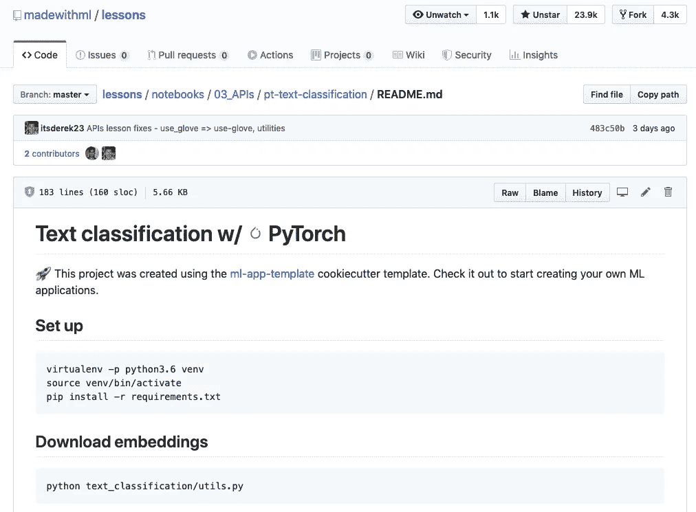

# 如何为 PyTorch 设置本地 AWS SageMaker 环境

> 原文：<https://towardsdatascience.com/how-to-setup-a-local-aws-sagemaker-environment-for-pytorch-d045ada46d61?source=collection_archive---------51----------------------->

*声明:我是本教程中提到的*[*booklet . ai*](https://booklet.ai)*的联合创始人。*

作为一名黑客数据科学家，但基本上是合法的 web 开发人员，**我对创建一个 ML 应用程序的过程感到沮丧**(一个触发预测的简单 UI 和一个可公开访问的 API)。创建和迭代一个典型的 web 应用程序的流程感觉就像在一个春日沿着一条低流量、平缓弯曲的乡村道路行驶。ML 应用开发流程？就像学开手动挡的车一样。

为什么 ML 应用开发流程这么粗糙？一个重要原因:**没有强调本地发展。我来举例说明。**

我将向您展示如何为部署到 AWS Sagemaker 的 PyTorch 神经网络创建 ML 应用程序。🚀[试试](https://app.booklet.ai/model/pytorch-text-classification) [Booklet.ai](https://booklet.ai) 上的 ML web app 。

# 所以您想将 PyTorch 模型部署到 AWS Sagemaker？

您已经构建了一个模型，现在您想要部署它。您偶然发现了 [AWS Sagemaker](https://aws.amazon.com/sagemaker/) 登录页面，并看到了这段文字:

一键部署？在几分钟内将新模型集成到您的应用中？你是数据科学家，不是 web 开发人员，为什么要花时间学习 web 技术呢？这听起来很棒——注册吧！

接下来，您搜索“使用 PyTorch 和 Amazon SageMaker ”,并意外发现您的用例:

完美！您点击链接，在 SageMaker SDK 文档中的[部署来自模型数据](https://sagemaker.readthedocs.io/en/stable/using_pytorch.html#deploy-endpoints-from-model-data)的端点。只需两个函数调用，您就有了一个部署好的模型！

**…但是接着疼痛开始了:**

*   `model_data`文件格式是什么？您有一个模型文件，但是您也有一些预处理中需要的编码器。你是怎么装的？
*   `entry_point`脚本是做什么的？文档的“从模型数据部署端点”一节没有对此进行描述。

哦好吧。你交叉手指，运行代码，部署，然后**等待大约 10 分钟**过程完成。接下来，您找到一些代码示例，这样您就可以调用`invoke_endpoint()`并触发一个预测。这失败了，CloudWatch 日志提到缺少`model_fn()`函数，所以您在文档中发现[加载了一个模型](https://sagemaker.readthedocs.io/en/stable/using_pytorch.html#load-a-model)。你试试这个然后部署。

**…并等待 10 分钟**。你叫`invoke_endpoint()`。这次`input_fn()`出现错误，好像和预处理有关。原始输入中有字符串 SageMaker 不喜欢这样吗？还是你在`invoke_endpoint()`发送了一个畸形的有效载荷？

您尝试一些东西，部署，**然后…等待… 10 …分钟**。

神圣的地狱。这有什么难的！嗯，我写了一些没用的蹩脚代码。当我在笔记本上训练 PyTorch 模型时，这不是问题，因为我可以快速修复我的错误。部署到 SageMaker 是一个不同的故事— **每一个小小的改变都需要漫长的等待**。

# 您需要一个本地 SageMaker 环境

**当你写完这篇文章，那些在 SageMaker 上等待 10 分钟来验证新代码的工作将成为过去！**您将拥有一个在您的计算机上运行的本地 SageMaker 开发环境。您将拥有一个简单的脚本来部署对 Sagemaker 的更改。

# PyTorch + SageMaker 示例

我们的起点是一个 [PyTorch 文本分类神经网络](https://github.com/itsderek23/lessons/tree/master/notebooks/03_APIs/pt-text-classification)我已经从优秀的[用 ML](https://madewithml.com/) 教训 GitHub repo 取得了分叉。我的 fork 添加了一个`[deploy/sagemaker](https://github.com/itsderek23/lessons/tree/master/notebooks/03_APIs/pt-text-classification/deploy/sagemaker)`目录，其中包含将模型部署到 local + production SageMaker 环境的逻辑。

这一课也是一个很好的起点，因为它展示了如何使用 [FastAPI](https://fastapi.tiangolo.com/) 为模型创建 RESTful API。您可以看到用 FastAPI 开发自己的 API 和利用 Sagemaker 之间的区别。

# 运行本教程的先决条件

*   **GitHub Repo** —用 SageMaker 更新:`git clone [https://github.com/itsderek23/lessons.git](https://github.com/itsderek23/lessons.git.)` [克隆我用 ML Lessons repo 制作的分叉副本。](https://github.com/itsderek23/lessons.git.)
*   **amazonseagemakerfullcaccess IAM 角色** —使用*amazonseagemakerfullcaccess*策略创建角色。
*   **项目设置** —遵循[自述文件](https://github.com/itsderek23/lessons/tree/master/notebooks/03_APIs/pt-text-classification#set-up)中的设置说明。
*   **训练 PyTorch 型号**——按照[自述](https://github.com/itsderek23/lessons/tree/master/notebooks/03_APIs/pt-text-classification)中的说明进行。

我引用的命令和文件假定当前目录如下:

# 亚马逊 SageMaker 本地模式是如何工作的？

除了在一篇介绍性博客文章中的一些线索之外，我还没有找到关于 SageMaker 本地模式应该如何配置以服务于本地 ML 模型的重点总结。AWS 官方博客文章的重点是培训，而不是托管已经构建好的 PyTorch 模型。这是我拼凑出来的。

SageMaker 本地模式需要三类变更:

1.  **预构建的 Docker 容器**:在为您的 PyTorch 模型提供服务时，使用 SageMaker 在云中运行的[相同的 Docker 容器](https://github.com/aws/sagemaker-pytorch-container)。这给了你很高的信心，如果你的模型在本地工作，它也能在生产中工作。
2.  **API 客户端的本地版本**:通常情况下，你使用`botocore.client.SageMaker`和`botocore.client.SageMaker Runtime`类来使用 Python 中的 SageMaker。为了在本地使用 SageMaker，我们将使用`sagemaker.local.LocalSagemakerClient()`和`sagemaker.local.LocalSagemakerRuntimeClient()`来代替。
3.  **函数参数改变**:我们也改变了几个参数到`PyTorchModel()`和`pytorch_model.deploy()`。这些变化如下。

# Sagemaker 本地的 PyTorchModel()

从本地文件加载`model_data`。我们不需要上传`model.tar.gz`文件并从 S3 桶中加载它。这在测试新代码时要快得多。

# 用于 Sagemaker 本地的 pytorch_model.deploy()

将`instance_type`设置为`local`，而不是标准的 Sagemaker 实例类型(例如:`ml.t2.medium`)。

**为了处理本地环境和生产环境之间的差异，我创建了一个** `**DeployEnv**` **类，它从** `**deploy/sagemaker/config.yml**` **加载特定于环境的设置。**

# 介绍 DeployEnv 类

因为我们的本地环境需要一组分散的修改，所以我将这些更改封装到一个类中。这意味着我们不必让检查本地或生产环境的`if`语句污染我们的脚本。

让我们看看`DeployEnv`是如何工作的。

首先，**如果没有指定环境，我们默认为** `**local**` **环境**。这是你*应该*花费大部分时间的地方，因为这里的发展更快。

**加载生产设置通过设置** `**DEPLOY_ENV=production**` **环境变量**:

**通过** `**DeployEnv.client()**` **和** `**DeployEnv.runtime_client()**` **为您的环境加载正确的 SageMaker API 客户端。**

`local`环境 SageMaker 客户端:

`production`环境 SageMaker 客户端:

**通过** `**DeployEnv.setting()**`访问特定环境设置。这些使用`[deploy/sagemaker/config.yml](https://github.com/itsderek23/lessons/blob/master/notebooks/03_APIs/pt-text-classification/deploy/sagemaker/config.yml)`作为底层数据存储。

例如，`model_data_path`在`local`环境中使用一个本地文件:

…在生产中:

既然我们可以访问特定于环境的设置，那么是时候编写与环境无关的部署脚本了。

# SageMaker PyTorch 模型部署脚本

我想用相同的脚本将 PyTorch 模型部署到我的本地和生产环境中。

**部署到本地环境:**

本地部署需要多长时间？这是第一行和最后一行日志:

**23 秒！**或者，比部署到 AWS SageMaker 生产环境快 26 倍。这使得 ML 应用程序的迭代速度大大加快。注意，第一次本地部署将花费更长时间，因为 SageMaker 需要下载 PyTorch Docker 映像。

**部署到生产环境:****`[**deploy/sagemaker/deploy.py**](https://github.com/itsderek23/lessons/blob/master/notebooks/03_APIs/pt-text-classification/deploy/sagemaker/deploy.py)`**如何处理两种环境？****

**我们只是使用上面的`DeployEnv`类。例如:**

**了解 Booklet.ai 的最新动态，并率先访问我们的测试版。**

**这个`deploy/sagemaker/serve.py`文件是什么？**

# **在 Sagemaker 中加载和服务我们的 PyTorch 模型**

**[SageMaker PyTorch 模型服务器](https://sagemaker.readthedocs.io/en/stable/using_pytorch.html#the-sagemaker-pytorch-model-server)允许我们配置模型如何加载和服务(前/后处理和预测流程)。这可能需要做一些工作来适应现有的模型(这就是创建本地环境的原因)。**

**`[deploy/sagemaker/serve.py](https://github.com/itsderek23/lessons/blob/master/notebooks/03_APIs/pt-text-classification/deploy/sagemaker/serve.py)`封装了加载和服务我们的文本分类神经网络模型的逻辑。下面是我如何调整`model_fn`、`input_fn`和`predict_fn`来适应现有的模型。**

# **型号 _fn**

**[model_fn](https://sagemaker.readthedocs.io/en/stable/using_pytorch.html#load-a-model) 告诉 SageMaker 如何从磁盘加载模型。此功能是必需的。**我猜 SageMaker 创建了一个加载模型的专用函数，这样模型只能在启动时加载，而不是在每次 API 调用时加载。从磁盘反序列化模型很慢。****

**然而，为了不重构这个应用程序现有的`Predict`类，我将`model_fn`设为空操作。`Predict.predict()`很好地封装了前/后处理、加载模型和预测。我更喜欢重复使用这个。**如果这是一个频繁使用的 API，我会将模型加载转移到一个专用的调用**，这样它只在启动时执行。**

**代码如下:**

# **输入 _fn**

**SageMaker 使用一个专用函数`input_fn`来处理[预处理数据](https://sagemaker.readthedocs.io/en/stable/using_pytorch.html#process-model-input)。有一个默认的反序列化单个 JSON 列表的函数。然而，如果你仔细观察，你会发现文档提到列表被转换成了一个`torch.Tensor`，所以它不能处理`string`对象的列表(这就是我们所拥有的)。这是因为[默认实现](https://github.com/aws/sagemaker-pytorch-serving-container/blob/master/src/sagemaker_pytorch_serving_container/default_inference_handler.py#L49)在我们的输入上调用`torch.from_numpy()`。`from_numpy`不喜欢串串。**

**以下是习俗`input_fn`:**

****重要**:我想确认默认的 SageMaker PyTorch JSON 格式(单个 JSON 列表)，这样我就可以把模型钩到 [Booklet.ai](https://booklet.ai) 里，免费得到一个 web app UI + public API。 **Booklet.ai 期望 API 模式匹配默认值**。此外，当我几天后忘记 API 模式时，我可能会回到 SageMaker SDK 文档。有通用格式真好。**

# **预测 _fn**

**因为`Predict.predict()`已经做了我们需要的一切，我们只需要在一个定制的`predict_fn`函数中调用它。SageMarker 提供了一个默认的[预测函数](https://sagemaker.readthedocs.io/en/stable/using_pytorch.html#get-predictions-from-a-pytorch-model)，它基本上执行`model_fn().__call__()`。但是，我决定不为这个概念验证加载`model_fn()`中的模型。**

**`predict`函数返回是什么？项目中实际上有一个`predict.py`脚本，我们可以执行它来从命令行调用模型。我们会得到相同的输出:**

# **输出 _fn**

**我们只返回模型输出，而不是返回`raw_input`和`preprocessed_input`的键/值。我们可以用一个专用函数来处理这个过程:**

# **测试 PyTorch SageMaker 端点**

**我想让验证端点在本地和生产环境中都能工作变得容易。介绍。**

****`**test.py**`**脚本使用两个输入调用 SageMaker 端点:** **下面是一些输出:******

****想要测试您的生产端点吗？你猜对了！只需使用`DEPLOY_ENV=production`:****

# ****回顾我们新的 SageMaker PyTorch 开发流程****

****下面是工作原理的总结(参见 [GitHub](https://github.com/itsderek23/lessons/tree/master/notebooks/03_APIs/pt-text-classification/deploy/sagemaker) 上的脚本):****

*   ******特定环境设置** —将这些设置放入`deploy/sagemaker/config.yml`****
*   ******展开** : `python deploy/sagemaker/deploy.py`****
*   ******测试** : `python deploy/sagemaker/test.py`****
*   ******加载和服务模型**:参见`deploy/sagemaker/serve.py`中定义的功能。****

****默认情况下，所有脚本都使用`local`环境。要使用`production`，设置`DEPLOY_ENV=production`环境变量。例如，要部署到生产环境中:****

# ****ML web app 呢？****

****我们可以通过 SageMaker SDK 调用模型，这很好，但是做同样事情的 web 应用程序不是更酷吗？****

****你可以用 Flask、React、Docker 等等来构建一个网络应用。或者，您可以将[**booklet . ai**](https://booklet.ai)**与您的 AWS 帐户集成。**事实上，我已经为这个 [PyTorch 文本分类演示](https://app.booklet.ai/model/pytorch-text-classification)设置了一个 web 应用程序:****

********

****[在 Booklet.ai 上试试这款 ML 车型的响应式 ui](https://app.booklet.ai/model/pytorch-text-classification)****

****已经可以访问 Booklet.ai？[遵循我们的 SageMaker 集成说明](https://booklet.ai/blog/web-app-for-ml-model/)。 [**还没有访问 Booklet.ai？在 Booklet.ai**](https://booklet.ai) **报名提前获取。******

# ****摘要****

****通过使用 SageMaker 本地模式，我们将查看 ML 模型应用程序更改的时间从 10 分钟缩短到了 23 秒。我们可以轻松地在本地或生产中部署变更。我们已经添加了一个响应性的 web ui，通过 [Booklet.ai](https://booket.ai) 使用该模型，而无需构建一个定制的 Flask 应用程序。我们的 ML 应用程序开发流程现在顺畅多了！****

****[在 GitHub](https://github.com/itsderek23/lessons/tree/master/notebooks/03_APIs/pt-text-classification/deploy/sagemaker) 上查看本教程的源代码。****

*****原载于 2020 年 4 月 2 日*[*https://booklet . ai*](https://booklet.ai/blog/aws-sagemaker-pytorch-local-dev-flow/)*。*****