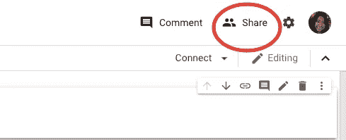
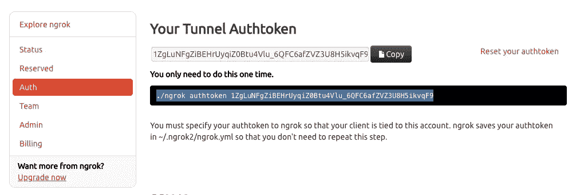
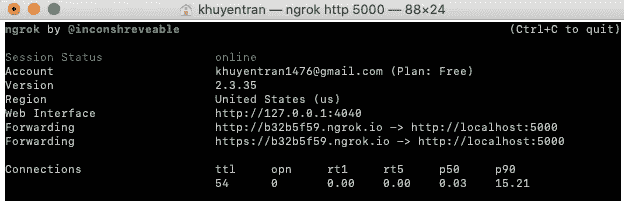

# 如何用 Ngrok 用 3 行代码分享你的 Jupyter 笔记本

> 原文：<https://towardsdatascience.com/how-to-share-your-jupyter-notebook-in-3-lines-of-code-with-ngrok-bfe1495a9c0c?source=collection_archive---------31----------------------->

## 想象一下，让你的朋友在远程机器上使用你的本地 Jupyter 笔记本

# 动机

您是否曾经想要与您的朋友共享您的 Jupyter 笔记本以协作完成某个项目，但却发现没有协作按钮？你不能只是复制粘贴你的 Jupyter 笔记本的链接，因为它是在本地机器上运行的。你希望有一种方法，你可以给你的朋友发送一个链接，这样你们俩就可以在同一个笔记本上工作了。如果一个人在笔记本上做了更改，另一个人也会看到该更改。



Google Colab 中的共享按钮

Google Colab 允许你分享你的笔记本。Jupyter 笔记本的分享按钮在哪里？在从 Jupyter 笔记本转向 Google Colab 进行协作之前，你可以考虑另一种选择:用 ngrok 为你的 Jupyter 笔记本创建**公共服务器**。


照片由[米米·蒂安](https://unsplash.com/@mimithian?utm_source=medium&utm_medium=referral)在 [Unsplash](https://unsplash.com?utm_source=medium&utm_medium=referral) 上拍摄

# Ngrok

ngrok 是什么？Ngrok 通过安全隧道将 NAT 和防火墙后面的本地服务器暴露给公共互联网。这意味着您可以将本地服务器提供给 web 服务器的端口。当您访问该 web 服务器时，您应该能够到达您指定的本地地址。在您的终端上使用 **3 行代码**，您将获得一个**您的 Jupyter 笔记本的公共 URL，该 URL 可用于共享**！

## 装置

从在这里安装 ngrok [开始](https://ngrok.com/download)。然后注册 ngrok 账号。注册后，你应该可以在这里获得你的隧道授权令牌[。](https://dashboard.ngrok.com/auth)



将 authtoken 的代码复制并粘贴到终端。一旦您将带有 authtoken 的计算机链接到此帐户，您就不需要在将来重复此操作。

接下来，通过更改 Jupyter 笔记本的配置，允许远程访问 Jupyter 笔记本

```
jupyter notebook --generate-config
```

您将看到 Jupyter 笔记本配置文件的链接地址。在我的机器中，这个链接是`/Users/khuyentran/.jupyter/jupyter_notebook_config.py`。复制那个地址。然后运行下面的代码

```
echo "c.NotebookApp.allow_remote_access = True" >> ~/.jupyter/jupyter_notebook_config.py
```

为了更加安全，请为您的 Jupyter 笔记本设置密码

```
jupyter notebook password
```

然后告诉 ngrok 你的 jupyter 笔记本在哪个端口运行。如果您的端口是 8888。类型:

```
./ngrok http 8888
```

您应该会看到下面的结果



点击链接 [http://b32b5f59.ngrok.io](http://b32b5f59.ngrok.io) 访问您隧道的公共 URL。

就是这样！现在，您应该能够复制和粘贴您生成的链接，并与您的朋友和同事分享它！确保告诉他们您访问笔记本的密码。

# 结论

恭喜你！您已经学习了如何共享您的 Jupyter 笔记本，以及如何在不同的机器上使用它。需要注意的一点是，由于这个公共 web 服务器连接到您的本地机器，如果您在本地机器上终止服务器，您的隧道的公共 URL 也将被终止。所以，如果你想让 Jupyter 笔记本在另一台机器上运行，请确保你的服务器正在运行。

最后但同样重要的是。在您的终端上运行以下命令行:

```
say "Thank you for reading this article"
```

我喜欢写一些基本的数据科学概念，并尝试不同的算法和数据科学工具。你可以通过 [LinkedIn](https://www.linkedin.com/in/khuyen-tran-1401/) 和 [Twitter](https://twitter.com/KhuyenTran16) 与我联系。

如果你想查看我写的所有文章的代码，请点击这里。在 Medium 上关注我，了解我的最新数据科学文章，例如:

[](/how-to-turn-a-dinosaur-dataset-into-a-circle-dataset-with-the-same-statistics-64136c2e2ca0) [## 恐龙和圆圈的数据集可以有相同的统计数据吗？

### 它们有相同的中位数和标准差，但它们是两个明显不同的数据集！

towardsdatascience.com](/how-to-turn-a-dinosaur-dataset-into-a-circle-dataset-with-the-same-statistics-64136c2e2ca0) [](/how-to-monitor-and-log-your-machine-learning-experiment-remotely-with-hyperdash-aa7106b15509) [## 如何使用 HyperDash 远程监控和记录您的机器学习实验

### 培训需要很长时间才能完成，但你需要去洗手间休息一下…

towardsdatascience.com](/how-to-monitor-and-log-your-machine-learning-experiment-remotely-with-hyperdash-aa7106b15509) [](/how-to-create-fake-data-with-faker-a835e5b7a9d9) [## 如何用 Faker 创建假数据

### 您可以收集数据或创建自己的数据

towards data science . com https://towards data science . com/cy thon-a-speed-up-tool-for-your-python-function-9bab 64364 bfd](/how-to-create-fake-data-with-faker-a835e5b7a9d9) [](/how-to-create-an-elegant-website-for-your-data-science-portfolio-in-10-minutes-577f77d1f693) [## 如何在 10 分钟内为您的数据科学产品组合创建一个优雅的网站

### 你需要做的就是编辑

towardsdatascience.com](/how-to-create-an-elegant-website-for-your-data-science-portfolio-in-10-minutes-577f77d1f693) [](/cython-a-speed-up-tool-for-your-python-function-9bab64364bfd) [## cy thon——Python 函数的加速工具

### 当调整你的算法得到小的改进时，你可能想用 Cython 获得额外的速度，一个…

towardsdatascience.com](/cython-a-speed-up-tool-for-your-python-function-9bab64364bfd)