# 如何显示熊猫数据框的所有列/行？

> 原文：<https://towardsdatascience.com/how-to-show-all-columns-rows-of-a-pandas-dataframe-c49d4507fcf?source=collection_archive---------0----------------------->

## 加:改变数据帧中数字的精度。


汉斯·雷尼尔斯在 [Unsplash](https://unsplash.com?utm_source=medium&utm_medium=referral) 拍摄的照片

(这个帖子的所有代码你可以在[我的 github](https://github.com/andryw/pandas_tips) 里找到)

大家好！在我的熊猫提示系列文章(上一篇文章是关于分组提示的)之后，我将解释如何显示熊猫数据帧的所有列和行。除此之外，我将解释如何显示数据帧中列表中的**所有值，并选择数据帧中数字**的**精度。所有东西都用同样的工具。**

在本教程中，我使用的是从[数据世界](https://data.world/studentoflife/imdb-top-250-lists-and-5000-or-so-data-records)下载的前 250 个 IMDB 电影数据集。数据库有 250 行和 37 列

# 问题:熊猫截断信息

有时，我读取一个有许多行或列的数据帧，当我在 Jupyter 中显示时，这些行和列被隐藏(在红色框中突出显示):

```
movies = pd.read_csv("data/IMDB_Top250movies2_OMDB_Detailed.csv")
movies
```


一些行和列是隐藏的(红框)

我知道它们被隐藏起来是为了避免显示太多的信息。但是有时候我想看所有的列和行！那么，如何把它们都打印出来呢？

我们可以在熊猫身上玩选项参数。让我们看看。

# 选择

Pandas 有选项配置，您可以更改数据框的显示设置(等等)。

你所需要做的就是选择你的选项(用一个字符串名)并获取/设置/重置它的值。这些函数接受正则表达式模式，所以如果您传递一个子串，它将工作(除非匹配多个选项)。

# 列

**display.max_columns** 选项控制要打印的列数。它接收一个 *int* 或 *None* (打印所有列):

```
pd.set_option('display.max_columns', None)
movies.head()
```

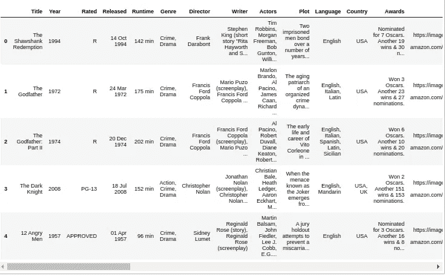

这些列不再隐藏。Jupyter 创建一个滚动条

你也可以使用字符串 *max_columns* 代替 *display.max_columns* (记住它接受一个正则表达式):

```
pd.set_option('max_columns', None)
```

传递一个数字而不是无:

```
pd.set_option('max_columns', 2)
movies.head()
```

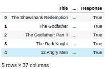

仅显示两列

要恢复默认值，您需要重置选项:

```
pd.reset_option(“max_columns”)
movies.head()
```

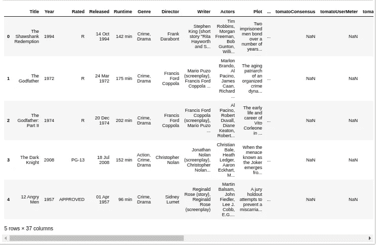

一些列再次被隐藏

## 列宽

您可以使用选项 **max_colwidth** 更改列宽。例如，*图的*列有许多字符，最初显示时被截断:

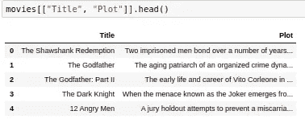

绘图列的某些文本被隐藏

您可以增加通过一个 *int* 的宽度(或设置为最大无通过):

```
pd.set_option(“max_colwidth”, None)
movies[[“Title”, “Plot”]].head()
```

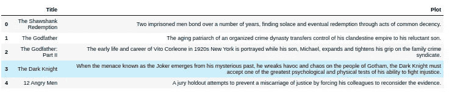

将显示绘图列的全部文本

# 行

要更改行数，您需要更改 **max_rows** 选项。

```
pd.set_option("max_columns", 2) #Showing only two columnspd.set_option("max_rows", None)
movies
```

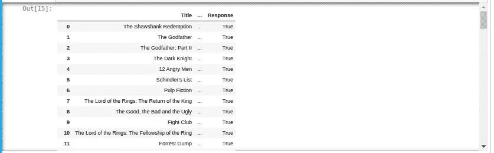

所有的行都被显示出来。Jupyter 折叠单元格并创建一个滚动条

与行相关，有两个设置: **max_rows** 和 **min_rows** 。当行数大于 *max_rows* 时，数据帧被截断，显示为 *min_rows* rows。

比如说。让我们再次打印电影数据帧以及默认值 *max_rows* 和 *min_rows* :

```
print("Default max_rows: {} and min_rows: {}".format(
pd.get_option("max_rows"), pd.get_option("min_rows")))movies
```

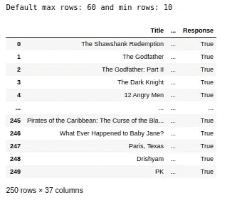

由于数据帧中的行数为 250(大于 *max_rows* 值 60)，因此显示 10 行( *min_rows* 值)，前 5 行和后 5 行。

如果我们将*最小行数*改为 2，它将只显示第一行和最后一行:

```
pd.set_option(“min_rows”, 2)
movies
```

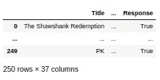

仅显示两行，第一行和最后一行

如果我们使用值低于 *max_rows* 值(60)的 *head* 命令，所有的行都会被显示。例如，使用值为 20 的*头*:

```
movies.head(20)
```

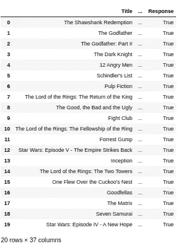

显示所有 20 行，因为该值小于 max_rows (60)

# 项目顺序

如果项目序列(列表)包含许多字符，也会被截断:

```
#Create "my_list" column and put a list of 100 values in each row
movies[‘my_list’] = [[1]*100] * 250 
movies.head()
```

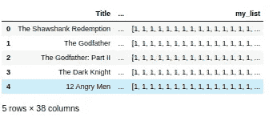

改变这种行为的选项是 **max_seq_items。**但是我们也必须改变**最大列宽**。首先，更改 *max_colwidth* (列表将被截断):

```
pd.set_option(“max_colwidth”, None)
movies.head()
```

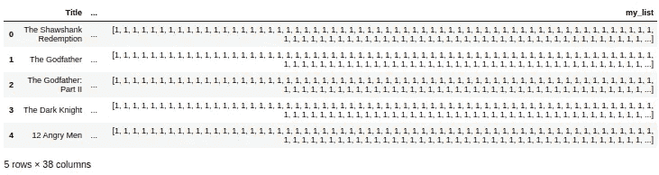

“我的列表”列已展开，但列表被截断

然后你改变*最大序列项*。

```
pd.set_option(“max_seq_item”, None)
movies.head()
```

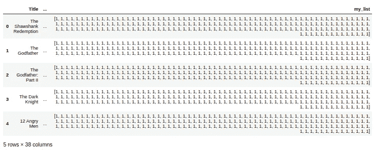

显示列表的所有值

# 额外收获:数字的精确性

另一个有用的选项是使用**精度**选项设置浮点精度——小数点后的位数。

```
#adding more decimal places to imdbRating column
movies[‘imdbRating’] = movies[‘imdbRating’] + 0.11111
movies[[‘imdbRating’]].head()
```

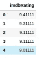

有 5 个小数位的数字

```
pd.set_option(‘precision’, 2)movies[[‘imdbRating’]].head()
```

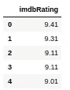

有两位小数的数字

**来源:**

*   [选项和设置— pandas 1.0.1 文档](https://pandas.pydata.org/pandas-docs/stable/user_guide/options.html)
*   [https://stack overflow . com/questions/19124601/pretty-print-an-entire-pandas-series-data frame](https://stackoverflow.com/questions/19124601/pretty-print-an-entire-pandas-series-dataframe)
*   [https://stack overflow . com/questions/52580111/how-do-I-set-the-column-width-when-using-pandas-data frame-to-html/52580495](https://stackoverflow.com/questions/52580111/how-do-i-set-the-column-width-when-using-pandas-dataframe-to-html/52580495)

***谢谢，随时添加您的评论***

IMDB top 250 中有一部巴西电影:*上帝之城*。很好看的电影=)