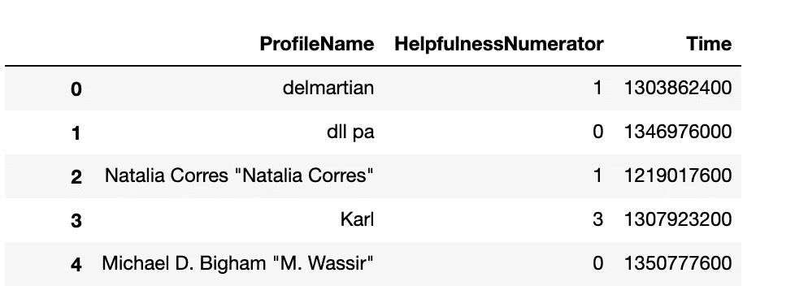
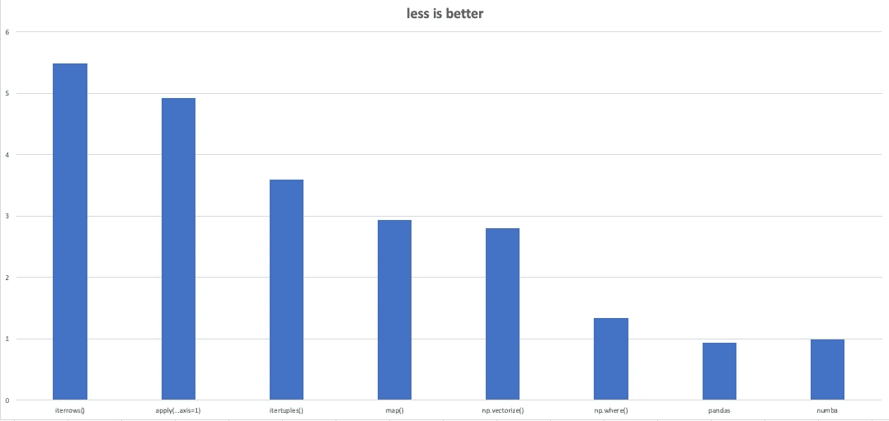
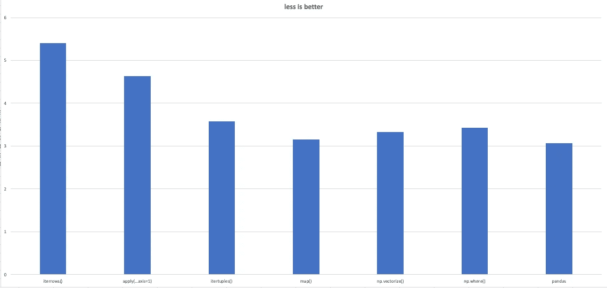

# 如何简单快捷地对熊猫数据帧进行操作

> 原文：<https://towardsdatascience.com/how-to-simply-make-an-operation-on-pandas-dataframe-faster-adaea5e41e96?source=collection_archive---------17----------------------->

## 在这篇文章中，我将介绍并评估不同的 python 方法，以便在 pandas 中运行相同的函数并创建新的列。这些方法将在数值和非数值运算中进行检查。


Marc Sendra Martorell 在 [Unsplash](https://unsplash.com?utm_source=medium&utm_medium=referral) 上拍摄的照片

如果你以前有过足够大的数据集，你就会知道有时一个简单的操作需要很多时间。有很多方法可以使熊猫数据帧上的操作更快。你可以使用像 multiprocessing，modin[ray]，cuDF，Dask，Spark 这样的库来完成这项工作。此外，您可以修改您的算法，以更快地执行任务。但是在寻求一个困难的解决方案之前，让我们看看有没有简单的方法来获得更高的速度和节省一些时间！

至于我的数据集，我用的是[T5 这个 T7 的一部分。它有两个数字列和一个文本列，由“HelpfulnessNumerator”列中的 0 和“ProfileName”列中的 NaN 组成。(数据集和所有笔记本都已经上传到了](https://www.kaggle.com/snap/amazon-fine-food-reviews) [**这个 Github**](https://github.com/MINIMALaq/FasterPandasOperation) 资源库中。)



# 数值运算

我想在不改变主函数的情况下简单地检查不同的方法。数字部分的函数是一个除法函数。

```
**def** divide(t,h):
    **if** h == 0:
        **return** np.nan
    **return** t/h
```

我在处理熊猫数据帧时学到的第一件事是 df.iterrows()

```
%%timeit
iterrows_divide = []
**for** index,row **in** df.iterrows():
    Time = row['Time']
    HelpfulnessNumerator = row['HelpfulnessNumerator']
    iterrows_divide.append(divide(Time,HelpfulnessNumerator))
5min 12s ± 31.1 s per loop (mean ± std. dev. of 7 runs, 1 loop each)
```

apply()方法是另一个选项:

```
%timeit df.apply(**lambda** row: divide(row['Time'],row['HelpfulnessNumerator']),axis = 1)1min 25s ± 4.88 s per loop (mean ± std. dev. of 7 runs, 1 loop each)
```

pandas 行操作中最好的选择是 itertuples()方法:

```
%%timeit
itertuples_divide = []
**for** _ **in** df.itertuples():
    Time = getattr(_,'Time')
    HelpfulnessNumerator = getattr(_,'HelpfulnessNumerator')
    itertuples_divide.append(divide(Time,HelpfulnessNumerator))4 s ± 238 ms per loop (mean ± std. dev. of 7 runs, 1 loop each)
```

大多数情况下，我们并不强制使用按行操作。但如果对你来说是必须的，df.itertuples()是最快的方法。

让我们试试 map()方法:

```
%timeit list(map(divide,df['Time'],df['HelpfulnessNumerator']))861 ms ± 22.9 ms per loop (mean ± std. dev. of 7 runs, 1 loop each)
```

让我们做一些(假的)numpy 矢量器()方法:

```
%timeit np.vectorize(divide)(df['Time'],df['HelpfulnessNumerator']) 636 ms ± 24.6 ms per loop (mean ± std. dev. of 7 runs, 1 loop each)
```

我们可以对(实)numpy 矢量器使用 numpy where()方法:

```
%timeit np.where(df['HelpfulnessNumerator'] == 0 , 0 , df['Time']/df['HelpfulnessNumerator'])21.6 ms ± 329 µs per loop (mean ± std. dev. of 7 runs, 10 loops each)
```

正如你所看到的，我们不能在任何地方使用 np.where()方法。但是真的很快。让我们稍微改变一下函数:

```
**def** modified_divide(t,h):
    **return** t/h
```

现在我们可以在 np.where()中使用这个函数:

```
%timeit np.where(df['HelpfulnessNumerator'] == 0 , 0 , modified_divide(df['Time'],df['HelpfulnessNumerator']))21.4 ms ± 200 µs per loop (mean ± std. dev. of 7 runs, 10 loops each)
```

此外，我们可以直接用 pandas 操作这个函数:

```
%timeit modified_divide(df['Time'],df['HelpfulnessNumerator'])8.75 ms ± 114 µs per loop (mean ± std. dev. of 7 runs, 100 loops each)
```

还有其他选择吗？绝对是的。如果你能用 Python 写代码，你就能用 Fortran 写代码。我在 Jupyter 笔记本里为 Fortran magic 做了一个 [**笔记本**](https://github.com/MINIMALaq/FasterPandasOperation/blob/master/FortranMagic.ipynb) 。举个例子，看看这个:

```
%%fortran

subroutine fortran_divide(x, y, z)
    real, intent(**in**) :: x,y
    real, intent(out) :: z

    z = x/y
    IF ( 0 .EQ. Y ) THEN 
         Z = 0
    END IF

end subroutine fortran_divide%timeit np.vectorize(fortran_divide)(df['Time'],df['HelpfulnessNumerator'])669 ms ± 22.8 ms per loop (mean ± std. dev. of 7 runs, 1 loop each)
```

我们可以用 numba。Numba 是一个 python 库，我们可以非常直接地使用它。它比 np.where()快 2 倍，而且这里没有 np.where()的一些限制:

```
**from** **numba** **import** njit

@njit()
**def** divide(t, h):
    res = np.empty(t.shape)
    **for** i **in** range(len(t)):
        **if** h[i] != 0:
            res[i] = t[i] / h[i]
        **else**:
            res[i] = 0
    **return** res

%timeit divide(df['Time'].values, df['HelpfulnessNumerator'].value9.99 ms ± 133 µs per loop (mean ± std. dev. of 7 runs, 1 loop each)
```

numba 和 Fortran 都可以选择使用多处理的能力。这取决于数据帧的大小和操作。有时候我们可以使用多重处理来获得更快的速度，而有时候 numba 和 Fortran 中的多重处理对我们没有太大帮助。



每种方法的对数时间。

> 总之，不要在 pandas 数据帧上使用逐行操作。如果是必须的，可以使用 df.itertuples()。永远不要使用 df.iterrows()和 df.apply(…，axis=1)。
> 
> **大部分时候可以用 np.where()搭配一些小技巧。这是最好的选择。但是如果不能使用，可以在进行数值运算的同时使用 np.vectorize()。**
> 
> **如果我们有一个很大的数据集，有一些其他的选项可以帮助我们，比如 numba 和 Fortran magics，值得花一些时间去学习和使用它们。**
> 
> 另外，有时候熊猫本身也支持我们想要的。先查熊猫比较好。:)

# **非数值运算**

我将定义一个简单的函数来评估不同的方法。该函数将在每条记录的开头添加一个短语。

```
**def** edit_name(profileName):
    **if** profileName != profileName:
        **return** np.nan
    **return** 'Name is **{}**'.format(profileName)
```

使用 df.iterrows()很简单。但是它太慢了:

```
%%timeit
iterrows_name=[]
**for** index,row **in** df.iterrows():
    name = edit_name(row['ProfileName'])
    iterrows_name.append(name)4min 15s ± 2.45 s per loop (mean ± std. dev. of 7 runs, 1 loop each)
```

使用逐行应用方法():

```
%timeit df.apply(**lambda** row: edit_name(row['ProfileName']),axis = 1)43.2 s ± 687 ms per loop (mean ± std. dev. of 7 runs, 1 loop each)
```

使用 itertuples()方法:

```
%%timeit
itertuples_name=[]
**for** _ **in** df.itertuples():
    name = edit_name(getattr(_,'ProfileName'))
    itertuples_name.append(name)3.78 s ± 128 ms per loop (mean ± std. dev. of 7 runs, 1 loop each)
```

另一种使用 apply()的方法:

```
%timeit df['ProfileName'].apply(**lambda** x: edit_name(x))1.58 s ± 86.5 ms per loop (mean ± std. dev. of 7 runs, 1 loop each)
```

让我们使用 map()方法:

```
%timeit list(map(edit_name,df['ProfileName']))1.41 s ± 65.5 ms per loop (mean ± std. dev. of 7 runs, 1 loop each)
```

哎呀，np.vectorizer 没有我们预期的那么快。是的，因为运算不是数值的。

```
%timeit np.vectorize(edit_name)(df['ProfileName'])2.16 s ± 155 ms per loop (mean ± std. dev. of 7 runs, 1 loop each)
```

有一只[熊猫。可以非常快速地完成有限任务的 Series.map](https://pandas.pydata.org/pandas-docs/stable/reference/api/pandas.Series.map.html) 。它可以自己处理 NaN 值。例如，让我们更改函数并查看结果:

```
**def** modified_edit_name(profileName):
    **return** 'Name is **{}**'.format(profileName)
```

我们可以在 np.where()中轻松处理 NaN 值:

```
%timeit np.where(df['ProfileName'] == np.nan,np.nan, modified_edit_name(df['ProfileName']))2.69 s ± 98.3 ms per loop (mean ± std. dev. of 7 runs, 1 loop each)
```

熊猫系列地图方法:

```
%timeit df['ProfileName'].map('Name is **{}**'.format, na_action='ignore')1.16 s ± 50.6 ms per loop (mean ± std. dev. of 7 runs, 1 loop each)
```



每种方法的对数时间。

> **说到文字，我更喜欢用 map()，因为它速度快。如果我必须进行行操作，我将使用 df.itertuples()。**

正如我所说的，在这个简单的优化之后，我们可以在应用多重处理和使用其他库之后对 pandas DataFrame 进行更快的操作。

关于 numba 和 Fortran magic 的更多信息，请看这里:

 [## 示例- numba 0.15.1 文档

### 假设我们想用 Python 写一个图像处理函数。下面是它可能的样子。Numba 实际上产生了两个…

numba.pydata.org](http://numba.pydata.org/numba-doc/0.15.1/examples.html) [](https://github.com/mgaitan/fortran_magic) [## mgaitan/fortran_magic

### 使用 f2py，用 Fortran 代码编译和导入单元格中的符号。单元格的内容被写入 a .f90…

github.com](https://github.com/mgaitan/fortran_magic) [](http://arogozhnikov.github.io/2015/11/29/using-fortran-from-python.html) [## 从 python 使用 fortran

### 我喜欢 numpy(python 中数值计算的核心库)，但在一些非常罕见的情况下，我需要实现…

arogozhnikov.github.io](http://arogozhnikov.github.io/2015/11/29/using-fortran-from-python.html)