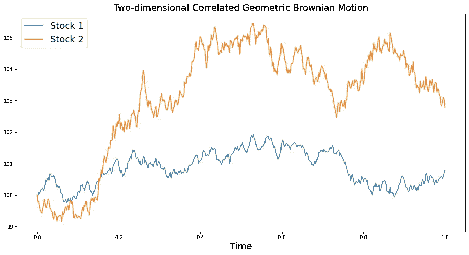

# 如何用 Python 模拟金融投资组合

> 原文：<https://towardsdatascience.com/how-to-simulate-financial-portfolios-with-python-d0dc4b52a278?source=collection_archive---------19----------------------->

克里斯·利维拉尼在 [Unsplash](https://unsplash.com?utm_source=medium&utm_medium=referral) 上的照片

## 多维几何布朗运动的一个应用

***来自《走向数据科学》编辑的提示:*** *虽然我们允许独立作者根据我们的* [*规则和指导方针*](/questions-96667b06af5) *发表文章，但我们并不认可每个作者的贡献。你不应该在没有寻求专业建议的情况下依赖一个作者的作品。详见我们的* [*读者术语*](/readers-terms-b5d780a700a4) *。*

在一个日益全球化的世界里，金融市场不断受到越来越多因素的影响:新闻、政治、体育……尤其是市场本身。许多科学家正试图对金融市场内外事件之间的这些相互作用进行抽象和建模。然而，在定量金融领域，很难开发出一个代表实际市场的模型。然而，需要一个有价值的市场模拟模型来解决以下问题:

*   期权定价；
*   投资组合估价；
*   对冲策略；
*   敏感性分析；
*   不确定的未来现金流计算。

简而言之，高效地模拟尽可能多的场景，有助于我们减少市场不确定性带来的不便。下面我介绍一个强大的方法来实现一个简单而有价值的市场模拟模型。

单只股票的价格趋势可以被塑造成一个随机过程，称为几何布朗运动(GBM)模型。然而，对于由多个公司股票组成的投资组合，我们需要扩展 GBM 模型。本文旨在使用多维几何布朗运动模型对投资组合中的一个或多个股票价格进行建模。

## **总结**

1.  介绍
2.  理论和算法
3.  用 Python 实现
4.  投资组合模拟示例
5.  结论

## 介绍

尽管我们可以非常精确地计算出子弹的轨迹，但预测市场趋势似乎是不可能的。至少到目前为止。

这是因为金融市场的随机特性使其成为复杂系统的完美例子。事实上，复杂系统有一个本质上难以塑造的行为，因为它们各部分之间的相互作用(在物理数学意义上)。在复杂系统中，部件的集体行为会导致特征的出现，而这些特征很难从单个部件的属性中推断出来，甚至根本无法推断出来。

> "整体是部分之外的东西."

金融市场的复杂性源于其各部分之间的高度相关性。相互作用的非线性本质反映在因果过程中，直到产生不可预测的事件。由于这个原因，他们的行动之间的相互关系的性质和动态特征是金融市场复杂性的关键方面。

然后，重要的是建立一个连贯的和尽可能现实的市场模型，以便对这一特征的研究可以改进经济预测和复合金融规模的形成，如股票投资组合。

## **理论和算法**

*一维*

几何布朗运动是一个连续时间的随机过程。更严格地说，几何布朗运动过程是通过以下形式的随机微分方程(SDE)来规定的

其中 *W* 是布朗运动，*和σ是分别代表百分比漂移和百分比波动的常数。*

上述 SDE 有解析解

这提供了一个简单的递归过程，用于在时间离散化的每个瞬间模拟 *S* 的值:

对于 *n = 0，1，…，N -1* ，与 *Z* 独立的标准法线。

*多个维度*

多维几何布朗运动可以通过一个随机微分方程系统来描述。假设您想要模拟一个由 *d* 支股票组成的投资组合，系统采用以下形式

用 *i = 1，.。。*

股票之间的相关信息包含在布朗运动中，事实上我们有

如果我们通过设置定义一个*d×d*矩阵σ

在一个方便的术语滥用中，我们称σ为协方差矩阵；尽管协方差由下式给出

回想一下，具有均值 *0* 和协方差矩阵σ的布朗运动可以表示为 *AW* ，其中 *W* 为标准布朗运动，而 *A* 为

我们可以应用这个性质，把 SDE 的系统改写成

这种表示导致了用于模拟多维 GBM 的简单算法:

对于 *i = 1，.。。，d* 和 *n = 0，…，N -1* ，其中 *Z* 为标准正态随机向量。

*注*:选择 *A* 为σ的乔莱斯基因子，可以减少每一步所需的乘法和加法的次数。

有关更多详细信息，请参见参考文献[1]。

## **用 Python 实现**

我们使用 numpy 包及其矢量化属性来使程序更紧凑、更易于阅读、维护和更快执行。

我们定义一个函数来模拟给定参数的多维 GBM。除了模型参数之外，我们还选择插入一个与随机化种子相关的参数，以便能够以相同的结果重复模拟。

我们构建一个包含所有模拟股票路径的大小(股票数量，增量数量)数组。

## **投资组合模拟示例**

让我们从展示二维情况的例子开始。对于这种情况，假设我们想从时间序列中估计模型参数。

一个简单的方法是使用一个名为 *pandas_datareader* (这里是[文档的链接)的库。](https://pandas-datareader.readthedocs.io/en/latest/)

我们选择任意两只股票，例如英特尔(INTC)和 AMD。

因此，我们有熊猫数据框架形式的历史数据。

为了估计𝜇、𝜎和𝐶𝑜𝑣的参数，我们计算了调整后收盘价的对数收益。

模拟获得的投资组合的 2 支股票与真实数据估计参数。

对于有超过 2 只股票的多维情况，我们选择通过随机化参数来举例。特别是，我们从相关矩阵开始创建协方差矩阵，因为它们必须符合特定的数学条件。我们记得这两个矩阵之间的关系由下面的公式描述

为了应用乔莱斯基分解，协方差矩阵必须是对称正定的。

因此，让我们利用 scipy 库获得一个随机相关矩阵，给定一个特征值向量。

用随机参数对 10 只股票的投资组合进行模拟。

## 结论

由于几何布朗运动的推广，本文提供了一个算法来模拟一只或多只股票，并强调了多维相关性的重要性。上面的例子显示了用 Python 实现一个在各种金融应用中有用的数学模型是多么简单。很明显，从这个基本模型开始，通过引入进一步的细节，例如与时间相关的参数，可以使模型越来越复杂。

点击[此处](https://github.com/richard303d/MediumNotebooks/blob/main/How_to_simulate_financial_portfolios_with_Python.ipynb)查看完整代码。感谢阅读，希望这篇文章对你有所帮助！

## 参考

[1] P .格拉斯曼，*金融工程中的蒙特卡罗方法*。第 53 卷(2013)，施普林格科学&商业媒体。