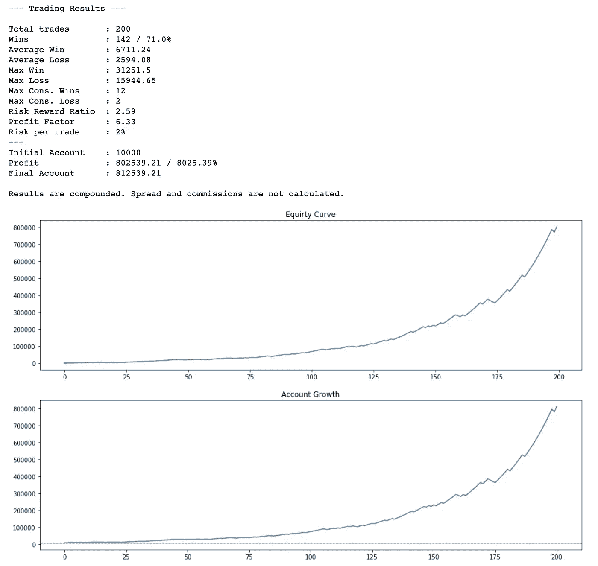

# 如何用 Python 模拟交易

> 原文：<https://towardsdatascience.com/how-to-simulate-trades-in-python-7e613c83fd5a?source=collection_archive---------11----------------------->

我们总是看到，所谓的交易者声称他们有超过 70%的胜率，他们的风险回报比超过 1:2(风险 1%，盈利 2%)。你觉得可能吗？让我们来了解一下！


作者图片

> 我有 70%的胜率，风险回报比为 1:2

ROFL！你确定你没有错过高中的数学课(可能是小学？！)?请记住，在 2019 年，对冲基金的平均回报率为 6%。[这里是来源](https://www.marketwatch.com/story/hedge-fund-returns-badly-lagged-behind-the-stock-market-in-2019-2020-01-02)的链接。

**现在让我们开始谈论 Python。**

我们只需要两个库

```
import numpy as np
import matplotlib.pyplot as plt
```

现在我们需要写一个函数来模拟交易。当然不是真的。

```
def simulate(account_size, total_trades, risk_per_trade, win_rate, risk_reward):
    account = account_size
    accounts = [account]
    profits = []
    loss = []
    wins = []
    total_win = 0
    max_con_l = 0
    max_con_w = 0
    con_l = 0
    con_w = 0
    pre = 0
    rnd = list(np.round(np.random.uniform(1, 101, total_trades), 2))
    for i in range(len(rnd)):
        r = rnd[i]
        win = r <= win_rate
        risk = -np.round(account * risk_per_trade / 100, 2)
        profit_per_trade = abs(risk) * risk_reward
        profit = profit_per_trade if win else risk
        profits.append(profit)
        account += profit
        accounts.append(account)
        if profit > 0:
            total_win += 1
            wins.append(profit)
            con_l = 0
            if pre == 1:
                con_w += 1
                if con_w > max_con_w:
                    max_con_w = con_w
            pre = 1
        else: # 0 is also a loss (spread + commissions)
            loss.append(abs(profit))
            con_w = 0
            if pre == -1:
                con_l += 1
                if con_l > max_con_l:
                    max_con_l = con_l
            pre = -1
    avg_win = np.mean(wins)
    avg_loss = np.mean(loss)
    max_win = np.max(wins)
    max_loss = np.max(loss)
    win_r = np.round(total_win / total_trades * 100, 2)
    rrr = np.round(avg_win / avg_loss, 2)
    profit_factor = np.round(np.sum(wins) / np.sum(loss), 2)
    net_profits = np.cumsum(profits)
    gain = np.round(accounts[-1] - account_size, 2)
    growth_rate = np.round((accounts[-1] - account_size) / account_size * 100, 2)
    print("--- Trading Results ---\n")
    print("Total trades       : {}".format(total_trades))
    print("Wins               : {} / {}%".format(total_win, win_r))
    print("Average Win        : {}".format(np.round(avg_win, 2)))
    print("Average Loss       : {}".format(np.round(avg_loss, 2)))
    print("Max Win            : {}".format(np.round(max_win, 2)))
    print("Max Loss           : {}".format(np.round(max_loss, 2)))
    print("Max Cons. Wins     : {}".format(max_con_w))
    print("Max Cons. Loss     : {}".format(max_con_l))
    print("Risk Reward Ratio  : {}".format(rrr))
    print("Profit Factor      : {}".format(profit_factor))
    print("Risk per trade     : {}%".format(risk_per_trade))
    print("---")
    print("Initial Account    : {}".format(account_size))
    print("Profit             : {} / {}%".format(gain, growth_rate))
    print("Final Account      : {}".format(np.round(account, 2)))
    print()
    print("Results are compounded. Spread and commissions are not calculated.")
    fig, ax = plt.subplots(2, 1, figsize=(16, 10))
    ax[0].plot(net_profits)
    ax[1].plot(accounts)
    ax[1].axhline(account_size, color="#000000", ls="-.", linewidth=0.5)
    ax[0].set_title("Equirty Curve")
    ax[1].set_title("Account Growth")
    plt.show()
```

让我们来定义一下这个人的说法

```
account_size = 10000
total_trades = 200 #trades per year maybe?
risk_per_trade = 2 #risk 2% of your account per trade
win_rate = 70 # in percentage
risk_reward = 2 # risk 1% profit 2%
```

OMG！这太疯狂了。如果你准备好了，我们就跑吧？:)

```
simulate(account_size, total_trades, risk_per_trade, win_rate, risk_reward)
```

**奥斯卡颁给了这个家伙！！！！**



他每年能赚 80% 25%还想卖给你一个产品？！加油！！！！

ok；现在让我们试着更现实一点。我将使用以下参数:

```
account_size = 10000
total_trades = 200 #trades per year maybe?
risk_per_trade = 2 #risk 2% of your account per trade
win_rate = 52
risk_reward = 1.4
```

结果呢


即使有 52%的胜率和 1.4 的风险回报比，每年也能赚 193%！然而，这并不容易。

# 结论

请不要再相信那些所谓的交易者了。大多数社交媒体交易者都是骗子。他们只是想卖给你一个梦想和他们所谓的圣杯产品。没有圣杯，你也不需要 70%的胜率。

***免责声明***

我不是专业的财务顾问。这篇文章和代码，分享仅用于教育目的，而不是财务建议。你要对自己的输赢负责。

*本文的全部代码可以在这个资源库中找到:*

[](https://github.com/atillayurtseven/TradeSimulation) [## atillayrutten/贸易模拟

### 如何用 Python 模拟交易？通过创建一个关于…的帐户，为培训/贸易模拟发展做出贡献

github.com](https://github.com/atillayurtseven/TradeSimulation) 

**啊也；记得在以下社交渠道关注我:**

[中型](https://medium.com/@atillayurtseven)
[推特](https://twitter.com/atillayurtseven)
[YouTube！](https://youtube.com/AtillaYurtseven)
[交易视图](https://www.tradingview.com/u/AtillaYurtseven/)

直到下次；保持安全，交易安全！！！

图片来自:[https://hacker noon . com/algo-trading-for-dummies-implementing-an-actual-trading-strategy-part-4-acec 5543052 b](https://hackernoon.com/algo-trading-for-dummies-implementing-an-actual-trading-strategy-part-4-acec5543052b)

阿蒂拉·尤尔特塞文

***注来自《走向数据科学》的编辑:*** *虽然我们允许独立作者根据我们的* [*规则和指导方针*](/questions-96667b06af5) *发表文章，但我们不认可每个作者的贡献。你不应该在没有寻求专业建议的情况下依赖一个作者的作品。详见我们的* [*读者术语*](/readers-terms-b5d780a700a4) *。*