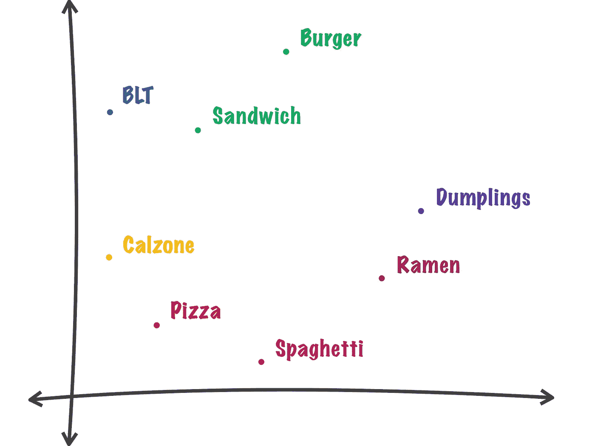
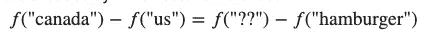
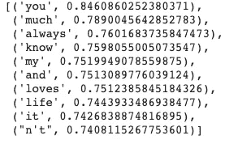
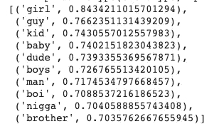
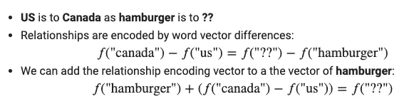
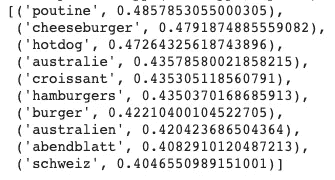
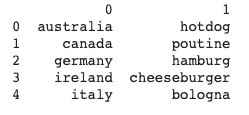
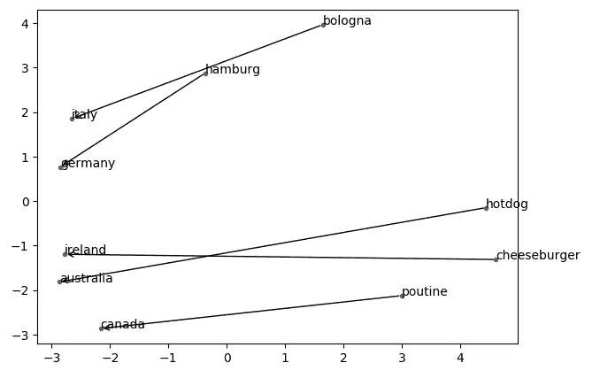

# 如何用 Word2Vec 解决类比问题

> 原文：<https://towardsdatascience.com/how-to-solve-analogies-with-word2vec-6ebaf2354009?source=collection_archive---------11----------------------->

## 美国之于加拿大，就像汉堡之于 _？

# Word2vec 是什么？

为了让机器学习算法理解单词，使用单词嵌入将单词映射到实数的向量。有各种各样的单词嵌入模型，word2vec 就是其中之一。

简而言之，word2vec 是一组用于产生单词嵌入的相关模型。这些模型被训练来构建单词的语言上下文。Word2vec 采用大型文本语料库并产生一个向量空间，其中**将语料库中的每个唯一单词分配给空间中相应的向量。**

但是单词向量在向量空间中是如何定位的呢？它们被定位成使得在语料库中**共享共同上下文的单词在空间中彼此靠近**。



从[怀特哈特学校](https://whitehat-school.com/tendencias-seo-para-2019-word-vector)取得

为了理解 word2vec 是如何工作的，让我们探索一些可以使用 word2vec 的方法，比如寻找单词之间的相似性或解决类似的问题



# 加载数据和模型

我们将使用来自[手套](https://nlp.stanford.edu/projects/glove/)的预训练单词向量。我们对包含 2B 推文、27B 令牌和 200d 向量的 Twitter 数据集特别感兴趣。数据可以在这里下载[。我们使用](http://nlp.stanford.edu/data/glove.twitter.27B.zip) [Gensim](https://radimrehurek.com/gensim/models/word2vec.html) 将手套向量转换成 word2vec，然后使用 KeyedVectors 加载 word2vec 格式的向量。

# 查找最相似的单词

现在我们用`model.most_similar()`来寻找前 N 个最相似的单词。积极的词语对相似性有积极的贡献。负面词汇对相似性有负面影响，或者换句话说，对差异有影响。让我们测试一下这个模型！

找出与“爱”最相似的单词

```
model.most_similar(positive=['love'])
```



“女孩”怎么样？

```
model.most_similar(positive=['girl'])
```

。我们不妨查一下和‘男孩’类似的词

```
model.most_similar(positive=['boy'])
```



嗯。那么‘男孩’和‘男人’在相似的词上有区别吗

```
model.most_similar(positive=['man'])
```


“男孩”变成“男人”似乎有明显的不同

# 解决类比

单词嵌入方法还能够捕获单词之间的多个不同程度的相似性。语义模式可以使用向量算法来复制。因此，我们也可以使用 word2vec 来解决类比问题。如果美国有汉堡包，加拿大有什么食物？



结果似乎显示了加拿大流行的各种食物。来自加拿大的读者可以确认这些热门词汇是否合理。让我们用一个名为`analogy().`的函数再探索几个国家。这次，我们只为每个类比返回一个最上面的相似单词。



既然可视化很好，让我们创建一个国家和它们相应的食物之间的地图。我们使用主成分分析将数据的维数降低到 2。



在这张地图上，国家之间的距离显示了在二维空间中哪些国家彼此更接近。箭头表示国家和食物之间的关系。

# 结论

恭喜你！你已经学习了什么是 word2vec，以及如何用 word2Vec 寻找单词之间的相似之处。看到 word2vec 的强大，你可能会想:“这种方法怎么能工作得这么好？”

我们知道，word2vec 对象函数导致出现在相似上下文中的单词具有相似的嵌入。但有趣的是，是什么让 word2vec 框架中的单词嵌入学习如此有效却知之甚少。无论是什么原因使这种嵌入成功，我希望您理解它的功能，并利用这个强大的工具进行文本分析。我鼓励您使用这个数据集或您选择的数据集来创建 word2vec 的其他类比。

在 [this Github repo](https://github.com/khuyentran1401/Data-science/blob/master/nlp/word2vec.ipynb) 中，您可以随意使用本文的代码。

我喜欢写一些基本的数据科学概念，并尝试不同的算法和数据科学工具。你可以通过 [LinkedIn](https://www.linkedin.com/in/khuyen-tran-1401/) 和 [Twitter](https://twitter.com/KhuyenTran16) 与我联系。

如果你想查看我写的所有文章的代码，请点击这里。在 Medium 上关注我，了解我的最新数据科学文章，例如:

[](/how-to-match-two-people-with-python-7583b51ff3f9) [## 如何找到和 Python 很好的搭配

### 给定个人偏好，如何匹配使得总偏好最大化？

towardsdatascience.com](/how-to-match-two-people-with-python-7583b51ff3f9) [](/dictionary-as-an-alternative-to-if-else-76fe57a1e4af) [## 字典作为 If-Else 的替代

### 使用字典创建一个更清晰的 If-Else 函数代码

towardsdatascience.com](/dictionary-as-an-alternative-to-if-else-76fe57a1e4af) [](/choose-stocks-to-invest-with-python-584892e3ad22) [## 用 Python 选择要投资的股票

### 您计划在未来 3 年投资几只股票，每只股票的每一美元都有不同的预期回报…

towardsdatascience.com](/choose-stocks-to-invest-with-python-584892e3ad22) [](/maximize-your-productivity-with-python-6110004b45f7) [## 使用 Python 最大化您的生产力

### 你创建了一个待办事项清单来提高效率，但最终却把时间浪费在了不重要的任务上。如果你能创造…

towardsdatascience.com](/maximize-your-productivity-with-python-6110004b45f7) [](/boost-your-efficiency-with-these-6-numpy-tricks-29ca2fe81ecd) [## 用这 6 个小窍门提高你的效率

### 并控制您的阵列

towardsdatascience.com](/boost-your-efficiency-with-these-6-numpy-tricks-29ca2fe81ecd) 

# 参考

*Word2vec。*维基百科。【https://en.wikipedia.org/wiki/Word2vec 号