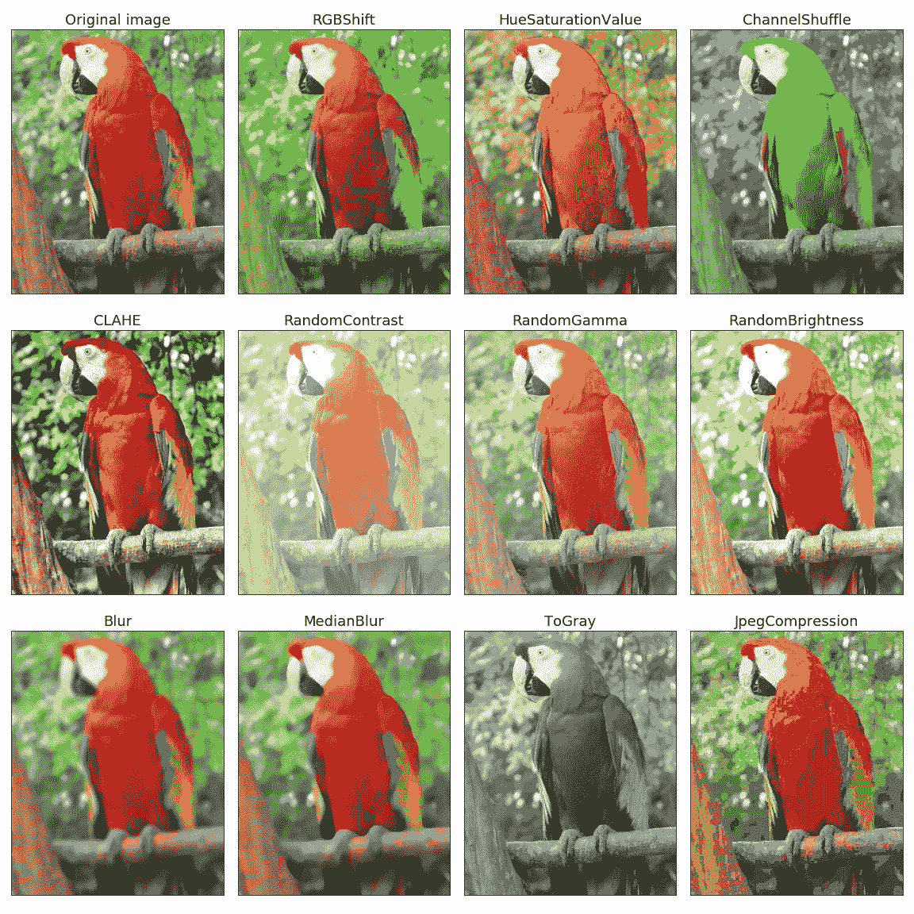

# 如何解决编码问题

> 原文：<https://towardsdatascience.com/how-to-solve-coding-problems-e86944c5bfdf?source=collection_archive---------17----------------------->

Daria Nepriakhina 在 [Unsplash](https://unsplash.com?utm_source=medium&utm_medium=referral) 上拍摄的照片

## 工作数据科学家的实际问题解决策略

曾经写过的每一行代码最终都是为了一个目的:解决问题。无论你做什么，你都是在同时解决几个方面的问题。

一个小的一行程序解决了一个让函数工作的问题。数据处理管道需要该函数。该管道被集成到一个平台，该平台为其用户实现了机器学习驱动的解决方案。

问题无处不在。它们的规模和影响可能不同，但解决问题的一般策略是相同的。

作为一名工程师、开发人员或数据科学家，有效地解决问题真的可以提高你的成绩，让你领先于你的同行。有些人经过多年的练习可以本能地做到这一点，有些人则需要有意识地努力去学习。然而，无论你是谁，你都可以并且*你必须*提高你解决问题的技巧。

有了研究级数学的背景，我有机会练习解决问题并观察过程。令人惊讶的是，这不是你每次都要即兴创作的东西。相反，

> 一个成功的问题解决者有几个标准的工具和一个总的计划，并随时调整。

在这篇文章中，我的目标是给出这些工具的一个概述，并使用它们来创建一个可以随时遵循的过程。为了使情况变得现实，让我们将自己置于以下场景中:我们是深度学习工程师，正在研究对象检测模型。我们的数据有限，所以需要为*图像增强*提供一个解决方案。

图像放大。来源:[相册](https://github.com/albumentations-team/albumentations)自述文件

增强是通过应用随机变换(如裁剪、模糊、亮度变化等)从可用图像生成新数据的过程。请看上面的图片，它来自 awesome[albuminations](https://github.com/albumentations-team/albumentations)库的自述文件。

你需要在下周之前发布这个特性，所以你需要马上开始工作。如何处理*问题*？

(作为一名数学家，我的思维过程深受乔治·波利亚的《如何解决》一书的影响。虽然数学问题不同于现实生活中的编码问题，但这是任何希望解决问题的人的必读之作。)

照片由[新闻社](https://unsplash.com/@olloweb?utm_source=medium&utm_medium=referral)在 [Unsplash](https://unsplash.com?utm_source=medium&utm_medium=referral) 上追踪

# 步骤 0:理解问题

在试图解决你脑海中的任何问题之前，有一些问题需要回答。没有正确理解一些细节会导致浪费时间。你肯定不想这么做。例如，明确以下几点是有好处的。

*   **问题的规模有多大？**在我们的图像增强示例中，您是否需要在生产中每秒处理数千张图像，或者只是让您尝试一些方法？如果需要生产级解决方案，您应该提前意识到这一点。
*   其他人会使用你的解决方案吗？如果人们打算广泛地使用你的代码，必须在代码质量和文档方面投入大量的精力。另一方面，如果这只是供您使用，就没有必要在这方面做太多工作。(我已经看到有人不同意我的观点:)然而，我坚信应该尽量减少工作量。所以，如果你只需要快速尝试一个想法和实验，请放心*而不是*考虑代码质量。)
*   **您需要一般解决方案还是特殊解决方案？许多时间会被浪费在实现没人会用到的功能上，包括你自己。在我们的例子中，您需要广泛的图像增强方法，还是只需要垂直和水平翻转？在后一种情况下，预先翻转图像并将其添加到训练集中也是可行的，这需要最少的工作。**

衡量你理解程度的一个很好的标准是你解释和与他人讨论问题的能力。讨论也是发现意想不到的方法和边缘案例的好方法。

当您理解了您的约束并有了一个稍微精确的问题规范时，就该开始工作了。

# 第一步。有没有现成的解决方案？

你必须做的第一件事就是寻找现有的解决方案。除非你正在挑战人类知识的极限，否则其他人已经遇到了这个问题，创建了一个关于堆栈溢出的线程，并可能围绕它编写了一个开源库。

利用这一点。使用成熟的工具，而不是创建自己的工具，有几个好处。

*   你节省了大量的时间和工作。在时间紧迫的情况下，这一点至关重要。(我的一个老师曾经讽刺地说“你可以用两个月的工作节省一个小时的谷歌搜索”。完全正确。)
*   **既定的工具更有可能是正确的。**开源工具不断得到社区的验证和检查。因此，它们不太可能包含 bug。(当然，这不是保证。)
*   **更少的代码供你维护。**同样，我们应该一直努力降低复杂度，最好是代码量。如果你使用外部工具，你就不用担心它的维护，这是一个很大的好处。每一行代码都有隐藏的维护成本，以后再支付。(往往是最不方便的时候。)

初级开发人员和数据科学家经常忽略这些，更喜欢从头开始编写所有东西。(我当然有，但很快就学会了更好地了解。)我见过最极端的案例是一个开发者，他自己写的深度学习框架。你应该**永远不要**这样做，除非你是一个深度学习研究者，并且你知道如何比现有的框架做得更好。

当然，并不是所有的问题都需要一个完整的框架，也许你只是在寻找一个命令行程序。寻找现有的解决方案肯定是有益的，尽管在这种情况下你需要小心。如果您花时间去理解它是如何工作的以及为什么工作，那么从堆栈溢出中查找和使用代码片段是很好的。不这样做可能会导致不愉快的调试会话，甚至在最坏的情况下导致严重的安全漏洞。

 [## 为什么堆栈溢出的代码片段会破坏您的项目

### 您会惊讶地发现，许多最常见的解决方案都包含安全漏洞

medium.com](https://medium.com/better-programming/why-code-snippets-from-stack-overflow-can-break-your-project-ced579a48ddb) 

对于这些较小的问题，寻找现有的解决方案包括浏览教程和最佳实践。总的来说，在无情的实用主义和盒子外面的思维之间有一个平衡。当你以通常的方式实现某个东西时，你是在为将要使用和维护这段代码的开发人员做一件好事。(往往包括你。)

## 有一个现有的解决方案。接下来呢？

假设在您为数据预处理管道提供图像增强的道路上，您遵循了我的建议，寻找现有的解决方案，并找到了令人敬畏的[album ations](https://github.com/albumentations-team/albumentations)库。太好了！接下来呢？

一如既往，需要考虑的事情范围很广。不幸的是，仅仅因为您已经确定了一个可能是潜在解决方案的外部工具，并不意味着它将适合您的目的。

*   它工作正常吗？是否得到了适当的支持？有一件事比不使用外部代码更糟糕:使用有 bug 且未经维护的外部代码。如果一个项目没有被很好地记录并且没有被维护，你应该避免它。
    对于较小的问题，答案通常可以在堆栈溢出中找到，而*运行良好的*部分是必不可少的。(见上面我链接的帖子。)
*   **是直接适应吗？**例如，如果您使用的图像处理库与[相册](https://github.com/albumentations-team/albumentations)不兼容，那么您必须做额外的工作。有时，这可能太多，你必须寻找另一种解决方案。
*   **性能是否足够？**如果您需要每秒处理数千张图像，性能是一个因素。一个库使用起来可能非常方便，但是如果它不能运行，它就必须被淘汰。这可能不是所有情况下的问题(例如，如果你只是在寻找一个快速的解决方案来做实验)，但如果是，应该在投入大量工作之前尽早发现。
*   **你了解它是如何工作的吗？它的基本假设是什么？由于我上面提到的原因，对于使用堆栈溢出代码片段来说尤其如此。对于更复杂的问题，如图像增强问题，您不需要逐行理解每一段外部代码。但是，您需要了解库的要求，例如输入图像的格式。**

当然，这只有在你确实能找到外部解决方案的情况下才适用。请继续阅读，看看在这种情况下应该怎么做。

照片由[印尼 UX](https://unsplash.com/@uxindo?utm_source=medium&utm_medium=referral)在 [Unsplash](https://unsplash.com?utm_source=medium&utm_medium=referral) 上拍摄

## 如果没有现成的解决方案呢？

有时候你必须自己开发解决方案。问题越小，发生的越频繁。这些都是学习和建设的大好机会。事实上，这是真正的解决问题的部分，也是最让我们兴奋的部分。

有几种策略可以采用，它们都应该在你的工具箱里。如果你仔细阅读，你会发现有一个共同的模式。

*   你能简化吗？有时候，只解决一个特例就够了。例如，如果您确实知道图像增强管道的输入将总是具有相同的格式，则没有必要花费时间来处理几种情况下的输入。
*   **隔离问题的组件**。解决一个问题可能很难，更别说同时解决两个了。你应该总是让事情变得简单。当我年轻的时候，我曾经认为解决困难的问题是为了得到发展点。很快，我意识到解决难题的人总是通过解决许多小问题来做到这一点。
*   **你能解决特殊情况吗？**在你实现一个图像增强的抽象接口之前，你应该做一个方法来添加到你的管道中。一旦您发现了更好的细节并规划出确切的需求，就可以设计出更通用的解决方案。

本质上，解决问题是一个迭代的过程，在这个过程中，你一步一步地把问题分解，最终把它简化成容易解决的部分。

照片由[莫里茨·门吉斯](https://unsplash.com/@mphotographym?utm_source=medium&utm_medium=referral)在 [Unsplash](https://unsplash.com?utm_source=medium&utm_medium=referral) 上拍摄

# 第二步。打破解决方案(可选)

我注意到许多优秀的数学家和开发人员有一个共同的特点:他们喜欢分析解决方案，分析是什么让他们工作。这是您学习的方式，也是您构建健壮而简单的代码的方式。

打破东西可能是解决问题过程的一部分。从特殊情况到一般情况，你通常会通过打破现有状况来找到解决方案。

# 当它完成的时候

根据问题本身的严重程度，如果允许的话，您应该考虑开源它。为其他开发人员解决问题是对社区做出贡献的一个很好的方式。

例如，我就是这样构建了[model](https://github.com/modAL-python/modAL)，这是 Python 最流行的主动学习库之一。我从一个非常具体的问题开始:为生物信息学构建主动学习管道。因为构建复杂的方法总是需要实验，所以我需要一个能够快速实验的工具。用当时可用的框架很难做到这一点，所以我慢慢地将我的代码转换成一个可以被其他人轻松采用的工具。

 [## modAL-python/modAL

### Python3 的模块化主动学习框架 modAL 是 Python3 的一个主动学习框架，用…

github.com](https://github.com/modAL-python/modAL) 

曾经“只是”一个解决方案变成了一个库，拥有成千上万的用户。

# 结论

与流行的观点相反，有效的解决问题并不等同于一直有好主意。相反，它是一个思维过程，带有一些定义明确且易于使用的工具，任何人都可以学习。聪明的开发人员本能地使用这些，使它们看起来像魔术一样。

解决问题的技巧可以通过有意识的练习和思考习惯来提高。你可以在几个平台上发现问题并着手解决，比如 [Project Euler](https://projecteuler.net/) 或 [HackerRank](https://www.hackerrank.com/) 。然而，即使你开始应用这些方法来解决你在工作中遇到的问题，你也会看到你的技能迅速提高。

[***如果你喜欢把机器学习概念拆开，理解是什么让它们运转，我们有很多共同点。看看我的博客，我经常在那里发表这样的技术文章！***](https://www.tivadardanka.com/blog)