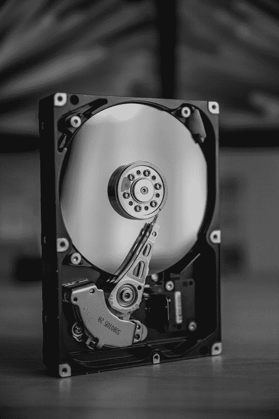
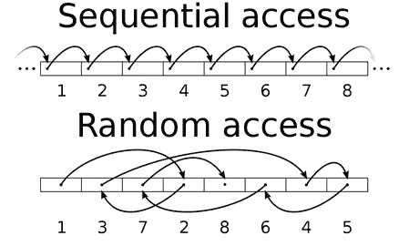
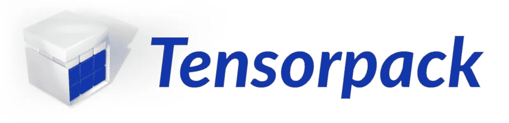
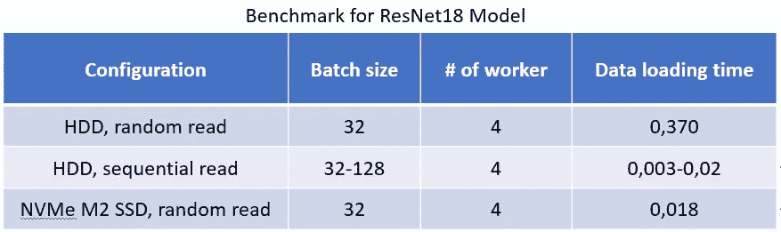

# 如何解决你深度学习训练中的数据加载瓶颈

> 原文：<https://towardsdatascience.com/how-to-solve-data-loading-bottlenecks-in-your-deep-learning-training-1ddfcc24449b?source=collection_archive---------14----------------------->

## 即使你没有固态硬盘


在 [Unsplash](https://unsplash.com?utm_source=medium&utm_medium=referral) 上由 [Varun Gaba](https://unsplash.com/@varunkgaba?utm_source=medium&utm_medium=referral) 拍摄的照片

深度学习训练中的每一次迭代，你都形成一批数据，并传递给模型。从 HDD 中读取数据是一个非常耗时的过程，因为机械致动器臂会穿过 HDD 板来寻找数据点的目标块。你知道，我们通常混洗数据集，并从这个混洗的数据集形成批次。这意味着批次中的数据点随机分布在硬盘中。这称为随机读取，与顺序读取相比非常慢。如果您要训练大型数据集(如 ImageNet ),您应该避免这些类型的瓶颈。下面是一个例子:**使用 RTX2080 GPU 和 7200 RPM HDD** ，ResNet18 模型在 ImageNet 数据上的一次迭代需要 32 个批处理大小，耗时 0.44 秒。**100 个纪元，需要 20 天！**当我们测量函数的计时时，数据加载+预处理需要 **0.38 秒**(其中 90%的时间属于数据加载部分)，而优化(向前+向后传递)时间只需要 **0.055 秒**。如果将数据加载时间减少到合理的时间，完全训练可以轻松减少到 **2.5 天！**



硬盘内部。我们在深度学习训练中形成批次时执行随机访问。照片由弗兰克 R 在 Unsplash。

## 最基本、最快的解决方案:购买 NVMe 固态硬盘

如果你的硬件系统支持固态硬盘，购买一个 **NVMe M2 型固态硬盘**将立即解决你的问题。为什么？让我们检查一些存储设备的读取速度。

**7200 RPM 硬盘:**100 MB/秒

**采用 SATA 速度的固态硬盘:**600 MB/秒

**SSD (NVMe 型)通过 M2:**3500 MB/秒

所以在 NVMe 型固态硬盘和你的 7200 RPM 硬盘之间，有 35 倍的差别。因此，购买和 NVMe 类型的固态硬盘是最基本和最快的解决方案。

如果固态硬盘不适合您，该怎么办？然后你必须继续使用你的硬盘。这是一些收据，可以让你用硬盘更快地加载数据。

## 1.如果你的数据是在硬盘上，它适合内存

在训练开始时将所有数据集加载(读取)到 RAM 中，这样在每次迭代中就不会消耗从磁盘读取的时间。你必须为此编写一个自定义数据集类(对于 PyTorch，请查看这里:[https://py torch . org/tutorials/beginner/data _ loading _ tutorial . html](https://pytorch.org/tutorials/beginner/data_loading_tutorial.html))。

## 2.如果您的数据存储在硬盘中，但不适合存储在 RAM 中

如果您正在处理大型数据集，如 ImageNet(大约 150 GB)，您不能将所有数据加载到 RAM 中。所以，你必须从硬盘上一批一批地读取数据。然而，我们怎样才能让它更快呢？提示在本文的第一段:我们应该执行**顺序读取**而不是**随机读取**。

你混洗你的数据集，并将混洗后的数据集再次写入磁盘，这样，如果你按顺序读取每一批，你将得到混洗后的批。您可以使用 **Tensorpack** 库来完成此操作(https://tensor pack . readthedocs . io/tutorial/efficient-data flow . html)。



当您没有固态硬盘时，Tensorpack 库是一个救命恩人[1]。

现在，让我们比较这三种不同的数据加载方法。



三种不同数据加载方法的数据加载时间比较。

**HDD，随机读取** 果然最慢。然而，这里有一个惊喜！**硬盘，顺序读取** *，*比 **SSD 快一圈，随机读取** *。*所以，我们不花钱买固态硬盘，就不能用硬盘吗？

不幸的是没有。

首先，读写混洗数据需要时间。对于 ImageNet 2012 数据(150 GB)，读取、混洗和写入需要 4 个小时。因此，您不能对每个时期执行此操作。如果你没有固态硬盘，这是唯一的救命稻草。

第二，将数据加载时间从 0.370 秒减少到 0.018 秒是重要的，但是对于训练来说将其从 0.018 秒减少到 0.003 秒是不必要的，因为存在额外的优化时间(向前传递+向后传递)。一旦数据加载时间减少，优化时间就会成为主要瓶颈。此外，许多框架提供异步数据加载；因此，这种差异不会显著影响整体训练表现。

## 预处理呢？

1.  裁剪、翻转、规格化等基本操作不会显著影响训练时间；因此，大多数时候，您可以动态地执行这些操作。但是，如果您有一长串预处理函数或自定义预处理函数会降低处理速度，您可以对原始数据集执行一次这些操作并将其写入磁盘，然后您可以读取预处理文件并直接将其提供给模型。
2.  可以使用 GPU 张量进行预处理。 **NVIDIA DALI** [2]设计用于在 GPU 上进行预处理，它也具有快速的 CPU 实现。
3.  可以使用低级语言(比如 C++)进行预处理，充分利用线程机制。

## 额外收获:了解你的图书馆。

PyTorch 和 Tensorflow 等框架将复杂的操作和 GPU、CPU 数据传输与用户隔离开来。这是这些图书馆的魅力之一。然而，它可能是有害的。例如，您想在每次迭代中获得一个张量的值，您可以通过下面的代码行(在 PyTorch 中)轻松获得它:

```
aValue = aTensor.item()
```

虽然看起来是很无辜的一行，但是每次执行这一行，都会把 GPU RAM 中的张量复制到主 RAM 中，这是一个很耗时的操作。它就像一个 *print()* 函数，我们不能随时使用它(尤其是在循环中)。因此，我们必须知道正在发生什么，以及函数如何在后台运行。了解这一点有助于我们编写更有效的代码。

下面是本文中提到的方法的简单流程图:


图片作者。

觉得这篇文章有用？看看我下面的其他文章:

[](https://medium.com/swlh/deep-learning-architectures-that-you-can-use-with-a-very-few-data-8e5b4fa1d5da) [## 你可以用很少的数据使用深度学习架构

### 传统的 CNN(Alex net，VGG，GoogLeNet，ResNet，DenseNet …)在样本较多的情况下有很好的表现…

medium.com](https://medium.com/swlh/deep-learning-architectures-that-you-can-use-with-a-very-few-data-8e5b4fa1d5da) [](/effective-deep-learning-development-environment-with-pycharm-and-docker-34018f122d92) [## 使用 PyCharm 和 Docker 的有效深度学习开发环境

### 借助全面承诺的 IDE 和虚拟化提高您的工作效率。

towardsdatascience.com](/effective-deep-learning-development-environment-with-pycharm-and-docker-34018f122d92) 

# 参考

[1]吴，庾信。“Tensorpack。”(2016).(【https://github.com/tensorpack/tensorpack】T4)

[2][https://github.com/NVIDIA/DALI](https://github.com/NVIDIA/DALI)