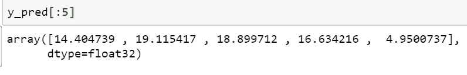
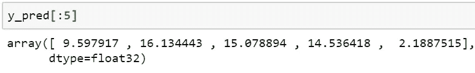
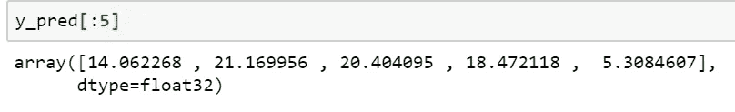

# 如何解决人工神经网络中的随机性？

> 原文：<https://towardsdatascience.com/how-to-solve-randomness-in-an-artificial-neural-network-3befc4f27d45?source=collection_archive---------20----------------------->

## 了解一个人工神经网络随机性的原因以及如何修复。

在这篇短文中，我们将了解

*   人工神经网络*的随机性是什么？*
*   为什么我们在 ANN 中会有随机性？
*   如何修复随机性，让一个神经网络稳定？
*   keras 中的简单代码实现，用于从人工神经网络获得一致的结果


***人工神经网络(ANN)的随机性是什么？***

**人工神经网络(ANN)的随机性是指当相同的神经网络对相同的数据进行训练时，它会产生不同的结果。**

有时，我们可能已经随机选择了训练数据和测试数据，如果我们从训练数据和测试数据中去除随机性，即使使用相同的神经网络，每次执行我们仍然可能得到不同的结果。

结果的这种随机性使得神经网络不稳定和不可靠，尤其是在与他人共享您的代码或展示您的工作时。

***人工神经网络为什么会有随机性？***

人工神经网络中的随机性可能由于多种原因而发生

1.  权重和偏差的随机初始化
2.  像辍学这样的正规化技术中的随机性
3.  随机梯度下降(SGD)等优化技术中的随机性

***我们如何修复一个 ANN 的随机性？***

如果我们使随机性更可预测，我们就能获得一致的结果。

为了使随机性可预测，我们使用了 ***种子的概念。***

> Seed 有助于每次获得可预测、可重复的结果

如果我们不设置种子，那么我们在每次调用时都会得到不同的随机数

将种子设置为某个值，比如 0 或 123，将在同一台机器或不同机器上多次执行代码时生成相同的随机数。

为了解决我们使用的人工神经网络的随机性

*   **numpy 随机种子**
*   **张量流集合 _ 随机 _ 种子**

让我们在不设置随机种子的情况下构建一个简单的 ANN，接下来，我们将设置随机种子。我们将在 ketas 中实现代码

我使用了 Kaggle 的[房屋数据集](https://www.kaggle.com/apratim87/housingdata/data)

## 证明人工神经网络的随机性

```
#Importing required libraries
import numpy as np
import pandas as pd
from keras import Sequential
from keras.layers import Dense# Reading the data
dataset = pd.read_csv('housingdata.csv')
dataset.head(2)# Creating independent and dependent variable
X=dataset.iloc[:,0:13]
y=dataset.iloc[:,13].values# creating train and test data
from sklearn.model_selection import train_test_split
X_train, X_test, y_train, y_test =X[:400], X[400:], y[:400], y[400:]# Building a simple ANN for regression
**def build_regressor():**
    regressor = Sequential()
    regressor.add(Dense(units=13, input_dim=13))
    regressor.add(Dense(units=1))
    regressor.compile(optimizer='adam', loss='mean_squared_error',  metrics=['mae','accuracy'])
    return regressor# creating the kears Regressor with 100 epochs
from keras.wrappers.scikit_learn import KerasRegressor
regressor = KerasRegressor(build_fn=build_regressor, batch_size=32,epochs=100)# Fitting the training data
results=regressor.fit(X_train,y_train)# Making prediction the test data
y_pred= regressor.predict(X_test)# printing the first 5 predictions for comparison
y_pred= regressor.predict(X_test)
y_pred[:5]
```

程序第一次运行的输出



第二次运行的输出



您将在每次执行时得到不同的输出

## 修复我们人工神经网络的随机性

我们将导入另外两个库并设置种子

```
**from numpy.random import seed
from tensorflow import set_random_seed**
```

设置 numpy 种子和 tensorflow 种子

```
**seed(0)
set_random_seed(0)**
```

**最终代码**

```
#Importing required libraries
import numpy as np
import pandas as pd
**from numpy.random import seed
from tensorflow import set_random_seed**
from keras import Sequential
from keras.layers import Dense**# settingt he seed
seed(0)
set_random_seed(0)**# Reading the data
dataset = pd.read_csv('housingdata.csv')
dataset.head(2)# Creating independent and dependent variable
X=dataset.iloc[:,0:13]
y=dataset.iloc[:,13].values# creating train and test data
from sklearn.model_selection import train_test_split
X_train, X_test, y_train, y_test =X[:400], X[400:], y[:400], y[400:]# Building a simple ANN for regression
**def build_regressor():**
    regressor = Sequential()
    regressor.add(Dense(units=13, input_dim=13))
    regressor.add(Dense(units=1))
    regressor.compile(optimizer='adam', loss='mean_squared_error',  metrics=['mae','accuracy'])
    return regressor# creating the kears Regressor with 100 epochs
from keras.wrappers.scikit_learn import KerasRegressor
regressor = KerasRegressor(build_fn=build_regressor, batch_size=32,epochs=100)# Fitting the training data
results=regressor.fit(X_train,y_train)# Making prediction the test data
y_pred= regressor.predict(X_test)# printing the first 5 predictions for comparison
y_pred= regressor.predict(X_test)
y_pred[:5]
```

首次运行和任何运行时的输出



## 结论:

由于权重的随机初始化、偏差、使用漏失和不同的优化技术，人工神经网络本质上是不确定的。我们可以为 numpy 和 TensorFlow 设置种子，以便在同一台计算机或不同的计算机上使用相同的数据集获得一致的结果。