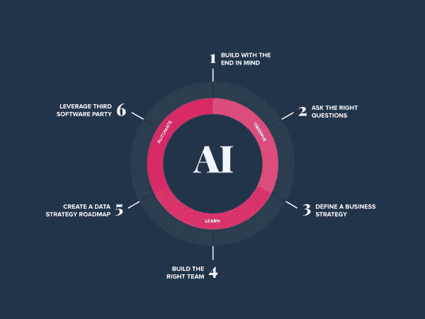
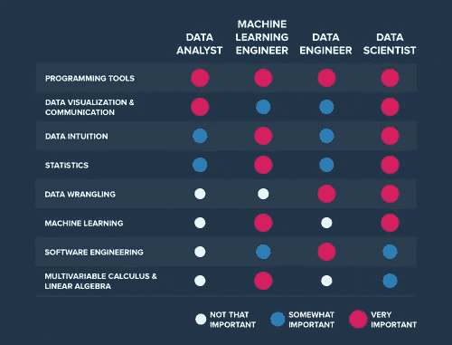
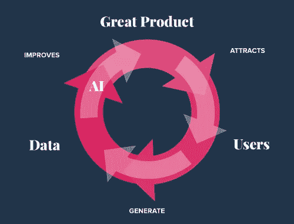

# 如何解决企业人工智能中的最大挑战

> 原文：<https://towardsdatascience.com/how-to-solve-the-biggest-challenges-in-enterprise-ai-deb0b1635bcb?source=collection_archive---------43----------------------->

企业人工智能战略路线图

[90%的现有数据](https://www.forbes.com/sites/bernardmarr/2018/05/21/how-much-data-do-we-create-every-day-the-mind-blowing-stats-everyone-should-read/#41251e4560ba)是在过去两年中生成的。每天，[产生 7.5 万亿千兆字节的数据](https://lucidworks.com/darkdata/) — [**每人大约 147，000**](https://www.weforum.org/agenda/2019/04/how-much-data-is-generated-each-day-cf4bddf29f/) 千兆字节。这些数字是惊人的，但这是意料之中的:世界在增长，机器经济呈指数增长。

这并不是说所有这些数据都立即有用。没有大量的预处理，组织不能简单地利用这些资源——但是有人在做这项工作吗？Forrester 报告称，在企业内部，73%的数据仍未用于分析。业务战略和数据战略之间仍有很大差距——您组织的预测性解决方案只能像最初的问题陈述一样可靠。根据 Gartner 的说法，组织需要建立具体的用例，并部署具有可衡量结果的技术，以实现人工智能的价值。

## 数据是拼图中的一大块

这个比喻仍然存在——数据是新的石油(尽管，这个短语最迟在 2006 年被创造出来，可能并不那么“新”)。它在原始状态下绝对有价值。提炼出来就更值钱了。但是当它变成一种产品，一种专门为解决某个特定问题而制造的产品时，它的应用是数不胜数的，它的价值也在飙升。

这同样适用于数据:组织需要记住，这里的最终目标不是收集尽可能多的数据。他们需要从数据中提取价值，并将其应用于特定的业务问题。观察数据，从中学习，然后根据反馈自动完成工作的想法是机器学习的核心。

GIF via [giphy](https://gph.is/2c6hINj)

尽管好莱坞经常描绘，曼梯·里并没有证明“终结者假说”。

## 理解机器学习

在任何组织成为数据驱动型组织之前，了解基础知识非常重要。人们通常认为机器学习的最终目标是在实时仪表板上显示数据的图表和可视化。ML 是关于自动化任务的(不是关于取代工作)，它不仅仅是展示统计数据。广义而言，机器学习教给计算机一些关于世界的知识，以便机器可以使用这些知识来执行其他任务。另一方面，统计学教给人们一些关于世界的东西，这样他们就能看到更大的图景，做出明智的决定。

根据埃森哲的数据，与追求概念证明的公司相比，战略性扩展人工智能的公司报告的人工智能投资回报几乎是其三倍。显然，ML 不是一个精心打扮的仪表板；事实上，它可以帮助您的组织构建智能系统，这些系统可以模仿、扩展和增强人类智能，以实现特定的“机器智能”，使您组织中的人员能够专注于解决更适合人类的问题。

然而，大多数组织都在努力实现可扩展的人工智能解决方案，并错过了好处(见:钱)。问题？你的组织不缺人才，缺的是战略。不服气？我们来看一些数字。

## 可扩展解决方案

自 2015 年以来，数据科学职位需求**增长了 344%。我们可以清楚地看到，组织正在投资发展他们的数据科学团队，他们的印象是，如果他们继续雇佣数据科学家，创新和数字化转型将是一个自动的副产品。然而**只有** [**27%的企业数据**](https://www.designnews.com/automation-motion-control/preparing-growing-ai-workforce/204267110160662) **被使用**，算上外部数据更是令人震惊——在世界上所有可用的数据中， [**不到 1%被用于分析**](https://www.designnews.com/automation-motion-control/preparing-growing-ai-workforce/204267110160662) 。**

**所有这些数据都有一个临界点。公司可以投入数百万美元建立庞大的数据团队来搜索互联网搜索结果，并准备来自各地的数据——但这永远不会是一个可扩展的解决方案，并且缺乏管理策略是造成瓶颈的原因。**

## **公司部署 AI 和 ML 需要什么？**

**那么这个过程从哪里开始，组织实际上是如何构建和部署成功的机器学习项目的呢？**

1.  **从目标开始。你必须清楚地了解你面临的问题以及你想要实现的解决方案。在保龄球运动中，你可以用每一个球击倒十个瓶，但只有当你投对了球道，这才是一场完美的比赛。对于 ML，你需要知道你的目标是什么。组织是以目标为导向的，他们总是寻求增加收入和提高 KPI——如果你的问题没有解决这些目标，它可能偏离目标。**
2.  ****问正确的问题。**大多数企业在试图用 ML 解决问题之前都没有提出正确的问题。分析并理解你能回答什么，不能回答什么，然后弄清楚你的预测系统如何真正让最终用户受益。要问的一个关键问题是:“我的项目会被它能为组织创造的价值深深地驱动吗？”**
3.  ****定义商业战略。**制定战略时，必须像对待其他项目一样，对数据和 ML 项目给予同样的关注和细节。您需要具体的、可测量的、可实现的目标、实施计划以及帮助跟踪项目成功的度量标准。仅仅从技术层面来看你的项目是不够的，你需要能够将解决方案与你的组织联系起来。例如，在实施您的模型后，您的公司会增加收入或在市场中获得稳固的竞争优势吗？**
4.  ****建立合适的团队。**组织往往无法为工作雇用合适的候选人，因为他们要么不知道自己想要实现什么，要么对数据科学家的角色有冲突的看法。数据团队由更多角色组成，而不仅仅是数据科学家，认为一个角色能够建立和维护仓库，设计数据工作流，编写完美优化的机器学习算法，并对一切进行分析是无知的。为了填补项目的正确角色，你需要清楚地定义你的目标，理解每个技术角色/团队结构的细微差别，并确保所有这些都在你的招聘公告中概述。下图显示了核心技能对于数据科学新兴角色的相对重要性:**

****

**数据科学中技能重要性图表**

****5。创建数据战略路线图。**数据是 ML 项目的关键资产，因为它训练模型。[据人工智能领域的先驱](https://www.google.com/url?q=https://www.awaken.com/2017/02/artificial-intelligence-is-the-new-electricity-says-andrew-ng/&sa=D&ust=1582056564885000&usg=AFQjCNGO40TUWSJDNZajMsS9vb3JfaUiGw) [吴恩达](https://www.awaken.com/2017/02/artificial-intelligence-is-the-new-electricity-says-andrew-ng)称，最大、最成功的产品拥有最多的用户。拥有最多的用户通常意味着你获得最多的数据，而在现代 ML 中，拥有最多的数据通常意味着你可以创造出最好的 AI。下图描述了上述概念:**

****

****6。利用第三方软件**。不要试图重新发明轮子，建立一个内部数据管道。为了成功推出 AI，[选择正确的工具](https://blog.thinkdataworks.com/adapt-or-die-why-your-business-strategy-is-failing-your-data-strategy)非常重要，这些工具可以帮助您的组织完成可以自动化的任务，如寻找、收集、标准化、提炼和集成数据。 [**代表 Alegion 进行的维度研究报告**](https://www.techrepublic.com/article/96-of-organizations-run-into-problems-with-ai-and-machine-learning-projects/?ftag=TRE684d531&bhid=27663080550100795442100377881848&utm_content=buffer214b5&utm_medium=social&utm_source=facebook.com&utm_campaign=buffer) 发现，最终，71%的团队将训练数据和其他机器学习项目活动外包出去。在“建造还是购买”的争论中，选择“建造”的公司花费更多的时间和金钱。记住，你不是在雇佣数据管理员，而是在雇佣数据科学家。采用 DataOps 工具并找到自动化数据生命周期的准备和处理阶段的方法将缩短洞察时间。**

## **这从来都不容易——但没必要这么难**

**一些企业没有足够的数据，另一些企业则在苦苦寻找超过十年的无用数据。拥有数据并不意味着可以从中获得洞见。组织未能认识到从数据中提取洞察力所需的准备工作，因此在创新和增长方面出现了越来越多的瓶颈。不是没有数据，是没有可用的数据。**

**数据是创建预测和智能解决方案的一个重要因素，但数据不仅仅是拥有大量数据。找到一个问题，找到合适的人来解决它，给他们有效解决问题所需的工具，并衡量他们的功效——这些是成功的 ML 的要求。**

***最初发表于*[*【https://blog.thinkdataworks.com】*](https://blog.thinkdataworks.com/solving-challenges-in-enterprise-ai)*。***