# 如何解决真正的大数据问题——加载巨大的 Excel 文件

> 原文：<https://towardsdatascience.com/how-to-solve-the-real-big-data-problems-load-huge-excel-files-7e3ea6957126?source=collection_archive---------29----------------------->

## 提示:多线程。使用 PDI 和 PostgreSQL，我们可以在几分钟内加载一个巨大的 excel 文件。

越来越多的公司开始意识到数据的重要性。因此，他们会要求将庞大的 CSV 或 Excel 文件从其传统系统或手动流程加载到数据库，以进行数据驱动的分析。我知道，我们现在有很多解决这个问题的方案，像 [pandas](https://pandas.pydata.org/) 、 [dask](https://dask.org/) 、 [vaex](https://pypi.org/project/vaex/) python 库或 Informatica 等工具。

然而，学习不同的方法来解决问题陈述总是很有趣的。我们将使用 PDI 来解决这个问题，并使用 PostgreSQL 作为我们的数据库。这里的想法是优化利用我们的系统能力。我知道不是所有人都有内存优化服务器的特权。


[ev](https://unsplash.com/@ev?utm_source=medium&utm_medium=referral) 在 [Unsplash](https://unsplash.com?utm_source=medium&utm_medium=referral) 上拍照

如果你是数据管道建设过程的新手，那么我会推荐你看下面的故事。

[](https://medium.com/swlh/build-your-first-data-pipeline-in-just-ten-minutes-2a490867b901) [## 仅用 10 分钟构建您的第一条数据管道

### 通过使用 PDI 的真实用例，逐步构建您的第一个数据管道。

medium.com](https://medium.com/swlh/build-your-first-data-pipeline-in-just-ten-minutes-2a490867b901) 

# 先决条件

*   **PDI:** Pentaho 数据集成安装在您的系统上。您可以使用[链接](https://medium.com/ai-in-plain-english/pentaho-data-integration-installation-guide-easy-yet-powerful-etl-tool-80930cff46c6)获得逐步安装指南。
*   PostgreSQL :我们可以根据自己的喜好使用任何关系或非关系数据库。如果您想跟随，请使用[链接](https://www.enterprisedb.com/downloads/postgres-postgresql-downloads)来安装。

# 用户故事

我喜欢首先为我们的问题陈述定义用户故事。这有助于我设计数据管道的高级架构。我们需要将问题分解成简单的小块。

1.  我想读取包含数百万条记录的经济数据的巨大 CSV 文件。
2.  我想用一个维度/主表对数据中的每个内容进行查找。
3.  我想清理数据并删除空字段。
4.  我想添加一个行级条件。如果状态栏包含“修订”一词，我想添加“_R”。
5.  我想在 PostgreSQL 数据库中加载相同的。

我们试图通过增加一点复杂的数据操作来复制真实世界的场景。

# 输入数据

理解输入数据文件是一个很好的做法。现在，在我们的例子中，可能很难打开巨大的 CSV 文件并检查列和行。然而，我们可以通过一些方法来确定或检查样本数据。PDI 通过创建一个小的转换来读取样本数据和检查其他元数据。

在这里，我谷歌了“csv 格式的巨大数据文件”这个词，并从第一个网站下载了这个文件。下面是[环节](https://www.stats.govt.nz/assets/Uploads/Business-price-indexes/Business-price-indexes-March-2020-quarter/Download-data/business-price-indexes-march-2020-quarter-csv.csv)。

现在，我想让系统崩溃并创建巨大的文件；就像我们在处理大数据一样，对吗？下载的文件有**66526 条记录**，所以我多次追加相同的记录来创建一个巨大的文件，大约有**11974697 条记录**；是的，没那么大。

# 测试案例

定义测试用例在这里很重要，因为我们不能手工检查整个数据。我们需要确保，我们检查了足够好的样本数据来交叉验证准确性。

1.  检查行数并与输入数据匹配。请注意，因为我们将删除空数据。存储这些空记录也很重要。
2.  交叉验证至少 500 -1000 条记录的维度输出结果。
3.  随机交叉验证计算结果，以检查准确性；至少一千张唱片。

# 步骤 1:项目的设置

我们为这个项目设置了一个非常简单的项目。只有一个目录和一个转换文件。

我喜欢在一个名为“work”的项目目录中创建所有与工作相关的项目；我知道，多有创意啊！我们需要执行以下操作:你可以跳过这一步。

1.  创建我们的项目目录- LoadData。
2.  在项目目录中创建一个目录“Input”。
3.  在项目目录中创建一个名为“Main.ktr”的空转换。

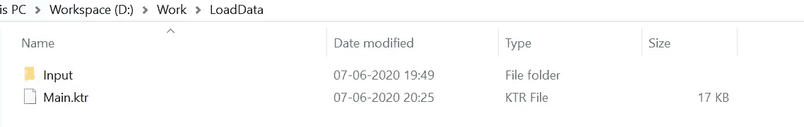

项目目录结构

如果你不知道像转换或工作这样的词，那么我将推荐下面提到的故事。

[](https://medium.com/ai-in-plain-english/getting-started-with-pentaho-data-integration-kettle-and-its-components-ef1e71101323) [## Pentaho 数据集成(Kettle)及其组件入门。

### 了解勺子、平底锅、厨房等关键部件将使我们对 PDI 工具有更好的了解

medium.com](https://medium.com/ai-in-plain-english/getting-started-with-pentaho-data-integration-kettle-and-its-components-ef1e71101323) 

# 步骤 2:创建数据库表

我假设您已经在这里安装了数据库。我们使用 PostgreSQL。

现在，我更喜欢使用 [Django 模型](https://docs.djangoproject.com/en/3.0/topics/db/models/)创建表格。您不一定必须使用这种方法。

> 话虽如此，但通过编写 Django 模型而不是手动创建表和列，我们的生活变得简单了。Django models 使用简单的 migrations 命令为我们做到了这一点，并且还获得了开箱即用的 [CRUD](https://en.wikipedia.org/wiki/Create,_read,_update_and_delete) (创建、读取、更新和删除)功能。

你可以选择下面提到的两个选项来创建数据库和表。我已经创建了一个表 medium_db

*   PostgreSQL 创建脚本。

```
 — Table: public.economic_data — DROP TABLE public.economic_data;CREATE TABLE public.economic_data
(id integer NOT NULL DEFAULT nextval(‘economic_data_id_seq’::regclass),series_reference character varying(255) COLLATE pg_catalog.”default” NOT NULL,indicator_name character varying(255) COLLATE pg_catalog.”default” NOT NULL,period character varying(45) COLLATE pg_catalog.”default” NOT NULL,indicator_value numeric(30,10) NOT NULL,status character varying(255) COLLATE pg_catalog.”default” NOT NULL,
indicator_unit character varying(255) COLLATE pg_catalog.”default” NOT NULL,group_name character varying(255) COLLATE pg_catalog.”default” NOT NULL,series_name character varying(255) COLLATE pg_catalog.”default”,
 CONSTRAINT economic_data_pkey PRIMARY KEY (id)
)TABLESPACE pg_default;ALTER TABLE public.economic_data
OWNER to YOURUSER;
```

*   运行迁移的 Django 模型脚本。

```
from django.db import models# Create your models here.class EconomicData(models.Model):**series_reference** = models.CharField(db_column="series_reference",max_length=255,help_text="Unique code to identify a particular record",verbose_name="Series Reference",)**indicator_name** = models.CharField(db_column="indicator_name",max_length=255,verbose_name="Name of the indicators")**period** = models.CharField(db_column="period",max_length=45,verbose_name="Period")**indicator_value** = models.DecimalField(db_column="indicator_value",max_digits=30,decimal_places=10,verbose_name="Value of the Field")**status** = models.CharField(db_column="status",max_length=255,verbose_name="Status of the value For eg, Final or Revised")**indicator_unit** = models.CharField(db_column="indicator_unit",max_length=255,verbose_name="Unit of the indicators")**group_name** = models.CharField(db_column="group_name",max_length=255,verbose_name="Group of the indicators")**series_name** = models.CharField(db_column="series_name",max_length=255,verbose_name="Series of the indicators"null=True)def __str__(self):return f"{self.indicator_name} - {self.value}"class Meta:db_table = "economic_data"verbose_name = "Economic Data"verbose_name_plural = "Economic Data"
```

如果你有兴趣了解我们如何从 Django 的数据管道中获益，请在下面的回复部分告诉我。

我们已经准备好桌子了。现在，让我们创造我们的转变。

# 步骤 3:加载程序转换

我们需要创建一个 loader 转换，它读取我们的输入 CSV，执行操作并将数据加载到数据库中。

我们需要打开 Main.ktr 文件并拖动一些插件，如下所述。

## 步骤 1:拖动步骤

1.  首先，让我们添加一个关于转换的小描述。文档是任何数据管道的关键。
2.  将“CSV 文件输入”、“数据网格”、“连接行(笛卡尔乘积)”、“用户定义的 Java 表达式”、“过滤器行”、“文本文件输出”、“表格输出”插件从“设计”选项卡拖到画布上。
3.  按照我们的命名约定重命名字段。

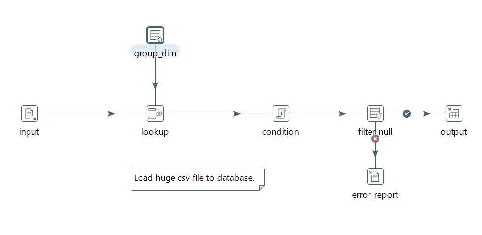

重命名后的主要转换

## 步骤 2:配置属性

1.  我们需要为上述每个步骤配置属性。让我们配置 CSV 输入步骤，我们需要在**文件名**字段中浏览我们的输入文件，并点击**获取字段**。我们可以根据内存可用性调整 **NIO 缓冲区大小**；它将分批处理文件，每批 50K 条记录。
2.  我们需要在数据网格中添加数据(在这里复制一个表)。在这里，我们使用数据网格来表示数据。在真实的场景中，您将从一些维度表中获得这些数据。我们正在使组名标准化。你可以参考下面的数据截图。我们需要在**元**选项卡中添加列名，并在**数据**选项卡**中添加实际数据。**
3.  在 Join rows 步骤中，我们需要将输入中的字段映射到我们的维度表/网格中。因为我们在这里映射组，所以我们需要添加条件**来映射相同的组。**
4.  在用户定义的 java 表达式中，我们将配置自定义的行级条件。我们需要将我们的**新字段**定义为‘Series _ reference _ flag ’,如果状态列为‘Revised ’,这里我们要更改‘Series _ reference’字段并附加‘R’。在我们的 **Java 表达式**中，我们将添加以下条件——‘status = =‘Revised’？Series _ reference+" _ R ":Series _ reference '；这是 java 代码。我们可以执行[类似](https://wiki.pentaho.com/display/eai/user+defined+java+expression)的条件或计算，**功能强大！**最后，我们需要将**值类型**添加到‘String’中。
5.  在筛选行步骤中，我们需要定义传递没有空值的记录的条件。
6.  在文本文件输出(错误报告)中，我们需要添加**文件名**为 **'** ${Internal。entry . current . directory }/error _ report**'**并将**扩展名**改为‘CSV’。
7.  在表格输出步骤中，我们需要创建一个新的**连接**来连接到我们的数据库。我们可以根据需要连接到任何数据库。我们在这里将连接到 PostgreSQL 有关连接的详细信息，请参考屏幕截图。我们需要浏览**目标表**到‘经济 _ 数据’。我们需要检查指定数据库字段的**字段**字段。然后，我们需要将输入/转换字段映射到表字段。

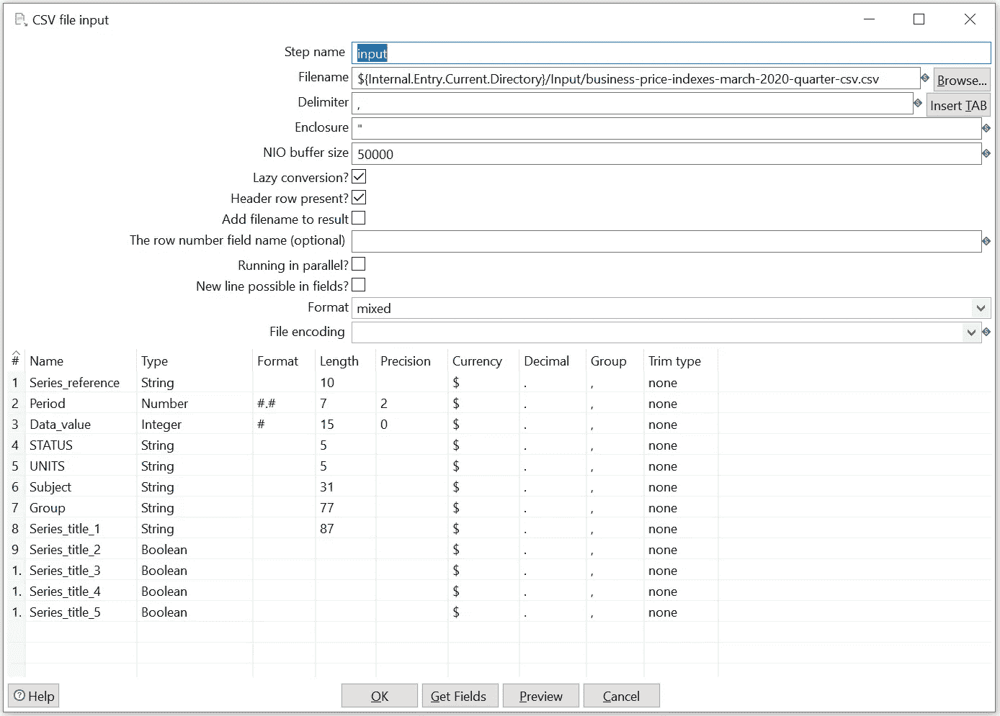

输入步骤配置

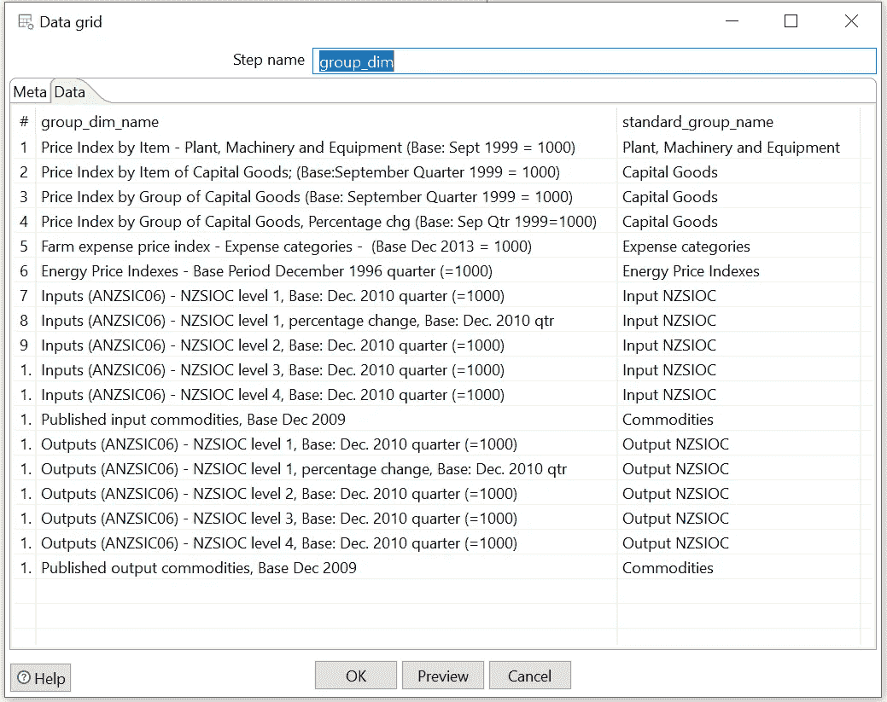

数据网格配置-维度

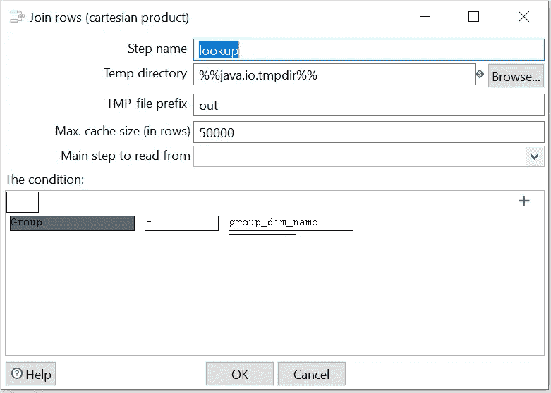

联接行配置

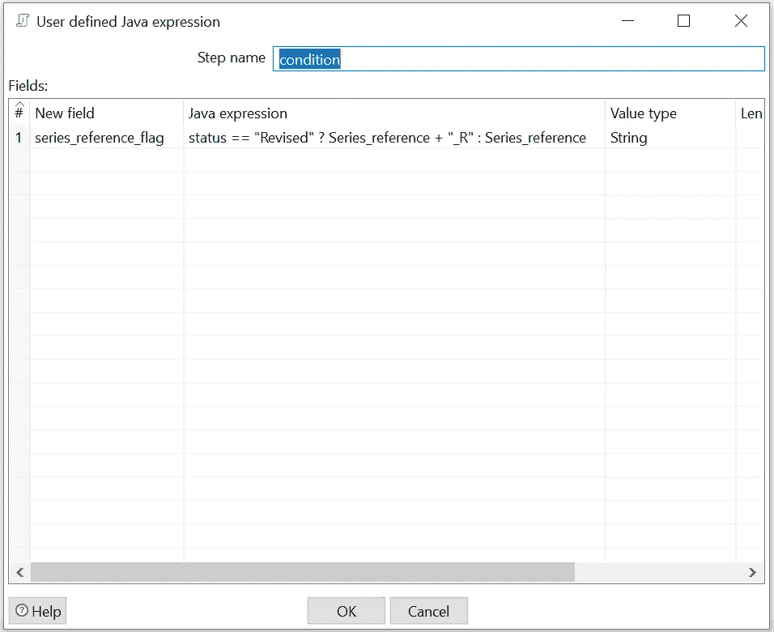

条件配置

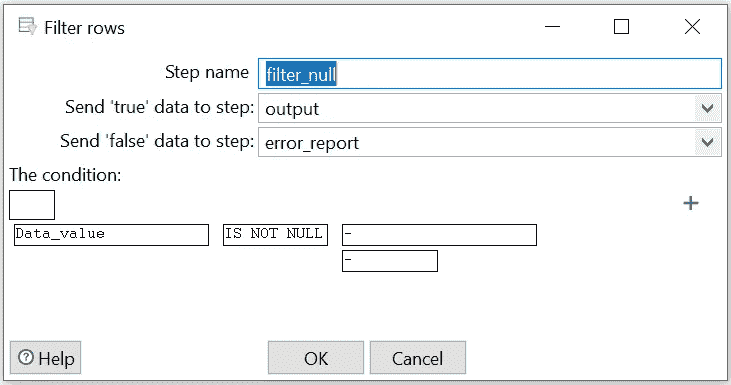

过滤空配置

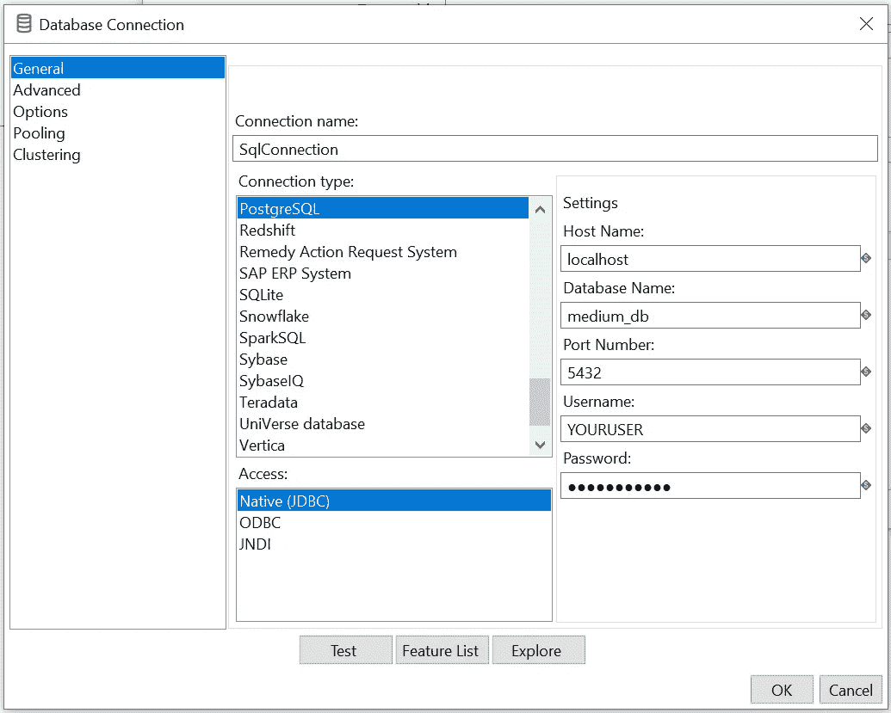

数据库输出配置

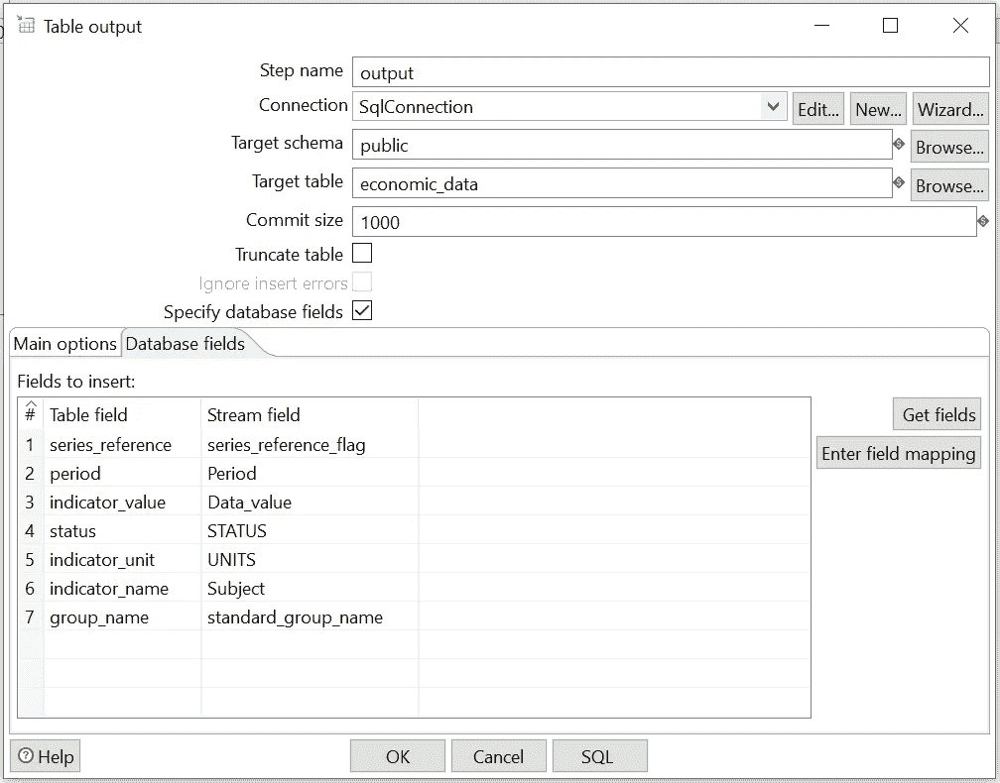

数据库映射

## 第四步:让我们加快进程

现在我们已经配置了属性，我们可以通过创建插入数据的多线程来加速这个过程。这将提高性能。PDI 为我们提供了按步骤配置多线程的工具。如果我们在输入步骤中使用它，它将成倍增加记录。然而，如果我们将它用于像数据库这样的输出步骤，它将分发记录。

PDI 为我们提供了许多优化性能的选项。我们可以执行以下步骤来提高性能。

1.  在我们的输入步骤中更改 **NIO 缓冲区大小**，定义我们的批处理大小。
2.  改变**最大值。高速缓存大小(行数)**在查找步骤中，定义它将存储在高速缓存中的行数，而不是查询数据库。
3.  改变**提交大小，**类似于缓冲区大小改变批量大小来插入记录。
4.  使用多线程来执行活动，我们可以添加一个虚拟步骤，并在输出步骤之前，右键单击选择**根据我们的要求，将启动**的副本数从 1 更改为 1 以上的任何值。
5.  请注意，如果我们想要在表输出步骤上执行多线程，那么我们不能使用第四点。然后，我们必须在输出之前添加一个**虚拟**步骤，并且**在多个输出表步骤中分配**记录。

> 哇！我们有这么多的选择，我们应该改变所有的性能优化器吗？简而言之，答案是否定的。我们需要用样本数据进行尝试，并对最适合我们的方法进行多次测试。

# 第二步:评估

让我们在没有性能优化器的情况下运行这个流，然后通过应用优化器进行比较。

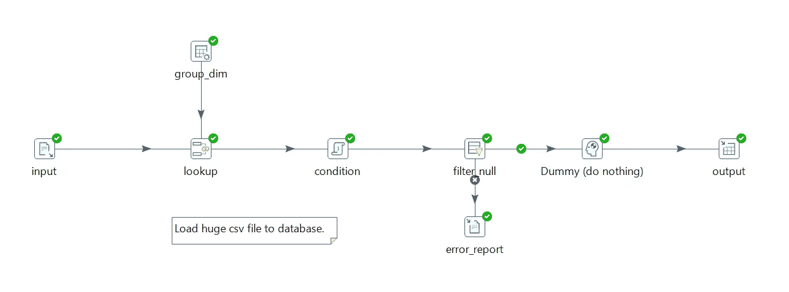

成功

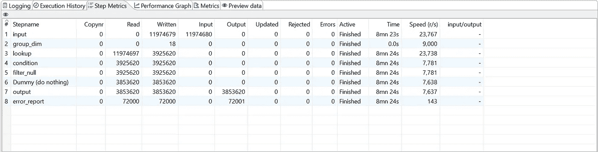

步进矩阵——用了 8m 42s

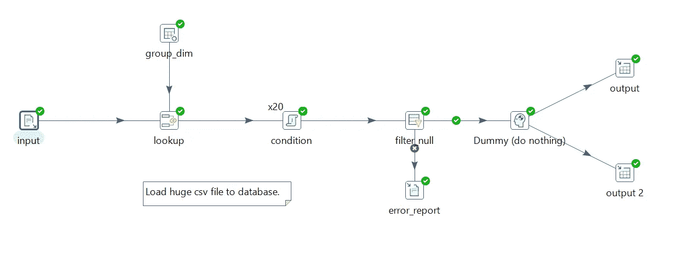

添加了简单的优化器—20 倍的 on 条件和两个输出线程

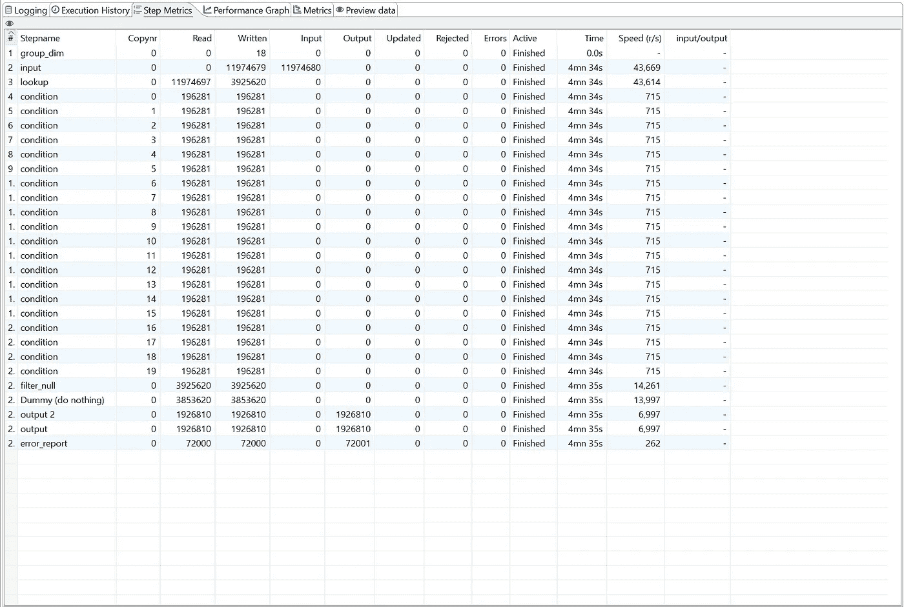

步骤矩阵——花了 4m 35s

通过添加一些简单的性能优化器，我们将执行相同活动的时间减少了近 50%。

如果我们想读取多个文件，并创建一个循环来处理相同的文件，那么我会推荐你阅读下面的故事。

[](/how-to-automate-multiple-excel-workbooks-and-perform-analysis-13e8aa5a2042) [## 如何自动化多个 Excel 工作簿并执行分析

### 应用这个循序渐进的指南来解决问题，使用神奇的元数据注入 PDI。

towardsdatascience.com](/how-to-automate-multiple-excel-workbooks-and-perform-analysis-13e8aa5a2042) 

# 结论

我们提出了一个问题陈述，并尝试使用多种方法解决它，还尝试优化它。理论上，您可以应用这个过程来满足您的需求，并尝试进一步优化它。PDI 也为我们提供了 **PostgreSQL 批量加载器**步骤；我也试过那一步。然而，这并没有提供任何显著的性能提升。

我们不能在一开始就优化代码/管道，必须执行多次测试才能获得理想的结果。然而，为了缩短学习曲线，你可以随时阅读我的经验，并通过使用下面的链接订阅我的电子邮件列表来找到问题陈述的解决方案。

[](https://wryteex.com/) [## WryteEx -使用真实世界用例寻找解决方案的平台

### 我写的博客涉及数据工程、金融、Python、Python Django、项目管理、Web 开发等等

wryteex.com](https://wryteex.com/) 

# 下一篇文章再见。快乐的 ETL