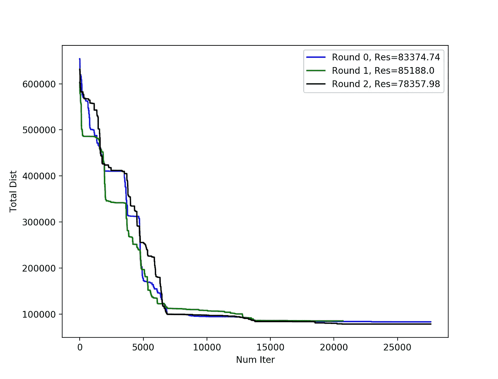

# 如何解决旅行商问题——比较分析

> 原文：<https://towardsdatascience.com/how-to-solve-the-traveling-salesman-problem-a-comparative-analysis-39056a916c9f?source=collection_archive---------3----------------------->

## 行业笔记

## 通过 3 种优化方法:动态规划、模拟退火和 2-opt。

凯勒·琼斯在 [Unsplash](https://unsplash.com?utm_source=medium&utm_medium=referral) 上拍摄的照片

我相信你已经听说过旅行推销员问题或 TSP。这个问题有许多应用，也有许多具有不同性能的解决方案。在这里，我想分享一下我最近解决旅行商问题的经验，特别是用 [**2-opt 法**](https://pypi.org/project/py2opt/) 这是解决这个问题最简单也是最有效的方法之一。

> 如果你只是想了解 2-opt，你可以直接跳到这篇文章的末尾。您也可以使用我在下面开发的 Python 包来解决 TSP 问题。

 [## py2opt

### 在优化中，2-opt 是一种简单的局部搜索算法，具有特殊的交换机制，非常适合于求解复杂的优化问题

pypi.org](https://pypi.org/project/py2opt/) 

在这篇文章里，我想分享我用 120 个城市去访问解决一个 TSP 的经验。这个问题必须在不到 5 分钟的时间内解决，才能用于实践。我的目标是用以下方法解决这个问题:

*   动态编程，
*   模拟退火，以及
*   二选一。

首先，让我简单解释一下 TSP。

 [## 人工智能:非正统的教训:如何获得洞察力和建立创新的解决方案

### 亚马逊网站:人工智能:非正统课程:如何获得洞察力和建立创新的解决方案电子书…

www.amazon.com](https://www.amazon.com/gp/product/B08D2M2KV1/ref=dbs_a_def_rwt_hsch_vapi_tkin_p1_i0) 

# 旅行推销员问题

旅行商问题是组合优化中的经典问题。这个问题是要找到一个推销员应该走的**最短路径**来遍历一个城市列表并返回到起始城市。提供了城市列表和每对城市之间的距离。

TSP 在现实生活中的各种**应用**中都很有用，比如规划或物流。例如，想要为乐队安排一系列演出的巡回音乐会经理必须确定巡回演出的最短路径，以确保降低旅行成本，并且不会使乐队不必要地筋疲力尽。

这是一个 **NP 难**问题。简单来说，就是你不能保证在合理的时间限制内找到最短的路径。这并不是 TSP 所独有的。在现实世界的优化问题中，您经常会遇到这样的问题，您必须找到**次优**解，而不是最优解。

旅行推销员问题

# **一、动态编程**

动态规划或动态规划方法保证找到 TSP 的最佳答案。然而，随着城市数量的增加，其时间复杂度将呈指数增长。DP 方法的时间复杂度渐近地等于 N × 2^N，其中 n 是城市的数量。

为了给你时间复杂度增加的提示，让我分享我的实验。10 个城市的 TSP，用英特尔酷睿 i7 用 DP 法差不多 0.2 秒就能解决。在 15 个城市中，这个数字增加到几乎 13 秒(大约 60 倍)。也就是说，即使城市数量增加很少，时间复杂度也会显著增加。

为了优化 DP 方法，我可以使用记忆技术。然而，具有大量城市的记忆化技术需要一个 2^N × 2^N 矩阵，该矩阵不容易在存储器中处理。

> **建议-** 如果要解决有大量城市的旅行商问题，动态规划方法不是最佳选择。DP 方法可以保证全局最优，但它需要大量的时间和计算能力，这是我们在现实世界问题中所不能承受的。

# 二。模拟退火

模拟退火或 SA 是一种启发式搜索算法，其灵感来自冶金工业中的退火机制。退火指的是一种**控制的冷却机制**，它导致材料达到期望的状态。但是，这如何映射到优化问题呢？

优化专家从退火机制中学到的经验是，与具有固定规则的梯度下降算法相反，对搜索过程实施更多的控制。SA 方法有两个主要规则，解释如下。

*   **的移动方向**必须在每一步中以概率的方式确定，希望不会陷入局部最优，并向全局最优移动。
*   **搜索步骤**在搜索过程向前推进并接近最终结果时，必须缩小规模。这有助于在早期积极行动，在后期谨慎行动。

在 SA 方法中，搜索过程必须继续，直到找到足够好的解决方案或达到停止标准。此外，该方法对其参数(包括搜索步长和移动方向)的制定和调整非常敏感。SA 方法是一种启发式搜索算法，因此，它对搜索空间中的初始点**敏感。**

我实现了 SA 方法并测试了几次。最后，由于执行时间有限，我无法获得比 2-opt 方法更好的结果。2-opt 方法执行得非常快。

> **建议-** 模拟退火法的结果对其参数和停止准则很敏感。模拟退火法是一种强有力的工具。但是如果你想和它一起工作，确保你知道它的缺点。

# **三世。双选项**

2-opt 算法是一个简单的局部搜索方法，带有一个作为启发式算法的**特殊交换机制**。2-opt 方法背后的主要思想是**在城市的每一个邻近区域移除路径交叉**。2-opt 可以很容易地实现并快速执行。比如 120 个城市的 TSP，在英特尔酷睿 i7 上用这种方法不到 5 秒就能解决。在这里，“已解决”意味着算法收敛到一个足够好的解，这是一个次优解。2-opt 方法收敛快，因为它与 SA 方法相反是确定性的。

使用随机初始点运行 3 次 2-opt 方法。停止标准是基于与最佳结果相比的改进比率来定义的。

这种方法类似于其他启发式搜索算法，不能保证找到全局最优解。2-opt 方法很容易陷入局部最优，因为它没有跳出局部最优的机制。知道了所有这些缺陷，这种方法在 TSP **中仍然工作得很好，因为它的启发式算法在这个问题**中非常相关，非常有效。

 [## pdrm83/py2opt

### 在优化中，2-opt 是一种简单的局部搜索算法，具有特殊的交换机制，非常适合于求解复杂的优化问题

github.com](https://github.com/pdrm83/py2opt) 

类似于其他启发式搜索算法的 2-opt 方法对其在搜索空间中的初始点**敏感。这意味着不同的初始点会改变最终的结果。我使用了一个简单的技巧来解决这个问题，并改善 2-opt 方法的结果。我用不同的随机初始点运行该方法 10 次，并从中选择最佳结果。通过这种方法，我在一定程度上降低了对起点的敏感性。**

> **建议-**2-opt 方法容易实施，执行速度快。另外，它比预期的效果好得多，尤其是当你降低它对搜索空间中初始点的敏感度时。我强烈建议使用这种方法来解决 TSP，除非一个足够好的结果不适合你。

# 四。摘要

下面的视频很好的总结了这篇文章。你会喜欢看它的。

# 外卖食品

解决 TSP 的方法有很多。然而，上述方法是最常见的。我强烈推荐 2-opt 方法，因为它实现简单，执行速度快。然而，模拟退火方法是非常强大的，如果你可以适当地调整它，并且你没有时间限制找到最终结果。

> 最后一句话——当你想为包括 TSP 在内的任何问题找到一个解决方案时，总是要想一想像 2-opt 方法这样的简单技术是如何工作得很好的。为什么？因为它的启发式非常适合这个问题。

# 感谢阅读！

如果你喜欢这个帖子，想支持我…

*   *跟我上* [*中*](https://medium.com/@pedram-ataee) *！*
*   *在* [*亚马逊*](https://www.amazon.com/Pedram-Ataee/e/B08D6J3WNW) *上查看我的书！*
*   *成为* [*中的一员*](https://pedram-ataee.medium.com/membership) *！*
*   *连接上*[*Linkedin*](https://www.linkedin.com/in/pedrama/)*！*
*   *关注我* [*推特*](https://twitter.com/pedram_ataee) *！*

 [## 通过我的推荐链接加入 Medium—Pedram Ataee 博士

### 作为一个媒体会员，你的会员费的一部分会给你阅读的作家，你可以完全接触到每一个故事…

pedram-ataee.medium.com](https://pedram-ataee.medium.com/membership)