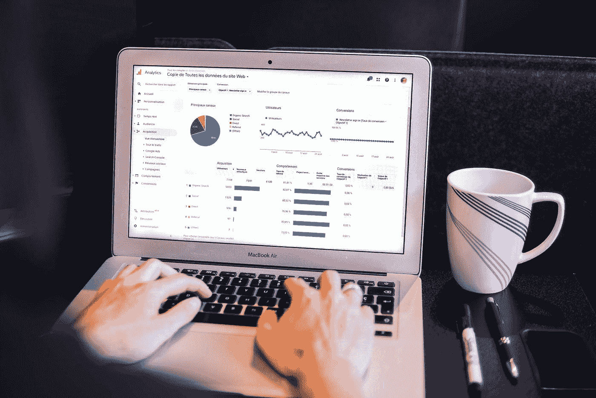
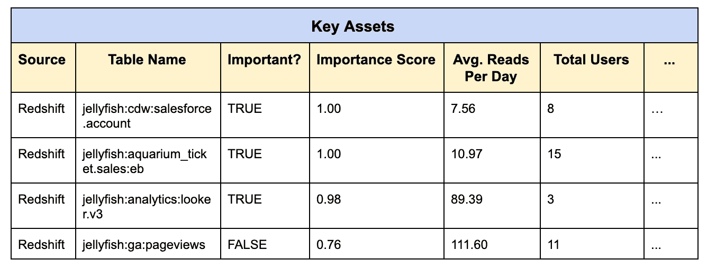
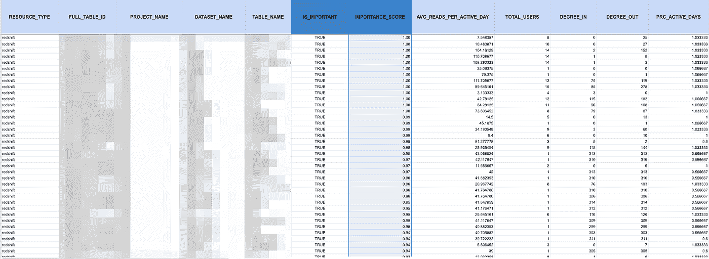

# “你在用那张桌子怎么解决？!"问题

> 原文：<https://towardsdatascience.com/how-to-solve-the-youre-using-that-table-problem-22bdabec57a1?source=collection_archive---------40----------------------->

## *如何快速识别数据仓库中最关键的表格和报告*

照片由[米利安·耶稣会士](https://unsplash.com/photos/eveI7MOcSmw)在 [Unsplash](http://www.unsplash.com) 上提供。

*随着公司越来越依赖数据来推动决策和创新，这些数据的及时性、准确性和可靠性变得非常重要。当您考虑到全球每天产生的超过 7.5 万亿(77 亿)GB 的* [*数据中只有一小部分是可用的*](https://betanews.com/2016/02/19/big-dark-data/) *时，跟踪哪些数据资产是重要的只会变得更加困难。*

*在本文中，我们将介绍* ***“关键资产】、*** *一些最优秀的数据团队采用的一种新方法，来展示您最重要的数据表和报告，以获得快速可靠的见解。*

你有没有想出最奇怪的方法来命名“相关”的表，如“IMPT”或“使用这个 _V2”？数据仓库迁移已经进行了四分之三，您是否发现自己不知道哪些数据资产是正确的，哪些是错误的？您的分析团队是否迷失在电子表格的海洋中，看不到救生衣？

如果你对这些问题中的任何一个回答是肯定的，你并不孤单。在过去的几年里，我与数百个数据团队交谈过，他们对自己公司数据资产的潜力感到兴奋和不知所措，他们负责维护一个不断发展的数据资产生态系统。

> 我们称之为“你在用那张桌子？!"问题，而且比你想象的更普遍。

以下是你可能正在经历的三个迹象:

# 您正在迁移到新的数据仓库

*就像水牛迁移穿过塞伦盖蒂平原一样，迁移到新的数据仓库可能是一个混乱而乏味的过程，让您的团队意识到数据(或水牛)不再适合或可用。图片来自*[*Jan Rix on Shutterstock*](https://www.shutterstock.com/image-photo/wildebeest-crossing-mara-river-during-annual-1007823028)*。*

随着数据团队越来越多地从本地数据仓库转移到雪花、红移和其他云仓库，或者在云仓库之间转移，了解哪些数据有价值以及哪些数据可以像渡渡鸟一样变得越来越重要。

不幸的是，数据验证和交叉引用通常是手动处理的，成本高、耗时且难以扩展。一位客户是一家全球金融服务公司的数据团队负责人，目前正在迁移到雪花，他透露说，他们“正在手动将 Redshift 中的表映射到 Tableau 中的报表，这样我们就知道将什么迁移到雪花和 Looker 中。”

通常，当数据团队从 Redshift 迁移到 Snowflake 时，他们最终会求助于两个数据仓库中相同表的副本之间的手动差距分析，因为**“了解表下游的哪些报告将有助于我们确定迁移的优先级，或者废弃我们不再需要的表。”**

# 您公司的数据分析师和数据科学家不知道使用什么数据

数据团队的第二个也是最常见的痛点是不知道什么数据最有用，更不用说有用了。

如果你和你的团队问了以下任何一个问题，他们可能正处于一个连史酷比都无法解决的谜团之中。以下是常见数据发现问题的列表。也许他们会产生共鸣:

*   我应该使用什么数据？
*   我找不到我需要的数据，我该怎么办？
*   很难理解什么是我们的“重要数据”……帮帮忙？
*   谁在用这张桌子？这些数据重要吗？

当这些问题被频繁问及时，您的公司明显缺乏数据信任和数据发现，这对您公司利用数据作为竞争优势的能力造成了损害。

# 您有大量的“数据债务”

*数据债务不仅仅是代价高昂；它会侵蚀用户的信任，导致糟糕的决策。图片由 Shutterstock 上的* [baranq](https://www.shutterstock.com/g/baranq) 提供。

像技术债务一样，**数据债务**指的是过时的、不准确的或者占用数据仓库中宝贵存储空间的数据资产。这种情况太常见了，即使是最先进的数据团队也会陷入困境，很难及时获得相关的见解。

**数据债在实践中是什么样子的？这里有三个强有力的指标:**

*   您的衣柜里有旧的数据框架(包括过时的、不准确的表和遗留数据类型)，团队可能会错误地使用它们。
*   您会收到不同作业和系统检查失败的警报，但它们都被忽略了，因为“事情总是这样。”
*   您已经更新了您的技术堆栈，迁移到了雪花，并且使用了最新的新工具，但不再利用相同的数据格式、数据表甚至数据源。

# 简介:关键资产

数据团队的任务是通过数据驱动的洞察来创建业务的可见性，但当涉及到他们自己的运营时，他们往往会盲目行事。相反，团队需要一个单一的视图来了解他们的数据的健康状况，这些数据是识别您的数据仓库中最关键的数据表和数据集的关键资产。

幸运的是，最好的数据可靠性和可发现性(目录)解决方案已经将它们集成到他们的产品中。通过利用机器学习，这些解决方案可以智能地映射您公司的静态数据资产，而无需从您的数据存储中提取数据，从而生成一个**“关键资产仪表板”**。

关键资产可能是:

*   许多人经常查询的表
*   ETL 过程大量使用的数据集，用于派生其他数据集
*   为许多或常用仪表板提供信息的表格
*   具有重要下游依赖性的外部来源

但是团队如何识别他们的关键资产呢？在其他变量中，我建议团队寻找具有以下特征的表和数据集:

*   经常被访问(例如，每天 AVG 读取次数)
*   频繁更新(例如，AVG 每天的写入次数)
*   被大量用户使用
*   定期更新/使用(即，每个单独数据资产的< 1–5 days since latest update)
*   Leveraged by a large number of ETL processes
*   Supports connectivity, in other words is read-from/written-to many other data assets
*   Experiencing a high data incident rate (over days/weeks/months)
*   Queried recently/frequently by BI tools

Additionally, Key Assets should include an **【重要性分数】**)。此分数是关于数据使用的关键指标的组合，表明哪些资产对您的组织最重要。分数越高，该资产越有可能成为您团队的重要资源。

*虽然过于简单，但这个关键资产仪表板的呈现具有搜索功能，允许用户查找特定的资产，同时还可以根据统计数据(如每天的平均表读取次数和表用户总数)明确哪些资产是重要的，哪些资产可以折旧或清理。图片由作者(巴尔·摩西)提供。*

# 利用关键资产实现数据信任和发现

随着 [**数据架构**](https://www.montecarlodata.com/what-is-a-data-mesh-and-how-not-to-mesh-it-up/) 变得越来越孤立和分散，我看到了关键资产和类似解决方案在优化数据发现和恢复数据信任方面的巨大潜力，包括:

# 促进更顺畅的仓库迁移

引领 [**数据仓库迁移**](https://www.montecarlodata.com/how-to-migrate-to-snowflake-like-a-boss/) 可能是一项既令人兴奋又令人畏惧的任务。通常，数据团队被迫手动处理数据验证。有了关键资产，团队可以自动识别哪些表正在使用和依赖，哪些表可以废弃，从而使这个过程更快。

# 更容易找到用于智能决策的重要数据

关键资产功能可以轻松找到重要数据，从而做出明智的决策。图片由作者(巴尔·摩西)提供。

很可能整个公司的分析师都在为阳光下(或者更确切地说，在你的仓库里)的每个数据集制作 v1、v2、v3 和 v4；当你在进行批判性分析时，发现并知道哪些是真正相关和重要的将会有很大的不同。如果用户还可以搜索特定的数据资产，则加分。关键资产支持这两种功能。

# 减少数据债务

关键资产使清理“垃圾”表和管道变得更加容易，通过突出显示哪些数据表被广泛使用，哪些已经过时甚至不准确，您可以减少数据仓库或湖中的数据债务。减少数据债务的传统方法严重依赖于代码密集型集成(即开源)或围绕工作流编排工具的临时 SQL 查询。关键资产提供了一种更简单、更快捷的方法来获取这些指标及更多信息。

# 实现端到端的数据可观察性

从摄取到分析，[**端到端的数据可观测性**](https://www.montecarlodata.com/data-observability-the-next-frontier-of-data-engineering/) 是任何一个严肃的数据工程团队必备的。通过了解您的重要数据位于何处，以及它在管道的所有阶段是如何被使用的，已经被否决的表和数据集可以被忽略，关键表可以浮出水面。

# 通过机器学习自动生成关键资产

在我看来，一个智能但安全的关键资产仪表板应该自动生成，利用机器学习算法，通过拍摄数据生态系统的历史快照来学习和推断你的数据资产，而不是实际访问数据本身。

# 通过消除数据停机时间提高数据可靠性

自动生成的单一真实来源(如关键资产)是理解如何利用表的逻辑结论，可防止[数据停机](https://www.montecarlodata.com/how-to-fix-your-data-quality-problem/)的影响在您的数据管道中显现。

使用关键资产，用户可以搜索并确定哪些数据资产需要密切监控以发现可能的异常或问题，哪些数据资产可以暂时搁置。这种解决方案可以帮助团队自动消除过时数据的嘈杂警报，并只监视业务部门经常使用的数据资产。

> 我不知道你怎么想，但我等不及“你要用那张桌子？!"问题已经成为过去。

***想要识别您自己的数据组织的关键资产？*** [***蒙特卡洛***](http://montecarlodata.com?utm_source=blog&utm_medium=medium&utm_campaign=key assets&utm_term=october) ***可以帮忙。***