# 如何在 Power BI 中按时间顺序排列月份

> 原文：<https://towardsdatascience.com/how-to-sort-months-chronologically-in-power-bi-73dac77850e1?source=collection_archive---------8----------------------->

## 了解如何在 Power BI 中按时间顺序对月份字段进行排序

图片来自 [Unsplash](https://unsplash.com/photos/LtNvQHdKkmw)

在本文中，我将演示如何在 Power BI 中按时间顺序对月份进行排序。可视化一段时间内的销售数据是最有影响力的报告方式之一。通常，设计图表来显示指标随时间的趋势或增长是非常重要的。时间段可以是任何时间，例如几天、几周、几个月或几年。它基本上让您了解指标在特定时间段内是如何增加或减少的。

在 Power BI 中，您还可以按特定的选定时间段可视化您的指标。这通常通过绘制显示一段时间内趋势的折线图来实现，或者通过使用垂直条形图来显示该时间段内的特定指标，甚至简单地使用表格矩阵来以文本方式显示结果。出于本文的考虑，为了简单起见，我们将只考虑第三种情况，即表格矩阵。然而，同样的解决方案可以适用于任何类型的包含时间段的图表。

有时，当您将数据导入 Power BI 时，特别是如果您在原始数据源中有月或季度作为文本数据(来自平面文件的*，那么 Power BI 无法理解导入的字段是否是实际的日期字段(日/月/年等)。)或者只是简单的文本数据。在这种情况下，在导入后，月份或季度按字母顺序排序，而不是按时间顺序排序，这是一个错误，取决于需求和与开发趋势报告不太相关的东西。在这个解决方案中，我们将首先学习如何重现错误，然后了解如何对数据模型进行必要的更改以解决这个错误，并在 Power BI 中按时间顺序对月份进行排序。*

# 重现错误

让我们首先试着重现这个错误，然后我将解释如何在幂 BI 中按时间顺序排列月份。为了重现错误，我们需要创建一个简单的 CSV 文件，如下图所示。

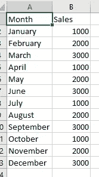

*图 1 — CSV 数据集*

如上图所示，我们只有两个简单的列— *月*和*销售*。*月*列出了从“1 月”到“12 月”的所有值以及相应的*销售额*值。一旦创建了 CSV 文件，下一步就是打开 Power BI 并将其连接到这个数据集。

打开 Power BI Desktop，按照以下步骤将该数据提取到 Power BI 数据模型中:

选择**获取数据**，并从出现的菜单中选择**文本/CSV** 。

*图 2 —获取功率 BI 中的数据*

浏览上一步刚创建的文件，点击**打开。**

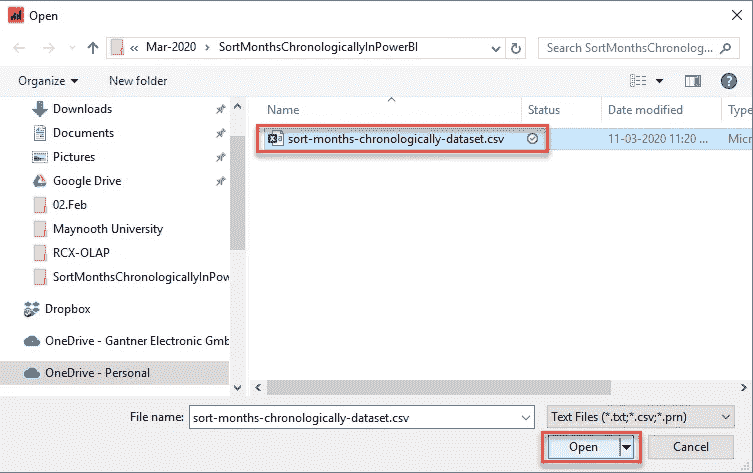

*图 3 —浏览数据集*

在出现的下一个对话框中，验证数据并点击**加载。**

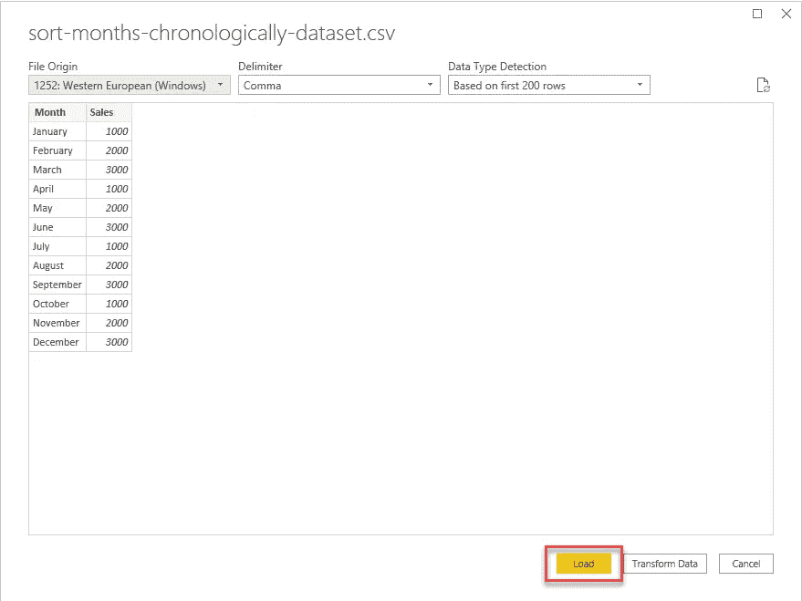

*图 4 —将数据加载到 Power BI 模型中*

您将看到数据已经加载到 Power BI 中。

点击*可视化* *窗格*中的**表格**，将字段拖放到如图所示的表格中。

在创建的新表中，您可以看到月份现在按字母顺序排序。

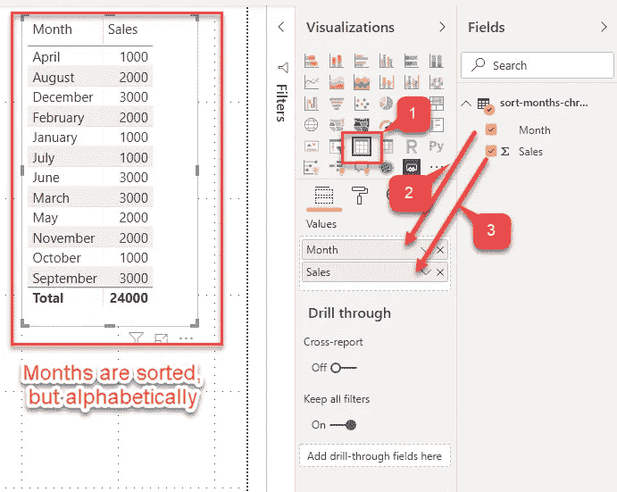

*图 5 —创建表格*

在 Power BI 桌面中，选择**转换数据**，然后点击**转换数据。**

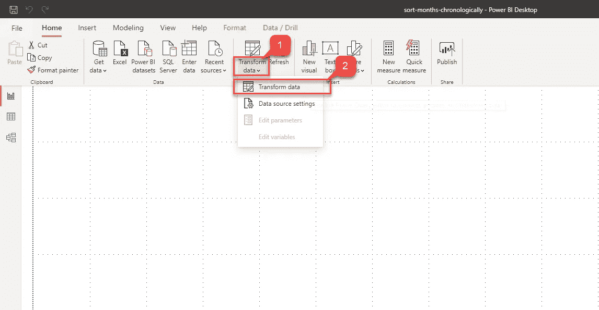

*图 6 —转换数据*

在打开的 **Power Query Editor** 中，导航到打开的 **Add Column** 选项卡。

选择**自定义栏**，输入公式，如下图所示。

对于自定义列的名称，我使用“ **Date** ”，因为该列将存储虚拟日期值。

在自定义列的公式中，使用以下内容:= " 1 " &[月] & " 2020"。

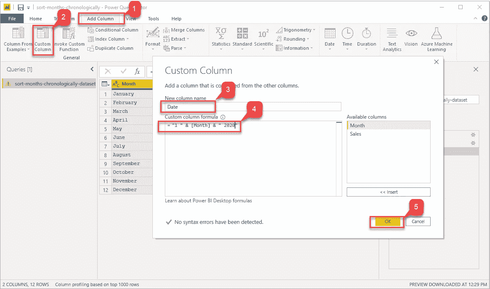

*图 7 —添加虚拟日期列*

因此，基本上，我们试图实现的只是创建一个虚拟日期值，方法是将“1”作为日期，将“2020”作为年份值添加到已经存在的月份中。

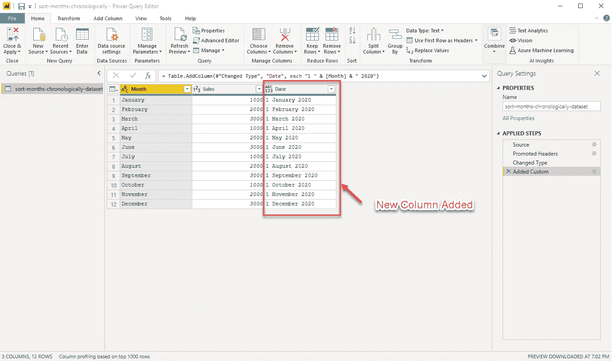

*图 8 —增加了新的日期栏*

下一步是将这个新字段 **Date** 转换为 *date 数据类型*。右键点击该列，选择**更改类型**，然后选择**日期。**

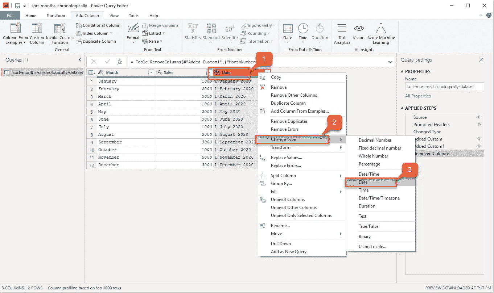

*图 9 —改变数据类型*

您可以看到该列的数据类型和值已经更改。

*图 10 —更改了数据类型*

我们现在将再添加一个自定义列，从该字段中提取月份数。点击**添加列**，然后点击**自定义列。**

提供字段名称为“**月份号**”，公式为“=日期”。月份([日期])”并点击**确定。**

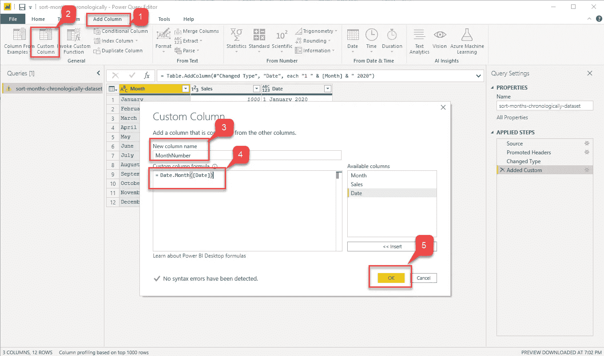

*图 11 —添加新的月份号列*

现在，您将看到数据集中又添加了一列。

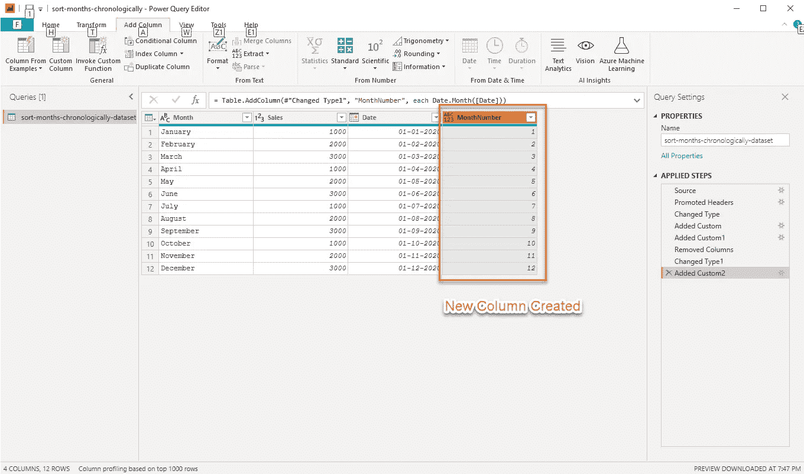

*图 12 —增加了新的月份号列*

我们将把这个字段的数据类型改为整数。右键点击**月份号**，选择**更改类型**，然后选择**整数。**

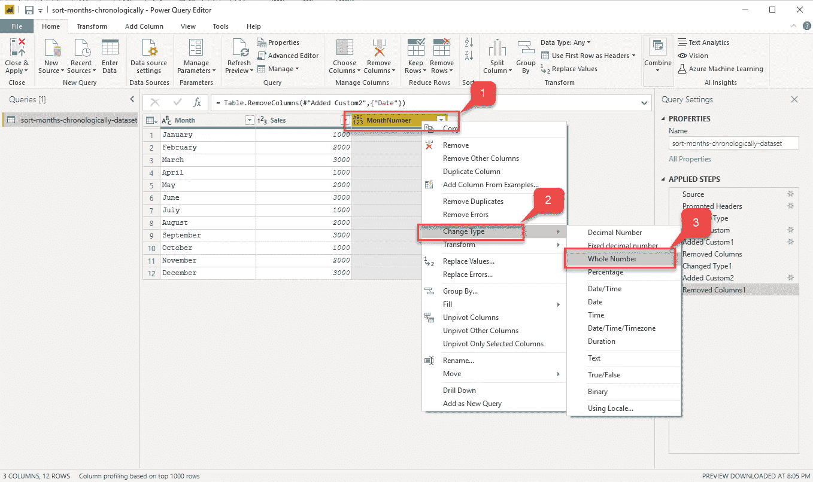

*图 13 —将数据类型更改为整数*

由于我们的数据模型中有了所需的字段 **MonthNumber** ，我们可以删除在前面的步骤中创建的虚拟日期字段。右键单击**日期**栏并选择**移除。**

最后，您可以通过导航到**主页**并选择**关闭和应用来关闭 Power Query 编辑器窗口。**

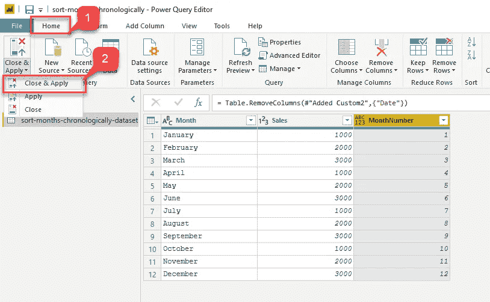

*图 15 —关闭电源查询编辑器*

# 在 Power BI 中选择按时间顺序排列月份的列

既然我们已经在数据模型中进行了必要的更改，以在 Power BI 中按时间顺序对月份进行排序，那么最后一步就是按照 **MonthNumber** 的升序对**月份**进行排序。请按照下面的步骤对月份进行排序。

点击左侧窗格上的**数据**选项卡。

选择**月**列，然后在上方工具栏的**排序**窗格中选择**按列排序**。

在出现的下拉菜单中，选择**月份号**并导航至**报告**选项卡。

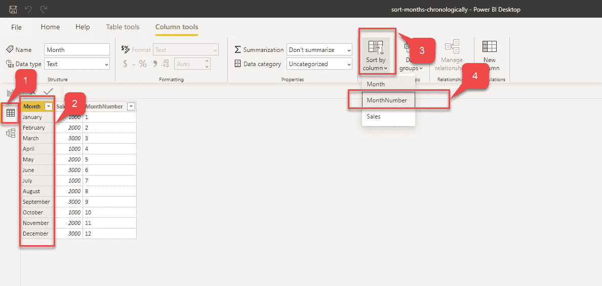

*图 16 —按月号排序*

您现在可以看到，月份是按时间顺序而不是字母顺序排序的。

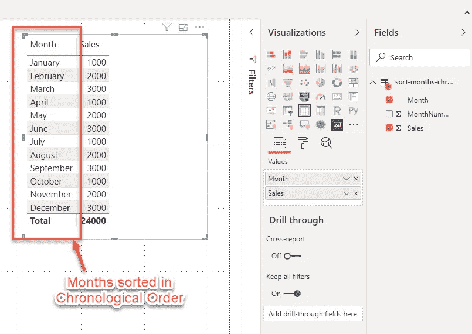

*图 17——按时间顺序排列的月份幂 BI*

此外，如果您想隐藏**月份号**字段，您只需右击它并选择**隐藏**。

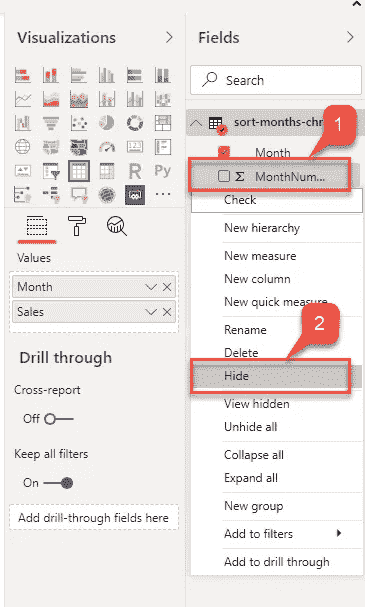

*图 18 —隐藏月份号字段*

您将拥有原始 CSV 文件中的数据集，但月份是按时间顺序排序的。

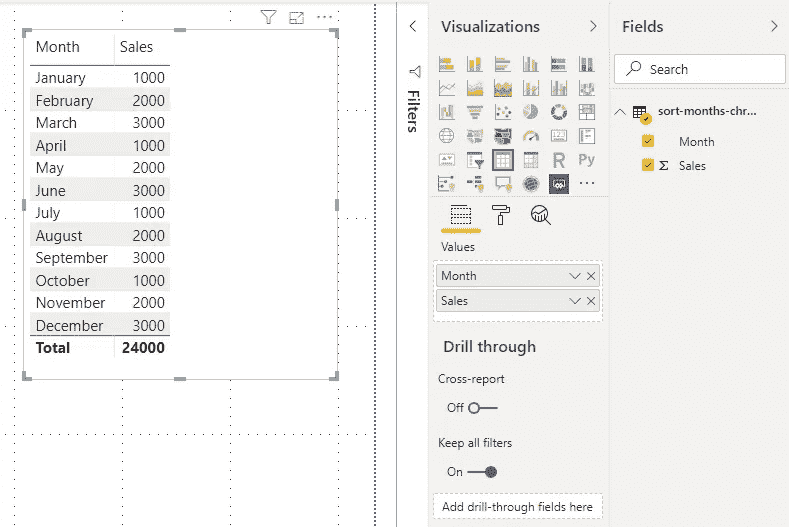

*图 19——以幂 BI 形式按时间排序的月份*

# 结论

在本文中，我解释了如何在 Power BI 中按时间顺序对月份进行排序。我还提到了复制错误的步骤，然后提供了如何解决问题并最终获得预期结果的分步指导。

*原载于 2020 年 3 月 16 日 https://www.sqlshack.com***。**