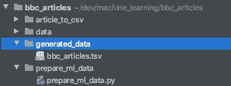
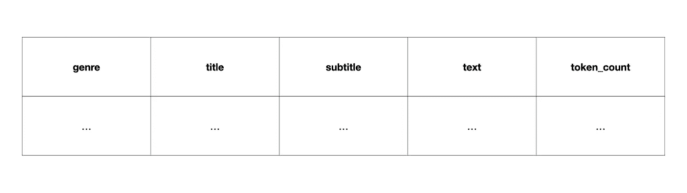

# 如何用 Python 将一个数据帧分割成训练集和测试集

> 原文：<https://towardsdatascience.com/how-to-split-a-dataframe-into-train-and-test-set-with-python-eaa1630ca7b3?source=collection_archive---------9----------------------->

## 在熊猫数据帧上使用 sklearn train_test_split 的简短指南

作者插图

在这篇短文中，我描述了如何通过应用 sklearn 的 train_test_split 函数，将数据集分割成用于机器学习的训练和测试数据。我使用我上一篇文章中的程序创建的数据框。这些数据基于 D. Greene 和 P. Cunningham 发表的原始 BBC 新闻文章数据集[1]。

如果你感兴趣，可以在这里查看源代码。

如果您错过了我的第一个从文本文件中提取信息的指南，您可能想要查看它以更好地理解我们正在处理的数据。

 [## 用 Python 将文本文件转换成数据表

### 从任何文本文件中提取信息的可重用方法

towardsdatascience.com](/transforming-text-files-to-data-tables-with-python-553def411855) 

# 数据理解

因为我想让本指南保持简短，所以我不会像在我的上一篇文章中那样详细描述这个步骤。在这一部分要提到的最重要的信息是数据是如何构造的以及如何访问它。

从下面的截图可以看出，数据位于 generated_data 文件夹中。一旦创建了这些文件，我们还想将训练和测试数据保存到这个文件夹中。此外，该脚本在 prepare_ml_data.py 文件中运行，该文件位于 prepare_ml_data 文件夹中。

文件系统的屏幕截图

正如我在关于将文本文件转换为数据表的上一篇文章中所介绍的，bbc_articles.tsv 文件包含五列。然而，对于本教程，我们只对文本和流派列感兴趣。

数据集的列

# 加载数据

第一步，我们希望将数据加载到我们的编码环境中。为此，我们需要存储数据的目录的路径。我们保存本地变量的路径来访问它，以便加载数据，并使用它作为保存最终训练和测试集的路径。由于数据存储在与运行脚本的文件不同的文件夹中，我们需要在文件系统中返回一级，在第二步中访问目标文件夹。我们通过加入“..”来实现这一点以及导致‘的数据文件夹../generated_data/'。

使用 generated_data 文件夹的路径，我们创建另一个指向数据文件本身的变量，称为 bbc_articles.tsv。由于它是一个制表符分隔值文件(tsv)，我们需要添加' \t '分隔符，以便将数据作为 Pandas Dataframe 加载。

# 选择要分割的数据(可选)

将数据分成训练集和测试集不需要以下命令。然而，由于我不需要数据集的所有可用列，所以我选择了想要的列，并创建了一个新的 dataframe，其中只有“text”和“genre”列。

# 分割和保存

现在，我们已经准备好了分割它的数据。幸运的是，sklearn 库的 train_test_split 函数能够处理 Pandas 数据帧和数组。因此，我们可以简单地通过提供数据集和其他参数来调用相应的函数，例如:

*   **test_size** :
    该参数表示应该包含在测试分割中的数据集的比例。这个参数的缺省值被设置为 0.25，这意味着如果我们不指定 test_size，那么产生的分割由 75%的训练数据和 25%的测试数据组成。
*   **random_state** :
    该参数控制分割前应用于数据的洗牌。通过定义随机状态，我们可以在多个函数调用中重现相同的数据分割。
*   **洗牌** :
    该参数表示数据在分割前是否需要洗牌。因为我们的数据集是按流派排序的，所以我们肯定要打乱它。否则，训练集和测试集将不会包含相同的类型。

在分割数据之后，我们使用目录路径变量来定义保存训练和测试数据的文件路径。通过将数据帧转换为 csv，同时使用' \t '作为分隔符，我们创建了制表符分隔的训练和测试文件。

# 结论

在这篇短文中，我描述了如何加载数据，以便将数据分成训练集和测试集。相应的数据文件现在可以用于训练和评估文本分类器(尽管取决于模型，可能需要额外的数据清理)。

在未来的文章中，我将描述如何建立不同的深度学习模型(如 LSTM 和伯特)来训练文本分类器，这些分类器根据文章的文本来预测文章的体裁。下面是我的文章的链接，在这篇文章中，我使用 FARM 框架为文本分类微调 BERT。

 [## 微调用于 FARM 文本分类的 BERT

### 使用最先进的 NLP 模型进行简单快速的迁移学习

towardsdatascience.com](/fine-tuning-bert-for-text-classification-with-farm-2880665065e2) 

非常感谢你的阅读和快乐编码！

# 参考

1d .格林和 p .坎宁安。核心文档聚类中对角优势问题的实际解决方案。ICML 2006。