# 如何拆分 Shapefiles

> 原文：<https://towardsdatascience.com/how-to-split-shapefiles-e8a8ac494189?source=collection_archive---------20----------------------->

## 切割阿拉斯加附近的西阿留申群岛(它们大多无人居住)


阿拉斯加。[杆长](https://unsplash.com/@rodlong?utm_source=medium&utm_medium=referral)在[上拍照](https://unsplash.com?utm_source=medium&utm_medium=referral)

有时您只需要 shapefile 的一部分。根据哪一部分和 shapefile 源，这可能非常简单，也可能不那么简单。例如，前几周，我在绘制美国各州向联邦消费者金融保护局投诉的相对比率(更多[此处](/data-prep-with-spark-dataframes-3629478a1041?source=friends_link&sk=1393493838aa8a9f7d4438b1af778c9f))，我的 choropleth 是这样绘制的:

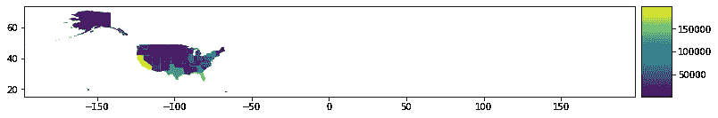

虽然在这个比例下很难看到，但是西阿留申群岛穿过了 180 度经线[,形成了这幅试图将球体展平为矩形的不连贯地图。](https://en.wikipedia.org/wiki/180th_meridian)

解决这个问题有几种选择:

1.  将不需要的(同样是无人居住的)面从其多面簇中分离出来
2.  对整个地理数据框使用 shapely 函数`.intersects()`
3.  在 matplotlib 中设置绘图的 x 极限
4.  将正/东经多边形转换为负/西经多边形
5.  使用 Cartopy 进行不同的地图投影，而不是拆分形状

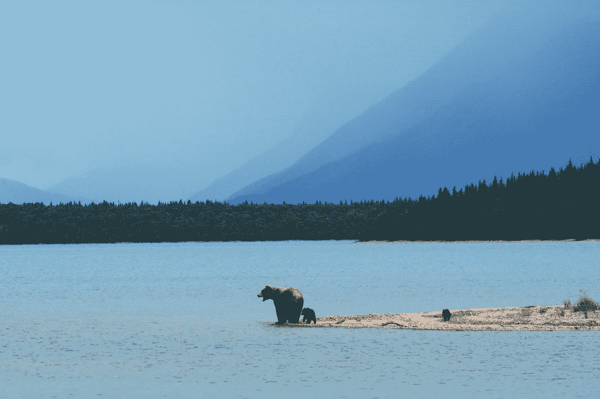

更多的阿拉斯加，而不是西阿留申群岛。[帕克森·沃尔伯](https://unsplash.com/@paxsonwoelber?utm_source=medium&utm_medium=referral)在 [Unsplash](https://unsplash.com?utm_source=medium&utm_medium=referral) 上拍摄的照片

我们开始吧:

# 将不需要的(同样是无人居住的)面从其多面簇中分离出来

我想从这个选项开始，因为它解决了一个我一次又一次碰到的更普遍的问题。如何在`shapely`和/或`geopandas`中拆分多个多边形，然后将它们放回一起用于 choropleths。

首先，我加载 shapefiles 并选择我想要处理的记录，在本例中是阿拉斯加。(谢谢[美国人口普查](https://www.census.gov/geographies/mapping-files/time-series/geo/carto-boundary-file.html)提供的 shapefiles！#opendata)

```
# import necessary packages
import geopandas as gpd
from matplotlib import pyplot as plt# load shapefile
states_gdf = gpd.read_file('./data/cb_2018_us_state_5m.shp')# select Alaska
alaska_gdf = states_gdf.loc[states_gdf['STUSPS'] == "AK"]
```

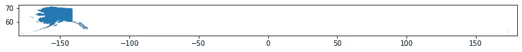

修改前的阿拉斯加地块。

“geometry”列返回一个单项数据帧。您可以通过`.values`访问形状良好的几何图形列表。在这种情况下，我们的单记录数据框架有一个项目列表。通过访问第一个值，我们得到了阿拉斯加形状优美的多多边形。

```
alaska_mp = alaska_gdf['geometry'].values[0]
```

或者，您可以使用原始状态地理数据框架，但我总是忘记到底有多少层，并且发现使用我的单记录数据框架进行猜测和检查更容易。

```
alaska_mp_alt = states_gdf.loc[states_gdf['STUSPS'] == "AK", 
                               'geometry'].values[0]
```

使用多重多边形，您可以像访问列表或数组一样访问每个多边形。

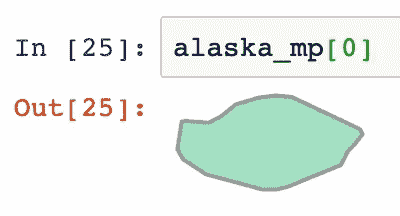

阿拉斯加多重多边形中的第一个多边形。

在其当前形式下，当使用 Shapely 函数(如)时，整个多边形集合(多多边形)被视为一个整体。相交())。为了分别考虑每个面，我将多重面转换为其自己的地理数据框架:

```
# create the GeoDataFrame
ak_exp_gdf = gpd.GeoDataFrame(alaska_mp)# set the geometry column
ak_exp_gdf.columns = ['geometry']
```

现在我们有了一个地理数据框，其中每一行都是一个多边形，它们共同构成了阿拉斯加，我们可以根据我们想要或不想要的位置来过滤这些地理数据框了。我们需要制作一个形状优美的多边形，用来判断和过滤阿拉斯加的每一片土地。我们需要一个多边形来覆盖你想要(或不想要)的所有区域，我们将使用`.intersects()`或你选择的另一个 shapely 函数来分类你的形状。

多边形是用一列点/顶点创建的。最后一个点会自动连接到第一个点，因此您不需要自己闭合回路。

```
from shapely.geometry import Polygon# create polygon that covers Alaska up to the 180th Meridian
target_poly = Polygon([(-180, 50), (-180, 75), 
                       (-100, 75), (-100, 50)])
```

现在我们可以使用这个多边形和 shapely/geopandas 的`.intersects()`进行过滤。

```
western_isles = ak_exp_gdf[al_exp_gdf.intersects(target_poly) == 
                           False].copy()
eastern_ak = ak_exp_gdf[al_exp_gdf.intersects(target_poly)].copy()
```

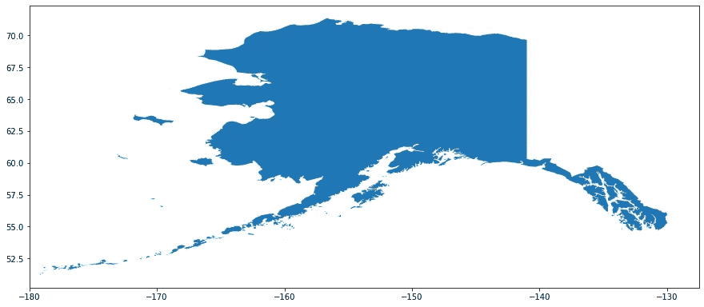

阿拉斯加东部的地块

厉害！！！


照片由 [McKayla Crump](https://unsplash.com/@funkmastacrump?utm_source=medium&utm_medium=referral) 在 [Unsplash](https://unsplash.com?utm_source=medium&utm_medium=referral) 上拍摄

## 将面的地理数据框架合并为多面

现在我们有了感兴趣的阿拉斯加多边形，我们准备将此几何图形放入我们的州地理数据框架中。我们使用“by”参数，用`.dissolve()`将一个多边形的数据帧组合成一个或多个多多边形。(我仍然不明白让“溶解”感觉像是“粘合”或“结合”的同义词的框架——也许我们正在溶解边界？)

```
# add a column to groupby
eastern_ak['STUSPS'] = 'AK'# combine polygons/records into a single multipolygon/record
alaska_trimmed = eastern_ak.dissolve(by='STUSPS')# add this new multipolygon in place of the old alaska multipolygon
states_trimmed = states_gdf.copy()
states_trimmed.loc[states_trimmed['STUSPS'] == 'AK', 'geometry']
  = alaska_trimmed['geometry'].values
```

我们准备好了！

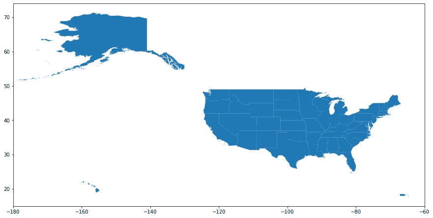

修剪过的美国地图。充分披露:我还修剪关岛，北马里亚纳群岛联邦，美属萨摩亚出这个阴谋。

这是一个包含阿拉斯加的 choropleth 示例——水域面积与陆地面积的比率。阿拉斯加的巨大面积确实让我们很难看到东部的一些州，但控制局面很好，可以自由决定是否(以及如何)通过修剪来包含不同的形状。

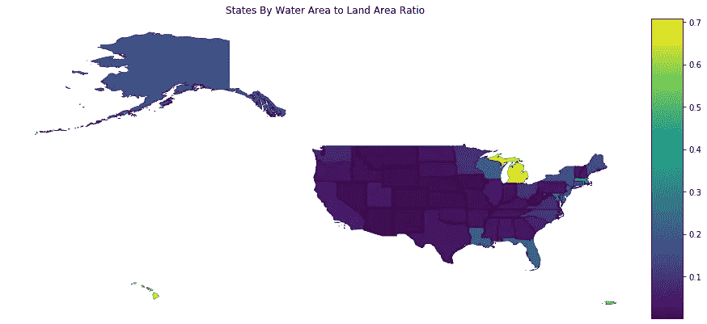

# 在整个地理数据框上使用匀称的`.intersects()`

您也可以修改几何图形，而无需将多重多边形分解为单独的多边形。这种方法确实有其特殊性，但是代码行要少得多。请注意，使用`GeoDataFrame.intersection(*shape*)`会返回一系列几何图形，而不是添加了新信息的原始地理数据框。您需要添加或替换一个列来将此信息存储在现有的地理数据框中。

```
from shapely.geometry import Polygon# create a polygon with the desired dimensions of the map
desired_map = Polygon([(-180, 80), (-60, 80), (-60, 15), 
                       (-180, 15)])# create a new copy of the states GeoDataFrame for this example
states_trimmed_v3 = states_gdf.copy()# get the intersection of the states geometries with the desired map states_trimmed_v3['geometry'] = states_gdf.intersection(desired_map)
```

如果你试图直接`.plot()`这个几何集合，你可能会得到一个`TypeError: ‘Polygon’ object is not subscriptable`。当您有一些记录与您的相交几何不重叠时，就会发生这种情况，在我们的示例中，就是太平洋地区。在这种情况下`.intersection()`返回一个空多边形。我的解决方案是在绘图前过滤这种情况。

```
states_trimmed_v3[states_trimmed_v3['geometry'] != Polygon()].plot()
```

我们得到了与上面相同的结果，不需要找到令人讨厌的形状，分割多重多边形，然后将多边形融合成一个单一的多重多边形。根据您的用例，这绝对是一个好的选择。

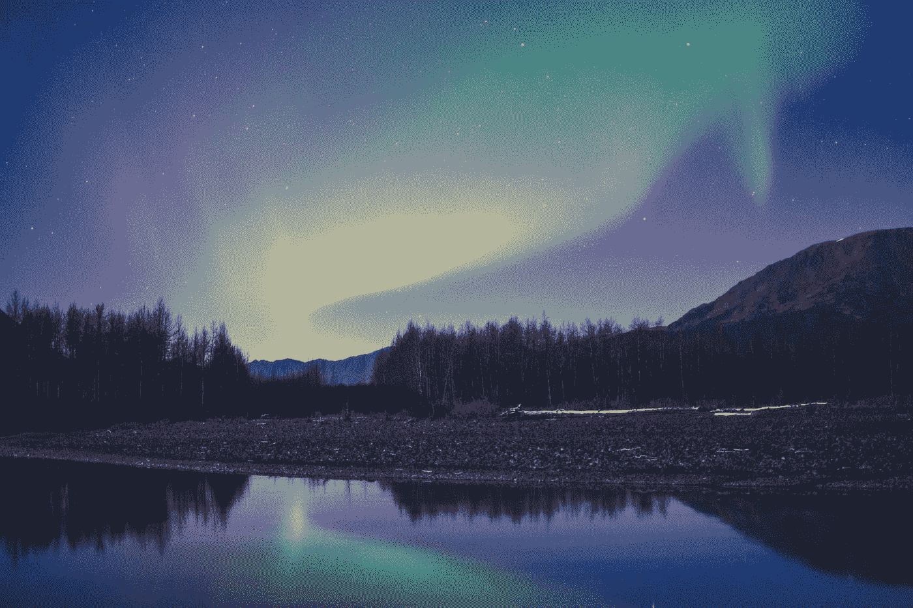

美丽的阿拉斯加天空。照片由[麦克凯拉·克伦普](https://unsplash.com/@funkmastacrump?utm_source=medium&utm_medium=referral)在 [Unsplash](https://unsplash.com?utm_source=medium&utm_medium=referral) 上拍摄

# 在 matplotlib 中设置绘图的 x 极限

另一个简单的选择是使用`matplotlib`的图形界面来删除任何不想要的区域。

```
fig, ax = plt.subplots(figsize=(15,10))
alaska_gdf.plot(ax=ax)
ax.set_xlim(-180, -128)
```

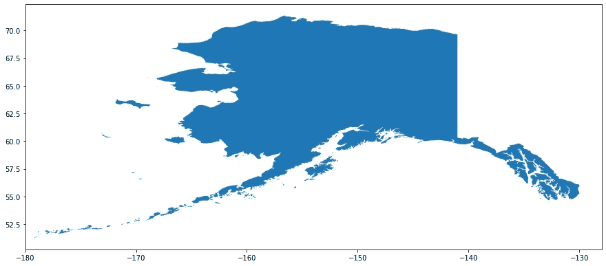

使用 matplotlib 的绘图选项 ax.set_xlim()修剪阿拉斯加

# 将正/东经多边形转换为负/西经多边形

如果你想保留投影和阿留申群岛西部，你可以使用`.translate()`将这些多边形的 x 值移动-360°。该选项使用上文描述的[分割多多边形的技术](#3ab2)

```
# shift the western isles by 360 degrees
western_isles_shifted = western_isles.translate(xoff=-360)# convert to GeoDataFrame
west_ak_shift_gdf = gpd.GeoDataFrame(western_isles_shifted)
west_ak_shift_gdf.columns = ['geometry']# add 'STUSPS' column
west_ak_shift_gdf['STUSPS'] = 'AK'# combine the western and eastern parts into the same dataframe
ak_shifted_actual_gdf = west_ak_shift_gdf.append(eastern_ak, 
                                                 ignore_index=True)# combine/dissolve into a single MultiPolygon
ak_shifted_actual_dissolved = 
                         ak_shifted_actual_gdf.dissolve(by='STUSPS')
```

这会生成 x 值为-190 到-125 的阿拉斯加。在绘图时，您可能需要调整 x 刻度标签，以符合传统的-180°到+180°约定。

```
fig, ax = plt.subplots(figsize=(15, 12))
ak_shifted_actual_dissolved.plot(ax=ax)# get the locations and labels of the x-ticks
locs, labels = plt.xticks()# set the first label in labels to 170 instead of -190
labels[1] = '170'# set the x-ticks with new labels (keeping the locs)
plt.xticks(locs, labels)
```

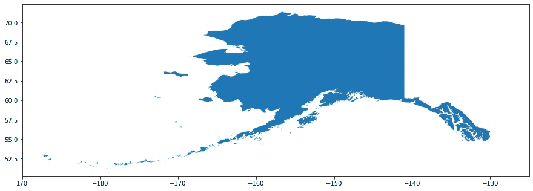

阿拉斯加和所有的阿留申群岛。

注意:我试图将整个美国移动+30 °,但这只改变了 x 轴上的 x 刻度值，而没有将地图最右边的部分移到左边。

# 对 Cartopy 使用不同的地图投影

或者，您可以使用`Cartopy`根据自己的喜好改变地图投影。我喜欢这个选项！它允许您将地理空间数据调整到对项目最有意义的视图。

首先，用`conda install -c conda-forge cartopy`安装或查看[完整安装指南](https://scitools.org.uk/cartopy/docs/latest/installing.html#installing)。请注意，我在 conda-forge 通道上也安装了 geopandas 将所有这些包及其依赖项安装在同一个通道上可能很好。

那你准备好了！基本使用与上述相同的投影(平板托架):

```
# set figure size
fig = plt.figure(figsize=(15, 12)# set axis with desired projection
ax = plt.axes(projection=ccrs.PlateCarree())# add shapes, indicating their original projection
ax.add_geometries(states_gdf['geometry'], 
                  crs=ccrs.PlateCarree())# add gridlines
gl = ax.gridlines(crs=ccrs.PlateCarree(), draw_labels=True,
                  linewidth=.5, color='gray', alpha=0.5)# display map
plt.show();
```

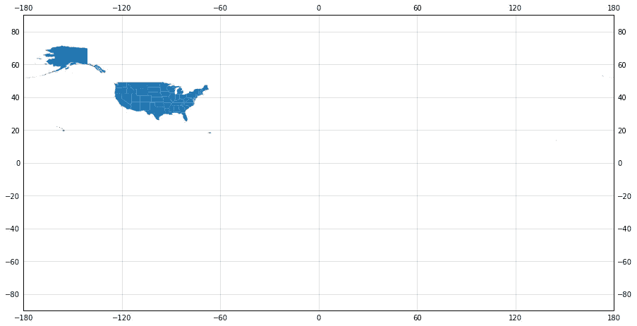

美国地图与卡雷板投影。

你可以在这里查看所有的预测。在我的例子中，允许你设置视图中心的投影正是我所寻找的。

```
# set desired projection/view
ax = plt.axes(projection = ccrs.Orthographic(central_longitude=-100, 
                                             central_latitude=40))# add your shapes (indicating their existing projection)
ax.add_geometries(states_gdf.geometry, crs=ccrs.PlateCarree())# add coastlines and gridlines for context
ax.coastlines(linewidth=.5)
ax.gridlines()
```

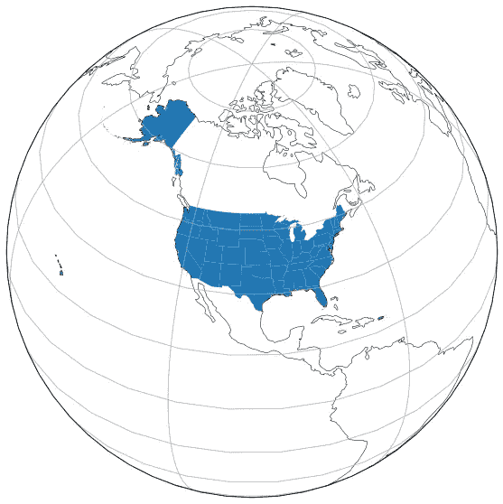

未用正交投影修剪的美国

您还可以使用`ax.set_extent(*xmin, ymin, xmax, ymax*)`聚焦于特定区域。

若要调整几何图形的颜色，请使用各种面颜色分别添加它们。例如与上述相同的 choropleth:

```
from matplotlib.colors import Normalize# value normalization for the color map
values = list(states_trimmed_v2['water:land'])
norm = Normalize(vmin=min(values), vmax=max(values))# select color map
cmap = plt.cm.get_cmap('viridis')#create chorpleth: set fig and ax projection
fig = plt.figure(figsize=(15,15))
ax = plt.axes(projection = ccrs.Orthographic(central_longitude=-100, central_latitude=40))# add each state to the ax with its appropriate facecolor
for state_i in states_trimmed_v2.index:
    geom = []
    geom.append(states_trimmed_v2.loc[state_i, 'geometry'])
    facecolor = cmap(norm(states_trimmed_v2.loc[state_i, 'water:land']))
    ax.add_geometries(geom, 
                      ccrs.PlateCarree(), 
                      facecolor=facecolor, 
                      edgecolor='grey', 
                      linewidth=.2)

ax.set_title('States By Water Area to Land Area Ratio', fontsize=20)
ax.coastlines(linewidth=.2)
ax.gridlines()
```

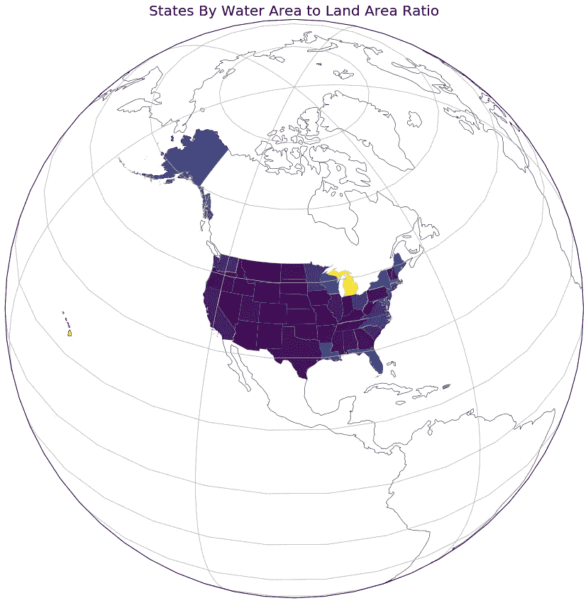

带有卡通图案的 Choropleth

有关更多信息，请查看以下资源:

*   使用地理空间数据:[这篇博文](/puppies-python-analyzing-geospatial-data-93dd9dc3137?source=friends_link&sk=6486448b7c31de38bc6fc15a3e62f617)(由你的真实作者撰写)
*   Cartopy 简介:[由 geohackweek 发布](https://geohackweek.github.io/visualization/04-geopandas-and-cartopy/)

在这里找到 GitHub [回购](https://github.com/allisonhonold/splitting_shapes)。编码快乐！

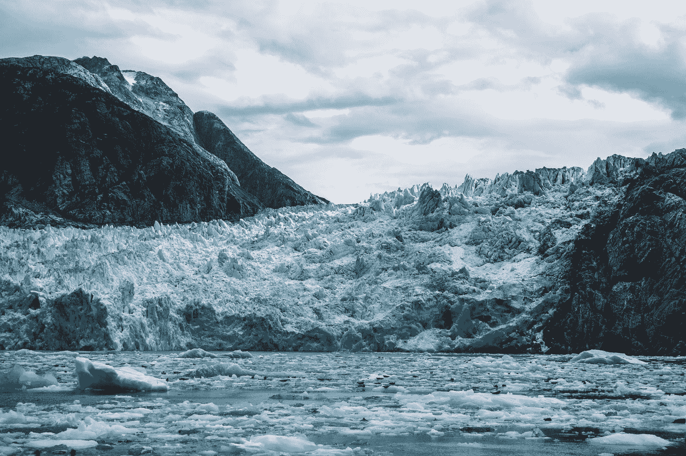

[黄斌](https://unsplash.com/@ronaldwong57?utm_source=medium&utm_medium=referral)在 [Unsplash](https://unsplash.com?utm_source=medium&utm_medium=referral) 上的照片