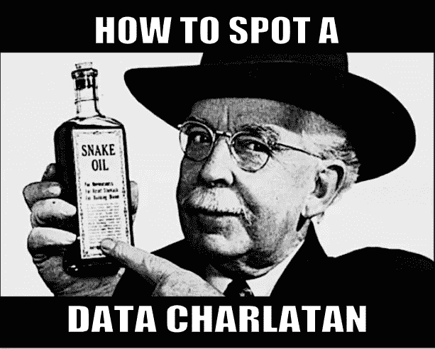
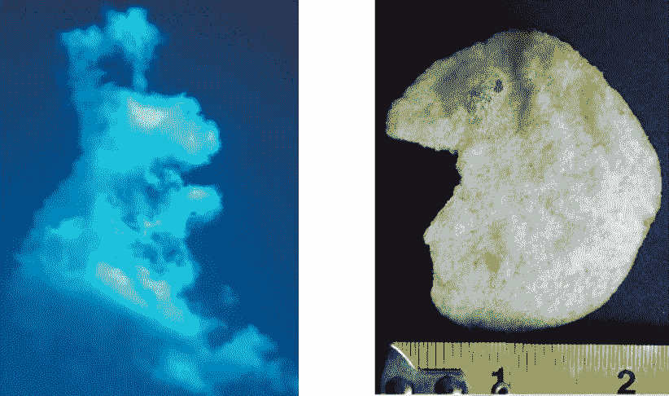
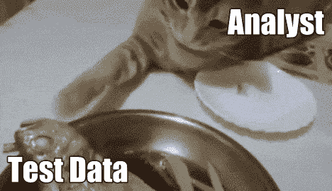
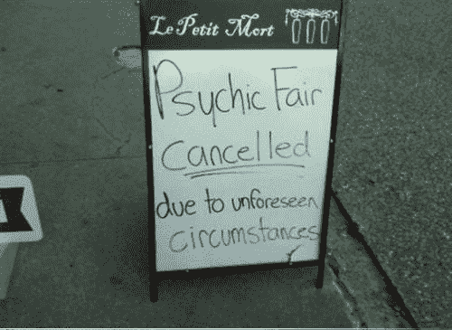

# 如何识别数据骗子

> 原文：<https://towardsdatascience.com/how-to-spot-a-data-charlatan-85785c991433?source=collection_archive---------0----------------------->

## 识别骗子和中和他们的蛇油的提示

你可能听说过[分析师](http://bit.ly/quaesita_versus)、 [ML/AI 工程师](http://bit.ly/quaesita_roles)和[统计员](http://bit.ly/quaesita_statistics)，但你听说过他们的高薪表亲吗？认识一下**数据江湖骗子**！

受到有利可图的工作的诱惑，这些叫卖者给合法的数据专业人士带来了坏名声。

图片:[来源](https://memegenerator.net/Snake-Oil/caption)

*【赶时间？向下滚动查看底部的快速摘要。]*

# 数据骗子无处不在

您的组织很可能已经窝藏这些骗子多年，但好消息是，如果您知道要查找什么，他们很容易识别。

> 数据骗子非常善于隐藏在众目睽睽之下，以至于你甚至可能*已经是*一个了，而你却没有意识到这一点。*啊哈！*

第一个警告信号是未能理解**分析和统计是非常不同的学科。我将在下一部分给你一个简要的概述，但是如果你想更深入地理解它，我在这里写了一整篇文章。**

# 不同学科

统计学家接受的训练是推断数据之外的东西，而分析师接受的训练是探索数据集内容。换句话说，分析师对数据中的内容做出结论，而统计学家对数据中的内容做出结论。

> 分析师帮助你提出好的问题(假设生成)，而统计学家帮助你得到好的答案(假设检验)。

也有奇特的混合角色能够身兼两职…但他们不会同时身兼两职。为什么不呢？[数据科学](http://bit.ly/quaesita_datasci)的一个核心原则是，如果你在处理[不确定性](http://bit.ly/quaesita_uncertainty)，那么使用*相同的*数据点来生成[假设](http://bit.ly/quaesita_damnedlies)和进行测试是无效的。当你的数据有限时，不确定性迫使你在统计和分析之间做出选择。*(此处* *找到我的解释* [*)。)*](http://bit.ly/quaesita_sydd)

> 没有统计数据，你就无法知道你刚刚形成的观点是否站得住脚。
> 
> 没有分析，你就像瞎飞一样，几乎没有机会驯服你未知的未知。

这是一个艰难的选择！当你发誓放弃知道你的新观点是否站得住脚的满足感时，你会睁开眼睛寻找灵感吗？或者你会冷汗直流，祈祷你选择问的问题——在没有任何数据的情况下独自沉思——值得你即将得到的严谨答案(*统计*)吗？

# 兜售后见之明的人

江湖骗子摆脱这种困境的方法是忽略它，在薯片中找到猫王的脸，然后假装惊讶于同一个薯片看起来像猫王。(统计假设检验的逻辑可以归结为一个问题:我们的数据是否足以让我们惊讶到改变主意。如果我们已经看到了数据，我们怎么会对它们感到惊讶呢？)

你觉得这些像兔子和猫王的肖像吗？或者总统肖像？关于这个话题的乐趣，请看我的相关文章[这里](http://bit.ly/quaesita_inkblot)。

每当江湖骗子找到一个模式，得到灵感，然后测试*相同的* *数据*以得到那个*相同的模式*发布结果，并在他们的理论旁边加上一两个合法化的 [p 值](http://bit.ly/quaesita_pesky)，他们实际上是在骗你(也许也在骗他们自己)。那个 p 值没有任何意义，除非你在查看数据之前先确认你的假设。

> 江湖骗子模仿分析师和统计学家的行为，却不理解其原因，这给整个数据科学领域带来了坏名声。

# 真正的统计学家总是发号施令

由于统计行业在严谨推理方面近乎神秘的声誉，数据科学领域的“蛇油”销量创下了历史新高。用这种方式作弊很容易不被抓到，尤其是如果你不知情的受害者认为这都是方程式和数据的问题。数据集就是数据集，对吧？不对。你如何使用它很重要。

> 数据集就是数据集，对吧？不对。你如何使用它很重要。

幸运的是，对于他们的潜在目标，你只需要一条线索就能抓住他们:*江湖骗子兜售马后炮。*

> *一个江湖骗子兜售后见之明——从数学上**重新发现他们已经知道存在于数据中的现象——而一个统计学家则提供远见测试。*

与江湖骗子不同，优秀的分析师是思想开放的典范，总是将鼓舞人心的见解与提醒相结合，提醒人们观察到的现象可能有许多不同的解释，而优秀的统计学家在做出判断之前会小心谨慎。

> 优秀的分析师是思想开放的典范。不像江湖骗子，他们不会在数据之外下结论。

# 分析师产生灵感

分析师可以免于发号施令……只要他们的数据不超过[。如果他们想对自己没见过的东西发表看法，那就是另一回事了。他们应该摘下他们的](http://bit.ly/quaesita_battle)[分析师](http://bit.ly/quaesita_hero)帽子，戴上他们的[统计学家](http://bit.ly/quaesita_battle)头盔。毕竟，不管你的正式职称是什么，没有规定说你不能想学就学。别把他们搞混了。

江湖骗子如何测试假设？迷因:[来源](https://imgur.com/r/gifs/4W6a7sg)。

擅长统计并不意味着你擅长分析，反之亦然。如果有人试图告诉你，检查你的口袋。如果那个人告诉你，你被[允许](http://bit.ly/quaesita_sydd)对你已经研究过的数据进行[统计推断](http://bit.ly/quaesita_statistics)，检查你的口袋两次。

# 躲在花哨的解释后面

如果你在野外观察数据骗子，你会注意到他们喜欢编造一些奇特的故事来“解释”观察到的数据。越学术化越好。不要介意这些故事只是[(过度)符合](http://bit.ly/quaesita_sydd)事后的数据。

当江湖骗子那样做时——让我直截了当地说吧——他们是在胡扯。再多的等式或相当的武断也无法弥补这样一个事实，即他们没有提供任何证据证明他们知道自己在谈论的数据之外的东西。

> 不要被他们的解释有多花哨所打动。为了进行统计推断，他们必须在看到数据之前做出决定。

这相当于炫耀他们的“通灵”能力，首先偷看你拿到的手牌，然后预测你手里拿的是什么……不管你手里拿的是什么。准备好接受他们的小说吧，是你的面部表情泄露了秘密。那是 [***后知后觉的偏见***](http://bit.ly/quaesita_sweden) 而[数据科学职业](http://bit.ly/quaesita_bubble)就是用它塞到腮里的。

分析师说，“你刚才出的是一张方块皇后。”统计学家说，“在我们开始之前，我在这张纸上写下了我的假设。我们来玩玩，观察一些数据，看看我说的对不对。”江湖骗子说，“我知道你会一直玩方块皇后，因为……”(机器学习说，“我会不断提前调用它，看看我做得如何，一遍又一遍，我可能会调整我对有效策略的反应。但我会用算法来做，因为手动跟踪一切很烦人。”)

# 江湖骗子-证明你的生活

当没有足够的数据时，你不得不在统计和分析之间做出选择。

> 数据分割是每个人都需要的文化快速解决方案。

幸运的是，如果你有足够的数据，你有一个很好的机会利用分析*和*统计数据而不作弊。你也拥有对抗骗子的完美保护。它被称为[数据分割](http://bit.ly/quaesita_sydd)，在我看来，这是数据科学中最强大的想法。

> 永远不要认真对待未经检验的意见。相反，使用一堆测试数据来找出谁知道他们在谈论什么。

为了保护自己免受骗子的攻击，你所要做的就是确保你让一些测试数据远离他们窥探的目光，然后把其他一切都当作分析(不要当真)。当你面对一个你可能会相信的理论时，用它来发号施令，然后打开你的秘密测试数据，看看这个理论是否是胡说八道。就这么简单！

确保您不允许任何人在探索阶段查看测试数据。坚持探索性的数据。测试数据不应用于分析。迷因:[来源](https://www.youtube.com/watch?v=8gdsueMGUfk)

这是一个巨大的文化转变，在“小数据”的[时代，你必须解释你如何知道你所知道的，以便说服人们——脆弱地——你可能确实知道一些东西。](http://bit.ly/quaesita_history2)

# 同样的规则也适用于 ML/AI

一些冒充 ML/AI 专家的江湖骗子很容易被发现。你会像抓其他糟糕的工程师一样抓到他们:他们试图构建的“解决方案”反复失败。(早期的警告信号是缺乏行业标准编程语言和库的经验。)

但是那些生产看起来工作正常的系统的人呢？你怎么知道是否有可疑的事情发生？同样的规则也适用！江湖骗子是一个阴险的角色，他向你展示他们的模型表现得有多好……基于他们用来制作模型的相同数据。*[face palmT5***](http://bit.ly/quaesita_idiot)

如果你已经建立了一个疯狂复杂的[机器学习系统](http://bit.ly/quaesita_emperor)，你怎么知道它有没有用？你不…直到你证明它[对以前没有见过的新数据](http://bit.ly/quaesita_idiot)有效。

> 如果你在制作数据之前已经看过了，那就很难说了。

当你有足够的数据来拆分时，你不需要用漂亮的公式来证明你的项目(这仍然是一个过时的习惯，我在任何地方都能看到，不仅仅是在科学领域)。你可以说，*“我知道它有效的原因是，我可以获得一个我以前没有见过的数据集，我可以准确地预测那里将会发生什么……并且是正确的。一遍又一遍。”*

> [在新数据中测试](http://bit.ly/quaesita_idiot)你的模型/理论是[信任](http://bit.ly/quaesita_donttrust)的最好基础。

# 掌握你的统计数字，或者保持谦逊

套用经济学家保罗·萨缪尔森的一句妙语:

> 江湖骗子成功预测了过去五次衰退中的九次。

我对数据骗子没有耐心。你认为你“知道”一些关于猫王薯片的事情吗？我不在乎你的观点有多符合你的旧芯片。你的解释多么花哨，我不以为然。让我看看你的理论/模型在你从未见过的一大堆新芯片中是有效的(并且一直有效)。这是对你观点勇气的真正考验。

图片:[来源](https://randlee.files.wordpress.com/2017/11/psychic_fair_canceled.jpg)

# 给数据科学专业人员的建议

**数据科学专业人士**，如果你想被理解这种幽默的人认真对待，就不要再躲在花哨的方程式后面支撑你的[人类偏见](http://bit.ly/quaesita_confirmation)。让我们看看你有什么。如果你想让那些“明白”的人将你的理论/模型视为不仅仅是一首鼓舞人心的诗歌，就要有勇气在一个全新的数据集上展示它有多好……在证人面前！

# 给领导者的建议

**领导者**，拒绝认真对待任何数据“见解”，直到它们在*新*数据上得到检验。不想努力吗？坚持分析，但不要依赖这些见解——它们是脆弱的，没有经过可信度检查。此外，当您的组织拥有大量数据时，将拆分作为您的数据科学文化的核心部分，甚至通过控制对指定用于统计的测试数据的访问，在基础架构级别强制执行拆分，也没有什么坏处。这是将蛇油销售企图扼杀在萌芽状态的好方法！

# 更多坏把戏

如果你想看到更多江湖骗子不怀好意的例子，这条 [Twitter 帖子](https://twitter.com/quaesita/status/1263099326596894720)很棒。

# 摘要

当数据太少而无法分割时，只有一个数据骗子试图严格地遵循灵感，通过数学方法重新发现他们已经知道存在于数据中的现象，并声称他们的惊喜具有统计意义，兜售*后见之明*。这将他们与处理灵感的开明分析师和提供远见证据的一丝不苟的统计学家区分开来。

当数据充足时，养成分割数据的习惯，这样你就可以两全其美而不作弊了！确保对原始数据的不同子集分别进行分析和统计。

*   分析师为你提供开明的灵感。
*   统计学家为你提供严格的测试。
*   江湖骗子向你提供扭曲的马后炮，假装是分析加统计。

# 感谢阅读！人工智能课程怎么样？

如果你在这里玩得开心，并且你正在寻找一个为初学者和专家设计的有趣的应用人工智能课程，这里有一个我为你制作的娱乐课程:

在这里欣赏整个课程播放列表:[bit.ly/machinefriend](http://bit.ly/machinefriend)

# 与凯西·科兹尔科夫联系

让我们做朋友吧！你可以在 [Twitter](https://twitter.com/quaesita) 、 [YouTube](https://www.youtube.com/channel/UCbOX--VOebPe-MMRkatFRxw) 、 [Substack](http://decision.substack.com) 和 [LinkedIn](https://www.linkedin.com/in/kozyrkov/) 上找到我。有兴趣让我在你的活动上发言吗？使用[表格](http://bit.ly/makecassietalk)联系。