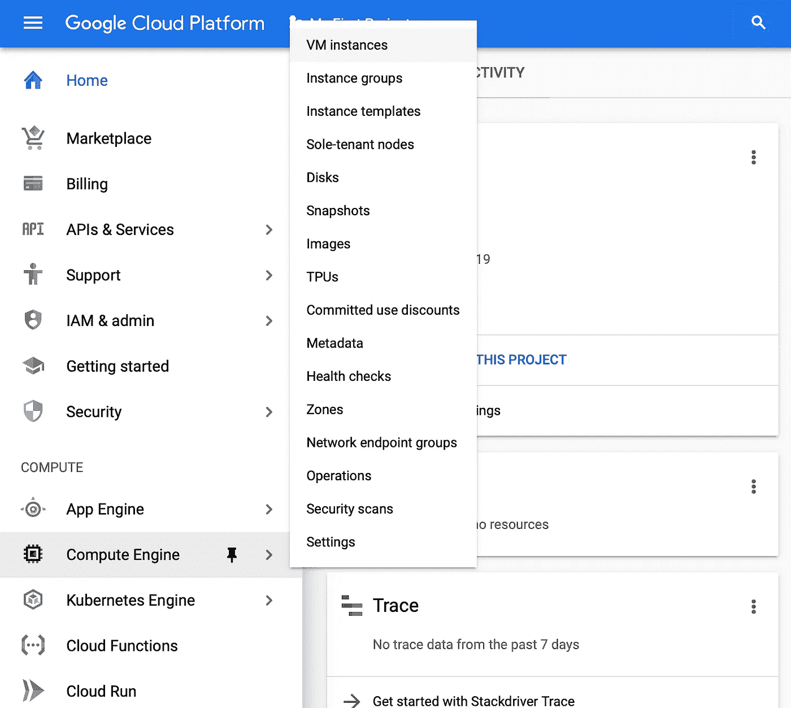
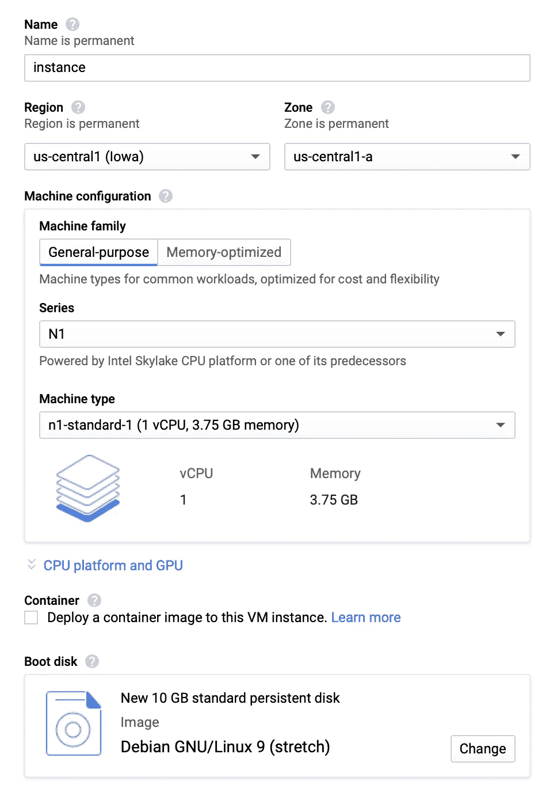
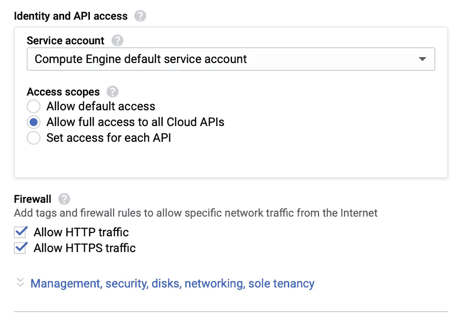
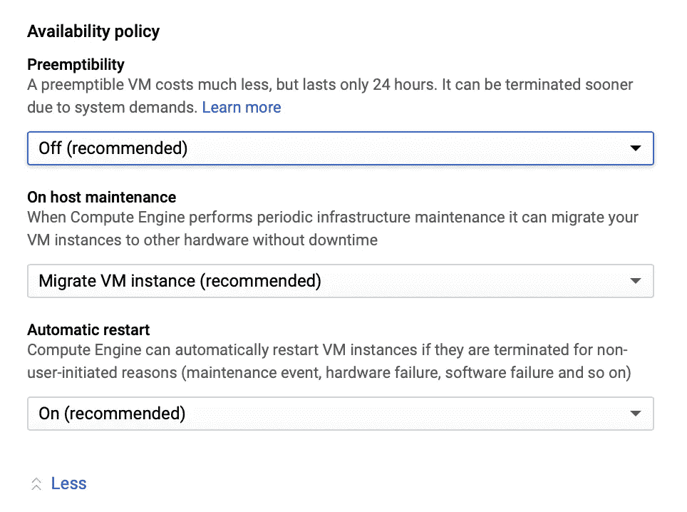
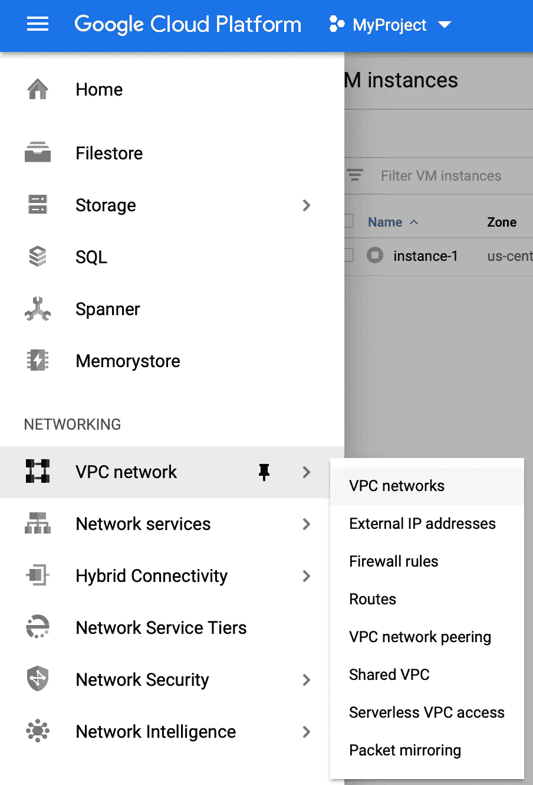
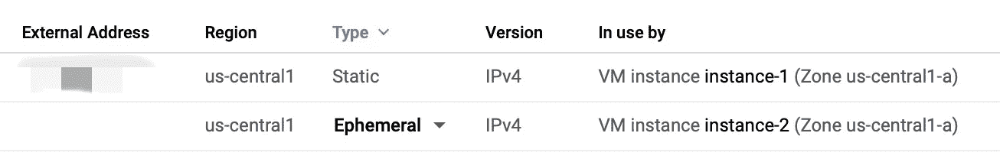
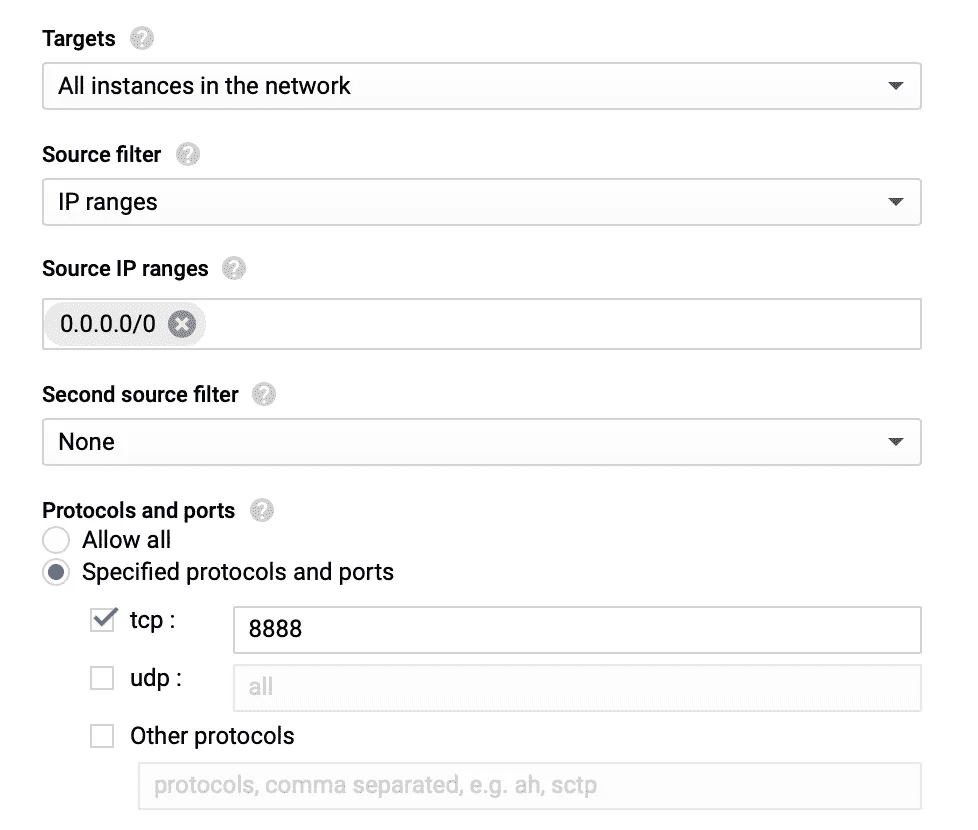
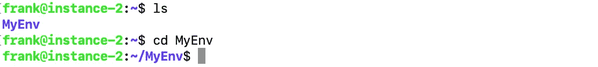
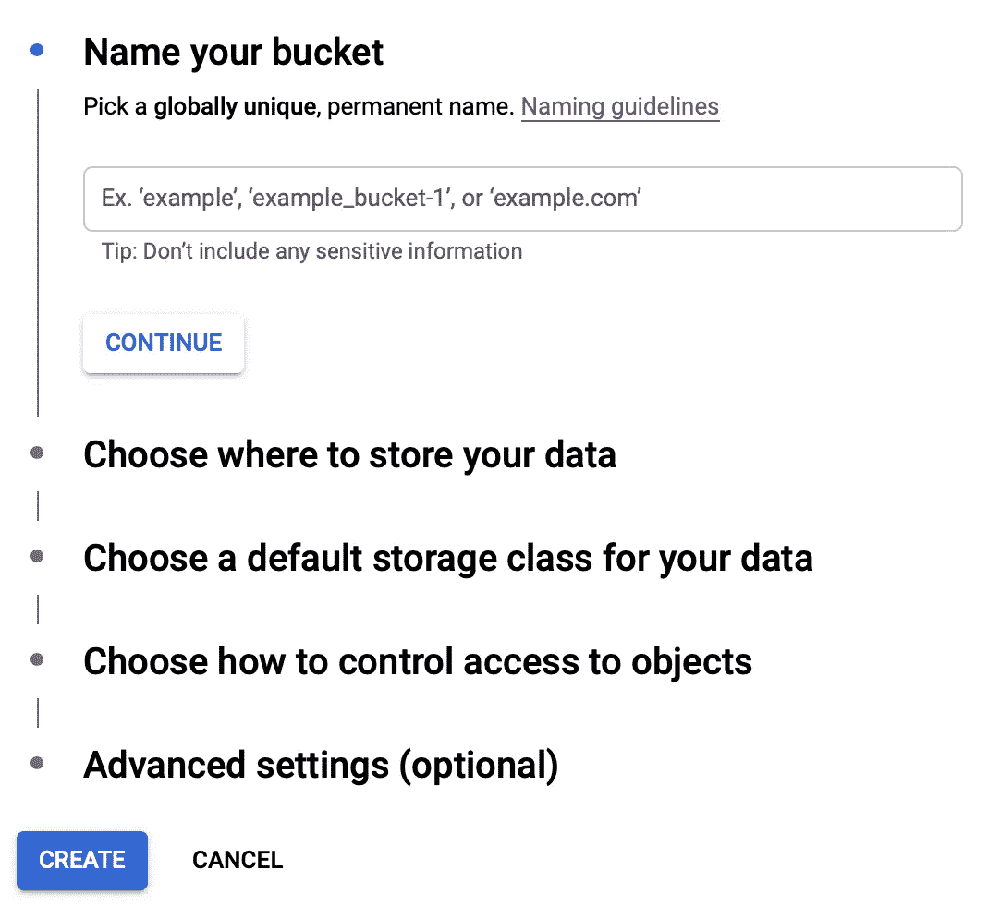
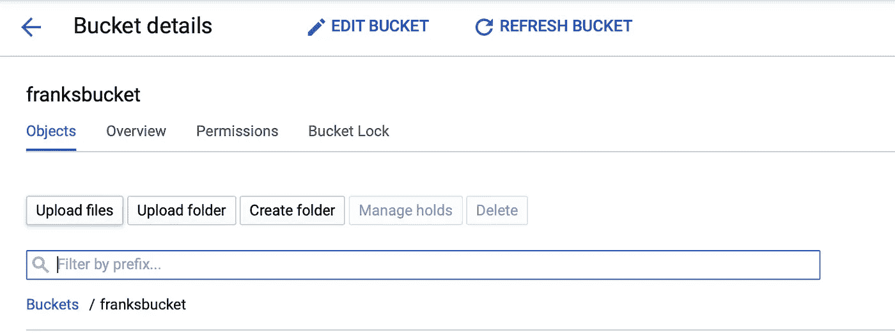

# 如何使用谷歌云平台启动数据科学项目

> 原文：<https://towardsdatascience.com/how-to-start-a-data-science-project-using-google-cloud-platform-6618b7c6edd2?source=collection_archive---------6----------------------->

## 利用谷歌云平台(GCP)服务创建 Python Jupyter 笔记本工作环境

# 什么是数据科学项目？

我的导师曾经告诉我，数据科学是关于:

> 1.从数据中获得洞察力
> 
> 2.将这些见解传达给你的客户

沟通对于几乎每个数据科学家来说都是至关重要的，在所有的沟通方式中，展示代码和可视化将是最直接和最常见的方式。和这个领域的大多数人一样，我在我的数据科学项目中使用了很多笔记本/减价品。因此，我很有信心地说，笔记本风格的工作流，使您能够在编写新代码时看到代码的所有结果，将是进行数据科学项目的一个很好的环境。

# 为什么要用谷歌云平台？

*GCP* ( *谷歌云平台*)是谷歌提供的云计算服务。对于那些不熟悉云服务的人来说，它基本上是使用网络连接到你租用的远程机器，在那台机器上进行计算并发回结果。**就像租车一样**。显然，使用云计算服务:

1.给你一台性能更好的机器来完成你的计算。(当然，如果你付够钱的话)

2.通过租赁而不是购买超级计算机来降低计算的实际成本。(就像租车一样不是吗)

3.解放您自己的笔记本电脑，这样您就可以一边玩视频游戏，一边进行繁重的并行计算。

现在实际上有很多公司提供云服务。AWS、Azure、GCP，应有尽有。然而，谷歌为第一年使用的注册用户提供 300 美元的积分。有了它，你可以租用一个简单的实例一整年，或者尝试一个巨大的实例几天。因此，对于任何不熟悉云服务并且在尝试之前不愿意付费的人来说，这是一个不错的选择！

## 在下面的案例中，我将展示如何在使用谷歌云平台的 *Python* 下使用 *Jupyter Notebook* 启动一个数据科学项目。

# 1.注册谷歌云平台

在:[https://cloud.google.com](https://cloud.google.com)

首页上应该有一个邀请，要求您激活 300 美元的试用版。输入你的信息和支付信息(只是为了验证你不是机器人，在你用完你的信用后不会有收费或订阅)，你就可以走了！

# 2.创建新的项目和实例

如果你刚到 GCP，你应该已经有一个自动生成的项目，叫做“我的第一个项目”。您可以稍后在项目设置中更改项目名称。如果你更喜欢创建一个新的，那就用谷歌的这个[教程吧。](https://cloud.google.com/resource-manager/docs/creating-managing-projects)

创建虚拟机实例

现在选择**左侧栏—计算—计算引擎—虚拟机实例**。您现在应该没有任何实例，请单击“创建”。

设置实例第 1 部分

*   **名字**:你可以选择给你的实例命名
*   **Region and Zone** :这是您的实例的物理位置。你会想选择一个离你比较近的地点，但是只要和你在同一个洲就不会有太多的差异。
*   **机器配置**:这是最重要的部分。除非明确知道自己需要什么，否则不必指定 CPU 系列、平台、GPU。默认情况下，它将选择 n1-standard-1 机器，具有 1 个内核和 3.75GB RAM。你可以向下滚动机器类型并选择你想要的，或者选择自定义，这样你就可以分别输入 CPU 内核和内存的数量。
*   **启动盘**:英文中是指你选择的操作系统。我一般选择默认的 Debian GNU/Linux 9 (stretch)。和 CPU 一样，不知道自己需要什么就不想换。我还发现 Linux 上的深度学习很有用，因为它预装了许多重要的软件包，尽管如此，我还是选择了默认的，这样我就可以跟踪我正在使用的软件包的具体版本。

设置实例第 2 部分

在这里，您可以选择 API 访问和防火墙设置。

将服务帐户保留为默认值，并选择“ ***允许完全访问所有云 API***”，以便在使用新 API 时节省大量设置 API 的工作。在防火墙 ***中允许 HTTP 和 HTTPS 流量*** 。

设置实例第 3 部分

如果您点击 ***【管理、安全、磁盘、联网】*** 您可以选择进一步的设置。通常情况下，你不想改变这些。但是，您可以在**可用性策略**中选择开启 [**抢占**](https://cloud.google.com/compute/docs/instances/preemptible) 。**抢占性**就像 AWS 中的 Spot 实例一样:

*   它的价格要低得多，大约是正常价格的 20%到 30%
*   它只持续 24 小时
*   它可以在你运行的任何时候被关闭

所以，如果你正在做的项目**不需要连续运行几个小时**并且**在 24 小时内完成工作**也没问题，这就是省钱的方法。现在一切都设置好了，点击 create 来创建您的第一个 GCP 实例。

# 3.设置外部 IP 和防火墙

设置网络第 1 部分

首先进入**左侧栏——网络——VPC 网络——外部 IP 地址。**

设置网络第 2 部分

在该类型下，您应该会发现您的新实例**是短暂的**。点击它并将其更改为**静态**，随你怎么命名。

现在进入**左侧栏—网络— VPC 网络—防火墙规则—创建防火墙规则。**

随便你怎么命名，在目标中选择“ ***网络中的所有实例*** ，放入“ ***0.0.0.0/0*** ”

在**源 IP 范围**中，选择 ***指定协议和端口*** ，在***【TCP***中输入 ***8888*** 。

然后单击创建。

# 4.连接到您的实例

现在回到**左侧栏——计算——计算引擎——虚拟机实例。您应该看到您的实例正在运行，名称前面有一个绿色的勾号。单击 SSH 按钮连接到您的实例，这将启动一个自动连接到它的云终端。**

连接到您的实例

如果你更喜欢通过你的本地终端或者云外壳来连接它，你将不得不安装 *gcloud* 并设置[***Google SDK***](https://cloud.google.com/sdk/docs/)然后使用 *gcloud compute ssh* 命令来连接。你可以带着这个[教程](https://cloud.google.com/compute/docs/instances/connecting-to-instance)去。

# 5.设置您的工作环境

我们正在使用 Linux 系统内置的 *Makefile* 命令来设置一切。您可以创建自己版本的事物和环境，也可以尝试我的代码作为快速入门。

首先，来自 GCP 的普通 Debian 环境可能没有我们需要的完整的基本工具和软件包:

当提示您是否继续时，输入“y”。

现在做 git 克隆来下载我的快速入门代码:

您可以使用 *ls* 命令检查下载，它应该只返回您刚刚下载的 *MyEnv* 。使用 *cd* 命令转到目录 *MyEnv* 。

然后运行这三行代码:

# 6.打开你的 Jupyter 笔记本

首先**确保你在正确的目录**中，在那里你已经准备好了你的数据，因为一旦你启动一个笔记本，你就不能去父目录。其次，**确保你在虚拟环境**中，因为你所有的包都被安装在那里:如果你在这个环境中，一个*(。env)* 应该显示在你的名字前面。

然后放进去:

然后回来。现在笔记本已经在运行了，但是你仍然需要自己连接它。打开浏览器，输入下面一行，其中<external static="" ip="">显示在实例页面上，当然没有括号。这应该把你带到好的**老 jupyter 笔记本界面**。</external>

# 7.(可选)使用云存储桶传输数据

您还可以选择使用上传按钮直接在实例界面中上传数据。但是，我鼓励您使用 Gcloud Storage Buckets 来完成这项工作，因为它可以轻松连接到您所有的 GCP 项目。

首先，您需要单击这个[页面](https://console.cloud.google.com/storage/)顶部的 Create Bucket。

创建一个桶

注意命名[指南](https://cloud.google.com/storage/docs/naming/)，因为**每个 bucket 名称必须是唯一的，并且所有名称都是公开可见的**。对于位置，您应该考虑存储桶价格以及实例的位置。(例如 *US-WEST1* 、 *US-CENTRAL1* 和 *US-EAST1* 有 5 GB 的免费存储空间，在同一区域内将数据从 bucket 传输到实例是免费的，请参见定价详情[此处](https://cloud.google.com/storage/pricing))，以便您根据自己的使用情况获得最佳设置。我倾向于将其他一切都保留为默认设置，以便您可以从日常使用中获得最佳设置。

创建存储桶后，您可以通过单击存储桶中的上传按钮将数据从本地上传到存储桶。

将文件上传到您的存储桶

或者使用 [Gcloud SDK 工具](https://cloud.google.com/sdk/docs)自带的 [*gsutil*](https://cloud.google.com/storage/docs/gsutil) 函数。代码格式就像 *cp* 或者 *scp* 一样。假设您想将 *data.csv* 从您的主目录上传到 bucket:

现在您已经将数据放入桶中，接下来您应该做的是连接到您的实例，使用相同的 *gsutil* 函数，并将其传输到您的实例的主目录:

现在，通过第 6 步，您可以打开笔记本，读取数据并继续探索您的数据科学项目！