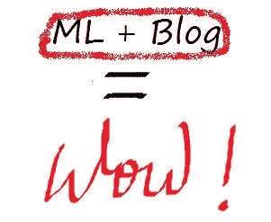
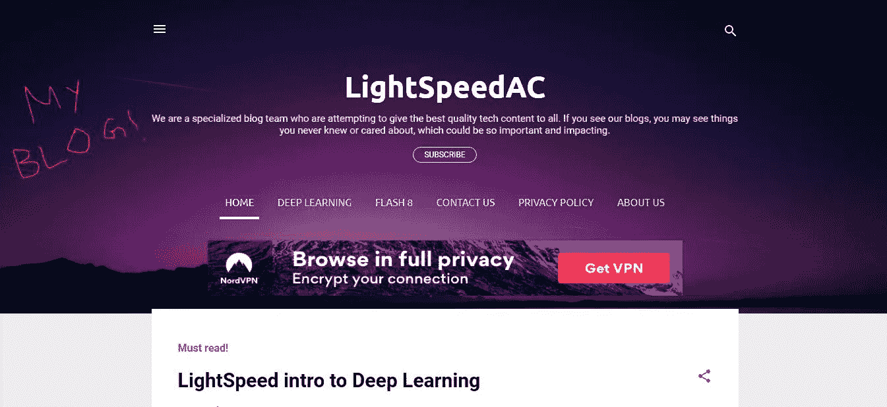
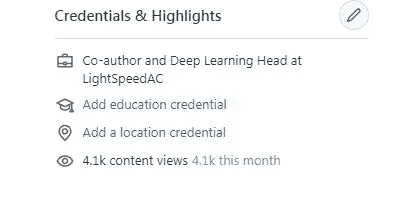
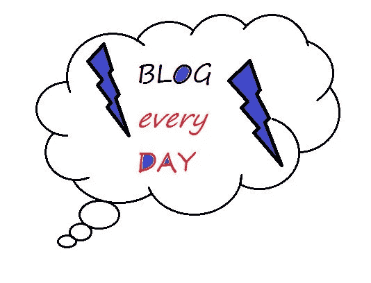

# 如何在一个月内开一个机器学习博客

> 原文：<https://towardsdatascience.com/how-to-start-a-machine-learning-blog-in-a-month-7eaf84692df9?source=collection_archive---------36----------------------->

## 你学了人工智能，现在教它！

## 我是怎么做到的，你也能做到！

我是深度学习爱好者 Dweep。我已经完成了许多 ML 和 AI 课程，我觉得是时候回报社会了。

MS Paint 的奇迹

因此，我在 Blogger 上开了一个名为[***LightSpeedAC***](http://lightspeedac.blogspot.com)的博客，向成千上万愿意进入人工智能、机器学习或深度学习的人分享我的知识。我开始写了几篇关于 NNs 的介绍性博客，当然，还有一篇 MNIST 教程。我觉得虽然写一个数据科学或人工智能博客并不太难，而且有一些事情你必须记住。我将与你分享。

我的博客(很棒的 UI，对吧？)

# 写博客(直觉部分)

对于初学者来说，博客不应该看起来充满了外国词汇和术语。是的，ML 确实有几个可怕的词，然而大多数都意味着惊人的简单事情！ 还有，尽量少理论化。我发现人们更有兴趣知道*它是如何工作的*，然后直接看代码。我特意保留了博客的名字*光速*以保证趣味性。

另外一个超级重要的事情就是 ***写你的意思，写你的意思。*** 如果你的博客标题是*零到人工智能英雄*，并且你完成了一个 MNIST 教程，那就是完全的点击诱饵！此外，对读者坦诚总是在许多方面有所帮助。

我最后想说的是，一个教一些概念 ***的 AI 博客，得有代码*** *！！一个理论性的博客可能更容易写，但是你最终给了他们他们没有办法实现的知识。很明显，代码需要充满注释和解释，因为读者应该能够理解每一行。如果你鼓励读者尝试一些代码行，比如超参数，这总是有帮助的。*

一个额外的提示，让你的博客读者友好，是使用语法，以确保没有污点的语法。这比你想象的更重要！我写了一篇关于语法对博客作者的重要性的博客。

# 写什么？

写一些人们在 之前没有写过的东西总是好的，尽管这并不总是可能的。我*知道*有成千上万的 MNIST 教程，但我仍然写了另一个。 ***为什么？*** 因为我感觉他们都没有我这样的逐行代码注释[。](https://github.com/djthegr8/mnist/blob/master/mnist4beginners.ipynb)还有一次，我写了一篇关于激活函数的博客。同样，我*知道*有数百个，其中一些是关于数据科学的，内容非常好。然而他们中的大多数人解释了这个功能。另一方面，我做了一个比较，并详细说明了在什么情况下使用什么激活。因此，我写了这本[激活功能手册](/manual-of-activations-in-deep-learning-30658167ffcb)。找到机会并抓住它们！

# 怎么宣传？

自然，这将是下一个问题。我想这个问题没有明确的答案。我采取了许多不同的方法，并定期检查哪些可行，哪些不可行。

所有博主获取有机流量的地方

我首先尝试的是 ***Quora*** 。这有两个故事。我的合著者(实际上是我的兄弟)也在我们的博客中尝试了同样的方法。我们俩几乎是同时开始的。18 天后， ***我的 4k 浏览量*** 越来越多，我的 80 个回答带来了不错的流量，而我的哥哥 ***面临着被 Quora*** 封禁两周的处罚。

我在 2 周内获得了 4.1K 的浏览量！

这些截然不同的结果的原因是什么？

我在 Quora 上的回答是真实的，只有不到 40%的人有我博客网站的链接。我保证读者会希望 去我的网站更好地学习。我不是在发垃圾信息，只是在帮忙。

如你所料，我哥哥的邮件是垃圾邮件。

> *如果问题是“*好的博客是什么样子的？”
> 
> 他会回答“一个好的博客看起来像[这个](http://lightspeedac.blogspot.com)”

图片来自 Shutterstock.com two mine 公司

通过那个故事，我的意思是让你明白 ***如何从 Quora 获得流量，*** *和* ***如何获得封禁。***

**我做的第二件事**，也是更有用的一件事，**是发电子邮件**。我给很多公司发了邮件，请求合作机会。有些人回答了，有些人没有。但是最好的部分是每个公司给的反馈。而且我说的是 Coursera、Grammarly 甚至 deeplearning.ai 这样的大公司！ ***这些邮件帮助我显著提高了市场占有率。***

# 并维护它

同样，Paint 女士也给人留下了深刻的印象:)

我定期写博客，比如每两天一次，这有助于提高我的存在感。此外，我 ***删除了*** 几个表现不佳的博客，以帮助维持内容质量。

# 还有，评论

如果你开始写博客，那太好了！下面用链接评论！

# 免费的任何合作，项目帮助和集成！

如有任何关于 TensorFlow、Keras、TFjS 或 Python 的疑问或项目，请发邮件至我的 Gmail。

***谢谢，祝您有美好的一天！***