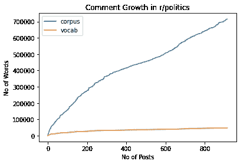

# 如何开始一个 NLP 项目

> 原文：<https://towardsdatascience.com/how-to-start-an-nlp-project-f76e3f7d0e61?source=collection_archive---------35----------------------->

## NLP 数据集的注意事项和基本探索性数据分析

自然语言处理是人工智能中一个令人兴奋的领域。它的应用非常广泛，从理解情感到主题分析，甚至生成供人类使用的原始文本等等。然而，在开始实施这些分析之前，为了确保项目的成功，必须做一些基本的准备工作。这包括选择要摄取的文本，以及一些必要的单词转换，以使您的文本为进一步的调查做好准备。

**快速提示:**这是**而不是**作为主题的 NLP 介绍，或者如何开始一个基本项目。你可以在这里和这里找到开始学习 NLP [的优秀指南。](/gentle-start-to-natural-language-processing-using-python-6e46c07addf3)

[布拉登·科拉姆](https://unsplash.com/@bradencollum?utm_source=medium&utm_medium=referral)在 [Unsplash](https://unsplash.com?utm_source=medium&utm_medium=referral) 上拍摄的照片

首先，人们需要决定他们想要分析什么文本。乍一看，这似乎是显而易见的，但是还需要进行一些更精细的技术考虑。对一些人来说，这些问题的答案将是他们想要的结果所必需的。例如，当检查自由文本调查输入时，很明显调查回答将构成您的语料库。在其他情况下，这可能不太明确。

这里有几个有用的术语需要解释。**语料库**指在分析中检查的文本集合。这个术语可以从一个句子扩展到每种语言中的每个单词。有时，一个语料库可以细分为**文档**，这些文档是更小的语料库，通常封装了一个想法或主题。文档可以小到一条推文，也可以大到一本书。将一个语料库划分为多个文档并不是每个 NLP 任务都必须的，但是这对于比较不同的文档很有用。NLP 中最小的测量单位是一个**令牌**。令牌是文档中的一个单词。一个**词汇表**是语料库中存在的不同标记的数量。一些技术，例如[手套单词嵌入](https://nlp.stanford.edu/projects/glove/)，随着词汇量的增加而增加时间复杂度，而其他技术随着更大的语料库而增加复杂度。一个人的用例将决定哪种分析和语料库规模最有意义。

除非你有一个大的计算集群和无限的时间，否则你不可能查看每一条推文。有意义的是选择一个时间段作为你分析的基础。一个人对时间段的选择将基于几个因素:你的时间窗口的大小和它开始的时间。这两个参数都会影响分析中包含的单词/文档的数量。如果不做一些探索性的数据分析，你很可能不知道单词大小随时间的分布，这些数据分析可以揭示随着你增加分析时间，语料库的大小是如何增长的。一旦你知道了语料库的大小是如何增长的，你就能够根据你可用的计算资源做出明智的决定。

我进行了一个样本分析来衡量语料库和词汇的增长。我挖掘了我最喜欢的宠物项目数据集:Reddit。我使用名为 [praw](https://github.com/praw-dev/praw) 的库从 Reddit API 获取评论。然后我把增长绘制成一系列。下面是我写的一个要点，以跟踪更多帖子的字数。我还包括了在发布时运行代码时输出的图表。

随着更多帖子的添加，测量语料库和词汇增长的示例分析

我们看到语料库呈线性增长，而词汇库呈对数增长

看上面的图表，我们可以看到语料库以大致线性的方式增长，而词汇则以对数的方式增长。利用这些知识，人们现在可以做出明智的决定，在自己的分析中包括多少 Reddit 帖子。进一步分析的一种方法是计算几个不同子社区的这些值，看看哪个社区的词汇最丰富，哪个最冗长。

一旦确定了创建语料库的参数，在开始分析之前还需要进行预处理。原始的自然语言有许多属性会使分析变得模糊不清。常见的第一步是删除[停用词](https://en.wikipedia.org/wiki/Stop_words)；没有提供丰富语义的常用词，反而添加了比信号更多的噪声。大多数 NLP 库都有一个停用词列表，你可以利用它来清理你的语料库。下面是一个使用[空间库](https://spacy.io/)移除停用词的例子。

用[空格](https://spacy.io)删除停止字

这个例子让 spaCy 接收每个评论，然后将评论转换成包含令牌的 pared 文档。对文档进行迭代会产生单独的标记，我们可以检查这些标记，以确定是否应该在分析中考虑它们。上面的要点删除了停用词，但人们也可以轻松地删除数字或进行基本的文本转换，如[引理](https://en.wikipedia.org/wiki/Lemmatisation)或[词干](https://en.wikipedia.org/wiki/Stemming)。SpaCy 在第一次解析每个文档时会执行大部分这种分析。[下面是 spaCy 提供的令牌属性列表](https://spacy.io/api/token#attributes)。

另一个常见的步骤是处理文本中的数字数据。一般来说，删除数字是很常见的，因为它们本身通常不提供任何语义。要删除数字和停用词，可以使用[正则表达式](https://en.wikipedia.org/wiki/Regular_expression) (regexes)或大多数 NLP 库中的内置函数。例如，在 spaCy 中，标记具有可以过滤的属性“is_alpha ”,类似于上面要点中的停止词。

但是，您可能希望保留数字的特定上下文。例如，一些数字序列具有特定的含义，如 IP 地址或 MAC 地址。如果数据集包含这样的信息，可以使用掩码用预先确定的标记(如“IP_ADDRESS”)替换数字实体的所有实例。这将保留数字实体的语义，同时移除噪声数字。在这里，简单的正则表达式替换通常是最好的工具。

屏蔽不仅对数字实体有用。它可以用于任何想要保留语法意义而删除特定细节的实体。这样做可以从您的数据中删除个人身份信息(PII)，这可能是法律或法规的要求，具体取决于您的数据集。回头看看 Reddit，我将演示用标记“USERNAME”屏蔽用户名。幸运的是，[r/help](https://www.reddit.com/r/help/comments/1ttv80/what_are_the_valid_usernamecharacters/)上的一个帖子解释说，用户名可以由 3 到 20 个字符组成，通常以“u/”为前缀在下面的要点中，我使用 python 内置的正则表达式库来查找所有 Reddit 用户名并用我们的令牌替换它们。

使用正则表达式的屏蔽示例

这些步骤将为成功的 NLP 项目奠定基础。有无数的工具和技术可以用来总结，提取意义，或任何数量的其他 NLP 任务。我已经提供了一个笔记本，上面有 gists 中列出的所有代码。