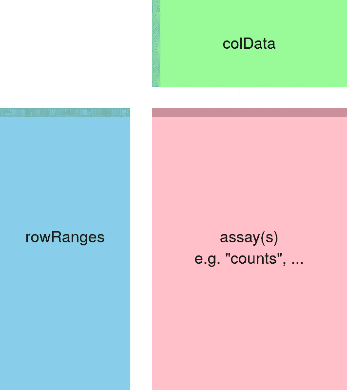
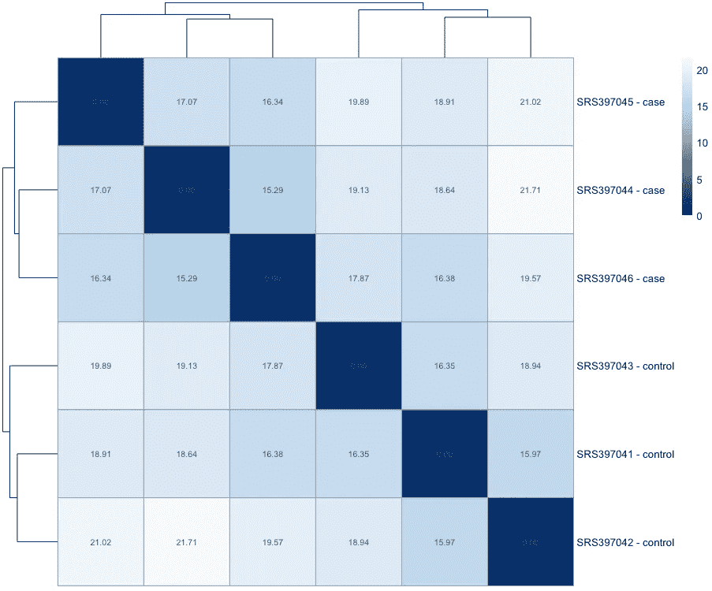
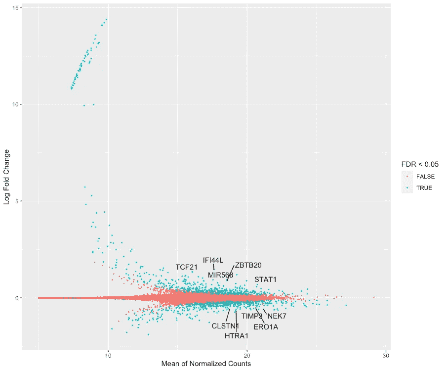
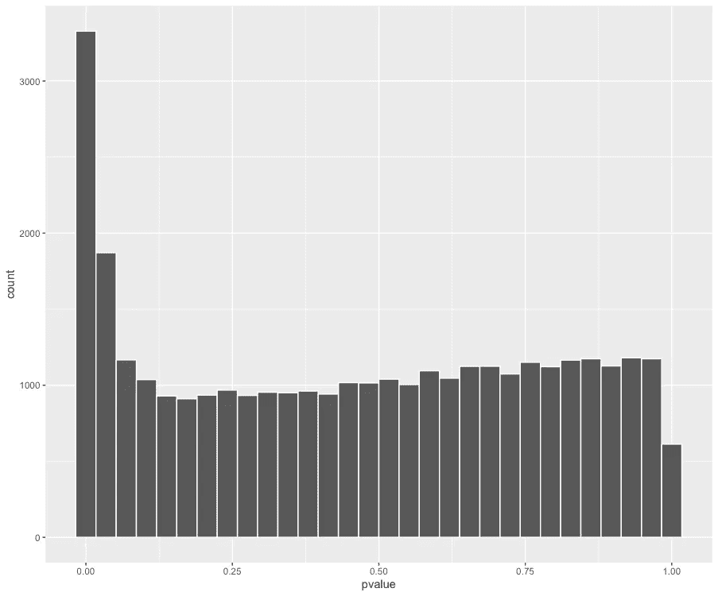

# 如何开始学习生物信息学而不被吓倒(带 R)

> 原文：<https://towardsdatascience.com/how-to-start-learning-bioinformatics-and-not-get-intimidated-with-r-b4b6a2450212?source=collection_archive---------34----------------------->

## 使用差异基因表达分析的分步示例

# 介绍

这篇文章的目标读者是那些希望“闯入”生物信息学领域并拥有 R 经验的人(最好使用 [tidyverse](https://www.tidyverse.org) )。生物信息学可能是一个听起来很可怕的概念(至少对我来说是这样)，因为它是一个如此广阔和快速发展的领域，以至于很难准确定义它是什么。我一直认为生物信息学是一个高度先进的领域，超出了我的能力范围——我需要多年的技术培训才能真正开始做这件事。但是就像所有事情一样，*开始*做某事实际上并不需要太多时间(不用说，*掌握*某事确实需要很多年)。

承认我过于简单化，生物信息学本质上是回答生物学问题的*电子*(或基于数据的)方法。随着更先进的测序技术的出现以及随之而来的统计算法的发展，我们现在可以以前所未有的规模和价格获得生物数据，以及从这些数据中提取洞察力的工具。

在这篇文章中，我的目标是提供一个简单的例子，任何喜欢数据、喜欢与 R 一起工作、对这个领域感兴趣的人，都可以开始在生物信息学领域进行*分析。*

有大量不同类型的问题和不同类型的生物数据，因此在这篇文章中，我们将使用 RNA-Seq 数据进行差异基因表达分析(DGEA)。简而言之，如果你回忆一下高中/大学生物课，DGEA 会回答不同实验条件下基因表达水平是否有变化的问题，RNA-Seq(RNA 测序的缩写)使用下一代测序来量化给定转录组(所有 RNA 转录本的集合)中的 RNA 数量。我们将从 [*记录 2*](https://jhubiostatistics.shinyapps.io/recount/) *中获取数据。*本质上是一个由约翰霍普金斯维护的数据库，通过他们的包与 R 接口，用户可以从中查询 RNA-seq read count 数据。计数是与基因的特定区域对齐的测序读数的数量。

请注意，这篇文章是针对*初学者*的，所以关于 DGEA 内部某些分析步骤背后的动机或关于软件包所有功能的许多细节将不包括在内。但是，我希望一旦你能够成功地做某事，你会感到有力量去学习更多！

# 设置

因此，让我们首先设置我们的工作空间，包括将我们的库和 RNA-Seq 数据加载到 R 中，这是我们从 retrol 查询的。鉴于我的学术兴趣，我将使用与冠状动脉疾病相关的 RNA-Seq 数据集。在这个特定的数据集中，病例指的是带有 [**TCF21**](https://www-ncbi-nlm-nih-gov.ezp.lib.cam.ac.uk/pmc/articles/PMC4447275/) **基因沉默的**冠状动脉平滑肌细胞。**retrol 附带一个漂亮的[闪亮的应用程序用户界面](https://jhubiostatistics.shinyapps.io/recount/)，在这里你可以搜索你感兴趣的项目，并使用相关的项目 ID 查询数据；但是，在重新计数包中也有一些功能，允许您在不使用应用程序界面的情况下搜索项目。**

对于大多数数据分析项目，我喜欢考虑 3 个主要步骤:探索性数据分析、分析和可视化。在我们开始之前，重要的是要注意我已经选择使用 [*DESeq2*](https://www.bioconductor.org/packages/devel/workflows/vignettes/rnaseqGene/inst/doc/rnaseqGene.html#exploratory-analysis-and-visualization) 进行这个分析，尽管存在其他使用不同方法进行 DGEA 的包。我们首先必须构建一个用于我们分析的 *DESeqDataSet* 对象。这个对象基本上包含三个部分:`colData`包含样本信息，`rowRanges`包含基因组范围信息，`assay`包含计数矩阵。



图片作者。

我们使用`dds <- DESeq2::DESeqDataSet(rse_gene, design = ~ case)`来生成我们的 *DESeqDataSet* 对象，其中`case`指定样本是控制样本还是实验样本。让我们通过做一些探索性的数字来弄脏我们的手。

# 探索性数据分析

首先，我们可以使用欧几里得距离来评估样本之间的总体相似性。这背后的细节就不在本文讨论了。重要的是澄清**计数将仅出于探索目的进行转换**。转换的目的是使数据更具同质性，以帮助探索(使用的特定转换是*方差稳定转换，*其细节可在本文[中找到](http://academic.oup.com/bioinformatics/article/18/suppl_1/S96/231881))。否则，对于统计分析，应使用原始计数。这是生成距离热图的附带代码。



蓝色阴影越深，一对样本彼此越相似。图片作者。

另一种评估样品间相似性的方法是使用主成分分析(PCA)图。不需要太多的细节，它本质上是一个图，其中 x 轴解释了所有样本之间的大部分差异，y 轴解释了所有样本之间的第二大差异。请注意，这些百分比加起来并不等于 100%，因为有更多的维度包含剩余方差(尽管这些剩余维度中的每一个都比我们看到的两个解释得少)。


观察 PC1 如何很好地分离病例和对照样本。这表明某些基因的表达是不同的。图片作者。

# 差异表达分析

现在我们已经可视化了我们的数据，让我们运行分析。我们正在使用的软件包使它变得非常简单；我们只要跑`dds <- DESeq(dds)`。通过使用 R: `?DESe`中的 help 命令，您可以看到它做了更多的事情，但简单来说，它做了三件事:估计大小因子(控制样本测序深度的差异，但现在不要太担心这意味着什么)，估计每个基因的分散值(同样不打算进入技术细节，将分散视为“扩散”的度量)，以及拟合一个通用的线性模型。如果这些话对你没有意义，没关系。我的哲学是*先做，后问，*我知道这可能很有争议，但我认为学生经常会陷入所有的理论和技术细节(其中有许多需要真正掌握和理解)中，以至于他们永远不会进步到事情的实际方面。

数据帧中返回的每个基因有两个主要估计值:`baseMean`，归一化计数值的平均值除以大小因子，以及`log2FoldChange`，效应大小估计值。例如，log2 倍变化 2 意味着基因的表达增加了 2 =4 的倍数。 *DESeq2* 对每个基因执行*假设检验*以查看是否有足够的证据来反对*无效假设*，即处理对基因没有影响，并且处理和控制之间的观察差异仅仅是由实验可变性引起的。

请注意，由于 *TCF21* 在 10%的 FDR 水平沉默，有许多基因存在差异表达。

# 形象化

我们可以做的一件有用的事情是可视化模型中所有基因的估计系数的分布。我们可以使用 MA 图。特定比较的 log2 倍变化(LFC)绘制在 y 轴上，通过大小因子标准化的计数平均值显示在 x 轴上。每个基因用一个点表示。在制作 MA 图之前，我们使用 *lfcShrink* 函数收缩 log2 倍变化，用于病例与对照的比较。 *DESeq2* 中有三种类型的收缩估计器，在 [DESeq2 简介](https://bioconductor.org/packages/release/bioc/vignettes/DESeq2/inst/doc/DESeq2.html)中有所介绍。我们将使用 *apeglm* 方法来收缩系数，这有利于收缩有噪声的 LFC 估计，同时为真正的大差异提供低偏差 LFC 估计。



y=0 以上的蓝点显示显著上调的基因，而 y=0 以下的蓝点显示显著下调的基因。前 10 个最显著的差异表达基因被标记。图片作者。

对 p 值直方图执行诊断也是一种很好的做法。这篇文章很好地解释了这一点。

```
res_shrink %>%
  filter(baseMean > 1) %>%
  ggplot(aes(x = pvalue)) + 
  geom_histogram(col = "white")
```



这是一个正常的直方图，峰值在 0 附近，表示差异表达基因的富集。没有迹象表明任何东西是时髦的！图片作者。

# 结论

那么我们完成了什么？我们进行了第一次差异基因表达分析，我们确定了一些当 *TCF21* 基因在冠状动脉肌细胞中沉默时上调/下调的候选基因！很酷，对吧？

使用差异表达分析，您可以做更多的事情。我几乎没有触及表面。如果你想更深入地了解，我推荐你看看这篇[短文](https://www.bioconductor.org/packages/devel/workflows/vignettes/rnaseqGene/inst/doc/rnaseqGene.html#exploratory-analysis-and-visualization)，或者谷歌一下“差异基因表达 R ”,然后进入兔子洞。希望这篇文章能够证明，开始一件全新的事情不应该是一个可怕的折磨，并提醒你，你总是要从某个地方开始。然而，只要有足够的兴趣和动力，一旦你开始，你很快就会搜索你不明白的东西或者需要了解更多的东西，你就会走上精通的道路！