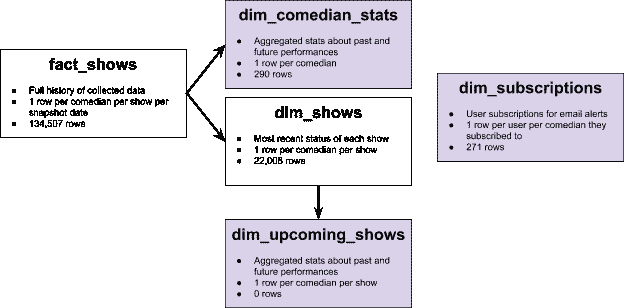

# 如何在不牺牲数据的情况下保持在自由层云数据库行限制内

> 原文：<https://towardsdatascience.com/how-to-stay-within-free-tier-cloud-database-row-limits-without-sacrificing-data-27f07b5110b0?source=collection_archive---------76----------------------->

## 通过仅托管小型汇总表并在本地硬盘上保留精细的历史表，节省资金并改善用户体验

*免责声明:这些建议是针对涉及几 GB 数据的低风险项目的。如果你在处理“大数据”，你只能靠自己*

如果您正在处理一个需要托管数据库的项目，您可能会担心您会很快超出免费/低成本计划的行限制。即使每月只需花费 9 美元就可以存储 100 倍多的行，这对您来说也不值得，尤其是如果您的项目不会产生收入的话。你可能认为是时候开始删除那些带给你最少快乐的记录了…

但是等等！你可能已经有了另一个免费存储数据的地方，就在你的指尖——你的本地硬盘。

在这一点上，你可能会担心我不知道我在说什么。你不会尝试使用本地数据库来运行一个网站。如果你的猫在你的笔记本电脑上摩擦它的头，并且不小心关上了它或者断网了，你的网站将会变得毫无用处。

我并不是建议你*完全*替换你的云数据库——只是使用本地数据库来补充它。将详细的历史数据保存在您的计算机上，只在云上托管较小的汇总表。通过这种方式，您的用户仍然可以登录、查看聚合数据、订阅电子邮件(所有这些好的数据库相关的东西)，并且如果您以后需要，您将拥有所有旧的/高粒度的数据。

在我的例子中，我制作了一个 web scraper 来收集喜剧场所网站上的表演信息，并使用这些数据在我自己的[网站](http://www.cellarscraper.com/)上显示一些统计数据。我平均每天收集 300 行数据(该场所网站上列出的每个节目的每个喜剧演员一行)，如果我继续将结果附加到我的表中，这将在一个多月的时间里超过 Heroku 的 10K“hobby-dev”等级行限制。

我只需要向用户显示聚合的历史数据(这个喜剧演员做了多少节目？他们最后一次表演是什么时候？等。)和详细的未来数据(该喜剧演员将很快出现在哪些具体的节目中？还有哪些喜剧演员会出席那场演出？).但是，我并不只是想把详细的史料丢掉。如果我的代码中有一个错误导致了不准确的聚合，我希望有旧的数据，这样我就可以重新生成聚合。更详细的数据可以方便地用于未来的预测建模。

我的表结构如下所示(在大约一年半的数据收集之后，行数为 6/28/20):

紫色的表在 Heroku 上，但是我也保留了本地的备份。完整的历史存储在 *fact_shows* 表中，该表用于生成较小的表。 *Fact_shows* 显然超过了行限制，但 Heroku 主持的桌子现在每个只有几百行(注意: *dim_upcoming_shows* 现在是空的，因为场地因 COVID 限制而关闭)。所有这些表格总共占用了我硬盘上 47MB 的空间。

我的 scraper 每天晚上在本地运行，并将数据附加到 *fact_shows* 中，如下所示:

在更新了 *fact_shows* 之后，我生成了 *dim* 表。我定义了这个通用的 *update_dim_table* 函数，以避免为我想要创建的每个 *dim* 表重复代码。它需要表名和查询，以便能够汇总来自 *fact_shows* 的数据，然后将汇总的表写入本地数据库和(可选)Heroku。

下面是我如何应用该函数创建 *dim_comedian_stats* 表的示例，该表被写入 Heroku，因为我需要它在我的站点上进行可视化:

更多上下文，完整的 scraper/ *fact_shows* 文件是[这里是](https://github.com/mlm603/comedy-cellar/blob/master/cellar_scraper.py#L186)，而 *dim* 表格脚本是[这里是](https://github.com/mlm603/comedy-cellar/blob/master/dim_shows.py)。

根据您的特定用例，您可能无法聚合数据。如果您的用户需要深入了解细节，可以考虑其他方法来减少托管数据，比如只显示最近 30 天的数据(同时在您的笔记本电脑上保留更长的历史记录)。总的原则是保持理想的表结构，将全部历史存储在本地，然后计算出满足用户需求所需的最低限度，只将那个小表推送到您的云服务。除了省钱之外，这还可以改善用户体验，因为网站查询是针对更小的表进行的，所以大家都赢了！