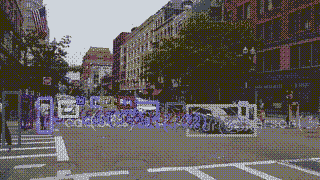
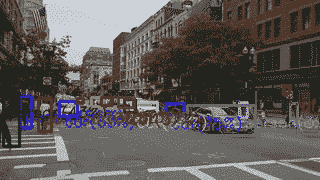
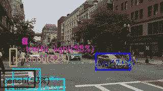

# Raspberry Pi 上的实时视频对象检测

> 原文：<https://towardsdatascience.com/how-to-stream-video-with-real-time-object-detection-on-raspberry-pi-f6503c46c7f9?source=collection_archive---------7----------------------->

## 使用 OpenCV、专用硬件和云技术实现快速检测

最近，一段来自特斯拉 autopilot view 的视频出现在互联网上，并非常受欢迎。我对一个类似的视频流(带有检测到的物体)很感兴趣，这个演示最终让我做了一些工作。

唯一的问题是我想从 Raspberry Pi 流视频，但总的来说，它不够强大，无法执行这样的任务。


检测到物体的图像

## 树莓上的 OpenCV

最直接的实现是通过 OpenCV-DNN 在 Raspberry Pi 上运行一个检测器。

OpenCV-DNN 支持多种网络和格式，但我以前用的是 Google 的[MobileSSD(11 _ 06 _ 2017 版本，最新的不兼容 OpenCV 4.2)。](http://download.tensorflow.org/models/object_detection/ssd_mobilenet_v1_coco_11_06_2017.tar.gz)

首先，读取类名并加载模型:

```
tf_labels.initLabels(dnn_conf.DNN_LABELS_PATH)net = cv.dnn.readNetFromTensorflow(dnn_conf.DNN_PATH,         dnn_conf.DNN_TXT_PATH)
```

然后对一个图像运行推理:def 推理(img):
net . set input(cv . dnn . blobfromimage(img，1.0/127.5，(300，300)，(127.5，127.5，127.5)，swapRB=True，crop = False))
return net . forward()

这个操作在树莓上需要 1.7 秒。例如，我的漂亮的旧笔记本电脑在 0.2 秒内完成同样的工作。

将输出张量转换为人类友好的 JSON:


```
def build_detection(data, thr, rows, cols):    
    ret = []     
    for detection in data[0,0,:,:]:         
        score = float(detection[2])         
        if score > thr:             
            cls = int(detection[1])             
            a = {"class" : cls, "name" : tf_labels.getLabel(cls),  "score" : score}             
            a["x"] = int(detection[3] * cols)             
            a["y"] = int(detection[4] * rows)
            a["w"] = int(detection[5] * cols ) - a["x"]                        a["h"] = int(detection[6] * rows) - a["y"]             
            ret.append(a)     
    return ret
```

考虑到测量，很明显原生树莓性能(1.7 秒)对于任何视频都是不够的。

但是让 Raspberry 与笔记本电脑配合使用应该会提高处理帧的整体能力。

## 笔记本电脑原型

现在用一个 REST 接口把检测器包起来。

为此，我通常使用烧瓶。获得[服务](https://github.com/tprlab/docker-detect/blob/master/detect-app/app.py)有两个切入点:

*   第一个返回 JSON 中的检测
*   第二个返回带有检测到的矩形和标签的图像

第二种方法给出了检测结果，简单明了:

```
curl -X POST -F "file=@pic.jpg" [h](http://192.168.1.243/)ost:80/ddetect --output a.jpg
```

## 码头工人

我们想要一个可扩展和可移植的解决方案，然后将服务打包到 docker 映像中。

选择 Debian Stretch + Python 作为基础映像，保留与 Raspbian 类似的堆栈。

需要设置 flask，protobuf，requests，opencv_python，从 GitHub 下载移动 SSD 和服务器代码。

```
FROM python:3.7-stretchRUN pip3 install flask
RUN pip3 install protobuf
RUN pip3 install requests
RUN pip3 install opencv_pythonADD [http://download.tensorflow.org/models/object_detection/ssd_mobilenet_v1_coco_11_06_2017.tar.gz](http://download.tensorflow.org/models/object_detection/ssd_mobilenet_v1_coco_11_06_2017.tar.gz) /
RUN tar -xvf /ssd_mobilenet_v1_coco_11_06_2017.tar.gzADD [https://github.com/tprlab/docker-detect/archive/master.zip](https://github.com/tprlab/docker-detect/archive/master.zip) /
RUN unzip /master.zipEXPOSE 80CMD ["python3", "/docker-detect-master/detect-app/app.py"]
```

为了与第三方提供商一起使用该图像，需要将其发布到一些公共 docker 注册表上。

我决定用传统的方式使用 Docker Hub。

*   创建一个帐户
*   使用 DockerHub: **docker 登录**授权本地 docker
*   给图像命名: **docker 标签<local _ image _ name>TPR lab/opencv-detect-SSD**
*   上传图片: **docker 推送 tprlab/opencv-detect-ssd**

现在，该映像可以用于许多容器提供商，如 Google Cloud、Microsoft Azure、Amazon Web Services、Digital Ocean、Heroku 等。

## 录像

使用 [OpenCV 示例，](https://opencv-python-tutroals.readthedocs.io/en/latest/py_tutorials/py_gui/py_video_display/py_video_display.html)制作一个基本服务器:

```
def handle_frame(frame):
    return detect.detect_draw_img(frame)

def generate():
    while True:
        rc, frame = vs.read()
        outFrame = handle_frame(frame)
        if outFrame is None:
            (rc, outFrame) = cv.imencode(".jpg", frame)
        yield(b'--frame\r\n' b'Content-Type: image/jpeg\r\n\r\n' + bytearray(outFrame) + b'\r\n')[@app](http://twitter.com/app).route("/stream")
def video_feed():
    return Response(generate(), mimetype = "multipart/x-mixed-replace; boundary=frame")
```

随着 docker 部署在笔记本电脑上，视频以慢动作播放。



## 谷歌云

到目前为止，单个码头工人是不够的。让它伸缩——在这种情况下，我们将能够同时处理多个帧。

我选择 GCloud 作为 Kubernetes 的服务提供商，并在 5 个实例中运行[我的映像](https://hub.docker.com/r/tprlab/opencv-detect-ssd)。

服务器代码变得更加复杂:

```
def generate():
    while True:
        rc, frame = vs.read()
        if frame is not None:
            future = executor.submit(handle_frame, (frame.copy()))
            Q.append(future)
keep_polling = len(Q) > 0
        while(keep_polling):            
            top = Q[0]
            if top.done():
                outFrame = top.result()
                Q.popleft()
                if outFrame:
                    print("Frame", datetime.datetime.now())
                    yield(b'--frame\r\n' b'Content-Type: image/jpeg\r\n\r\n' + bytearray(outFrame) + b'\r\n')
                keep_polling = len(Q) > 0
            else:
                keep_polling = len(Q) >= M
```

这种方法有助于以大约 10 fps 的速度传输检测到的视频。

还有提高速度的空间——只需在我们的 Kubernetes 集群中添加更多节点。



## 英特尔神经计算棒

在进行了远程检测实验后，我决定尝试本地硬件解决方案。

我有一台英特尔 NCS，已经在[类似任务](/robot-tank-with-raspberry-pi-and-intel-neural-computer-stick-2-77263ca7a1c7)中使用过。

所以我把 MobileSSD 转换成 OpenVino 格式，用 NCS 检测器运行视频流。

NCS 很好地完成了这项工作——FPS 略高于 10，优于 5 节点 Kubernetes 集群。



## 结论

最终，使用外部电源进行接近实时的检测被证明是可能的。

使用 NCS 是最简单(也是最便宜)的方法——一次性购买，用最简单的代码工作很长时间。

docker 方式更复杂，但也更具可伸缩性、可移植性和可重用性。

## 链接

*   带有 docker 文件和源代码的 [GitHub repo](https://github.com/tprlab/docker-detect)
*   Docker Hub 上准备就绪的 [docker 图像](https://hub.docker.com/r/tprlab/opencv-detect-ssd)