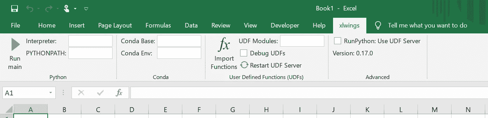
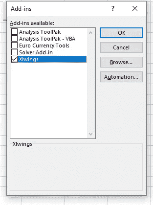
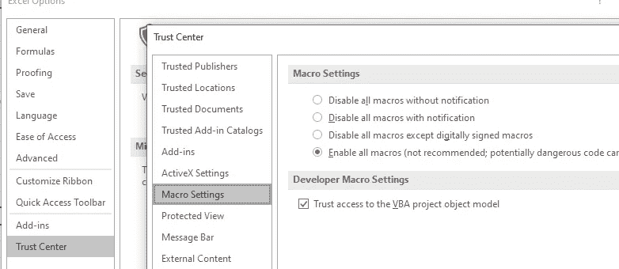
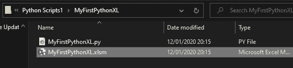
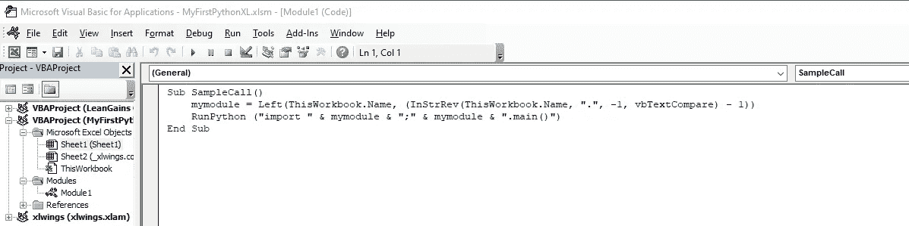
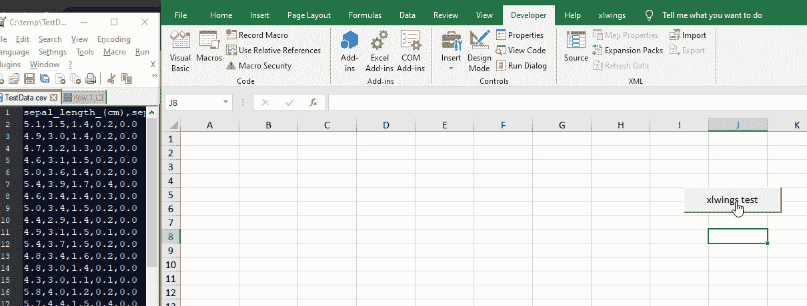
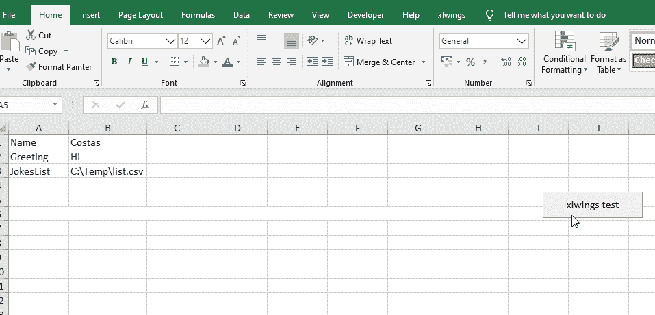
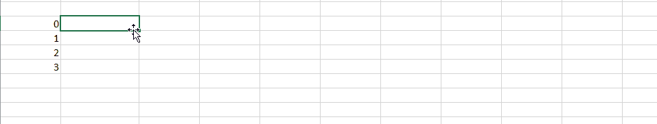

# 如何用 Python 为 Excel 增压

> 原文：<https://towardsdatascience.com/how-to-supercharge-excel-with-python-726b0f8e22c2?source=collection_archive---------0----------------------->

## 如何用 xlwings 集成 Python 和 Excel


由 [Unsplash](https://unsplash.com?utm_source=medium&utm_medium=referral) 上的[émile Perron](https://unsplash.com/@emilep?utm_source=medium&utm_medium=referral)拍摄的照片

Excel 既是一种祝福，也是一种诅咒。当谈到足够小的数据和足够简单的操作时 *Excel 是王者*。然而，一旦你发现自己在那些区域之外努力，它就变成了一种痛苦。当然，你可以使用 Excel VBA 来解决这些问题，但是在 2020 年，你可以感谢你的幸运星，因为你不需要这么做！

如果有一种方法能把 Excel 和 Python 集成在一起，给 Excel 插上翅膀就好了！现在有了。一个名为 ***xlwings 的 python 库允许你通过 VBA*** *调用 Python 脚本，并在两者*之间传递数据。

# 为什么要集成 Python 和 Excel VBA？

事实是，在 VBA 你几乎可以做任何事情。那么，如果是这样的话，为什么要使用 Python 呢？嗯，有很多原因。

1.  您可以在 Excel 中创建自定义函数，而无需学习 VBA(如果您还不知道的话)
2.  您的用户可以轻松使用 Excel
3.  使用 Python 可以显著加快数据操作的速度
4.  Python 中几乎有任何东西的库(机器学习、数据科学等)
5.  因为你可以！！！


照片由[摄影师](https://unsplash.com/@ffstop?utm_source=medium&utm_medium=referral)在 [Unsplash](https://unsplash.com?utm_source=medium&utm_medium=referral) 上拍摄

# 设置使用 xlwings

与我们想要使用的任何新库一样，我们需要做的第一件事是安装它。做起来超级简单；有了这两条命令，我们马上就可以设置好了。所以，继续输入您的终端:

一旦下载并安装了库，我们需要安装 Excel 集成部分。确保您已经关闭了所有 Excel 实例和任何终端类型:

假设您没有遇到错误，您应该能够继续。然而，在 Win10 和 Excel 2016 上，人们经常会看到以下错误:

```
xlwings 0.17.0
[Errno 2] No such file or directory: 'C:\\Users\\costa\\AppData\\Roaming\\Microsoft\\Excel\\XLSTART\\xlwings.xlam'
```

如果你是遇到上述错误的幸运儿之一，你需要做的就是创建丢失的目录。使用 mkdir 命令可以很容易地做到这一点。就我而言，我做到了:

```
mkdir C:\\Users\\costa\\AppData\\Roaming\\Microsoft\\Excel\\XLSTART
```

假设成功安装了 excel 与 python 库的集成，您会立即注意到 Excel 中的主要差异:



## 为 xlwings 启用用户定义的功能

首先，我们需要加载 Excel 插件。你可以点击 Alt，L，H，然后导航到上面的目录来加载插件。完成后，您应该能够看到以下内容:



最后，您需要启用对 VBA 项目对象模型的信任访问。为此，您可以导航至文件>选项>信任中心>信任中心设置>宏设置:



由 [Pakata Goh](https://unsplash.com/@pakata?utm_source=medium&utm_medium=referral) 在 [Unsplash](https://unsplash.com?utm_source=medium&utm_medium=referral) 上拍摄的照片

# xlwings 入门

从 Excel 到 Python(以及从 Python 到 Excel)有两种主要方式。第一种是直接从 VBA 调用 Python 脚本，而另一种是通过用户定义的函数。让我们快速浏览一下这两者。

为了避免任何混淆和每次都有正确的设置，xlwings 提供创建您的 Excel 电子表格，随时可用。然后让我们使用这个功能。使用终端，我们导航到我们喜欢的目录并键入:

```
xlwings quickstart ProjectName
```

我称之为 MyFirstPythonXL。上述命令将在您预先导航的目录中创建一个新文件夹，其中包含一个 Excel 工作表和一个 python 文件。



正在打开。xlsm 文件，您会立即注意到一个名为 [_xlwings.conf](http://_xlwings.conf/) 的新 Excel 表格。如果您希望覆盖 xlwings 的默认设置，您所要做的就是重命名该工作表并删除起始下划线。至此，我们已经准备好开始使用 xlwings 了。

# VBA 到 Python

在我们开始编码之前，让我们首先确保我们都在同一页上。要打开我们的 Excel VBA 编辑器，点击 *Alt + F11* 。这将返回以下屏幕:



xlwings 的 VBA 编辑器

这里需要注意的关键点是，该代码将执行以下操作:

1.  在电子表格所在的位置查找 Python 脚本
2.  查找与电子表格同名的 Python 脚本(但扩展名为. py)
3.  在 Python 脚本中，调用函数“main()”

事不宜迟，让我们看几个如何使用它的例子。

## 示例 1:在 Excel 之外操作，并返回输出

在这个例子中，我们将看到如何在 Excel 之外执行操作，然后在电子表格中返回结果。这可以有无限多的用例。

我们将从 CSV 文件中获取数据，对所述数据进行修改，然后将输出传递到 Excel。让我们回顾一下它有多简单:

首先，**VBA 密码**:

我完全没有改变默认设置。

然后，**Python 代码**:

这会导致以下结果:



xlwings 在行动

## 示例 2:使用 Excel 输入来驱动操作

在本例中，我们将从 Excel 中读取输入，用 Python 对其进行处理，然后将结果传回 Excel。

更具体地说，我们将读出一个问候语、一个名字和一个我们可以找到笑话的文件位置。我们的 Python 脚本将从文件中随机抽取一行，并返回一个笑话给我们。

首先，**VBA 电码**:

我完全没有改变默认设置。

然后，**的 Python 代码**:

这给了我们:



# 使用 xlwings 的用户定义函数

和以前一样，我们将改变 python 文件中的代码。为了将一些东西转换成 Excel 用户定义的函数，我们需要做的就是在函数所在的行之前包含“@xw.func ”:

Python 代码:

结果是:



# 结论

我想你会同意这是一个漂亮的小图书馆。如果你像我一样，你更喜欢用 Python 而不是 VBA 工作，但需要在电子表格中工作，那么这可能是一个非常好的工具。

想了解我博客的最新动态吗？别忘了[跟着我](https://medium.com/@costasandreou)！

以下是其他一些你可能会感兴趣的文章:

[](https://medium.com/financeexplained/from-excel-to-databases-with-python-c6f70bdc509b) [## 用 Python 从 Excel 到数据库

### 了解如何使用 Python 进行快速数据分析

medium.com](https://medium.com/financeexplained/from-excel-to-databases-with-python-c6f70bdc509b) [](/from-xml-to-excel-for-data-analysis-ac0c0c765b7d) [## 从 XML 到 Excel 进行数据分析

### Python 中处理 XML 的介绍

towardsdatascience.com](/from-xml-to-excel-for-data-analysis-ac0c0c765b7d)