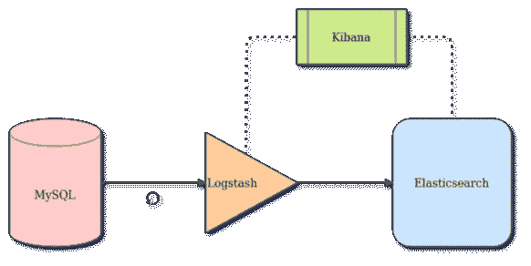
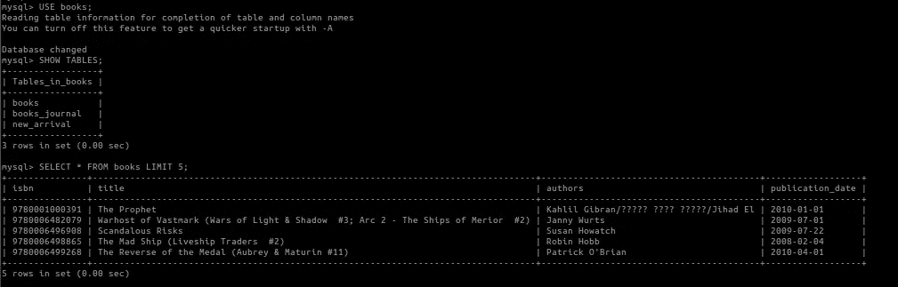
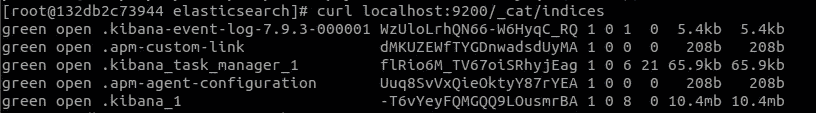
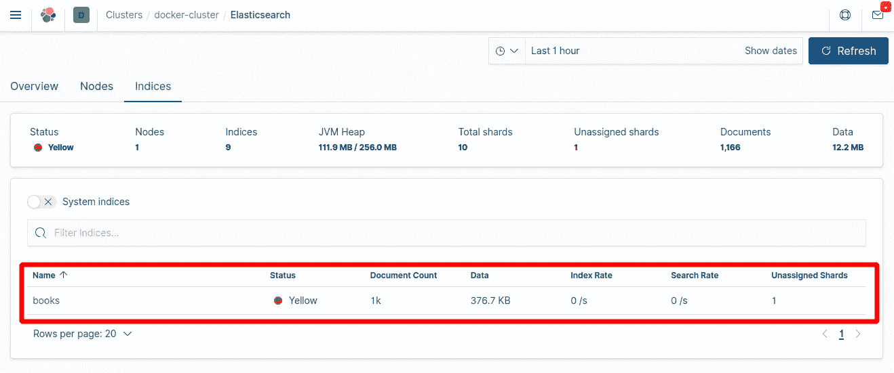
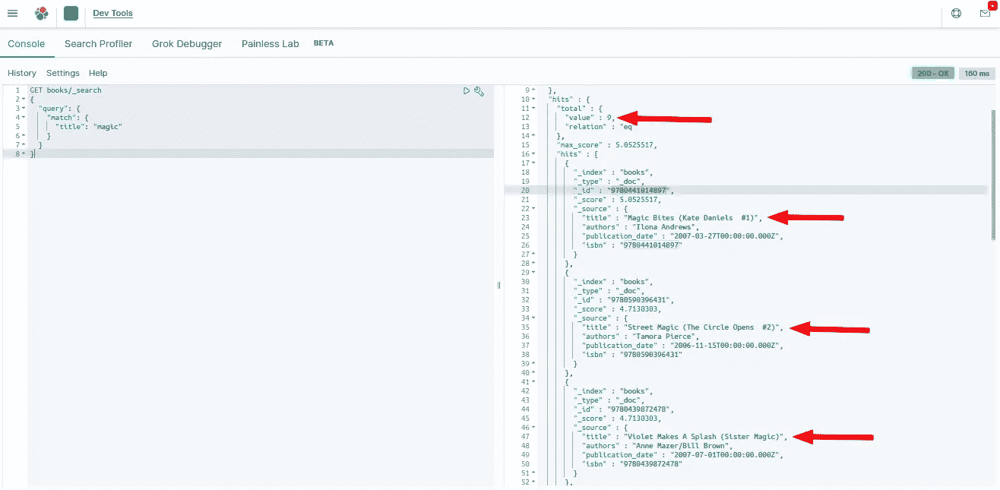
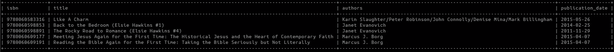
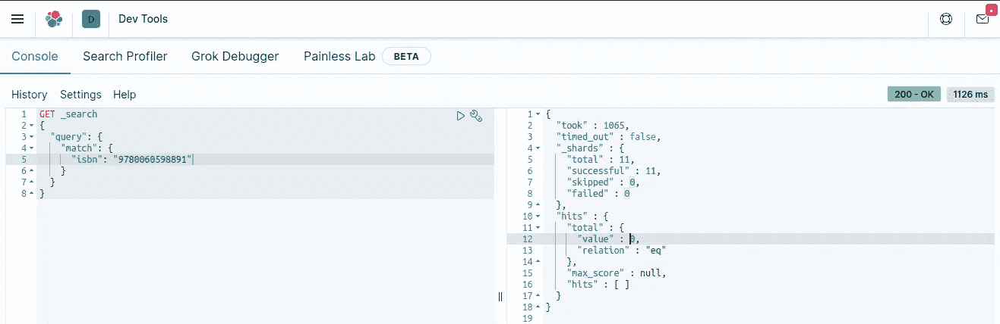
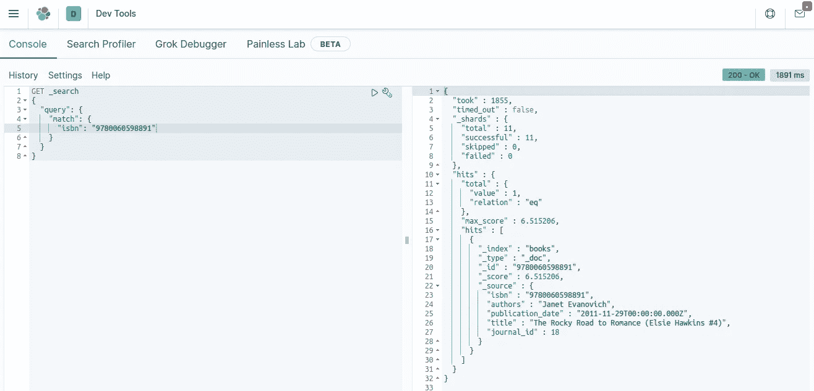
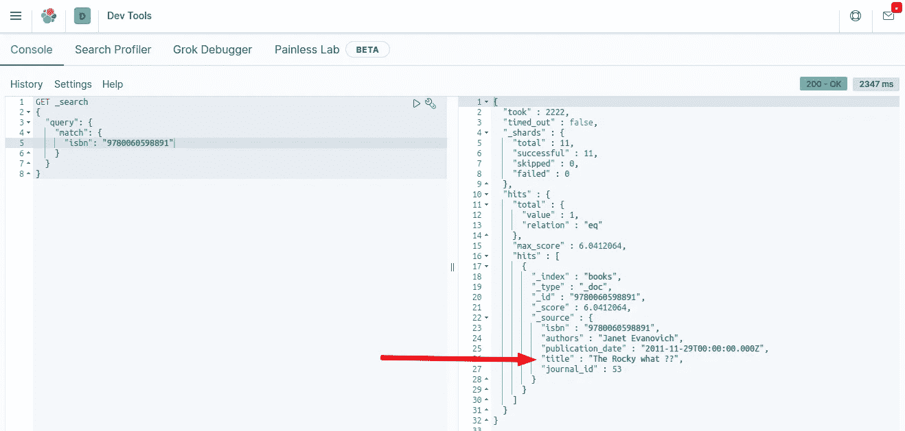
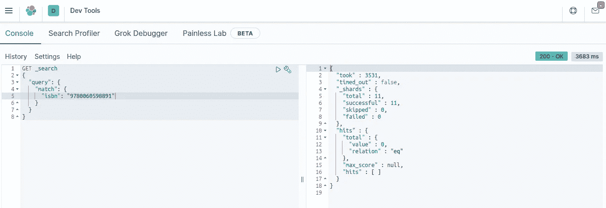

# 如何用 MySQL 同步 Elasticsearch

> 原文：<https://towardsdatascience.com/how-to-synchronize-elasticsearch-with-mysql-ed32fc57b339?source=collection_archive---------1----------------------->

## 使用 Logstash 创建一个连接 Elasticsearch 和 MySQL 的数据管道，以便从零开始建立一个索引，并将数据库记录上发生的任何变化复制到 Elasticsearch 中

## 快速访问链接

*   GitHub 上的资源库: [sync-elasticsearch-mysql](https://github.com/redouane-dev/sync-elasticsearch-mysql) 。

## 技术栈

*   MySQL 作为主数据库(版本 8.0.22)
*   作为文本搜索引擎的弹性搜索(版本 7.9.3)
*   Logstash 作为从 MySQL 到 Elasticsearch 的连接器或数据管道(7.9.3 版)
*   用于监控和数据可视化的 Kibana(版本 7.9.3)
*   JDBC 连接器/J(版本 8.0.22)

## 内容

*   问题陈述
*   解决方案
    -使用 Logstash 的好处
    -用例
*   实施概念验证
    -为项目创建主机目录
    -设置 MySQL 数据库
    -设置 Elasticsearch 和 Kibana
    -设置 Logstash 将数据从 MySQL 传输到 Elasticsearch:
    *第一个场景—从头开始创建 Elasticsearch 索引
    *第二个场景—将数据库记录的更改复制到 Elasticsearch
*   结论
*   资源


照片由 [Sébastien Jermer](https://unsplash.com/@seb?utm_source=medium&utm_medium=referral) 在 [Unsplash](https://unsplash.com?utm_source=medium&utm_medium=referral) 上拍摄

# 问题陈述

科技公司的一个常见场景是开始围绕一个或多个数据库构建其核心业务功能，然后开始将服务连接到这些数据库，以对文本数据执行搜索，例如在用户表的用户地址列中搜索街道名称，或者在图书馆的目录中搜索书名和作者姓名。

到目前为止一切都很好。公司不断发展壮大，获得了越来越多的客户。但随后搜索速度开始变得越来越慢，这往往会激怒他们的客户，并很难说服新的潜在客户购买。

从本质上看，工程师们意识到 MySQL 的`FULLTEXT` 索引对于在大型数据集上进行文本查找并不理想，为了扩大他们的业务，工程师们决定转向更专用的、经过实战检验的文本搜索引擎。

进入 Elasticsearch 及其底层 [Lucene 搜索引擎](https://lucene.apache.org/core/)。Elasticsearch 使用一个[倒排文档索引](https://en.wikipedia.org/wiki/Inverted_index)来索引数据，这导致了极快的全文搜索。

一个新的挑战随之而来:**如何将 MySQL 数据库中的数据放入 Elasticsearch 索引，以及如何保持后者与前者同步？**

# 解决办法

现代数据管道工的工具包中包含了大量的软件，可用于任何数据操作任务。在本文中，我们将关注来自 [ELK stack](https://www.elastic.co/what-is/elk-stack) 的 Logstash，以便定期从 MySQL 获取数据，并将其镜像到 Elasticsearch 上。这将考虑到 MySQL 数据记录的任何变化，如`create`、`update`和`delete`，并在 Elasticsearch 文档中复制相同的内容。

## 使用 Logstash 的好处

我们在这里试图解决的问题——定期从 MySQL 向 Elasticsearch 发送数据以同步两者——可以通过 cron 作业或任何作业调度程序运行的 Shell 或 Python 脚本来解决，但这将剥夺我们通过配置 Logstash 及其基于插件的设置所获得的好处:

*   虽然我们在这里主要关注 MySQL， [Logstash 可以从许多来源获取数据，](https://www.elastic.co/guide/en/logstash/current/input-plugins.html)使它成为一个集中式数据输入节点。
*   当数据从源传递到目的地时，Logstash 提供了动态解析、转换和过滤数据的可能性。
*   至于输入源，有[许多输出目的地可用](https://www.elastic.co/guide/en/logstash/current/output-plugins.html)——elastic search 是首选输出。
*   作为 ELK 堆栈的一部分，稍后，Elasticsearch 和 Kibana 将为度量和可视化提供很好的整合。

## 用例

我们将在以下步骤中介绍两种情况:

1.  从头开始创建弹性搜索索引和索引数据库记录*。*
2.  *增量* *根据数据库记录发生的变化(创建、更新、删除)更新弹性搜索索引的*。

# 实施概念验证

想象一下，你正在开一个在线图书馆，热心的读者可以在那里搜索你的图书目录，找到他们的下一本书。您的目录包含数百万个标题，从科学文献卷到有关异国冒险的小册子。

我们将创建一个初始数据库表`books`,其中有几千条记录，包括书名、作者、ISBN 和出版日期。我们将使用可以在 Kaggle 上找到的 [Goodreads](https://www.goodreads.com/) 图书目录。这个初始表将用于构建用例的原型(1)从零开始构建索引。

我们将在表`books`上创建触发器，该触发器将用`books`表上的所有更改填充日志表`books_journal`(例如`create`、`update`、`delete`)。这意味着无论何时在`books`表上创建、更新或删除一条记录，该操作都将被记录在`books_journal`表上，同样的操作也将在相应的 Elasticsearch 文档上执行。这将用于原型用例(2)弹性搜索指数的增量更新。

我们将通过使用 [docker-compose](https://docs.docker.com/compose/) 定义微服务架构来原型化和测试上述概念。



该项目的建筑——作者图片

## **先决条件**

*   [安装对接器](https://docs.docker.com/get-docker/)和[对接器组成](https://docs.docker.com/compose/install/)

## **步骤**

> 完整的源代码可以在 GitHub 的[sync-elastic search-MySQL](https://github.com/redouane-dev/sync-elasticsearch-mysql)找到。

1.  **首先创建一个目录**来托管这个项目(命名为`sync-elasticsearch-mysql`)，并在该目录中创建一个 docker-compose.yaml 文件，初始设置如下:

```
version: "3"
services:
...
# Here will come the services definition
...
```

**2。设置一个 MySQL 数据库:**创建一个目录`data/`，我们将在其中存储 MySQL 转储文件，这些文件包含`books`表的预清理图书数据，以及`books`表的触发器(关于创建、更新和删除)，还有一个`new_arrivals`表，其中包含我们将添加到目录中以模拟新记录的图书，以及表`books_journal`。

您可以在[项目资源库](https://github.com/redouane-dev/sync-elasticsearch-mysql/tree/main/data)中找到这些转储文件。请将它们复制到`data/`目录，以便 MySQL 容器在启动过程中将它们添加到`books`数据库中。

```
version: "3"
services:
  # add this:
  mysql:
    image: mysql:8
    container_name: sem_mysql
    ports:
      - 3306:3306
    environment:
      MYSQL_RANDOM_ROOT_PASSWORD: "yes"
      MYSQL_DATABASE: books
      MYSQL_USER: avid_reader
      MYSQL_PASSWORD: i_love_books
    volumes:
      # Dump files for initiating tables
      - ./data/:/docker-entrypoint-initdb.d/
```

> 请注意，不建议在源代码中以纯文本形式存储用户名和密码。以上只是为了建立这个项目的原型，在任何情况下都不是推荐的做法。

要启动 MySQL 并检查数据是否已成功添加，请在终端上运行项目目录:

```
docker-compose up -d mysql # -d is for detached mode# Once container started, log into the MySQL container
docker exec -it sem_mysql bash# Start a MySQL prompt
mysql -uavid_reader -pi_love_books# Check that tables have been loaded from dump files
use books;
show tables;
```



可用表格列表和数据示例—按作者分类的图片

要以类似 JSON 的格式显示触发器，请使用命令:

```
SHOW TRIGGERS \G;# To exit the MySQL prompt press CTRL+D
# To logout from the MySQL container, press CTRL+D
```

既然我们已经正确地建立了数据库，我们就可以继续进行这个项目的实质性工作了。

**3。设置 Elasticsearch 和 Kibana:** 要设置 Elasticsearch(还没有索引任何文档)，请将其添加到 docker-compose.yaml 文件中:

```
version: "3"
services:
...
  elasticsearch:
    image: docker.elastic.co/elasticsearch/elasticsearch:7.9.3
    container_name: sem_elasticsearch
    environment:
      - discovery.type=single-node
      - bootstrap.memory_lock=true
      - "ES_JAVA_OPTS=-Xms512m -Xmx512m"
    volumes:
      - ./volumes/elasticsearch:/usr/share/elasticsearch/data
    logging:
        driver: "json-file"
        options:
            max-size: "10k"
            max-file: "10"
  kibana:
    image: docker.elastic.co/kibana/kibana:7.9.3
    container_name: sem_kibana
    environment:
      - "ELASTICSEARCH_URL=[http://elasticsearch:9200](http://elasticsearch:9200)"
      - "SERVER_NAME=127.0.0.1"
    ports:
      - 5601:5601
    depends_on:
      - elasticsearch
```

> 请注意，为了将弹性搜索索引数据从 docker 卷挂载到您的目录文件系统，建议使用卷定义。

要启动 Elasticsearch 和 Kibana，请从您的项目目录运行以下命令:

```
docker-compose up -d elasticsearch kibana # -d is for detached mode# To check if everything so far  is running as it should, run:
docker-compose ps
```


在执行上述命令后，3 个容器应该启动并运行——Image by Author

让我们检查到目前为止我们的 Elasticsearch 节点中是否有任何索引:

```
# On your terminal, log into the Elasticsearch container
docker exec -it sem_elasticsearch bash# Once logged in, use curl to request a listing of the indexes
curl localhost:9200/_cat/indices
```

如果 Kibana 已经启动并运行，您将看到一个用于度量和可视化的索引列表，但是还没有与我们的书相关的内容——如果 Kibana 还没有启动，索引列表将是空的。



由 Kibana 创建的索引列表—图片由作者提供

**4。设置 Logstash 将数据从 MySQL 传输到 Elasticsearch:**

为了将 Logstash 连接到 MySQL，我们将使用官方的 JDBC 驱动程序，该驱动程序可以在[这个地址](https://dev.mysql.com/downloads/connector/j/)获得。

让我们创建一个 Dockerfile(在同一个目录中命名为`Dockerfile-logstash`)来提取一个 Logstash 映像，下载 JDBC 连接器，并启动一个 Logstash 容器。将这些行添加到您的 docker 文件中:

```
FROM docker.elastic.co/logstash/logstash:7.9.3# Download JDBC connector for Logstash
RUN curl -L --output "mysql-connector-java-8.0.22.tar.gz" "[https://dev.mysql.com/get/Downloads/Connector-J/mysql-connector-java-8.0.22.tar.gz](https://dev.mysql.com/get/Downloads/Connector-J/mysql-connector-java-8.0.22.tar.gz)" \
    && tar -xf "mysql-connector-java-8.0.22.tar.gz" "mysql-connector-java-8.0.22/mysql-connector-java-8.0.22.jar" \
    && mv "mysql-connector-java-8.0.22/mysql-connector-java-8.0.22.jar" "mysql-connector-java-8.0.22.jar" \
    && rm -r "mysql-connector-java-8.0.22" "mysql-connector-java-8.0.22.tar.gz"ENTRYPOINT ["/usr/local/bin/docker-entrypoint"]
```

然后将下面的代码片段添加到 docker-compose.yaml 文件中:

```
version: "3"
services:
...
  logstash:
    build:
      context: .
      dockerfile: Dockerfile-logstash
    container_name: sem_logstash
    depends_on:
      - mysql
      - elasticsearch
    volumes:
      # We will explain why and how to add volumes below
```

Logstash 使用定义的管道来知道从哪里获取数据，如何过滤数据，以及数据应该去往哪里。我们将定义两个管道:一个用于从头创建一个 Elasticsearch 索引(第一个场景)，另一个用于数据库记录变更的增量更新(第二个场景)。

有关管道定义中使用的每个字段的解释，请查看文档:

*   输入: [JDBC 输入插件](https://www.elastic.co/guide/en/logstash/current/plugins-inputs-jdbc.html)
*   过滤:[变异](https://www.elastic.co/guide/en/logstash/current/plugins-filters-mutate.html#plugins-filters-mutate-remove_field) `[remove_field](https://www.elastic.co/guide/en/logstash/current/plugins-filters-mutate.html#plugins-filters-mutate-remove_field)`
*   输出: [Elasticsearch 输出插件](https://www.elastic.co/guide/en/logstash/current/plugins-outputs-elasticsearch.html)

**4.a .第一个场景——从头开始创建弹性搜索指数:**

在您的项目目录中，创建一个`volumes`文件夹(如果还没有创建的话),然后创建一个目录来托管我们的 Logstash 配置:

```
mkdir -p volumes/logstash/config
```

然后在这个配置目录下，创建一个文件`pipelines.yml`，包含:

```
- pipeline.id: from-scratch-pipeline
  path.config: "/usr/share/logstash/pipeline/from-scratch.conf"
```

然后，我们创建一个文件夹`pipeline`来存放我们的管道定义:

```
mkdir volumes/logstash/pipeline
```

并在那里创建一个文件`from-scratch.conf`，内容如下:

```
input {
  jdbc {
    jdbc_driver_library => "/usr/share/logstash/mysql-connector-java-8.0.22.jar"
    jdbc_driver_class => "com.mysql.jdbc.Driver"
    jdbc_connection_string => "jdbc:mysql://mysql:3306"
    jdbc_user => "avid_reader"
    jdbc_password => "i_love_books"
    clean_run => true
    record_last_run => false
    statement_filepath => "/usr/share/logstash/config/queries/from-scratch.sql"
  }
}filter {
  mutate {
    remove_field => ["[@version](http://twitter.com/version)", "[@timestamp](http://twitter.com/timestamp)"]
  }
}output {
  # stdout { codec => rubydebug { metadata => true } }
  elasticsearch {
    hosts => ["[http://elasticsearch:9200](http://elasticsearch:9200)"]
    index => "books"
    action => "index"
    document_id => "%{isbn}"
  }
}
```

我们在`jdbc_driver_library`中定义了在哪里找到 JDBC 连接器，在`jdbc_connection_string`中设置了在哪里找到 MySQL，在`clean_run`中指示插件从头开始运行，并且我们在`statement_filepath`中定义了在哪里找到 SQL 语句来获取和格式化数据记录。

过滤器基本上删除了插件添加的额外字段。

在输出中，我们定义在哪里找到 Elasticsearch 主机，将索引的名称设置为`books`(可以是新的或现有的索引)，定义要执行的操作(可以是`index`、`create`、`update`、`delete` — [参见文档](https://www.elastic.co/guide/en/logstash/current/plugins-outputs-elasticsearch.html#plugins-outputs-elasticsearch-action)，并设置哪个字段将作为`books`索引中的唯一 ID—[ISBN 是图书的国际唯一 ID](https://en.wikipedia.org/wiki/International_Standard_Book_Number)。

为了添加由`statement_filepath`引用的 SQL 查询，让我们创建一个文件夹`queries`:

```
mkdir volumes/logstash/config/queries/
```

然后添加文件`from-scratch.sql`，只有:

```
SELECT * FROM books.books
```

用到目前为止我们的`books`表中所有可用的记录构建我们的索引。注意，查询不应该以分号(；).

现在，要挂载上面创建的配置文件和定义，请将以下内容添加到 docker-compose.yaml 文件中:

```
version: "3"
services:
...
  logstash:
    ...
    volumes:
      - ./volumes/logstash/pipeline/:/usr/share/logstash/pipeline/
      - ./volumes/logstash/config/pipelines.yml:/usr/share/logstash/config/pipelines.yml
      - ./volumes/logstash/config/queries/:/usr/share/logstash/config/queries/
```

> 请注意，`volumes`指令是一种告诉 Docker 将容器内的目录或文件(的右侧)挂载到您的机器或服务器上的目录或文件(的左侧)的方式。在`volumes`上查看[官方 Docker 撰写文档](https://docs.docker.com/compose/compose-file/#volumes)。

**测试**

为了测试第一个场景的实现，在您的终端上运行:

```
docker-compose up logstash
```

如果运行成功，您将看到类似于`Logstash shut down`的消息，容器将退出，并返回错误代码 0。

现在在你的浏览器上打开 Kibana(例如[这个链接](http://localhost:5601/app/monitoring#/elasticsearch/indices)，让我们开始尝试看看我们是否有一个`books`索引，以及我们如何搜索书籍。



图书索引已成功创建，包含 1k 个文档—图片由作者提供

在 Dev Tools 面板中，您可以运行定制查询来通过字段值获取文档。例如，让我们搜索标题中带有“魔法”一词的书籍。将此查询粘贴到开发工具控制台上:

```
GET books/_search
{
  "query": {
    "match": {
      "title": "magic"
    }
  }
}
```

我们得到 9 份文件:



搜索标题中包含“魔法”一词的书籍-作者图片

图片由 [Giphy](https://media.giphy.com/media/5pUxc9KypDZSkGRRXe/giphy.gif) 提供

**4.b .第二个场景—将数据库记录上的更改复制到 Elasticsearch:**

大部分配置和调整已经在前一部分完成。我们将简单地添加另一个管道来负责增量更新(复制)。

在文件`volumes/logstash/config/pipelines.yml`中，添加这两行:

```
- pipeline.id: incremental-pipeline
  path.config: "/usr/share/logstash/pipeline/incremental.conf"
```

在同一个文件中，您可能想要注释掉与“从头开始”部分(第一个场景)相关的前两行，以便指示 Logstash 只运行这个增量管道。

让我们在目录`volumes/logstash/pipeline/`中创建一个文件`incremental.conf`，内容如下:

```
input {
  jdbc {
    jdbc_driver_library => "/usr/share/logstash/mysql-connector-java-8.0.22.jar"
    jdbc_driver_class => "com.mysql.jdbc.Driver"
    jdbc_connection_string => "jdbc:mysql://mysql:3306"
    jdbc_user => "avid_reader"
    jdbc_password => "i_love_books"
    statement_filepath => "/usr/share/logstash/config/queries/incremental.sql"
    use_column_value => true
    tracking_column => "journal_id"
    tracking_column_type => "numeric"
    schedule => "*/5 * * * * *"
  }
}filter {
  if [action_type] == "create" or [action_type] == "update" {
    mutate { add_field => { "[[@metadata](http://twitter.com/metadata)][action]" => "index" } }
  } else if [action_type] == "delete" {
    mutate { add_field => { "[[@metadata](http://twitter.com/metadata)][action]" => "delete" } }
  }mutate {
    remove_field => ["[@version](http://twitter.com/version)", "[@timestamp](http://twitter.com/timestamp)", "action_type"]
  }
}output {
  # stdout { codec => rubydebug { metadata => true } }
  elasticsearch {
    hosts => ["[http://elasticsearch:9200](http://elasticsearch:9200)"]
    index => "books"
    action => "%{[[@metadata](http://twitter.com/metadata)][action]}"
    document_id => "%{isbn}"
  }
}
```

与之前的管道定义相比，我们看到了一些额外的参数。

`schedule`参数有一个类似 cron 的语法(当左边增加一个值时，分辨率下降到秒)，并在后台使用 [Rufus 调度器](https://github.com/jmettraux/rufus-scheduler)。这里我们用`*/5 * * * * *`指示 Logstash 每 5 秒运行一次这个管道。

> 网站 [crontab.guru](https://crontab.guru/) 可以帮你读懂 crontab 表达式。

在每次定期运行期间，参数`tracking_column`指示 Logstash 存储获取的最后一条记录的`journal_id`值，并将其存储在文件系统上的某个位置(参见[文档，此处](https://www.elastic.co/guide/en/logstash/current/plugins-inputs-jdbc.html#plugins-inputs-jdbc-last_run_metadata_path)用于`last_run_metadata_path`)。在接下来的运行中，Logstash 将从`journal_id + 1`开始获取记录，其中`journal_id`是当前运行中存储的值。

在`filter`部分中，当数据库操作类型为“创建”或“更新”时，我们将 Elasticsearch 操作设置为“索引”,这样新文档就会被索引，现有文档也会被重新索引以更新它们的值。避免重新索引现有文档的另一种方法是编写一个定制的“更新”脚本，并使用“更新”动作。对于“删除”操作，Elasticsearch 上的文档会被删除。

让我们使用以下查询创建并填充目录`volumes/logstash/config/queries/`中的文件`incremental.sql`:

```
SELECT
        j.journal_id, j.action_type, j.isbn,
        b.title, b.authors, b.publication_date
FROM books.books_journal j
LEFT JOIN books.books b ON b.isbn = j.isbn
WHERE j.journal_id > :sql_last_value
        AND j.action_time < NOW()
ORDER BY j.journal_id
```

**测试**

我们来看看表`books.new_arrival`。它包含刚刚交付给我们的书籍，我们没有时间将它们添加到主`books.books`表中。



“SELECT * FROM books.new _ arrival”—作者图片

如我们所见，该表中没有一本书在我们的 Elasticsearch 索引中。让我们试试上表中的第三本书《浪漫之路(艾尔西·霍金斯#4)》，ISBN 9780060598891:



搜索 ISBN 9780060598891 返回空结果—作者图片

现在，让我们将图书从新到货表转移到我们的主`books`表:

```
INSERT INTO books
SELECT * FROM new_arrival WHERE isbn = 9780060598891;
```

在 Elasticsearch 上运行相同的搜索，我们很高兴地看到该文档现已可用:



现在 ISBN 9780060598891 可以在弹性搜索索引上找到——作者图片

同步成功了！

让我们测试同一个 ISBN 的更新:

```
UPDATE books
SET title = "The Rocky what ??"
WHERE isbn = 9780060598891;
```



数据库记录的更新被成功复制到 Elasticsearch 文档——按作者分类的图片

…以及删除相同的 ISBN:

```
DELETE from books WHERE isbn = 9780060598891;
```



从数据库中删除的记录也将从 elastic search index-Image by Author 中删除

图片由 [Giphy](https://media.giphy.com/media/WKdPOVCG5LPaM/giphy.gif) 提供

# 结论

我们设法在很短的时间内获得了一个概念证明，即如何从 MySQL 数据库将数据索引到 Elasticsearch 中，以及如何使 Elasticsearch 与数据库保持同步。

我们使用的技术是业内的黄金标准，许多企业每天都依赖这些技术来服务他们的客户，很可能许多企业已经遇到或将会遇到我们在这个项目中解决的相同问题。

# **取得联系**

如果你想联系我，或者你只是想让我知道你对这个项目的想法，不要犹豫，留下评论，或者通过电子邮件或 [LinkedIn](https://linkedin.com/in/redouane-achouri) 联系我。

如果你觉得这个教程有用，并且你想支持高质量文章的制作，考虑[给我买杯咖啡](https://www.buymeacoffee.com/redouaneachouri)！

你可以点击“关注”按钮来获取我的最新文章和帖子！


# 资源

*   [首次尝试建立倒排索引](https://nlp.stanford.edu/IR-book/html/htmledition/a-first-take-at-building-an-inverted-index-1.html)
*   [数据输入:文件和索引](https://www.elastic.co/guide/en/elasticsearch/reference/current/documents-indices.html)
*   [如何使用 Logstash 和 JDBC 保持 Elasticsearch 与关系数据库同步](https://www.elastic.co/blog/how-to-keep-elasticsearch-synchronized-with-a-relational-database-using-logstash)。这篇文章很有启发性，但是它并不涉及从零开始索引和删除记录。
*   本项目使用的数据可在 Kaggle 数据集 [Goodreads-books](https://www.kaggle.com/jealousleopard/goodreadsbooks) 中获得。
*   [日志 JDBC 输入插件](https://www.elastic.co/guide/en/logstash/current/plugins-inputs-jdbc.html)
*   [日志隐藏变异过滤器插件](https://www.elastic.co/guide/en/logstash/current/plugins-filters-mutate.html)
*   [Logstash Elasticsearch 输出插件](https://www.elastic.co/guide/en/logstash/current/plugins-outputs-elasticsearch.html)