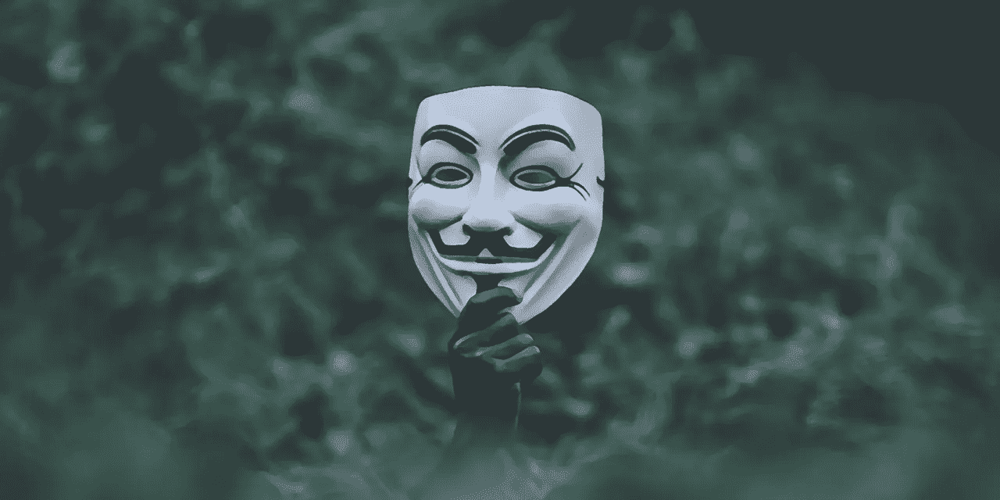
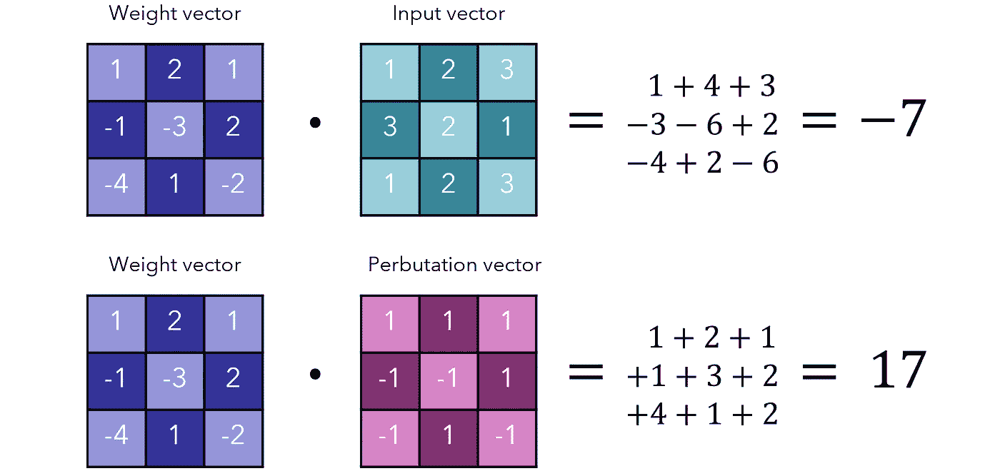
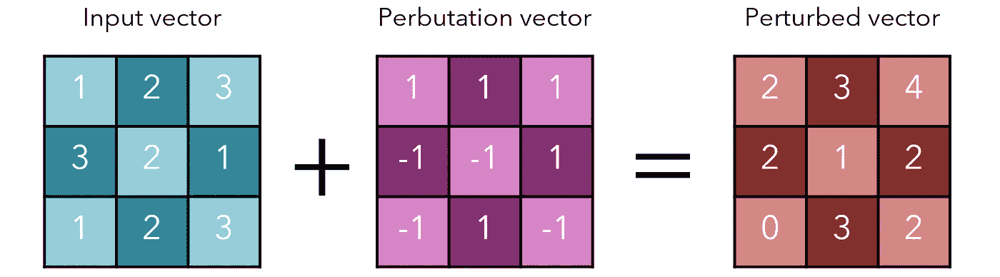
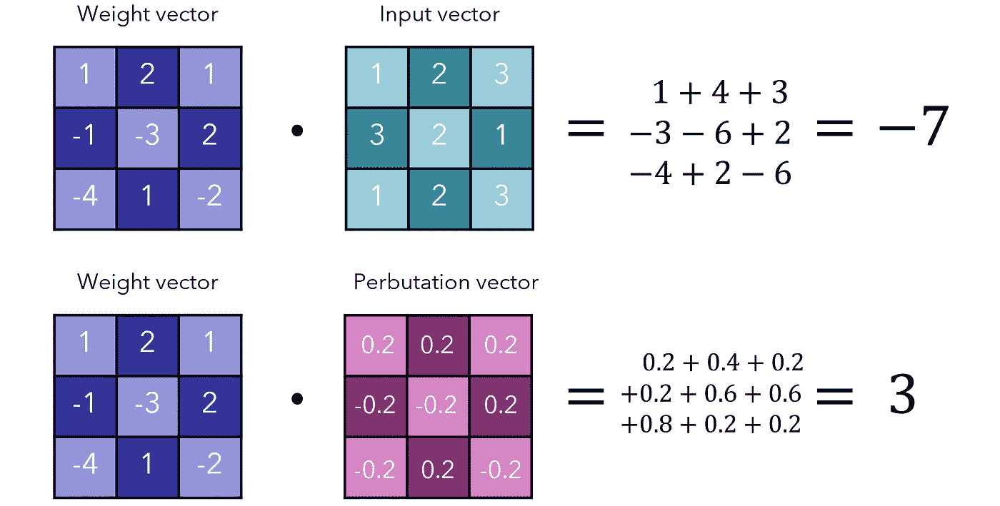
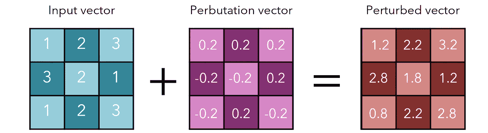
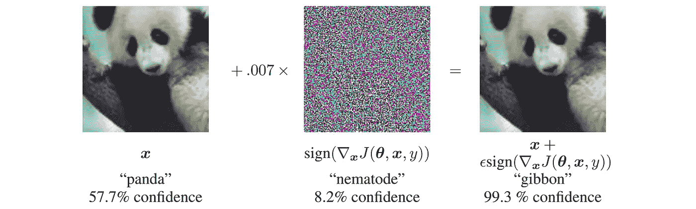

# 如何系统地愚弄一个图像识别神经网络

> 原文：<https://towardsdatascience.com/how-to-systematically-fool-an-image-recognition-neural-network-7b2ac157375d?source=collection_archive---------17----------------------->

来源: [Unsplash](https://unsplash.com/photos/1X8VQsDEyVU)

## 以及为什么它很重要

卷积神经网络(CNN)构成了图像识别的基础，这无疑是深度学习最重要的应用之一。不幸的是，深度学习的许多研究都是在数据集的“完美世界”约束下进行的，以追求几个百分点的准确性。因此，我们开发的架构在理论测试中表现非常好，但在现实世界中不一定如此。

对抗性的例子或输入(想想*对手* : *敌人*)对于人眼来说无法与常规图像区分开来，但完全可以骗过各种图像识别架构。显然，敌对输入的部署会带来许多令人不安和危险的影响，特别是当 AI 被赋予更多权力为自己做决定的时候。

因此，理解和解决系统地产生对抗性输入的方法——应用于深度学习的道德黑客攻击——是很重要的。

Goodfellow 等人介绍了一种简单的系统生成对抗输入的方法，称为“快速梯度符号方法”。

考虑:

*   一个输入向量 *x* (这是输入信息——图像——但是把它想象成一个一维列表)
*   对抗性输入 *x* -hat(与 *x* 形状相同，但数值有所改变)
*   一个对抗矢量*η*(‘eta’被加到输入矢量上以产生对抗输入矢量)

为了执行逐个元素的乘法和求和(例如`[1,2,3] × [1,2,3] = 1+4+9 = 14`)，我们将第一个向量的转置与第二个向量相乘。这将被称为“加权和”。

我们在这里有两个目标，我们必须都实现，以生成对抗性输入:

*   我们希望最大化原始输入向量的加权和与被扰乱(改变)的敌对输入的加权和之间的差异。这将改变激活状态，并打乱模型的决策过程。
*   我们希望使对立向量 *η* 的每个单独值尽可能小，以使整个图像在人眼看来不变。

Goodfellow 等人提出的解决方案是双管齐下的——而且非常聪明，原因如下。

*η* 设置为 sign( *w* )，其中 sign 函数返回-1 表示负值，1 表示正值(0 表示 0)。如果权重为负，则乘以负一得到正和；如果权重为正，则乘以正 1，不变。

例如，如果权重向量是`[3,-5,7]`， *η* 将是`[1,-1,1]`。加权和为`3+5+7=15`。请注意，执行此操作本质上是将否定转化为肯定，并保留肯定(`abs()`功能)。这意味着每个数字都是尽可能大的，如果权重在区间`[-1, 1]`内，则是可能的最高加权和。

考虑下面的一些“图片”。虽然它们是二维的，但把它们想象成一维向量。

由作者创建。

最终的和是 10，这与最初的输出-7 有很大的不同。当然，这将会打乱网络的预测。

这实现了做出大的改变的目标，但是它一点也不谨慎。毕竟，当我们扰乱它时，我们的形象已经发生了显著的变化:

由作者创建。

请记住，我们之前将最终总和表示为*w*(*x*)+*w*(*η*)，其中 *w* ()是加权总和， *η* 是概率向量，这实际上是对*w*(*x*+*η*)的扩展。我们想稍微改变每个像素的值。虽然总效果必须最大化，但是 *η* 的每个元素必须足够小以至于不被注意到。

在对抗输入的实际产生中，像素数`*j*`被定义为 *x* 的第`*j*`个值加上 *η的第`*j*`个值。*首先介绍的符号采取了一点捷径来演示 *η* 的目的，就是大幅增加*集体总和*，不一定是单个像素值。

*η* 的每个元素都相当大:+1 或-1，这对适当缩放的数据影响很大。为了解决这个问题，我们将把 *η* 的每个元素乘以一个带符号的ϵ，其中ϵ是传感器检测到的最小数值单位(或者更小)。对于 8 位颜色，这个数字是 256，因此ϵ = 1/255。

因为ϵ是“不可探测的”(或者说几乎不可探测)，所以从视觉上看，它对图像没有影响。但是，每个变化都是按照符号函数构建的，以使加权和的变化最大化。

因此，我们将-ϵ或+ϵ添加到输入向量的每个元素，这是一个足够小的变化，因此它是不可检测的，但用符号函数构造，使得变化最大化。

> 许多小组件加起来可能会非常大，尤其是如果它们是以智能方式构建的话。

让我们考虑一下这对我们之前的ϵ=0.2.例子的影响我们能够产生 3 个单位的差异(总和为-4)。

由作者创建

这是相当可观的，尤其是考虑到置换向量对原始输入向量的微小改变。

由作者创建

如果权重向量有 *n* 维，一个元素的平均绝对值是 *m* ，那么激活值将增长ϵ *nm* 。在高维图像(比如 256 乘 256 乘 3)中， *n* 的值是 196608。m 和ϵ可能非常小，但仍会对输出产生重大影响。

这种方法非常快，因为它只改变+ϵ或-ϵ:的输入，但它这样做的方式非常有效，它完全欺骗了神经网络。

这里，0.007 的ϵ对应于在 GoogLeNet 转换成实数之后 8 位图像编码的最小位的幅度。来源:[古德费勒等人](https://arxiv.org/pdf/1412.6572.pdf)

Goodfellow 等人在应用 FGSM 时发现了有趣的结果:

*   ϵ=0.25 导致浅层 SoftMax 分类器具有 99.9%的错误率，在 MNIST 上的平均置信度为 *79.3%* 。
*   对于预处理的 CIFAR-10 上的不正确预测，ϵ=0.1 导致 CNN 具有 87.15%的错误率，平均置信度为 *96.6%* 。

显然，这些对抗性的输入会导致严重的错误率，但更令人担心的可能是高置信度。这些网络不仅预测错误；他们对自己不正确的输出很有信心。这显然是有问题的:想象一下，在教一个犹豫地回答 2×4=6 的学生和一个自豪地宣布答案的学生时会有什么不同。

这些对立的输入/示例可以被解释为高维点积的一个属性:当有大量像素要在其中分配和时，加权和可以更大，并且每个单独像素的变化更小。

事实上，对立的例子是网络过于线性的结果。毕竟，这种变化对(比如说)一个由 sigmoid 函数组成的网络几乎没有影响，因为在大多数地方，perbutations 的影响是递减的。具有讽刺意味的是，正是这种特性——死亡梯度——导致了 ReLU 和其他倾向于敌对输入的无界函数的兴起。

文件中阐述的其他要点包括:

*   最重要的是传播的方向，而不是空间中的某一点。模型在多维空间中不存在“弱点”的口袋；相反，在对抗性输入的构建中，决定性的方向才是最重要的。
*   因为方向是最重要的，所以对立结构是广义的。由于寻找对立的输入并不归属于探索模型的预测空间，因此可以将构造方法推广到几种不同类型和架构的模型。
*   *对抗性训练可以导致正规化；甚至超过了退学*。训练网络识别敌对输入是一种有效的正规化形式，也许比辍学更有效。对抗性训练的正则化效果不能用例如重量衰减或简单增加来复制。
*   *容易优化的模型也容易扰动*。如果找到一个最佳梯度是简单的，那么计算一个有效的对抗输入也是简单的。
*   线性模型、为模拟输入分布而训练的模型和集成对对抗性输入没有抵抗力。RBF 网络*是抗*的。具有隐藏层的体系结构可以被训练成以不同程度的成功识别对立的输入。

越来越重要的是，走出数据集的有限和完美世界，进入不那么有序的真实世界。通过发现欺骗我们的图像识别模型的有效策略，我们可以在它们被用于更恶意的目的之前防御它们。

## 推荐阅读

*   [解释和利用对立的例子(Goodfellow et al.)](https://arxiv.org/pdf/1412.6572.pdf)
    以比本文更严格的数学方式介绍 FGSM，深入研究实证结果，并讨论理论解释和含义。
*   [走向抗对抗性攻击的深度学习模型(Madry et al.)](https://arxiv.org/pdf/1706.06083.pdf) 在 FGSM 的工作基础上，开发了更复杂的对抗性示例生成方法。
*   [TensorFlow 教程:与 FGSM 对立的例子](https://www.tensorflow.org/tutorials/generative/adversarial_fgsm)。在 TensorFlow 中实现 FGSM 的代码教程。

感谢阅读！