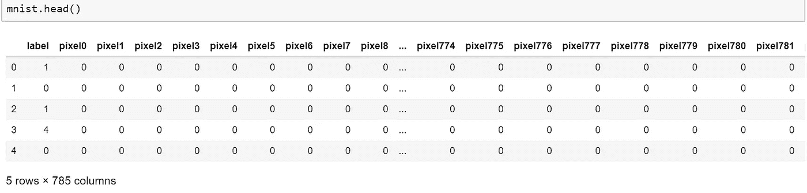
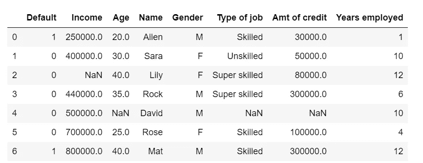
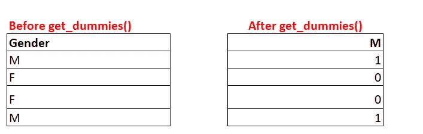
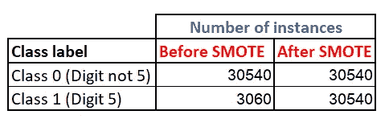
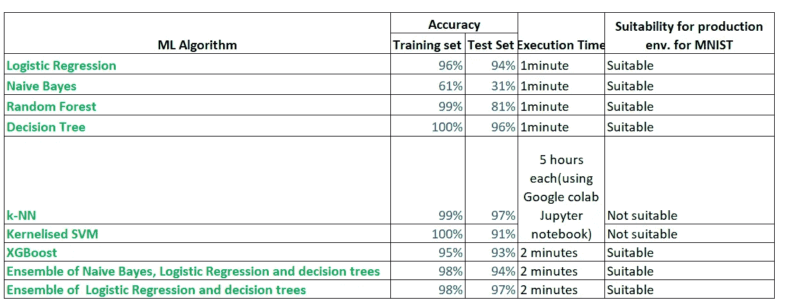

# 如何端到端地解决任何分类问题&选择正确的分类 ML 算法。

> 原文：<https://towardsdatascience.com/how-to-tackle-any-classification-problem-end-to-end-choose-the-right-classification-ml-algorithm-4d0becc6a295?source=collection_archive---------9----------------------->


来源:Pixabay

我们现在知道很多机器学习算法。然而，当我学习 ML 时，我无法找到一篇涵盖机器学习所有步骤的文章，包括数据预处理，选择 ML 算法，然后针对各种分类问题缩小范围。因此我写了这篇文章，这样任何人都可以在一个地方找到所有的资源。我还在文章中介绍了各种 ML 算法的优缺点，以便您知道何时使用哪种类型的算法。您可以简单地复制粘贴本文中给出的代码模板，并应用于手头的任何分类问题。让我们开始吧:)

# **A .数据集下载和准备**

1.  从[这里](https://www.kaggle.com/c/digit-recognizer/data)下载数据集。
2.  关于数据集:MNIST 是一个非常著名的数据集。该数据集包含 784 列，代表一个数字的像素(每个数字由 x 轴上的 256 个像素和 y 轴上的 256 个像素组成。256 x 256 像素= 784 像素)。它有一个列标签，从 784 个像素中识别数字。
3.  在下面的文章中，我们将把一个数字归类为 5 或者不是 5。因此，为了简单起见，我们将处理二元分类。此外，可以看出，大多数分类问题都是二元分类问题。多类分类(从 0 到 9 的数字分类)将在另一篇文章中讨论。



# B.应用 ML 模型前的数据预处理

1.  处理缺失值
2.  处理非数字数据(处理分类、顺序变量和字符串)
3.  特征工程和从现有特征中创建新特征。
4.  仅提取有用和相关的特征:特征选择
5.  移除缺失值超过特定阈值的要素
6.  将数据分为训练集和测试集
7.  检查阶级不平衡并解决它
8.  数据的标准缩放

# **数据预处理程序**

因为 MNIST 数据集不需要太多预处理(没有缺失值，没有字符串或分类特征/列等)。)，我们采用了一个称为**房屋数据集的简单数据集，并使用该数据集**说明了大多数数据预处理技术。在数据集中，我们需要根据过去数据的学习来预测某人是否会违约。过去获得贷款的人的概况以及他们是否违约都被给出了。



住房数据集

房屋数据集数据预处理的完整代码如下所示:

[](https://github.com/Shailaja-Gupta/Data-Preprocessing-for-medium/blob/master/Github%20Medium%20article/Data_preprocessing_for_Medium.ipynb) [## shai laja-Gupta/媒体数据预处理

### permalink dissolve GitHub 是 4000 多万开发人员的家园，他们一起工作来托管和审查代码，管理…

github.com](https://github.com/Shailaja-Gupta/Data-Preprocessing-for-medium/blob/master/Github%20Medium%20article/Data_preprocessing_for_Medium.ipynb) 

**B.1 .处理缺失值**(房屋数据集)

如果我们有缺失值，那么就很难实现大多数的 ML 算法。因此，我们需要先处理它们。一种方法是使用 inputr(inputr 的工作方式类似于 fillna)。

可能有不同类型的缺失值。例如，我们可能会丢失字符串数据、丢失分类数据和数字数据。因此，我们首先分离数字和非数字列，然后使用不同的方法填充它们的 NAN 值。数字列的 NAN 值在这里使用中值填充，字符串列的 NAN 值使用‘most _ frequency’填充。

```
from sklearn.impute import SimpleImputercols_remove=['Name']  #col names which we wish to remove from model
X_train = X_train.drop(cols_remove, axis=1)
cols = X_train.columns #new coumns without the columns removed
X_train_numeric=X_train.select_dtypes(include=['int', 'float']).columns
X_train_non_numeric=X_train.select_dtypes(exclude=['int', 'float']).columns#joined columns numeric and non numeric
new = X_train_numeric.tolist() + X_train_non_numeric.tolist()from sklearn.impute import SimpleImputer
from sklearn.compose import ColumnTransformer
t = [('num', SimpleImputer(strategy='median'), X_train_numeric),
('cat', SimpleImputer(strategy='most_frequent'), X_train_non_numeric)]
transformer = ColumnTransformer(transformers=t, remainder='passthrough')
X_train = transformer.fit_transform(X_train) #numpy array#DataFrame constructor with new columns names and added reindex for change by original order
X_train = pd.DataFrame(X_train, columns=new).reindex(cols, axis=1)
```

**B.2 .处理非数字数据**(房屋数据集)

**所有**你的**输入数据(X_train** 或 **X_test** data **)必须是数值型**数据**之后**你才能做**分类**！然而，根据你的经验，你现在必须知道，情况不会总是这样。大多数情况下，您也会遇到非数字数据。非数字数据有三种类型:分类数据、顺序数据和字符串数据。在住宅的数据集中，作业类型是顺序数据，性别是分类数据，这里的名称是字符串数据。这些数据类型的区别在于:

*   **分类/名义数据:**性别:男女在这里并没有更差也没有更好。它们只是人们性别的分类。
*   **序数数据:**评级:变量之间有一定的顺序。超级熟练>熟练>不熟练。
*   **字符串数据:**名称:该数据类似于分类数据，因为名称只是标签。然而，这是有区别的。在分类变量的情况下，只有固定数量的类别。另一方面，对于名称字段，将会有许多名称，并且没有一个是相同的。

让我们看看如何处理这些数据类型:

**B.2.1 .处理分类数据**(变量没有任何顺序或等级，并指定不同的类别。):



我们只使用一个变量 M 来指定一个人是否是 M/F。我们在 get_dummies 中使用 drop_first=True 来做到这一点。

```
from sklearn.preprocessing import OneHotEncoder
onehotencoder = pd.get_dummies(X['Gender'], drop_first=True)
# Drop column non_numeric_col as it is now encoded
X = X.drop('Gender',axis = 1)
# Join the encoded dataframe to X
X = X.join(onehotencoder)
```

**B.2.2 .处理顺序数据**:(变量有等级的数据)

在“工作类型”一栏中，超级熟练>熟练>非熟练。我们可以通过给这三个标签分配一些数值来告诉机器一个类别比另一个类别好。数字越大，ML 算法对它的考虑就越好。因为我们给超级熟练者 3 分，给熟练者 2 分，给不熟练者 1 分；ML 算法会假设超级熟练>熟练>不熟练，这就是我们想要的。

```
X['Type of job'] = X['Type of job'].map( {'Super Skilled':3, 'Skilled':2, 'Unskilled':1})
```

**B.2.3 .处理字符串数据**

在上面的例子中，我们有字符串数据“名称”。字符串数据无法转换成数字。我们能从这个字段名中提取一些有用的信息吗？答案是否定的。(然而，如果我们在先生、小姐、夫人等名字前加上前缀。我们本可以从该领域提取一些信息，并因此对其进行处理，但是现在无法提取任何信息)。因此，我们从我们的建模 X_train 中移除该场。

```
#You can specify all the string columns you want to remove
cols_remove=['Name']
X = X_train.drop(cols_remove, axis=1)
```

**B.3 .特征工程**

有时，我们可以从给定的数据集创建新的要素，或者调整现有的要素以提取更有价值的信息。所有这些都需要领域知识。例如，在给定的数据集中，我们可以创建新的功能，如%年就业和信用收入%。这给出了一个想法，即一个人实际工作了多少年，他的收入有多少百分比是信用。如果根据他的收入，他有更多的信贷，那么违约的机会就更多。如果这个人一生中的大部分时间都在工作，那么他违约的可能性就较小。

```
X['Years employed percent'] = X['Years employed'] / X['Age']
X['Credit Income percent'] = X['Amt of credit'] / X['Income']
```

**B.4 .仅提取有用和相关的特征:特征选择**

在我们的模型中有多余和无用的特征会降低准确性。让我们看看如何对任何包含数百个变量的数据集进行特征选择。特征选择将消除你的分类模型过度拟合的问题。

尽管有许多特征选择或变量约简的方法，我们将只描述几种非常有效和流行的特征选择方法。

**B.4.1 .如果需要特定数量的特性:**选择 KBest 类方法。

它允许您为您的模型选择前 k 个最相关的特性(这里我们取 k=5，因此它将给出前 5 个特性)。

```
#apply SelectKBest to extract top 5 best features for housing dfbestfeatures = SelectKBest(score_func=chi2, k=5)
fit = bestfeatures.fit(X_train,y_train)
dfscores = pd.DataFrame(fit.scores_)
dfcolumns = pd.DataFrame(X_train.columns)
#concat two dataframes for better visualization 
featureScores = pd.concat([dfcolumns,dfscores],axis=1)
featureScores.columns = ['Features','Score']  #naming the dataframe columns
print(featureScores.nlargest(5,'Score'))  #print 5best features
```

**B.4.2 .如果您只想要最相关和不相关的特征:Boruta 图**

在 SelectKclass 中，您需要指定您想要的 top k 特性。但是有时候，你不知道你需要多少功能。所以你干脆用博鲁塔图。它将为您提供对您的模型很重要的所有功能。此外，它还会删除高度相关的功能，这样您将只拥有最相关的功能。

```
from sklearn.ensemble import RandomForestClassifier
from boruta import BorutaPy# NOTE BorutaPy accepts numpy arrays only, if X_train and y_train #are pandas dataframes, then add .values attribute X_train.values in #that case
X_train = X_train.values
y_train = y_train.values# define random forest classifier, with utilising all cores and
# sampling in proportion to y labels
from sklearn.ensemble import RandomForestClassifier
rf = RandomForestClassifier(n_jobs=-1, class_weight='balanced', max_depth=5)# define Boruta feature selection method
feat_selector = BorutaPy(rf, n_estimators='auto', verbose=2, random_state=1)# find all relevant features - 5 features should be selected
feat_selector.fit(X_train, y_train)# check selected features - first 5 features are selected
feat_selector.support_# check ranking of features
feat_selector.ranking_# call transform() on X to filter it down to selected features
X_filtered = feat_selector.transform(X_train)#To get the new X_train now with selected features
X_train.columns[feat_selector.support_]
```

[](https://github.com/Shailaja-Gupta/Data-Preprocessing-for-medium/blob/master/Github%20MEDIUM%20boruta/Implementation%20of%20Boruta%20_%20Feature%20selection%20on%20MNIST%20dataset.ipynb) [## shai laja-Gupta/媒体数据预处理

### permalink dissolve GitHub 使上下文切换变得容易。阅读渲染文档，查看历史记录…

github.com](https://github.com/Shailaja-Gupta/Data-Preprocessing-for-medium/blob/master/Github%20MEDIUM%20boruta/Implementation%20of%20Boruta%20_%20Feature%20selection%20on%20MNIST%20dataset.ipynb) 

上面提到了 MNIST 数据集上的 Boruta 的完整代码。

**B.5 .移除缺失值高于特定阈值的特征**

如果您的列中有 85%的值缺失，该怎么办？在那种情况下你该怎么办？在这种情况下，最好删除该列。然而，有时企业坚持保留列，那么你可以要求新的数据。通常期望的阈值是多少，超过该阈值我们不能有缺失值？一般来说，该阈值预计为 25–30%。高于这个阈值时，您最好放弃色谱柱，除非客户坚持使用它，或者如果它是一个非常重要的分析参数。在这种情况下，您可以使用如上所述的估算器。

```
#Obtain the sum of missing values in all columns 
df.isna().sum()#Find the percentage of missing values in df:
result=df.isna().sum()/len(df)#In df remove columns where missing values are more than a threshold
df = df.loc[:,result > .8]
```

**B.6 .拆分成测试和训练数据(** MNIST 数据集 **)**

我们将使用 train_test_split 将 train_df 分成测试集和训练集，以在对 test_df 进行预测之前测试我们模型的准确性:

```
X=train_df.drop('label', axis=1)
y=train_df['label']# implementing train-test-split
from sklearn.model_selection import train_test_split
X_train, X_test, y_train_full, y_test_full = train_test_split(X, y, test_size=0.20, random_state=66)#Below part is only for MNIST dataset
#For digit 5, output label=1, for any other digit output label=0
y_train=((y_train_full==5).astype(int))  
y_test=((y_test_full==5).astype(int))
```

**B.7 .检查阶级不平衡并加以解决**

阶级不平衡意味着一个阶级占主导地位，而另一个阶级的例子很少。在 MNIST 数据集中，总共大约 40，000 个案例中，只有 3，060 个案例中的数字是 5。这意味着我们的 ML 算法暴露于非常少的数字为 5 的训练情况。

```
y_train.value_counts()
0    30540   #digit is not 5
1     3060   #digit is 5
Name: label, dtype: int64
```

如上图所示，我们的 MNIST 数据集中存在阶级不平衡。如何看待阶层失衡？

1.  通过使用过采样增加少数类实例(在本例中为类 1，数字为 5)
2.  通过使用欠采样减少多数类实例(在这种情况下是类 0，数字不是 5)。

我个人更喜欢过采样，因为它有助于保持数据的可变性。 [SMOTE 算法](https://arxiv.org/pdf/1106.1813.pdf)(合成少数过采样技术)是过采样的一种。在高水平上，击打:

1.  随机选择 k 个最近邻中的一个，并使用它来创建一个类似的，但随机调整的新观察。

我们要用 Python 实现 [SMOTE。](http://imbalanced-learn.org/en/stable/over_sampling.html#smote-variants)

```
from imblearn.over_sampling import SMOTE
sm = SMOTE(random_state = 42)
X_train_oversampled, y_train_oversampled = sm.fit_sample(X_train, y_train)
X_train = pd.DataFrame(X_train, columns=X_train.columns)
y_train=y_train_oversampled
```



```
pd.Series(y_train).value_counts().sort_index() #values after SMOTE
0    30540
1    30540
dtype: int64
```

在 SMOTE 实现之后，对于类 0 和 1，X_train 和 y_train 具有相似(在这种情况下相等)数量的值。

**B.8 .数据的标准缩放**

```
from sklearn.preprocessing import StandardScalersc = StandardScaler()
X_train = sc.fit_transform(X_train)
X_test=sc.transform(X_test)
```

# **C .选择和训练二元分类器**

1.  测试所有/多个分类器对训练数据的分类。
2.  选择在训练数据上工作得最好的一个或多个，并检查它们在测试数据上的性能
3.  尝试通过调整它们的超参数来改进那些工作得最好的分类器。

可以用于分类项目的分类器的例子包括逻辑回归、K-最近邻(KNN)、SVM、核 SVM、朴素贝叶斯、决策树分类、XGBoost 和 RandomForest 分类等等。将这些模型视为黑盒模型。你不需要知道模型背后的数学来实现它们。根据下面给出的代码，对它们进行编码是一个简单的即插即用过程。

**C.1 .在各种分类 ML 算法上测试模型。**

让我们在逻辑回归、K-最近邻(KNN)、SVM、核 SVM、朴素贝叶斯、决策树分类、XGBoost 和 RandomForest 分类上逐一训练我们的模型，并测试每个模型在训练和测试数据上的性能。

**C.1.1 .对 MNIST 数据集应用逻辑回归**

```
from sklearn.linear_model import LogisticRegression
lr_clf = LogisticRegression(random_state = 0)
lr_clf.fit(X_train, y_train)
```

**训练和测试数据的 Logistic 回归表现**

```
print('Accuracy on training set:',lr_clf.score(X_train,y_train))
print('Accuracy on test set:',lr_clf.score(X_test,y_test))
```

在训练集上的精度:0.9622134905042568
在测试集上的精度:0.2000000001

*请注意，lr_clf.score(X_test，Y_test)等同于你的 print(classification report(Y _ test，Y_pred))。但是不需要计算 Y _ pred 这是在您实现时由库内部完成的。评分方法。*

**C.1.2 .在 MNIST 数据集上实现朴素贝叶斯**

```
from sklearn.naive_bayes import GaussianNB
nb_clf= GaussianNB()
nb_clf.fit(X_train, y_train)
```

**朴素贝叶斯在训练和测试数据上的表现**

```
print('Accuracy on training set:',nb_clf.score(X_train,y_train))
print('Accuracy on test set:',nb_clf.score(X_test,y_test))
```

在训练集上的精度:0.6189259986902423
在测试集上的精度:0.200000001

**C.1.3 .对 MNIST 数据集实施随机森林回归**

```
from sklearn.ensemble import RandomForestRegressor
rf_clf = RandomForestRegressor(n_estimators = 10, random_state = 0)
rf_clf.fit(X_train, y_train)
```

**在训练数据上测试随机森林回归性能**

```
print('Accuracy on training set:',rf_clf.score(X_train,y_train))
print('Accuracy on test set:',rf_clf.score(X_test,y_test))
```

在训练集上的精度:0.9933483955468239
在测试集上的精度:0.2000000001

**C.1.4 .在 MNIST 数据集上应用决策树**

```
from sklearn.tree import DecisionTreeClassifier
dec_clf = DecisionTreeClassifier()
dec_clf.fit(X_train, y_train)
```

**在训练数据上测试决策树性能**

```
print(‘Accuracy on training set’,dec_clf.score(X_train, y_train))
print('Accuracy on test set:',dec_clf.score(X_test, y_test))
```

训练集上的精度 1.0
测试集上的精度:0 . 19986 . 188686868615

**C.1.5\. XGBoost:**

```
'''Install xgboost following the instructions on this link:
[https://stackoverflow.com/questions/35139108/how-to-install-xgboost-in-anaconda-python-windows-platform](https://stackoverflow.com/questions/35139108/how-to-install-xgboost-in-anaconda-python-windows-platform). '''from xgboost import XGBClassifier
xgb_clf= XGBClassifier()
xgb_clf.fit(X_train, y_train)
```

**XG 提升训练和测试数据的性能**

```
from sklearn.metrics import accuracy_score
print('Accuracy score on train_data: ', accuracy_score(y_true = y_train, y_pred = xgb.predict(x_train).round()))
print('Accuracy score on test_data: ', accuracy_score(y_true = y_test, y_pred = xgb.predict(x_test).round()))
```

训练数据的正确率得分:0.9498511904761905
测试数据的正确率得分:0。36986.96666666661

C.1.6\. **尝试合奏**

集成意味着不使用单一模型，而是利用多个模型进行预测。为了做出每个预测，ML 集成算法考虑每个模型的输出和建议，然后做出最终预测。如果你考虑多个模型，那么所有的模型都有可能犯不同的错误。因此，当集合考虑多个模型的预测时，一个特定模型的误差对整体结果的影响最小。因此，整体预测将具有最小的误差。

**c . 1 . 6 . 1 . SVM 和逻辑回归的集合**

```
from sklearn.svm import SVC
from sklearn.ensemble import VotingClassifiervoting_clf = VotingClassifier(
 estimators=[('lr', lr_clf), ('nb', nb_clf), ('decision', decision_clf)],
 voting='hard')
voting_clf.fit(X_train, y_train)
```

**使用 SVM 和逻辑回归的集合方法的性能**

```
voting_clf.score(X_train, y_train)
voting_clf.score(X_test, y_test)
```

训练集上的精度为 0.9787164374590701
测试集上的精度为:0。36866.68666866667

## **C.1.6.2\.** 使用逻辑回归&决策树的集成方法

```
voting_clf2 = VotingClassifier(
 estimators=[('lr', lr_clf),('decision', decision_clf)],
 voting='hard')
voting_clf2.fit(X_train, y_train)
```

**集成方法的性能(逻辑回归&决策树)**

```
voting_clf2.score(X_test, y_test)
voting_clf2.score(X_train, y_train)
```

训练集上的精度为 0.977380952380952
测试集上的精度为:0。59676.88668686666

**D .对大型数据集不太适用的分类模型**

我提到下面的分类模型，因为它们对你将遇到的许多分类问题非常有用。它们在 MNIST 数据集上的实现花费了太多的时间，主要是因为 MNIST 的规模很大。当数据很大时，下面这些算法的性能太慢，因此不建议在 MNIST 中使用它们。

1.  k-神经网络

k-NN 在输入变量/特征/列数量较少的情况下工作良好，但在输入数量非常大的情况下会出现问题。因此，在输入变量太多的情况下(MNIST 这里有 784 个)，k-NN 将不会像其他算法一样运行良好。

2.内核 SVM:内核矩阵 KK 是一个 n×n 矩阵，其中 n 是数据中实例的数量。因此，对于 MNIST 数据集，在过采样之后，我们有 60，000×784 个实例~ 470.4k，核矩阵 KK 将有(60，000×784 个实例)~ 2.2×10 个⁵元素，并且可能占用~100G 存储器。

基本上，存储核矩阵需要与数据点数量成平方比例的内存。传统 SVM 算法的训练时间也与数据点的数量成超线性比例关系。因此，这些算法对于大型数据集是不可行的。

请在下面找到如何为其他分类问题实现这些算法:

**1.1。对任何分类数据集应用 k-NN**

```
from sklearn.neighbors import KNeighborsClassifier
knn_clf = KNeighborsClassifier(n_neighbors = 5, metric = 'minkowski', p = 2)  
#You can change these hyperparameters like metric etc.
knn_clf.fit(X_train, y_train)
```

**k-NN 在 MNIST** 训练和测试数据上的表现(输出耗时接近 5 小时)

```
print('Accuracy on training set:',knn_clf.score(X_train,y_train))
print('Accuracy on test set:',knn_clf.score(X_test,y_test))
```

训练集的精度为 0.974257142857143
测试集的精度为:0.200000001

**1.2。MNIST 数据集上的核 SVM**

```
from sklearn.svm import SVC
kernel_svm_clf = SVC(kernel = 'rbf', random_state = 0)
kernel_svm_clf.fit(X_train, y_train)
```

**训练和测试数据上的内核 SVM 性能**(输出所用时间接近 5 小时)

```
print('Accuracy on training set:',kernel_svm_clf.score(X_train,y_train))
print('Accuracy on test set:',kernel_svm_clf.score(X_test,y_test))
```

训练集精度 1.0
测试集精度:0.9125

# **D .最终确定基于绩效的分类模型**

在最终确定一个模型的时候，我们需要记住准确性和时间。虽然 k-NN 比决策树和随机森林提供更好的准确性，但它需要很长时间来计算。尽管使用 GPU 在 Google colab 上工作，但我必须等待 5 个小时才能从 SVM 和 k-NN 获得输出，因此我们不会对这个数据集使用这些方法。k-NN 和 SVM 都非常适合较小的数据集。我们宁愿选择几乎和 SVM 和 k-NN 一样好的模型，并且只需几分之一的时间。



基于时间方面和准确性方面的性能，我们将选择逻辑回归和决策树的集成。我们选择创建 LR 和决策树的集合，因为这两个模型各自做得最好。你也可以尝试更多的组合，并检查模型的准确性。

还有其他参数，如调整超参数(超参数是您在每个模型中输入的参数，例如，在 k-NN 中，超参数指定 k，对于随机森林，超参数指定树的数量等。)在每个模型中，我们可以做到这一点，但我会在其他文章中介绍这一点。

如果你想知道各种机器学习算法的优缺点，以及何时使用哪种 ML 算法，它们的各种应用，请查看我下面的文章。

[](https://medium.com/@shailajagupta/pros-and-cons-of-various-classification-ml-algorithms-3b5bfb3c87d6) [## 各种分类 ML 算法的优缺点

### 机器学习中有很多分类算法。但是有没有想过哪种算法应该用于什么…

medium.com](https://medium.com/@shailajagupta/pros-and-cons-of-various-classification-ml-algorithms-3b5bfb3c87d6) 

快乐阅读:)。希望这有所帮助:)